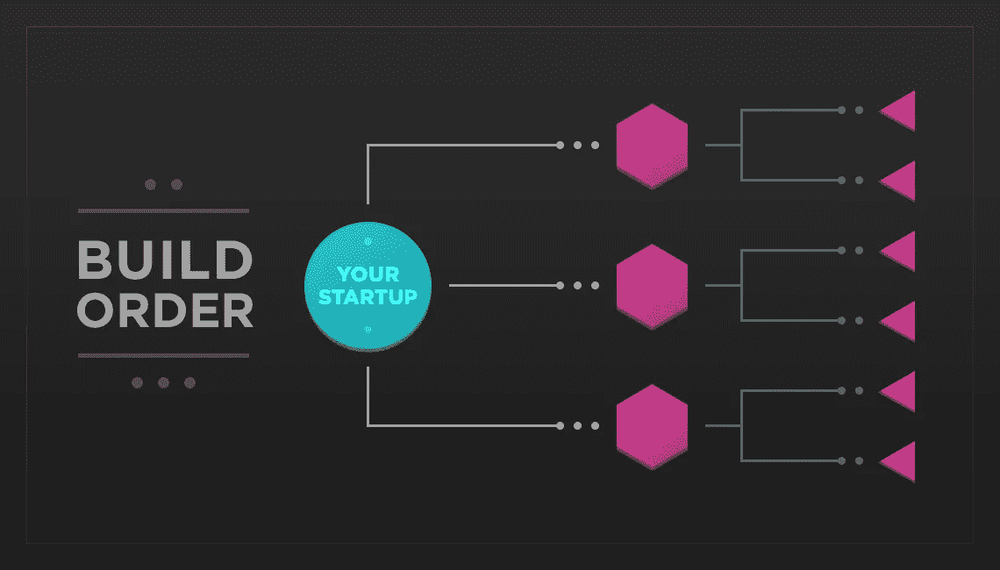

# 每个创业公司要成功都应该遵循的构建顺序

> 原文：<https://medium.com/hackernoon/the-build-order-every-startup-should-follow-to-become-successful-635e7ed00fa3>

绝大多数创业公司都遵循非常相似的流程。

第一步:想出一个主意。

第二步:创建一个原型。

第三步:筹集资金。

第四步:发射。

# 最简单的形式是，我们可以称之为创业公司的“构建顺序”

在竞技游戏中(想想像星际争霸这样的游戏)，你的建造顺序是你管理资源的过程——目标是比你的对手更快地建造(并复合你的努力)。

创业也不例外。

## 创业游戏是关于谁能更有效地管理他们的资源。

这意味着，给定所有相同的部分，每个创业公司都应该以同样完美的最终产品而告终。毕竟，每个创业公司都需要招聘，每个创业公司都需要设计和开发他们的产品或服务，每个创业公司都需要营销部门等等。

# 理论上，结果应该是相同的。

但他们不是——也永远不会是。您的构建顺序会显著改变您的结果。

例如:如果你在工程之前做设计，那会影响结果。

设计前的工程设计会影响结果。

产品开发前的营销会影响结果。

为什么？

# 因为每一个成功的大公司的秘密武器就是它利用时间的能力。

时间是衡量每一家初创公司建设顺序的唯一变量。时间总是在后台移动——这意味着游戏的名字是让“时间”为你工作(而不是反对你)。

沃伦·巴菲特成为如此成功的投资者的部分原因是他对时间的看法，他说:“世界第八大奇迹是复利。”

我想补充说，在创业世界里有一个同样神奇的奇迹，我称之为正确的构建顺序。

# 建立秩序，以及你随后追求最终目标的方式，会极大地影响创业的结果。

许多初创公司的创始人在筹集了一大笔资金后，会对自己说，“好吧，现在我们需要建立一个团队。”

这很好。我相信创始人不会创造伟大的产品——他们会建立伟大的团队来创造伟大的产品。对于伟大的创业公司来说，这是一个基本事实。

然而，执行的方式各不相同。

# 下面是一个团队构建顺序设计不当的例子:

创始人说，“我们需要雇佣下一个工程师。”

然后，创始人开始整理工作描述，并在 Craigslist 上发帖。当简历开始慢慢流入时，他或她坐在那里通读每一份简历，试图找到最合适的工程师。

在这个“建立订单”的场景中，创始人选择自己来筛选简历，打筛选电话，面试所有的申请人——而事实上，这是对他们时间的一种非常糟糕的利用。他们应该专注于更具战略性的事情，而不是做一些容易被雇佣的事情。

这可能看起来无关紧要，但是将一项任务花费的时间增加到一天、一周、一个月，你就会发现它的效率有多低——尤其是与构建顺序更好的竞争对手相比。

# 以下是更有效的构建顺序:

认识到创始人筛选简历的低效，任何得到风险投资支持的初创公司的第一批雇员之一都应该是招聘人员。

这是显而易见的。原因如下。

首先雇佣一个招聘人员，你实际上是在说，“我现在要用钱来换取一个以后能为我节省时间的资源。他们将成为我们的人才侦察兵，到处寻找最优秀的人才，这样我作为一名创始人，就可以收回更多自己的时间，为我的创业公司的下一部分工作。”

这听起来是不是更好地利用了资源？

为了让这一点更加明显，想象你正在玩一个资源驱动的视频游戏，你有两种方式可以花掉你的第一个 50，000 虚拟硬币。你可以花一些硬币来购买第二个角色，这样可以为你找到更多的资源，或者你可以自己留着这些硬币，慢慢地、稳定地建造自己。

我可以想象任何玩家都会选择前者。但这对于许多创始人来说是非常不明显的。就好像他们觉得自己不得不做同样多的工作。

与此同时，那些看到更广阔前景的人，现在愿意放弃他们的一些资源，以更快地建立一个更强大的资源生成团队。

# 这正是我们在 2012 年建造 Crashlytics 时的建造顺序。

从一开始，我和我的共同创始人[杰夫·塞伯特](http://jeffseibert.com/)就确保我们的第一批雇员中有一个是招聘人员。

到我们 4 个月大的时候，我们已经有了一个 2 岁的初创公司的团队轮廓。我们的主要优势之一是能够在如此短的时间内构建如此多的产品，然后在我们的产品推出仅 11 个月后就被 Twitter 收购，这是当时有史以来最大的一次收购。

大多数创始人不会考虑他们是如何招聘的。他们有意选择(在他们的建造顺序内)在以后引入招聘人员。但是，通过将这作为我们构建顺序的第一项，结果类似于复利:伟大的团队一起协作。由于日历效应(后台计时的变量)，我们能够更快地节约成本，并从优秀团队成员的加入中获益。

现在，以上所有都与一个伟大团队的构建顺序有关。

然而，作为一家初创公司，你做的每件事都有一个构建顺序。

# 另一个更具体的构建顺序可能是，“我想尽可能构建最好的产品。”

有些产品是先设计，后设计的。

有些产品是先设计出来的，然后再进行工程设计。

这些都是有意识的“构建顺序”决策，每一个*都会显著地*影响结果。

我构建产品已经有很长时间了，所以我对一个成功的构建顺序的看法是，在编写一行代码之前，你需要让设计师在房间里呆很久。

现在，这并不意味着你首先需要最好的 photoshop 艺术家，或者你首先需要花一大笔钱请一家代理公司来制作你的产品的精美模型。我的意思是拿起铅笔和纸，画出线框，思考整个经历。

不是看起来那样。T2 是如何运作的。

我们都见过这样的产品，先被设计，然后，很久以后，设计被添加上去。结果往往令人失望——当团队意识到构建顺序中的错误时，已经太晚了。工程师是主导产品感觉、工作等的人。，这意味着设计师，打个比喻，“给猪涂口红。”

在创业界，有一种普遍的信念，那就是为了开始构建一些伟大的东西，你需要像素级的实体模型，或者你必须对 UI 设计原则有深入的了解，等等。

但是这些事情都不重要——至少现在不重要。事实上，我建议甚至不要打开你的笔记本电脑。拿支铅笔和纸来。实际上，这是我上周和一个创始人做的一个练习。连续三天，我们所做的就是用铅笔和纸工作，解开应用程序应该如何工作。

*我什么时候让他们输入信息？我何时向他们展示分析仪表板？这是询问他们信用卡信息的合适时机吗？*

# 产品设计 90%是它如何工作，10%是它看起来如何。

这意味着，作为一名创始人和产品负责人，你的时间(和资源)应该花在关注它如何工作上。

这种产品设计构建顺序最棒的地方在于，一旦你画出了这些关键的线框，工程人员就可以开始让它工作，而设计人员可以开始填充像素并赋予其功能。

现在，你有两条平行移动的轨道。

这是一个很好的构建顺序技巧，因为你已经释放了两个同时向同一个目标前进的资源——并行而不是顺序地做事情。

# 从这里开始，有效的营销构建订单应该是这样的:

1989 年的经典电影*梦想之地*说:“如果你建造了它，他们就会来。”

不幸的是，这句话只适用于那些永远无法在现实世界中生存的梦想中的创业公司。

带着这种信念开始构建订单的初创公司和产品设计师很快就会发现自己在说，“我们构建了它。这里没人。现在我们必须想出如何营销这种产品。”

与此同时，日历时间在滚动，燃烧率在增加，资源正在枯竭，没有回头路可走。

一个更好的构建顺序应该是在你构建产品之前就考虑分销和病毒传播——这样你的营销就成为了产品本身的一部分。

在我的上一篇文章 [*《打造难忘的首次用户体验的典型指南*](https://hackernoon.com/the-quintessential-guide-for-building-an-unforgettable-first-time-user-experience-19720a7447d2) 中，我谈到了如何让用户#2 加入并使用你的产品，并实际上将加入过程构建到产品体验中。

当我们制造 Crashlytics 时，我们的制造订单将营销思想融入到我们的产品开发中。我们提前考虑过这个问题，不仅仅是外包给营销主管或代理机构。这是我们产品与生俱来的一部分——并最终带来了回报。

你可以在上面的文章中阅读完整的故事，但简而言之，我们让我们的第一个用户介绍我们的第二个用户——如此等等。当我们用 Crashlytics 做到这一点时，营销不再像这种奇怪的外力。这是每个团队的内在感受，我们所有人都朝着同一个目标努力。

# 创业公司的每一个项目都有一个构建顺序。

一旦你理解了这种思维方式，你就会开始意识到建立一个成功的创业公司的过程发生在宏观和微观两个层面。

公司作为一个整体是有订单的，小到如何处理你的应收账款项目都有订单。

这听起来可能很无聊，但如果你是一名创始人，并且你以任何方式受收入驱动，应收账款就成了一件大事——尤其是如果你是白手起家的话。

这个部门说，“我需要收取 1000 美元，然后我们需要执行这项工作。”当然，这项工作会产生开销、保险、员工工资等成本。到了客户付款的时候，他们会迟到——或者他们可能根本不会付款。

作为一名创始人，你现在陷入了一个困境，要么花时间去寻找丢失的资本，要么花时间去做一个不同的项目，为你的公司创造新的(增长)收入。

再一次，当用时间变量来衡量时，这是非常低效的。

在这里，更好的构建顺序是提前考虑，“我知道获得付款可能是一个问题，所以对于较小的客户，作为一家公司，我们将要求提前支付信用卡。”

当他们签约时，你让他们同意直接付费。如果是一个较大的项目，你可以给他们一个 ACH 表格，让他们授权每月提款。

如果客户对这些条款不满意，这就成了一个谈判点。但至少它在一开始就被解决了，而不是在以后成为一个问题。

# 作为创始人，要记住的重要一点是，你总是在和时间赛跑。

在任何情况下，你都应该问自己，“如果我在*之前做*这个*，然后做*，我的结果是什么——如果我在*这个*之前做*那个*，我能更快地达到同样的结果*吗？”*

*谈到成功创业的构建顺序，没有唯一正确的答案。*

*然而，所有成功的创业公司都有一条共同的主线，那就是他们对自己的订单构建过程的意识有多强。*

*不要只做清单上的下一件事。*

*仔细考虑你选择先做什么。*

**感谢阅读！**

*从我记事起，我就一直在创业。如果你想了解如何建立一个成功的公司，请点击这里订阅，这样你就不会错过我的下一篇文章。*