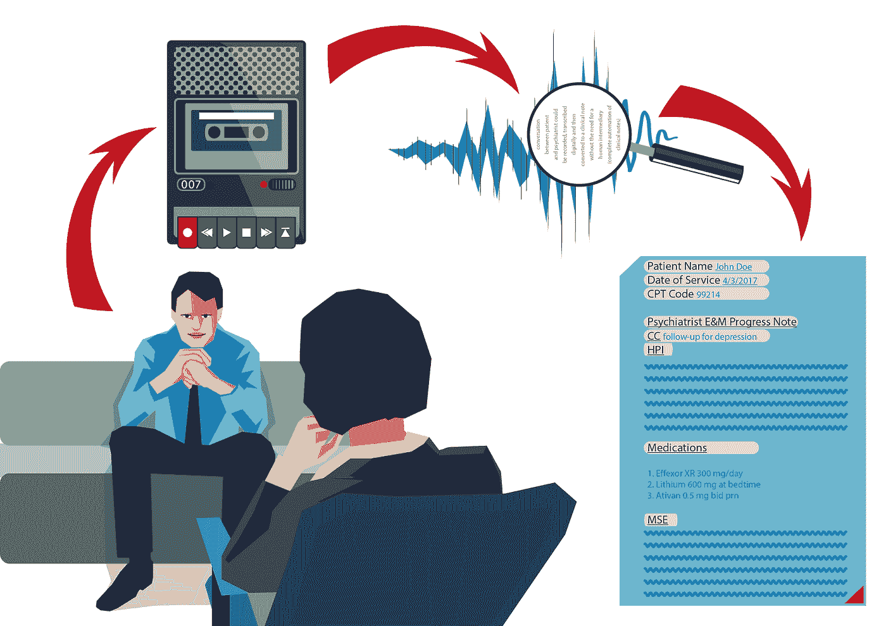
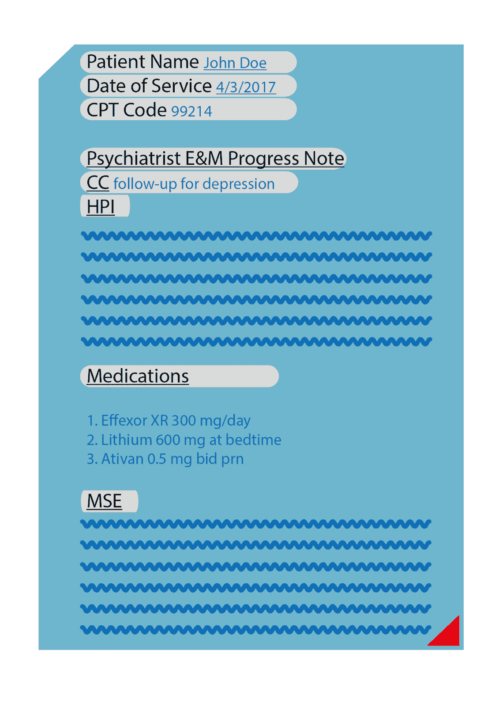

# 自动化临床文档的案例:有人能做这个吗？

> 原文：<https://medium.com/hackernoon/the-case-for-automated-clinical-documentation-can-somebody-please-make-this-3a6d80e23f2c>

想象一下，你是一个忙碌的临床医生，经营着自己的精神病学诊所。你整天都在看病人——也许是一个接一个的——并关注他们的需求。

这可能意味着评估新患者、跟进现有患者、开新药、补充旧药、提供心理治疗、安排测试、转诊、填写表格以及为第三方(如残疾保险公司)生成文档。最理想的情况是，在必要时，通过与患者的其他治疗临床医生(例如，精神病医生与正在治疗同一患者的精神治疗师交谈)和家庭成员交谈，获得间接信息。

因此，每一次与患者的会面，都可能意味着比你在办公室与患者面对面交流更多的时间。如果你允许的话——在这个时代，不这样做已经变得越来越难了——你可能还需要回复来自你的病人、他们的家人和其他治疗临床医生的电子邮件。当然，这些可以在白天和晚上的任何时候出现；你必须优先考虑哪些是最紧急的。与此同时，你必须收听(或阅读，在转录信息的情况下)语音邮件信息，潜在患者、现有患者和心理治疗师打来的电话，他们打电话来关心共同的患者。最后，为了从所有这些活动中获得收入，你必须通过直接向患者开具发票或向他们的健康保险公司提交索赔来支付服务费用。

如果你是一个私人执业者，你可能会自己从事所有这些活动。如果你在团体诊所或诊所实习，你可能需要行政助理、接待员或记账员来处理这些工作。在像 Kaiser Permanente 这样的环境中，您的工作可能会受到更多限制，因为您要处理与患者的接触、治疗计划、治疗开始和护理协调，而患者护理的所有其他功能都由支持人员提供。

哦，还有一件事我们还没有提到:临床文件。

如果你是一名心理健康临床医生，你可能会选择你的职业，因为你喜欢与病人一起工作，坐在他们的痛苦旁边，尽最大努力减轻痛苦。为了做到这一点，您需要花足够的时间与您的患者在一起，询问他们的症状，进行检查，解决他们的担忧和问题，并从间接来源获得相关信息。此外，在不明确的情况下，你可能需要咨询同事并熟悉专业文献中的最新信息来回答某个特定的问题。因此，你有越多的时间进行这些活动，就越有可能为你的病人提供最佳的护理。

那么，数字健康技术如何帮助促进这一场景，让临床医生有更多时间与患者面对面，有更多时间进行护理协调，有更多时间调查研究文献以优化护理？

* * * * * * * * * * * * * * * * * * * * * * * * * * * * * * * * * * * * * * * * * * * * * *

作为一个对心理健康领域的数字健康技术有一段时间热情的人，我经常想知道新技术如何真正帮助精神病学和临床心理学的实践。当然，最广泛采用的创新是电子健康记录(EHR)软件、电子药物处方软件和实践管理软件。EHR 软件，从本质上来说，有助于生成病人遇到的健康记录，这是实践的专业要求。它们取代了纸质图表。另一方面，实践管理软件处理与运行精神病学或心理学实践相关的所有其他问题:1)病人调度 2)计费 3)索赔生成和 4)分析。

用很少的管理费用来经营一个精神病学或心理学的实践是可能的。现在，可以通过一个完整的 EHR/实践管理解决方案来自动安排、开具发票/账单和生成索赔。接待员不再需要安排患者和管理呼叫，因为患者现在可以通过电子邮件或通过临床医生 EHR 软件上的患者门户功能直接向他们的护理提供者发送消息。对于那些仍然对语音邮件感到更舒服的人来说，自动转录服务本质上可以将他们的语音信息转化为文本电子邮件，供临床医生审阅。总的来说，患者现在可以通过安全的电子邮件联系他们的临床医生，甚至在大型 HMO 中，如 Kaiser Permanente，这似乎是首选的通信模式。

虽然这些创新有助于减少笨拙和过时的医疗保健业务方法，但不幸的是，它们也有自己的痛点。因此，现在，临床医生不再需要一个(或多个)档案柜来存放陈旧的病历。但是，他们可能没有通过翻阅病人的图表来快速查看大量笔记的那种满足感。虽然电子处方解决方案使开药变得轻而易举，但还不清楚相对于手写处方，它们实际上节省了多少时间。当然，它们不会生成必须重新输入到图表中的纸质记录(即，大多数电子处方解决方案与临床医生的 EHR 相集成，因此处方药物会自动集成到患者的医疗记录中)，从而可能节省一些时间和纸张浪费。

现在，许多 EHR 解决方案都提供了患者门户，患者可以通过该门户自行安排随访预约、查看部分医疗记录，并直接、安全地向提供者发送消息。当然，这需要患者创建另一个在线账户，并想出另一个要记住的密码。

但是，在我的日常工作中，我发现最没有吸引力的任务是生成临床记录。当然，这是一项重要的活动，也是一项职业要求。对于精神病医生来说，尤其是那些从事药物管理的医生，这涉及到遵循与账单代码相对应的模板，例如 **CPT 代码 99214** ，对已确定的患者进行第 4 级门诊。此代码的当前文档要求包括:

1.  患者身份信息(如姓名、出生日期、病历号)
2.  就诊标识信息(如服务日期、CPT 代码)
3.  主诉(如重性抑郁障碍的随访)
4.  详细描述当前症状、持续时间等的当前疾病史。
5.  系统综述
6.  药物清单
7.  与当前疾病史相关的相关家庭和社会历史
8.  一项检查，包括精神状况检查
9.  诊断
10.  解决相关临床问题的评估和计划(如持续抑郁、持续焦虑、持续物质滥用、慢性疼痛、社会孤立等)。)

认识到医生在生成临床记录的过程中有改进的空间，卫生系统已经采用了新的策略来减轻文档的负担。例如，在一些急诊部门，人工抄写员产生临床记录，跟随医生从一个病人到另一个病人，从一个房间到另一个房间。这减轻了医生的负担，使她能够专注于病人的护理。

伊恩·沙基尔和佩卢·特兰在 2012 年共同创立的数字健康公司 Augmedix 为这一公式引入了新的变化。该公司利用远程人工抄写员，利用**谷歌眼镜**技术，从本质上来说，实时传输患者与医生的会面，以生成临床文档。你不再需要有人在现场记录病人的遭遇。通过将这一功能转移到低成本劳动力市场，现场转录的成本得到了优化。

然而，我突然想到，某些医学领域可能不太适合这种临床记录方法。精神病患者——他们与临床医生谈论非常隐私的事情——可能会对让中间人偷听他们的谈话感到不安——即使他们在半个地球之外。接受妇科检查的女性可能同样不愿将她们的检查直播给一个完全陌生的人。

因为精神病学检查——被称为精神状态检查——不需要身体接触患者，所以人类书记员记录相对容易——视频直播或其他方式。但是，由于隐私在精神病患者中是一个如此重要的考虑因素，因此为了生成临床文档而雇佣人类中介是不理想的。

那么，这给我们留下了什么？

当我第一次对数字精神健康技术感兴趣时，我对两个具体的解决方案感兴趣:1)人工智能技术的发展，这种技术可以在本质上取代精神病医生的工作(即评估患者，做出诊断，制定治疗计划和实施治疗), 2)不需要人类中介的自动化临床文档技术。

在各种对健康技术感兴趣的人的网络会议上，我会问软件工程师关于后者的可行性。大多数时候，我被告知这个想法虽然有趣，但还不可行，主要是因为自然语言理解的限制，这是一个人工智能问题。另一方面，自动语音识别并没有太大的限制。

在我看来，这个解决方案的示意图——自动生成临床记录——似乎足够简单。这需要对精神病医生和患者之间的临床会面进行音频记录(相当容易)，将两人的音频对话转录成文本(可能可行)，然后将对话翻译成与临床相关的信息单元(最难的部分)，这些信息单元将构成临床记录。

我在谷歌上做了一些研究，并与一些工程师进行了交谈，我了解到可以使用 Tascam 数字记录仪等设备将精神病医生和患者之间的对话记录到两个不同的频道中。将音频分成对应于两个说话者的两个声道可能会产生更准确的抄本。与此同时，我了解了解析和实体提取，并了解了实体提取作为理解人类语言的一种方式的当前局限性。(实体提取检查文本并将命名的实体标记为各种类别(例如，人、组织、时间、地点等)。)，导致对文本的分析非常初级)。

在这一点上，我开始理解问题的复杂性:你如何训练计算机理解转录的人类对话足够好，以总结它，实际上，到一个临床上有意义的笔记？我想知道，那台电脑是否有必要“理解”转录的对话。相反，如果它可以被训练来识别未经编辑的录音誊本中的模式，从而在进度说明中产生特定信息，那会怎么样？在这种类型的解决方案中，必须使用机器[学习](https://hackernoon.com/tagged/learning)来训练计算机，以检查数以千计的精神病医生-患者就诊的自由文本副本及其相应的进度笔记，以开发一种从一个到另一个的算法。

为了让你对这项技术的实际应用有所了解，请考虑以下病人和精神病医生之间的交流，这是我和我的一个病人进行心理治疗前五分钟的真实记录，为了保护他，我们匿名了:

> **MD** :那么，自从我们上次见面后，你过得怎么样？
> 
> **PT** :做的还不错。我已经，嗯，事实上我已经觉得这周更能控制自己了
> 
> **MD** :嗯哼
> 
> 所以，我，嗯，出于某种原因，我觉得在工作中，我已经做出了自己的选择
> 
> **MD** :嗯哼
> 
> 好像我可以决定我想如何应对它
> 
> **MD** :嗯嗯
> 
> 我认为这与过去相反，过去我喜欢为改变而战，为改变而战
> 
> MD 是的
> 
> T21:所以，我觉得这样更有控制力
> 
> **MD** :嗯嗯
> 
> 我的房子在缓慢、缓慢地向前移动
> 
> **MD** :嗯哼
> 
> 但是，我觉得那是…所以有些环境是有帮助的
> 
> MD :啊哈
> 
> 我已经和我的律师完成了所有的文件，所以
> 
> **MD** :为了投诉？
> 
> **PT** :是的
> 
> **MD** :嗯嗯
> 
> 所以，我还没有签字，但是一切都有点，所以我觉得事情，嗯，有点在控制之中
> 
> MD :嗯嗯，那很好
> 
> 是的，我想这在某种程度上等同于我变得更快乐了
> 
> **MD** :嗯嗯
> 
> 所以，你知道，这就是我去过的地方
> 
> **MD** :心情稍微开心一点？
> 
> **PT** :对
> 
> **MD** :你觉得你仍然有某种程度的焦虑和抑郁吗？
> 
> 是的，嗯，没那么多……我确实会变得不耐烦，尤其是在车里，在工作中，我不得不不断地告诫自己，“放手吧。随它去吧。”因为我一直在想办法让事情变得更好。[笑]。
> 
> **MD** :嗯嗯。
> 
> **PT** :然后，我就一直在想，“Ehh！不是我的问题。不是我的问题”所以…[笑]
> 
> 没有人会欣赏它，而且…
> 
> **PT** :是啊，何必呢？
> 
> **MD** :对。是啊。
> 
> PT :我…我的价值体系与……这就像是经理和员工的不匹配。
> 
> **MD** :嗯嗯。
> 
> 凯莉和我已经讨论过这个问题了。好像有…根本没有考虑过让经理和在那里工作的人相配
> 
> **MD** :嗯嗯。
> 
> **PT** :没有人试图说，“什么，你知道，人们在那里做什么？”
> 
> **MD** :嗯。嗯。
> 
> **PT** :“人民是谁？也许我们应该让他们见面，看看是否，你知道，得到反馈，就像没有那样。就像，“我喜欢和她一起吃午饭。嗯，我听到 Theresa 告诉别人，她说，“是的…我的意思是…你知道，管理如此独立、工作出色的人是一件很棒的事情。“她，你知道，试图祈祷…赞美我们，但她真正想说的是，“我什么都不用做。"
> 
> **MD** :嗯。嗯。这就是她感激的。
> 
> **PT** :对。
> 
> **MD** :对。所以，你还有过类似的，呃，公路暴力事件吗？
> 
> 我想我这周没有。
> 
> **MD** :嗯，那很好。
> 
> 我已经不耐烦了。
> 
> **MD** :嗯嗯。
> 
> 但是，我不认为我真的已经下车了。[笑]或者
> 
> **MD** :嗯嗯。
> 
> **PT** :我可能按了喇叭，但是我没有对任何人大喊大叫，或者…
> 
> **MD** :嗯嗯。
> 
> **PT** :所以
> 
> MD:所以，你已经注意到了一些不耐烦，但是你处理得还不错。好像你没有爆发一样。
> 
> **PT** :对，对。
> 
> **MD** :还有，房子，有动静吗？就像，有没有…
> 
> 是的，戈登和我找了另一个人去看房子的后面
> 
> **MD** :嗯嗯。
> 
> 他还有一些，嗯，他实际上在十年前粉刷了我们的建筑
> 
> MD :嗯嗯。
> 
> 他知道那栋建筑，大概是八年前的事了。所以，他更清楚需要做什么。他实际上验证了我们之前得到的更多的中间道路建议…
> 
> MD:哪个是你能等的？
> 
> 我们可以等待
> 
> MD:但是，这是必须要做的。
> 
> **PT** :而且他基本上说你需要修的东西你需要修的人是木匠。我们不知道。就像我们不知道我们是否需要一个承包商，一个墙板公司。所以，他说不，他说你只需要照顾好这个地方，你需要一个木匠来做。
> 
> **MD** :嗯嗯。
> 
> PT:这很有帮助。
> 
> **MD** :对。
> 
> 因为，你知道，像我们这样的人——我想你也是——不知道
> 
> MD :很多这类事情，是的……
> 
> **PT** :【笑】
> 
> MD :所以，他们会切掉，比如，一个外景，呃，一部分…
> 
> 是的，就是他们更换窗户的那部分，现在窗户上面有一条裂缝
> 
> MD:是啊
> 
> PT :不是裂纹，是壁板没接对
> 
> **MD** :对，对，对。乔治，你吃得怎么样？这周过得怎么样？
> 
> **PT** :已经好了。我没有以前那么自律了。
> 
> **MD** :嗯嗯。
> 
> 事实上，我可以说，自从我认真对待我的肾脏问题以来，这是我第一次，嗯，这周我有点暴饮暴食。
> 
> **MD** :嗯。
> 
> PT:还有，嗯，我不知道，我刚刚偏离了轨道。
> 
> MD:那是开着的吗，就像你的安慰食品，或者，或者
> 
> 是的，舒适的食物和食物的数量。
> 
> **MD** :嗯嗯。
> 
> 而且，我，我的意思是，比我以前少多了，但是…
> 
> **MD** :嗯嗯。
> 
> **PT** :有一天，我吃了一串巧克力。我只是不能阻止自己
> 
> **MD** :嗯嗯。
> 
> PT :哪个钾含量高…
> 
> **MD** :哦，对了。
> 
> 然后，连续两个晚上，我都…除了午餐，我还吃了很多晚餐。
> 
> **MD** :嗯嗯。
> 
> 然后，因为我做了那件事，我后来吃了半品脱的冰淇淋，因为，你知道[笑]，所以…无论如何，我不觉得它完全失控了，这只是几天的事。
> 
> **MD** :嗯嗯。
> 
> 然后，我一直在想，“哦，我可怜的肾脏，不得不处理所有这些东西”
> 
> MD:是的。这能帮你重回正轨吗？
> 
> PT:是的
> 
> MD:是的。然后，回到 Lexapro，你把剂量保持在 15？
> 
> **PT** :嗯嗯。
> 
> MD:你有副作用吗？
> 
> 不，我是说，没有什么新东西。
> 
> MD:所以，不，你感觉的食欲并没有太失调。
> 
> **PT** :否
> 
> MD:好的

现在，考虑需要如何解释这一对话，以生成有意义且简洁的临床进展记录，如以下记录:

> **HPI** :患者报告说，自从我们上次见面以来，他一直“做得很好”。他表示，他觉得“控制力有所增强”。虽然他仍然有一定程度的焦虑和抑郁，但此时感觉没有那么强烈。他同意，他的心情愉快了一点。他否认在过去的一周里有过路怒症发作，但报告称他仍然感到不耐烦。他没有下车去面对其他司机。
> 
> 关于他的饮食习惯，他说他在过去的一周里暴饮暴食了几天，但并没有像过去那样失去控制。他说，有一次，他吃了“一堆巧克力”，然后是“半品脱冰淇淋”。
> 
> 他继续服用 Lexapro 15 毫克/天，并否认有任何新的副作用。他不认为 Lexapro 调节了他的食欲。

因此，抄本到笔记的转换算法将不得不丢弃与精神病学症状本身无关的大块对话(例如，在这种情况下，患者对需要在他家进行的修理工作的类型的描述，他对工作的不满，等等)。).此外，当我向患者询问与重要临床信息相关的问题时，它必须能够检测到(例如，关于他的情绪，关于他对愤怒的调节的冲动控制，关于他对饮食行为的冲动控制，关于他的药物剂量和副作用)。在某种程度上，它必须“理解”病人何时回答这些问题，以及他的反应是什么。

因此，这项技术的核心人工智能需要:

1.了解谁在发言，何时发言

2.理解医生何时询问重要的临床问题(如情绪、能量水平、睡眠、动机等抑郁症状)。)

3.理解病人对这些问题的反应和他说的话

4.理解病人何时主动提出症状以及这些症状是什么

5.将相似症状的报告组合在一起，使最终记录更容易理解

6.认识所有精神药物的名称和剂量范围

7.认识药物副作用的描述符

精神病学的精神状态检查也可以从这段转录的对话中推断出来。精神状态检查中典型的“字段”或“变量”包括:

1.  总体外观
2.  举止/态度
3.  精神运动功能
4.  演讲
5.  情绪
6.  影响
7.  思维加工
8.  思想内容
9.  见识
10.  判断

虽然让人工智能技术仅仅通过检查患者言语的副语言特征和分析患者与临床医生之间的对话文本来衡量患者的举止和态度或精神运动功能可能有点雄心勃勃，但想象这种技术可以填充某些变量或领域似乎并不太牵强:言语(音量、速率、节奏、情绪韵律、反应潜伏期等)。)、主观情绪和思想内容(例如，自杀意念、杀人意念、幻听、幻视、偏执意念、参考想法、妄想、噩梦、闪回经历、强迫症、强迫性沉思、过度担忧等的存在。).

因此，由该算法产生的最终文档可能具有关于以下内容的详细信息:

1.主要抱怨

2.目前疾病的历史

3.药物治疗(在会议中讨论并从电子病历中推断)

4.精神状态检查

5.诊断(从电子病历推断)

6.治疗计划

然后，在患者就诊后，医生可以简单地填充空白或根据需要修改由记录生成算法创建的记录，以最终确定准确的就诊/进展记录。

那么，这对精神病学和临床心理学的实践会有什么影响呢？

我的预感是，这将极大地解放临床医生的时间，使他们能够更多地关注临床护理，而不是记录。这可能会改善与其他提供者的护理协调(即致电治疗师、初级护理医师)或增加花在治疗计划研究上的时间(即阅读与临床问题或情况相关的最新研究)。

目前，创建这样一个应用程序的主要障碍似乎是:

1.生成足够大量的患者-医生会面的准确记录

2.训练计算机来分析数千个这样的转录本，以理解最终的临床文档是如何从其对应的转录本生成的

然而，我相信，这项技术准备好启动并运行只是时间问题，而且可能在不远的将来。

有人能开始做这个吗？拜托了。