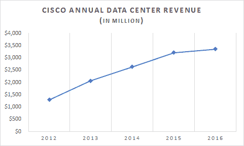

# 云战争:理解思科/谷歌的合作关系

> 原文：<https://medium.com/hackernoon/the-cloud-wars-cisco-google-partnership-6126d7f14278>

思科和谷歌两天前宣布了新的混合云合作伙伴关系，我想知道为什么。随着我潜得越来越深，战略目标很快变得清晰可见。让我们简要考察应用架构的发展，回顾思科和谷歌近年来在公司/技术方面的投资，并了解如何通过这种合作关系实现协同效应:

**应用开发和交付趋势**

与 5 年前构建的应用程序相比，今天构建的应用程序具有非常不同的扩展和管理需求，因为用户数量激增。构建一个像[网飞](https://www.youtube.com/watch?v=CZ3wIuvmHeM)或 [Spotify](https://www.youtube.com/watch?v=pts6F00GFuU) 这样的大型系统需要一种全新的方式来构建、交付和扩展应用。

Application development ecosystem evolution

如果一个应用程序是一辆汽车，那么就把微服务想象成一个导航系统，或者转向系统，或者内部温度控制机制。微服务是一个小的功能系统，它与其他系统协作来交付最终产品。通常，一个由 3-5 名工程师组成的团队负责微服务的所有方面。容器技术的爆炸(由 Docker 领导)无疑加速了微服务的采用。容器让您从硬件投资中获得更多的价值，因为它们可以在测试和生产环境中快速创建和销毁，以完成与您的应用程序相关的关键任务。

容器令人惊叹，但在生产环境中，面对最终用户流量的激增，扩展变得很困难。Google 构建并开源了一个名为 Kubernetes 的工具，它比任何其他替代方案都更好地解决了这个问题(这一点很重要，我们很快会详细讨论)。

此外，大型企业如今对公共云和私有云的扩展能力和安全性感到满意。交付业务关键型应用程序的方式正在发生变化，这些应用程序现在不再快乐地生活在孤立的数据中心内，而是生活在云的各种组合上，以实现实现规模和节省资金这两个相互冲突的目标。

现在，让我们来看看谷歌和思科最近在忙些什么

**思科**

正如 it's [10-K](https://materials.proxyvote.com/Approved/17275R/20161014/AR_300358/pubData/mobile/index.htm#/9/) 中提到的，思科的战略是帮助客户实现数字化转型。思科也在慢慢从旧的永久硬件许可模式转向软件销售的经常性收入模式(SaaS)。

这一战略是由其收购推动的。该公司手头有大量现金(2016 年 7 月 24 日，超过 650 亿美元的现金和现金等价物)，这些现金已被用于收购一些伟大的公司，以增强思科的云产品组合:

(**构建私有云**)2014 年 9 月—收购 MetaCloud，帮助全球组织运营私有云

(**跨数据中心集成容器**)2016 年 8 月—收购 ContainerX

(**监控应用程序的性能**)2017 年 1 月——在 app dynamics IPO 前几天收购了该公司，从而打乱了 2017 年的第一次科技 IPO

(**流式性能数据的机器学习分析**)2017 年 10 月—收购 Perspica，增强 AppDynamics 的产品能力

即使孤立地考虑，上面列出的最后两项收购也很有趣，因为通过将这些产品的数据与其路由器/交换机的监控数据结合在一起，思科可以成为应用性能管理行业的一个重要竞争对手(这是另一天的深入探讨)。

2016 年 10 月，思科终止了思科 Intercloud，这是其 1B 公共云产品。虽然这肯定会造成伤害，但它确实让思科得以推行围绕混合云设计的连贯战略。如下图所示，思科数据中心产品类别的收入在过去 5 年中有显著增长，与谷歌合作的成功跟踪指标之一是——未来几年该趋势线向右上方移动的程度。

**谷歌**

谷歌云是云派对的迟到者，当它进入时，亚马逊网络服务正在引导一个成熟的产品，该产品由一个庞大的云采纳者社区支持，该社区围绕亚马逊提供的工具建立了流程。在这个市场上，产品差异化一直很难。

**云**

过去，可乐大战受到密切关注，在技术领域也有类似的争夺云领导地位的激烈战争。来自 [Synergy Research Group](https://www.srgresearch.com/articles/cloud-market-keeps-growing-over-40-amazon-still-increases-share) 的 2017 年第三季度报告显示，AWS 拥有约 35%的市场份额。谷歌占 4%，微软 Azure 占 8%，要成为云提供商市场的领导者还有很长的路要走。

现在，如果你在谷歌做决策，一个大问题是，你如何对抗市场中 800 磅重的大猩猩(AWS ),它除了增长之外，由于受益于其庞大的用户群体的网络效应，还在不断创新？

在这个竞争激烈的市场中，你不能只在产品能力上竞争，但你能做的是押注未来更大的技术变革，让竞争变得无关紧要。谷歌对 Kubernetes 等技术的投资及其与思科的合作似乎就是这样一个重大赌注。

**策略**

假设 Laura 是一家大公司的首席信息官，负责直接推动收入增长的应用程序。如果应用程序宕机或运行缓慢，她可以向客户流失问好。Laura 希望完全控制应用程序基础架构，并确保关键应用程序 99.99%以上的正常运行时间和安全性。

几年前，当采用云成为主流时，Laura 终于接受了将她的一些应用程序托管在云中而不是数据中心的想法。

她发现自己置身于一个由亚马逊构建的美丽世界——一套用于部署、扩展和监控生产应用的大型工具。这种云比运营数据中心更便宜。

现在尝试向这位首席信息官销售新的云产品。以下是一些关注点:

1.  就开发人员的工作时间而言，改变流程以在这种新的云上托管应用程序的成本很高，而且这一举措增加了错过下一个主要产品发布截止日期的风险。
2.  在过渡期间，即使 30 分钟的停机时间也会对用户造成不利影响，这是任何首席信息官的噩梦。
3.  尚未与新的云供应商建立信任，价值主张也不明确。

现在，如果你是谷歌，你提供的是由出色的客户支持支持的尖端技术，但劳拉对改变有很大的阻力，因为转换成本太高。有哪些方法可以降低这种变革的阻力？

1.  通过与已经与 Laura 签订合同的供应商建立合作关系，消除 Laura 的转换成本。
2.  驾驭下一个大的技术浪潮，并利用它来获得新的客户，所以劳拉的朋友会说服她使用这个新的云。

这就是领先的机会所在。如果首席信息官已经决定采用容器，并且公司已经投入时间使用 Kubernetes 构建应用程序，那么推销就会变得更有影响力

“亲爱的首席信息官:

您已经在使用 Kubernetes，我们可以为您消除结垢疼痛。我们与思科有合作关系，思科的网络产品已经在您的数据中心使用。只需一键安装，我们就可以帮助您为您的应用充分利用公共云和私有云的优势。

谢谢"

对于一家出于安全和隐私原因仍未采用云的财富 500 强公司来说，这种宣传非常有效，比如银行和金融机构。因此，现在获得新客户变得更加容易。这一宣传也适用于已经严重依赖思科私有云/混合云部署的 AWS 客户。

此次合作将思科的网络和安全能力与谷歌的软件专业知识结合在一起，提供混合云解决方案。在这种情况下，最终结果超过了单个实体的总和，将实现协同作用。

亚马逊应该担心吗？

这一竞争举措可能不会偷走其当前的客户群，但如果 Kubernetes 最终成为使用容器构建的应用程序的事实上的标准，新的客户获取策略将带来挑战。在这种情况下，即使软件是开源的，谷歌也会有影响力。

谷歌构建并开源了 Android，但通过收购摩托罗拉和 HTC 等手机制造商，它正在检查与三星的关系——因为它可能会选择在发布软件更新时优先考虑自己的硬件。

如果 Kubernetes 最终成为标准，那么同样的关系动态是否有可能实现——是的，为什么不呢？如果在思科+谷歌提供的混合云上利用 Kubernetes 的应用程序最终在 AWS 上运行的应用程序之前获得了安全更新、客户支持和补丁，会怎么样？

**思科有什么好处？**

采用公共云对思科的硬件业务是一种威胁，因为采用云的客户最终会减少为其数据中心购买的硬件。通过提供与谷歌和微软合作的产品，思科将云带给了它的客户，因此增加了客户转向新供应商的成本。

**为什么不是微软 Azure +思科**？

原来已经有一个联盟[了](https://enterprise.microsoft.com/en-us/partners/cisco/)，所以思科确实在合作开发软件方面的能力。

**合作可能会出什么问题？**

一个大的潜在客户可能会非常乐意与两个不同的供应商合作来满足其需求，而看不到与一个供应商管理关系的价值。也有可能新产品会比 Kubernetes 被更多人采用，这可能会削弱这种关系的协同作用。

除了专注于核心业务之外，谷歌和思科还必须管理彼此之间、与硬件供应商、销售商和客户之间的新关系。这种开销可能不是微不足道的。

**亚马逊的选项**

我想到了几个:

1.  静观其变——此时什么都不做可能是一个非常有效的选择。亚马逊可以选择专注于当前的路线图，并根据市场反馈做出改变。
2.  **与思科**签署类似的协议——亚马逊今天与思科建立了正式的[关系](https://aws.amazon.com/enterprise/hybrid/)，除非排他性条款被添加到思科-谷歌的合同中，否则没有什么可以阻止两家科技公司谈判新的合同。
3.  **让 Kubernetes 变得无关紧要** —亚马逊可以收购一家 Kubernetes 的竞争对手，并投入资源推动这种新软件作为管理容器的默认产品的采用。
4.  与思科数据中心竞争对手合作

**接下来呢？**

亚马逊正在努力为其产品增加更多的安全性，今年早些时候悄悄收购了(？) [harvest.ai](https://techcrunch.com/2017/01/09/amazon-aws-harvest-ai/) 。未来几个月，亚马逊在安全方面的更多投资/合作可能会削弱思科-谷歌的竞争。

思科-谷歌合作产品将于 2018 年年中正式上市。如果这些早期采用者最终成为采用该解决方案的金融机构，几年后云市场份额数字可能会有很大不同。