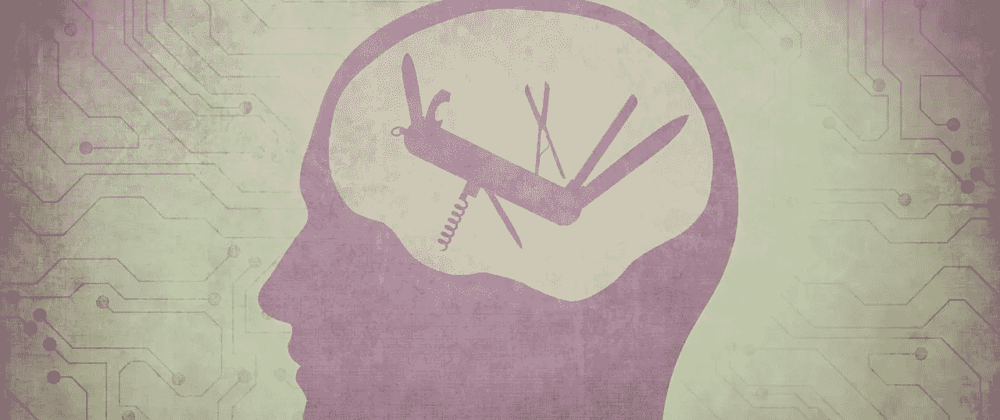
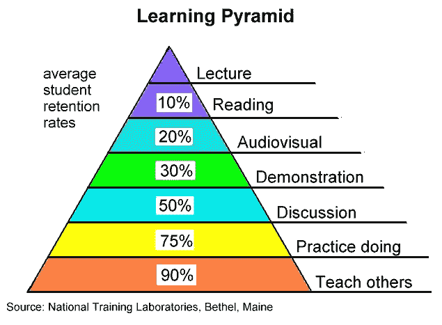
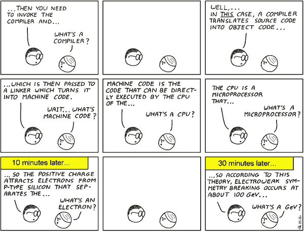

# 依赖抽象的危险

> 原文：<https://medium.com/hackernoon/the-danger-of-relying-on-abstractions-dfa04a8d553d>

## 我们处理抽象的方式可以帮助我们，也可以伤害我们

The abstract representation of a human head with a swiss knife inside the brain

上次我写了一篇文章，发表在自由代码营，名为[不要复制粘贴代码。打出来。](https://medium.freecodecamp.com/the-benefits-of-typing-instead-of-copying-54ed734ad849)在文章中，展示了《T2》一书中的一个图表，叫做**经验锥**。然而，在同一出版物的初稿中，使用了另一个图表，称为**学习金字塔**。

学习金字塔是一个在互联网上广为宣传的流行图表，出现在许多与学习相关的文章中。它基本上承诺通过许多不同的方式显示一个人对信息的平均记忆。

One of the most popular Learning Pyramid graphs, it shows the average student retention rate from top to bottom: 10% Lecture, 20% Audiovisual, 30% Demonstration, 50% Discussion, 75% Practice doing and 90% Teach others.

学习金字塔的问题在于，它没有任何证据表明是正确的科学研究的结果。下面的链接很好地总结了反对它的理由:

*   [学习金字塔:真实、虚假、骗局还是神话？](https://davidtjones.wordpress.com/2009/10/11/the-learning-pyramid-true-false-hoax-or-myth/)
*   [亡灵的故事…学习理论:学习金字塔](http://acrlog.org/2014/01/13/tales-of-the-undead-learning-theories-the-learning-pyramid/)
*   [学习的圆锥还是耻辱的圆锥？](http://www.danielwillingham.com/daniel-willingham-science-and-education-blog/cone-of-learning-or-cone-of-shame)

TL；博士是:

*   没有论文提供任何流行金字塔的精确截面和数字。
*   我们知道，不一致表明经验基础薄弱，尽管数量一致，但有许多不同类型的金字塔结构略有不同。
*   这些数字虽然一致，但都是四舍五入的，我们知道真正的研究不太可能得到四舍五入的数字。
*   埃德加·戴尔的原始论文，也就是许多人声称是其来源的论文，称之为“经验锥”,而没有提供任何数字。

最疯狂的事情是，10 年前工作学习研究的现任主席威尔·塔尔海默联系了 NTL 研究所，他们声称整数是真实的，但未能提供它们是如何被发现的证据。

如果有人愿意去寻找它，有足够的证据来假设学习金字塔本身没有一个强有力的案例，因为许多人没有找到图像的合理来源。不幸的是，我没有意识到这一点，并在文章中使用了它，这是由大量(显然)在他们的文章中使用它的著名来源所引导的。它们都以相当一致的方式重复相同的数字。

> [仅仅因为许多人不断重复一条信息，并不意味着这条信息就是正确的](https://en.wikipedia.org/wiki/Argumentum_ad_populum)

这幅漫画可能会告诉我们为什么这仅仅依赖于不止一个来源的可信度:

A comic where one developer tries to explain an abstract concept but is always interrupted by another question requiring additional explanations of something inside the description of that concept

当然，那些从事实际应用工作的人(比如我)总是可以阅读所有现有的研究论文，并在此基础上得出结论。然而，大多数时候我们需要依赖抽象，否则[我们将一事无成](https://twitter.com/ossia/status/565907210497040384)。在这种情况下，互联网代表了一种抽象，我们可以根据对不同独立来源的分析来推断一些事情，因为多个来源也可以通过某种方式查找它们之前的来源，我们可以将信息追溯到内容的来源。

不幸的是，信任互联网会产生意想不到的副作用。如果一个来源只是编造数字，而后面的来源没有在他们之前查找其他来源，只是复制了相同的数字，那么每个依靠这些数字来查找信息的人都会复制错误的数字。所发生的是一个概念的自然突变，因为多个个体没有使用真正的研究作为参考。

> 隐式地依赖一个抽象会让你依赖该抽象对其依赖者的决策

学校里经常玩的电话游戏很好地说明了这个概念:

> …一个人向另一个人低声传递消息，消息通过一排人传递，直到最后一个玩家向整个团队宣布消息。错误通常在复述中积累，所以最后一个玩家宣布的声明与第一个玩家宣布的声明明显不同，而且通常很有趣。

学习金字塔可能是所有文章无意中玩的电话游戏的结果，这些文章只是复制了一个信息的最新版本(有所有错误),而没有考虑咨询原始来源，依靠直觉认为数字和图表是正确的，而没有验证其背后的科学依据。

我们可以从中得到的是，在没有强有力的证据证明科学被用来产生信息的情况下，某些种类的信息，比如数字，被提及是很危险的。如果依赖一个为我们提供信息的抽象概念，我们至少应该在使用它之前尝试找到一些证据来证明信息不仅仅是编造的，咨询原始来源来验证研究是如何完成的，以及它是否符合科学方法的标准。

如果没有一点点努力去寻找一条信息，总有信息出错的风险。

这就是依赖抽象的危险。

感谢阅读。如果你有一些反馈，请在[推特](https://twitter.com/FagnerBrack)、[脸书](https://www.facebook.com/fagner.brack)或 [Github](http://github.com/FagnerMartinsBrack) 上联系我。