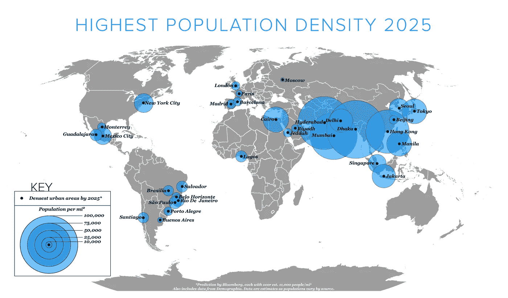

# 自由网络的出现

> 原文：<https://medium.com/hackernoon/the-emergence-of-free-networks-a6ed79abb95a>

**他们对社会和社区连通性的影响**

我们正看到一种新趋势的出现，这种趋势正在改变人们组织和交流的方式，目的是实现共同的目标。

智能手机的普及使这成为可能。如今，越来越多的人第一次在移动设备上发现互联网，而不是通过笔记本电脑或台式电脑。用户时间，似乎是硅谷消费应用程序最有价值的货币，已经从电视、笔记本电脑和游戏机转移到[智能手机](https://hackernoon.com/tagged/smartphone)屏幕上。智能手机已经成为最强大的设备:它们可以独立计算、存储、感知和传输数据。这些设备无线电的能量被用来形成新的连接。神奇的是，当社区、团体或人群使用这些无线接口时，他们形成了一个免费的[网络](https://hackernoon.com/tagged/network)，一个即时的社交网络。一个比它的各个部分的总和更强大的整体。用户的最终链接不再是访问提供商、平台或内容提供商。像你这样的人可以提供连接。

有史以来第一次，这些网络开始在全球范围内形成。我在香港的时候就经历过这种情况，当时学生们把 FireChat 作为自由的象征，在移动网络拥堵的时候组织起来支持自己。在向日葵运动期间，台湾的学生出于同样的原因形成了这些对等网状网络。在《燃烧的人》中，当每个人都因为风暴而被困在泥里时，燃烧者能够分享信息。从那以后，这种现象在世界各地一再发生。从印度的音乐节到莫斯科的示威游行，由这些技术赋权的社区一直在扰乱事件的正常进程。

这是不可避免的，并为人类交流的下一阶段开辟了道路。现代历史充满了新信息技术超越旧技术的例子。电话对电报做了这些，互联网超过了电话。访问信息的需求呈指数级增长，而现代基础设施却跟不上。整个世界将从 2014 年的每月消耗 2.5 艾字节增长到未来 5 年的每月 25 艾字节。点对点网状网络可以将大部分数据转移到网络边缘，让更多人上网。

***未来 3 年，智能手机用户数量将增长两倍以上，这会产生什么影响？***

没人知道。这个新的网络开启了一个新的时代，这个时代通常被称为物联网。我称之为美国的互联网。人口越密集，这个网络的影响就越大。未来 3 年，将有 50 亿部智能手机在新兴市场出货，其中大部分在人口密度高的城市地区。这一趋势将影响人们学习、交流和参与商业的方式。

未来 3 年将会非常精彩，因为智能手机在新兴市场的渗透率将会飙升。这些智能手机的许多用户将无力支付数据套餐费用。在这些市场中，高达 70–80%的智能手机用户不为数据付费是很常见的。这将影响移动互联网，并迫使市场寻找新的方式将互联网带给人们。谷歌已经启动了 Loon 项目，最近还投资了 SpaceX。脸书非常了解获取移动数据的障碍。作为 Internet.org 的一部分，全球超过 150 家移动运营商已经免费开放了对脸书的访问，或者只是让更多用户加入移动数据计划。

Percent of global Adult Population Without a Smartphone

智能手机是新的基础设施，你是载体。