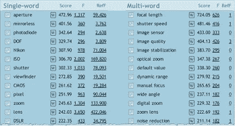
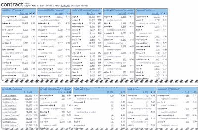

# 语料库分析工具的发展

> 原文：<https://medium.com/hackernoon/the-evolution-in-corpus-analysis-tools-bfdbfea6076e>

*这是 ondřej·马图斯卡的客座博文，他是* [*词汇计算*](https://www.lexicalcomputing.com/lexical-computing/) *公司的销售&营销经理，该公司开发了一款名为* [*草图引擎*](https://www.sketchengine.co.uk/) *的语料库和语言数据分析产品。*

*几周前，我通过 Jost Zetzsche 的时事通讯(工具箱的第 276 版)第一次知道了 Sketch Engine。随着相对干净的文本语料库的激增和数据量的增长，有必要使用新的工具来理解这种大量的文本数据，这些数据可能会也可能不会被考虑进行翻译。这些新工具帮助我们了解如何在大量文本语言数据中准确描述最突出的语言模式，并从这些新的语料库中提取有用的知识，以帮助完成许多与翻译相关的任务。对于我们这些在机器翻译领域的人来说，总是有学生制作的(主要是 NLP 和计算语言程序的研究生* [*)工具被使用和需要来理解语料库以获得更好的机器翻译开发策略，并为机器学习训练过程准备好文本数据。这些工具中的大部分都被描述为不“用户友好”，或者更直白地说，太令人讨厌了。随着我们进入深度学习的世界，对用于训练或利用任何翻译任务的充分理解的数据的需求只会越来越重要。*](http://libguides.usc.edu/textmining/tools)

***尽管大肆宣传，但我们应该明白，深度学习算法正越来越多地被视为商品。真正有价值的是数据。***

*我经常被问到将来翻译人员应该学习使用什么样的工具，我普遍认为他们应该远离 Moses 和其他 MT 开发工具包，如 Tensorflow、Nematus、OpenNMT 和* ***专注于*** [***数据分析和准备***](https://kv-emptypages.blogspot.com/2016/07/5-tools-to-build-your-basic-machine.html) ***方面，因为这种能力会为任何使用的数据驱动的机器学习方法增加价值。*** ***值得记住的一点是，尽管有炒作，深度学习算法是商品。数据才是真正的价值。*** *这些机器翻译深度学习开发工具(算法)很可能在近期内快速发展，我们可以预计只有最有能力和资金充足的团队才能跟上最新的发展。(你认为有多少 LSP 尝试过所有四个开源 NMT 平台？或者知道 CNN 是什么？我打赌只有 SDL 有。)甚至学术界也抱怨神经 MT 算法研究的变化率和新发展，因此 LSP 和翻译者在追求神经 MT 模型开发时很可能处于明显的劣势。对于从事商务翻译工作的人来说，为机器学习过程准备数据将成为越来越重要的战略性技能。这意味着以下技能在我看来是有价值的。在我看来，它们都有些紧密相连:*

*   *语料分析&像素描引擎这样的剖析工具*
*   *语料库修改工具，即高级文本编辑器、*[*Text pipe*](http://www.datamystic.com/textpipe)*和其他编辑器，可对超大型(数千万句)文本数据集进行模式级编辑*
*   *快速错误检测&超越 PEMT 传统观念的修正工具*
*   *MT 输出质量评估方法论&工具*
*   *训练数据制造能力，这种能力是从对来源和 TM 语料库的更深入理解发展而来的，这种理解是由诸如草图引擎之类的工具实现的。*

这些都是承担 500 万和 1 亿多单词翻译项目的基本工具，这些项目在未来可能会变得更加普遍。很明显，许多翻译者不想做这种工作，但是随着机器翻译使用的扩展，这种工具和技能变得更有价值，许多人会认为理解语言大数据中的模式对任何类型的翻译任务都有很大的价值。

*约斯特·蔡澈在下面提供了素描引擎的一个很好的概述:*

*   **Word sketches** :这就是这个项目得名的原因，也是 Kilgarriff(联合创始人)带来的东西。**单词草图是对一个单词的语法和搭配行为的总结(搭配是指分析一个单词与其他单词或短语共现的频率)。**由于语料库中的数据是词汇化的(即，单词被分析，因此它们可以被带回到它们的基础或字典形式)，结果比我们的大多数翻译环境工具在无法将一个单词的不同形式相互关联时提供的结果更有意义。*草图引擎*提供的另一个单词草图选项是相似单词的单词草图比较。
*   **词库:**检索具有相似词的详细列表或图形词云的能力，包括为那些术语创建关于词草图差异的报告的链接，以了解实际用法中的确切差异。
*   **Concordance:** 搜索单个单词、术语，甚至更长的短语。由于支持的语言中的数据是有标记的，所以也可以搜索特定类别的单词或围绕相关单词的特定类别的单词。
*   **平行语料库:**检索上下文中的双语单词或短语集。目前，这只能在屏幕上查看数据，但很快就会提供可下载的数据。这在上传您自己的翻译记忆库时尤其有用(见下文)。
*   **单词列表:**创建单词列表和出现次数的可能性，或者作为词条(每个单词的基本形式)，或者在每个单词形式中。
*   **创建自己的语料库:**对于译者来说，这可能是最令人兴奋的功能。您可以上传自己的翻译记忆库，也可以使用该工具自带的搜索引擎机制(依靠 Microsoft Bing)创建一个双语网站列表，其中包含与您的领域相关的术语。你可以下载许多包含某些术语的网站来建立一个语料库。但是，您无法通过草图引擎让它们自动与网站翻译版本保持一致。您可以执行前面提到的任何功能，但也可以对用户创建的语料库进行关键字搜索，识别相关术语，并将其下载到 Excel 或 TBX 文件中。该功能目前可用于捷克语、荷兰语、英语、法语、德语、中文、意大利语、日语、韩语、波兰语、葡萄牙语、俄语和西班牙语。这个的双语版指日可待。

许多年前，我认为从 TM 到其他“更智能”的语言数据分析和处理工具的发展会更快，但在像翻译行业这样高度分散的行业中，事情变化很慢。我认为像 Sketch Engine 这样的工具，加上更具吸引力的机器翻译功能，最终标志着一个转变正在开始，并有可能形成势头。

*另外，有趣的是，在我发表这篇文章的第二天，ATA 也发表了一篇关于* [*的文章，一篇关于语料库分析*](https://atasavvynewcomer.org/2017/08/29/corpus-analysis-translation/) *的文章，主要关注开源工具。*

*下面的重点几乎总是我的。*

*= = = = = = = = = = = = = = = = = = = = = =*

在翻译中部署自然语言处理和文本语料库

自然语言处理(NLP)是一门能为译者和翻译提供很多东西的学科，然而翻译很少利用这种可能性。这可能部分是由于没有一定水平的 IT 技能，NLP 工具很难使用。这是素描引擎团队在 13 年前意识到的，并建立了素描引擎，这是一个让任何人都可以使用 NLP 技术的工具。Sketch Engine 最初是一个语料库查询和语料库管理工具，随着时间的推移，它开发了各种功能来满足语言阵营之外的新用户(如翻译人员)的需求。

术语抽取是 NLP 变得非常有用的第一个领域。传统的方法倾向于基于 n 元语法，n 元语法是任意 n 个单词的序列。简而言之，术语提取工具将找到文本中最频繁的 n 元语法，这些将作为候选术语呈现给用户。然后，用户将进行下一步:手动清洁。收到非术语多于术语的列表并不少见，因此手动清理就成了自然的下一步。一些术语提取工具引入了停用词列表，用户甚至可以指出该词是否是硬停用词，或者停用词是否只允许出现在术语中的某些位置。虽然这导致了改进，但输出仍然包含大量噪声，手动清洁仍然是该过程中的重要步骤。

**在 Sketch Engine，我们决定致力于术语提取，以期通过利用我们的自然语言处理工具和数十亿字的通用文本语料库获得更清晰的结果。**

草图引擎和传统术语提取工具的主要区别在于，上传到草图引擎的每个文本都被标记和词条化。因此，系统知道该单词是动词、名词、形容词等。并且还知道哪些单词是被称为引理的相同基本形式的下降形式或共轭形式。草图引擎可以分别查找作为名词的工作和作为动词的工作，如果需要，还可以将不同形式的名词(格、复数/单数)或动词(时态、分词)视为同一个单词。这是在术语提取中被利用的东西。

对于每种支持术语提取的语言(截至 2017 年 8 月有 16 种语言)，我们开发了定义，告诉 Sketch Engine 该语言中的术语可能是什么样子。例如，Sketch Engine 知道英语中的术语最有可能采用(名词+)名词+名词或形容词+名词的形式，而在西班牙语中，最有可能是名词+形容词(+形容词)或名词+的+名词。完整的规则比这里列出的更复杂。这将立即取消任何包含动词或根本不包含名词的短语的资格。

除了短语的格式之外，草图引擎还利用其庞大的通用文本语料库来检查与通用语言相比，通过格式检查的短语是否在所讨论的文本中更频繁。在此检查过程中，每个短语被视为一个单元，在一般文本中搜索并统计相同短语的出现次数，然后进行比较。词汇化在这里起着重要的作用，因此复数和单数或不同的格可以算作同一个短语。格式检查和频率比较的结合产生了异常清晰的结果。以下是从关于摄影的文本中摘录的候选术语。未应用手动清理，列表在草图引擎中显示。

通过使用名为 one click Terms【https://terms.sketchengine.co.uk/ 的草图引擎的新专用术语提取接口，可以立即检查提取的质量

虽然大量的翻译业务与术语有关，但术语本身并不构成文本的大部分。这中间有很多语言，翻译起来可能并不总是那么简单。翻译人员习惯于在他们的 CAT 工具中使用索引，在这些工具中，翻译记忆库(TM)充当数据源。TM 对于术语工作来说已经足够了，但是对于介于两者之间的语言来说可能就没那么有用了。词表通常很小，索引没有找到足够的出现次数来判断哪种用法是典型的。这就是一般文本语料库派上用场的地方。“一般”一词是指这些语料库被设计成包含尽可能多的文本类型和主题。因此，一个普通的文本语料库将包含甚至非常专业的术语文本，以及来自各种来源的普通中性文本。草图引擎包含多种语言的数十亿字的语料库。最大的语料库是英语，有 300 亿字，即 300 亿字！

英语 33100
德语 19900
俄语 18300
法语 12400
西班牙语 11000
日语 10300
波兰语 9700
阿拉伯语 8300
意大利语 5900
捷克语 5100
加泰罗尼亚语 4800
葡萄牙语 4600
土耳其语 4100 瑞典语
立陶宛语 1000
印地语 900
保加利亚语 800
拉脱维亚语 700
爱沙尼亚语 600
塞尔维亚语 600
韩语 600
塞尔维亚语 600
波斯语 500
马耳他语 500

这种规模的语料库将为大多数单词或短语返回数千个命中结果，在频繁出现的情况下，将返回数百万个命中结果。这样的一致是人类无法处理的。这就是为什么我们开发了一个高级功能，称为 word sketch，它将处理如此大量的信息，并以简洁易懂的格式呈现结果。**单词 sketch 是该单词保留的单词组合(搭配)的一页摘要。它会给用户一个在上下文中如何使用这个词的即时想法。搭配以反映句法关系的组的形式出现。单词草图的示例可能如下所示:**

在语料库中找到了 200 万个“contract ”,并处理成上面的这个搭配摘要，用户可以在几秒钟内理解。它给出了一个清晰的图片，让用户可以像说母语的人一样自然地使用这个词。该信息是自动计算的，无需任何人工干预，这意味着用户可以为语言中的任何单词(包括罕见单词)生成该信息。强烈建议使用大型语料库来获取如此丰富的信息。最小大小约为 10 亿字。较小的语料库也将产生单词草图，但是没有那么多信息，并且低于 5000 万单词的语料库不太可能产生任何有用的东西，尤其是对于不太常用的单词。建议将 Sketch Engine 中最大的预加载语料库与 word sketch 一起使用。

我相信每个人都有这样的情况，当他们想说些什么，但却想不出合适的词。人们通常能想到一个相似的词，只是不是正确的那个。这是一本辞典有用的时候。传统的印刷和手工制作的同义词库内容受到空间或资金的限制，通常两者都有。NLP 和分布式语义的结合产生了可以自动生成同义词库条目的算法。计算机通过计算识别相似单词的想法经常导致怀疑，但结果却出人意料地有用。算法是如何发现词义相似的词的？分布语义学认为，出现在相似语境中的词在意义上也是相似的。因此，为了找到一个名词的同义词，Sketch Engine 将为语料库中找到的所有名词比较单词 sketchs。具有最相似单词草图的单词将被识别为同义词或相似单词。如果您需要一个类似于授权的词，以下是 Sketch Engine 将提供的示例:

许可
同意
批准
授权
准许
通知
核查
文件确认
许可
监督
披露
弃权
许可
豁免
证书补偿
登记
认证
通知
限制
报销
资格同义词按照每个单词的单词草图相似度计算的相似度得分排序。列表的顶部(第一列)是最有价值的。该列表包含某些不是很好的同义词的单词，它们被列出是因为它们形成的搭配类似于授权的搭配。然而，这仍然使列表非常有用，因为词库功能将由具有该语言的适当知识的人使用，并且这些词用作建议，用户将从中挑选最合适的一个。

对于没有同义词的单词，词库将生成属于同一类别或同一主题的单词列表。这是订书机的辞典:

记事本
回形针
卷笔刀
剪刀
橡皮擦
荧光笔
钉枪
铅笔钉
铅笔钉
便利贴
蜡笔
螺丝刀
量角器
油漆刷
图钉钢锯
扳手
锥子
手术刀
复印机
修剪器这种类型的同义词库条目可能有助于回忆同一类别中的一个单词。上下文中的例子—索引

草图引擎还具有简单和复杂搜索选项的一致性，用户可以搜索他们自己的文本以及预加载的语料库。这些选项允许通过精确键入的文本进行搜索，也可以通过词条(单词的基本形式，也可以找到所有派生形式)进行搜索，或者通过词性或语法类别(如动词时态)来限制搜索。它甚至允许在不指定具体单词的情况下搜索词汇或语法模式。这个有趣的索引展示了由介词 of 连接的名词序列的例子。这是我最近不得不查找的东西，以检查我可以连续使用多少个。虽然索引本身没有直接回答这个问题，但我可以看出，只要表达式由数字和测量单位组成，使用 use 3 of's 是正常的，这是我最初在句子中使用它的方式，索引帮助我检查我是正确的。

草图引擎还包含可用于翻译查找的并行多语言语料库。同样，简单和复杂的搜索标准都可以应用于第一和第二语言。这将使用户能够了解一个单词没有被最明显的对等词翻译的情况。例如，此搜索在英语中查找单词 vehicle，并匹配不包含 vehículo 的西班牙语段，以发现可能需要不同翻译的情况。

这对于没有任何 TM 或者 TM 不够大而不能提供所需覆盖的用户来说尤其有价值。拥有 TM 的用户可以将其上传到草图引擎，以访问高级搜索工具。

Sketch Engine 有一个用于自动语料库构建的内置工具。用户不需要任何技术知识来构建语料库。上传他们自己的数据(文本、文档)就足够了，如果用户没有任何合适的数据，素描引擎会自动在互联网上找到它们，下载它们并将其转换为语料库。建立一个 10 万字的专门语料库只需要几分钟。

第一个选项是显而易见的——用户上传他们的文本和文档，草图引擎将对它们进行词条分类和标记，语料库就准备好了。

如果用户没有合适的文本或者文本长度不够，用户可以提供一些定义主题的关键字。例如，定义牙齿护理的关键字可以是:牙齿、牙龈、蛀牙、护理。Sketch Engine 将使用这些关键字创建 web 搜索查询，并与 Bing 进行交互。Bing 将找到与网络搜索相对应的页面，并将 URL 返回到 Sketch Engine，在那里 URL 的内容将被下载、清理、标记和词条化，并转换为语料库。整个过程只需要几分钟。对于任何需要专业语言的可靠样本来探索术语和短语如何正确和自然使用的人来说，这是一个很好的工具。

免费的 30 天素描引擎提供完整的功能和多种语言的预装语料库，可从素描引擎网站获得:[https://www.sketchengine.co.uk](https://www.sketchengine.co.uk/)

— — —

Ondřej 负责监督销售和营销活动以及外部沟通。他是任何寻求草图引擎信息的人的主要联系人，也热衷于支持现有用户，以便他们可以充分利用草图引擎。

*原载于 2017 年 9 月 1 日*[*【kv-emptypages.blogspot.com】*](https://kv-emptypages.blogspot.com/2017/08/the-evolution-in-corpus-analysis-tools.html)*。*