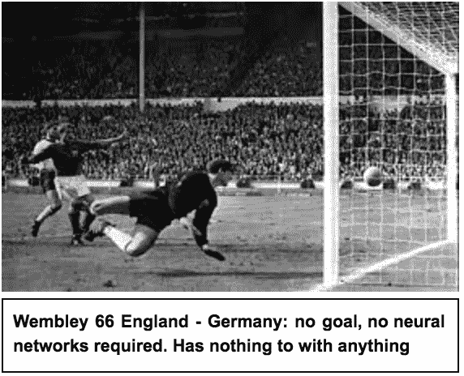

# 事实机器 II:机器学习不是密码学

> 原文：<https://medium.com/hackernoon/the-fact-machine-ii-machine-learning-isnt-cryptography-56fe30d3998d>

比特币最酷的把戏是它的投票机制，它鼓励人们按照规则玩游戏，并创造信任。我们应该重新发明智能机器学习算法的原理。这将允许我们将真实世界的“事实”引入我们的系统

在《T2》第一部分中，我描述了比特币如何组织矿工，以确保他们遵守规则，从而提供一个有序交易的区块链，这种交易不能被改变。区块链对现实世界的事实视而不见，但神经网络可以在重要方面模拟人类如何对世界进行分类。

一个神经网络可以检测到一辆汽车，许多神经网络在正确的激励下将确定确实有一辆汽车。然后，我们将事实记录到区块链中，我们的智能合同会奖励一张虚假的停车罚单。

所以我们想以某种方式组织来自机器学习领域的算法，就像我们组织比特币矿工一样，因为某种程度上我们可能能够以这种方式建立事实？但是这些是完全不同的学科。这听起来很奇怪，最重要的是，以太坊空间中有一些聪明的人，他们认真思考了如何将数据纳入智能合同。“这些你都考虑到了吗，”

# 所以神经网络根本不是密码学

没错，但不管怎样:这就是挑战，笨蛋！问题是，我们是否能以类似矿工的方式组织神经网络，让他们投票并确立一个事实:向人类认为是真理的东西靠拢(“犯规！”).当然，从数学上来说，这是完全不同的领域。我不是在寻找一个[替代采矿难题](https://www.youtube.com/watch?v=TipGy2bOVL4)，我也没有试图通过使用一种令人惊叹的机器学习算法来生成比特币区块链的安全属性，这种算法可能会产生一些有用的效果，而不是像比特币那样消耗大量的能量。

我们来简短的对比一下，可能(总是！)我们可以借鉴比特币。

比特币哈希难题，那些 [SHA 256](https://en.bitcoin.it/wiki/SHA-256) 算法，都是经过精心选择的，以实现我们想要的:比特币区块链安全特性“不变性”，并最终避免你重复花费比特币。“双重消费”是另外一个你应该查一下的概念，如果你不熟悉的话。最初的白皮书实际上非常容易阅读，所以如果你还没有阅读过的话，请阅读一下这个博客。

比特币[难度目标](https://en.bitcoin.it/wiki/Difficulty)代表着一种数学挑战，无法通过谷歌搜索或观察外部世界来回答。这不像我们问谁是公元 40 年的罗马皇帝或者阿姆斯特丹今天的天气。此外，你可以非常容易地调整“比特币问题”的难度:你只需调整难度目标，从统计上看，你可以有一个很好的猜测，平均而言，网络中的一个矿工将解决这个难题。目前大约每 10 分钟发生一次。如果你觉得这些听起来都像火星人，那就去看看[散列函数](https://en.wikipedia.org/wiki/Hash_function)。

现实生活中的问题是不同的:你通过环顾四周来回答问题(“那是犯规吗？”)或者查资料(“尼禄皇帝什么时候再活一次？”).有时它们很模糊，很难回答(“今天镇上的气氛如何？”)而且有时会有非常明确的答案(“你的电话号码是多少？”).你和其他人将会学习，你的表现也会提高。与哈希算法不同，我们有非常清晰的答案，矿工的表现不会因为每周 7 天、每天 24 小时从头再来就有所改善。“现实生活中的问题”是人工智能试图帮助解决的问题。它们很难处理，但结果比找到正确的随机数来满足一些难度目标要有用得多。

在比特币中，一旦有人找到了符合难度目标的解决方案，就很容易检查出这是“正确的解决方案”——很难找到，很容易验证。这一特征在工作证明机制中具有重要作用。一旦一名矿工用正确的解决方案分发了区块，矿工们争夺比特币奖励的竞赛就停止了，所有人都可以很容易地验证这一点。

如果我们在神经网络之间组织一场比赛来确定，是否有人犯规或犯规，就没有这样明确的终点。没有明确的验证步骤。从我们可以验证比特币矿工找到了正确的[随机数](https://en.bitcoin.it/wiki/Nonce)的意义上来说，不存在数学上客观的“这是否是犯规”。当然，我们可以找一个主裁判来定义，到底发生了什么——但是你会看到它的走向。这个解决方案重新引入了中间人，即中央权威。我们也可以马上问那个家伙，然后忘记我们的比赛。

如果你想有一个分散的模式，你可以设置一个人为的门槛。您将等待几分钟和/或网络投票的最低数量。如果您选择存储这些结果，您还可以对照您之前参加的比赛来检查他们提供的结果。事实上，为了得到正确的结果，你可以让这些网络访问之前被分类的犯规，这样他们就可以学习了。要有一个可靠的、高性能的机制，还需要做很多研究。称之为“实现细节”似乎低估了任务的重要性和复杂性。但是似乎没有理由为什么我们不能建立这样一个算法。最终，那些参与多数投票的人(比特币中最长的链)将会获胜。

然后呢:领奖？

或者他们有资格进入下一轮竞争:工作证明或股权证明或任何其他你选择的创造不变性的机制。因为在你确立了一个事实之后，你想要一劳永逸地记录下来，并允许智能合约利用它们。现在你的“裁判智能合同”可以说“禁区内犯规意味着处罚”。

我不是说把神经网络和密码学竞赛混为一谈，它们有不同的手段和不同的目标。一个是建立事实，你试图从博弈论和人工智能算法的特征中提取这些事实。另一个是不变地记录事实。我们使用博弈论和密码算法来实现这一点。

不是混合，是组合。你在一个不同的问题中重复使用“比特币把戏”,将两者结合起来，首先建立一个事实，然后记录下来。

# 事实，而不是神谕，应该成为明智的契约

更根本的问题是什么:事实还是法官用事实做什么？没有事实，裁判充其量只是一个彩票，或者最坏的情况是他们很容易受到胁迫和腐败。没有事实的智能合约往往是盲目无用的软件机器。对于加密货币等数字资产，你可以制定一些有趣的智能合约，但每当你的数字资产代表现实生活中的资产时，你就需要这种联系。

如果在一场 FIFA 世界杯比赛中有一名数字裁判，并且有两个人在一台控制台上对阵，事情就很美好:计算机可以跟踪每一步，它确切地知道发生了什么，并以数据结构和 1 和 0 的列来表示比赛。演员是数字世界的一部分，但在真实的足球比赛中并非如此。你需要与外部世界的联系，你的数字裁判可以遵循国际足联比赛裁判遵循的规则，但它需要了解外部世界的事情。

写聪明合同的聪明人都知道，加油！以太坊领域的话题经常在“甲骨文”的标题下讨论。一种典型的方法是给智能契约一个到外部数据源的连接，基本上是一个 API 调用。例如，它可以是像彭博这样的数据源。所以本质上，这些平台(例如 [oraclize](http://www.oraclize.it/) 、 [realitykeys](https://www.realitykeys.com/) 、 [smartcontract](https://www.smartcontract.com/link) 、 [gnosis](https://gnosis.pm/) 或 [oracul](/@roman.brodetski/introducing-oracul-decentralized-oracle-data-feed-solution-for-ethereum-5cab1ca8bb64) 以及其他平台)提供了从平台到外部数据源的 API 调用，有些还试图与预测市场合作。不同的是如何打电话，如何证明没有被篡改。人们可以想出让几个数据源确认一个事实的方案，使事情不那么集中。人们可以想象出复杂的预测市场来帮助事实。但是到目前为止，就我所见，这些方法并不是非常分散的。这些服务也是有限的，因为你真的只能检查彭博或预测市场提供的事实。

我的建议是，在你的事实引擎中建立一个共识机制，像 Satoshi 那样去做。事实就是这么根本，值得。只有在你确立了事实之后，一份不可阻挡的、没有腐败的智能合同才能成为有用的工具。它会做裁判做的事情:我们知道有人在禁区内击球前撞到了别人的脚。现在的规则是:这需要处罚。裁判会犯错，也会腐败。智能合约很难被破坏，在这种情况下，智能合约有望发挥作用。

[下一部分](/@benedikt.herudek/the-fact-machine-iii-blockchains-smart-contracts-dont-matter-that-much-fb5c7ac5ede5)，我总结一下。我要问的问题是谁是聪的“真正”精神继承人，这当然是一个荒谬的问题。我们甚至不知道那个人是谁。但这是一个很好的机会来看看区块链行业、以太坊和 Hyperledger 如何从 Satoshi 那里获得灵感，并看看我建议的不同重点。我会澄清，我在这里实际上想说的是什么，因为我们实际上只是说(剧透——警报):将机器学习与比特币工作原理证明等分布式共识机制相结合是一个有趣的研究领域，因为它可以帮助我们在区块链这样的数字系统中建立和表现事实。但实际上区块链和智能合约并没有那么重要，我会在下一部分解释。