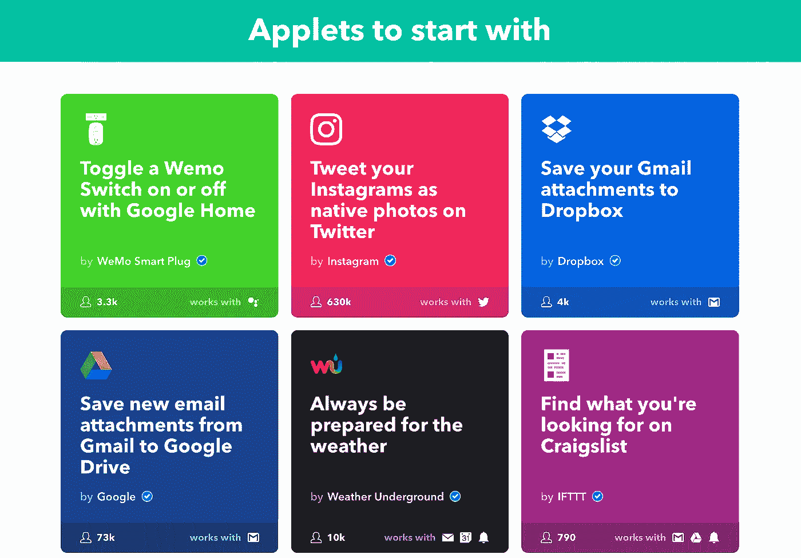

# 第一次后训练营公关:反思

> 原文：<https://medium.com/hackernoon/the-first-post-bootcamp-pr-a-reflection-a625e19b556e>

我很高兴能在 IFTTT 公司开始我的开发者生涯，该公司的使命是让用户能够连接他们日常使用的不同服务。IFTTT 的应用程序的用户可以用简单的编程逻辑制作自己的“小程序”:如果这个，那么那个。可能性是无限的。

第一天，我来到位于旧金山市场街的一间可爱的办公室，使用我漂亮的新电脑，并开始设置我的开发环境，学习我们使用的不同工具。

现在，我能给这种经历的最好类比是试图从消防站喝水。在我的训练营，我学会了反应和表达，这里的一切都像是用 Rails 写的。花括号在哪里？还有，Docker 是什么？梅索斯是谁？我不知道你说的负载均衡器是什么意思。类似这样的？

有人告诉我要慢慢来，我应该试着从我已经知道的东西中获取价值。所以我专注于此，鼓起勇气，开始着手我的第一个项目。

几天后，我准备好了我的第一个拉请求。我的提交历史有点混乱(记住，尽早提交，经常提交)，但是我做了一个漂亮的 PR，有很多图片和解释。我告诉我的团队我已经准备好接受审查，然后等待。

有时在生活中，你有微弱的希望，也许这一次事情会很容易。你不必跋涉上山，或者经历足够强壮才能跋涉上山的痛苦，也许你会得到 Lyft 的促销代码，有人会以 2.64 美元的价格载你上山。或者不管最低金额是多少。

但是，生活从来不是这样的。所以，我打开我的公关，有大量的评论。我一直做错的事情，我甚至不知道是错的。从我的 Javascript(我对它很有信心)到我的 CSS，大量的东西都需要修改，这样代码才能投入生产。更令人沮丧的是，我以为这个任务只需要一天时间(结果花了我 2 周时间)。

我记得唯一一次有这种感觉是在我大学的第一个学期。这是第一年的研讨会，是所有新生的必修课。我想如果我努力工作，学以致用，我会做得很好。

快进到我的第一篇论文:我得了 B-。实际上一开始写的是 c++，但她把它改了，因为“我的语法非常棒。”但我的论点没有经过深思熟虑，也不清楚我是如何证明我的论文陈述的。我不明白。我一直认为自己是一名优秀的作家，在高中时一直受到好评。

我走近老师，问她我做错了什么。她在图书馆和我见了一个小时，我还是不明白她的批评。再加上无助的感觉和得低分的巨大压力，我开始在图书馆哭了起来。不用说，这不是我最好的时刻。

我拿着我用红墨水写的第一个版本，解剖了几个小时。第二天我重新提交给了她。她把分数提高到了 B+。在整个学期中，我很幸运有一位老师，她虽然严厉，但愿意花时间解释她认为我需要改进的地方。我在班上的最终成绩是 A-，我感到自豪不是因为成绩，而是因为我已经成长为一名作家，以及我为此付出的努力。

所以我认为对于所有训练营的毕业生来说，第一次公关应该是这样的。我习惯用 2 到 3 周的时间来创建功能齐全的应用程序，并准备好展示给雇主。如果你深入研究我最后一个训练营项目的源代码，你会发现它相当粗糙。一家产品标准很高的科技公司会挑战你，让你的代码尽可能的优雅和优化，不管要花多长时间。

最后，我要说的是，当你从编码训练营[出来开始一份新工作时，你应该感到自信。在 3 个月的时间里，我们学会了一整套技术和](https://hackernoon.com/tagged/bootcamp)[编程的基础知识](https://hackernoon.com/tagged/programming)。当被告知我必须学习 Ruby 时，我很兴奋，并相信我将迎接挑战。我认为这种惊人的适应能力是我们最大的财富。我们学得很快，从四个月前我第一次到 IFTTT 开始，我已经可以看到作为一名程序员我成长了多少。所以不要害怕在第一次公关中得到大量的反馈。你会因此变得更好。