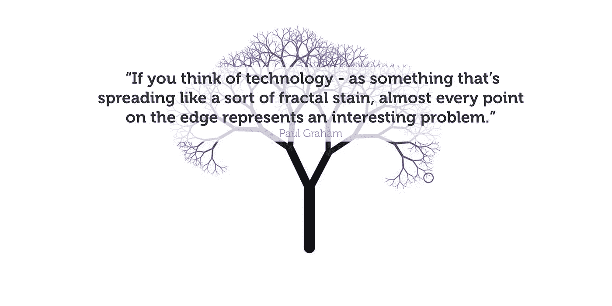

# "知识最大的敌人不是无知，而是对知识的错觉."

> 原文：<https://medium.com/hackernoon/the-greatest-enemy-of-knowledge-is-not-ignorance-it-is-the-illusion-of-knowledge-6dc94fe3519a>

[人名]斯蒂芬·霍金 (理论物理学家、宇宙学家及作家)

在我的许多演讲和研讨会中，我使用了“拉姆斯菲尔德空间”的概念——未知的未知。这是关于测试和创新的探索性本质——利用你的决策的所有不断分支的结果，朝向那些选择更高质量的无知领域！

我不断回到这个领域——在研究中提出好的问题，探索令人不舒服或似乎违背直觉的未来方向，或者在做出承诺之前测试和探索它们。

所以当我听到 BBC 的这个节目时，它非常有趣——关于“不知道”——无知以及它如何推动科学和探索未知。

哥伦比亚大学生物学教授斯图尔特·费尔斯坦的这段话非常精彩，值得你花 2 分钟的时间:

> “我们都很想谈论我们不知道的事情。成就伟大科学家的是那些能够把问题放在一起的人——那些能够看出什么是真正重要的问题或者更好的问题的人。我称之为“高质量的无知”与“低质量的无知”相对——因为这两种无知都有。
> 
> 这就是科学的真正意义，当你这样想的时候，科学变得非常吸引人，非常容易接近，对人们来说非常有趣——在许多方面都令人耳目一新。因为毕竟我们都喜欢谜题——我的意思是，这是其中之一——你知道好奇心是让我们前进和最投入的东西。所以我想这样教科学。
> 
> 我们知道很多东西，但当然还有更多我们不知道的东西。不仅有更多我们不知道的东西——而且我们知道的越多，我们不知道的东西就越多，因为有很多我们以前不知道的东西。
> 
> 然后你做一个实验或收集一些数据，然后你会发现真的有更多我们现在不知道的东西——我们可以问。所以一大堆新问题。
> 
> 我一直喜欢的一个图像是一个知识的圆圈——但随着圆圈的增长，随着直径的增加，与光明圆圈之外的所有黑暗接触的圆周也在增加——那就是无知。
> 
> 所以当你增加知识，当你增加圈子的规模，你也增加了你现在接触的无知的数量。这是一个动态的东西，不仅仅是一个存在，不仅仅是“我们不知道的东西”，而是继续增长，我们继续创造它。"

 [## 无知是福吗？-英国广播公司第四台

### 萨提那姆·桑格赫拉问道:"当我们能够知道一切时，我们是不是比一无所知更好?"

www.bbc.co.uk](http://www.bbc.co.uk/programmes/b0639xsw) 

享受吧。

C.