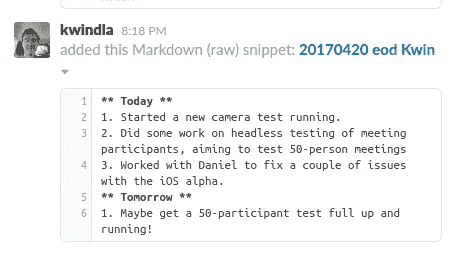

# 沟通的重要性💖-初创公司的节拍

> 原文：<https://medium.com/hackernoon/the-importance-of-communications-beats-for-startups-fe2e3e3a870a>

photo credit: [https://unsplash.com/@sauriel](https://unsplash.com/@sauriel)

如果你是一家初创公司的创始人，你可能至少会为管理团队的沟通节奏而感到些许困惑。

搞清楚良好的沟通心跳是创业[管理](https://hackernoon.com/tagged/management)的重要基础之一。但是，就像几乎所有关于创业管理的事情一样，*基础*和*简单*不是一回事。

几乎每次我和第一次创业的人交谈时，都会提到关于内部沟通的问题。我对此有强烈的看法，因为我经历过多次早期创业成长曲线，一次又一次地看到良好的沟通节奏对创业团队的幸福有多么重要。

# 小的更美

当你很小的时候——只有两三个人——你通常可以进行完全特别的交流。但是现在开始变得更有组织性和主动性还不算太早。如果你是一个分散在不同地点工作的团队，这一点尤其正确。一旦你发展到三个人以上，建立哪怕一点点的结构都会对生产力有所帮助。

这里有一个方法，我认为对大多数创业公司来说非常有效，最多 15 个人左右。

1.  非常短的**每日站立**会议。公司里的每个人都要简要(一到两分钟)总结一下她昨天做了什么，她今天的重点是什么，以及她需要其他团队成员做的任何阻碍或主要事情。
2.  **每周公司优先级会议**。这些会议由一个人主持，以保持他们的专注和效率。那个人从总结公司当前的目标开始。然后每个人都绕着圈子走，简要回顾他们正在做的事情，以及他们正在做的事情如何与公司目标保持一致。主持会议的人让事情继续进行。这个会议不应该超过一个小时。
3.  每个季度，公司都会花半天时间进行一次**“我们做得怎么样，下一步做什么”的谈话**。
4.  每周，创始人都会在办公室外喝咖啡，或者吃顿饭，或者一起散步。
5.  每周，每位创始人/经理都会与她的直接下属进行一次**一对一会谈**。这是员工告诉经理他的想法并征求反馈的时候了。

你可以在这里看到一个模式。前三次会议的重点是让每个人互相了解信息，并围绕一组共同的目标保持一致。周会是日会的加长版，更强调上下文。季度会议是周会议的加长版，更加强调背景。

# 维护共享上下文比你想象的要难

事实证明，即使对一个小团队来说，保持一致的上下文意识也不是很难。这有很多原因，但最简单的方法是，公司创始人和其他人之间存在很大的信息不对称。一家小公司的创始人几乎能看到正在发生的一切，脑子里有公司的全部历史，而且对公司的思考时间比公司存在的时间还要长。对于团队中的其他人来说，情况并非如此。

很久以前，一个朋友告诉我，在你公司的每个人都听到并内化某事之前，你必须说七次。这一直困扰着我，因为当时我正努力管理一家“只有”大约 50 或 60 人的公司。“你必须在它坚持之前说七遍”这个简单的想法就像一个镜头，让我能够专注于一件我作为一个创始人没有做好的事情。我没有足够努力地想出如何可靠地向每个人传达我们公司的背景。(我甚至还没意识到这是我需要弄清楚的事情。)

# 其他两次会议

会议 4，创始人边吃边走边谈是关于为开放式对话留出时间。共同创始人的工作保持同步至关重要。创始人“大脑信任”是初创公司的重要资源之一。每周一次的咖啡/晚餐/散步是一种从日常的战术训练中提升水平，一起进行战略性思考的方式。

第五项是一种会议，而不是特定的会议。一对一的会议是为了确保每位员工在工作中尽可能高效和快乐。这是员工的时间，不是经理的时间！

如果你是一名经理，觉得你在每周 1:1 有很多话要说，那就意味着出了问题。也许 1 号和 2 号会议没有做他们应该做的事情(让每个人保持一致，互相了解情况)。或者该员工正在挣扎，需要更多的时间和指导。或者这个员工不在工作。

所以，如果你是一名经理，觉得你每周都带着很多你想完成的事情来参加 1:1 的会议，退后一步，试着弄清楚发生了什么。

# 好消息是，一点点结构会有很大帮助

许多——也许是大多数——被初创公司吸引的人对结构有点过敏。这是一件好事！但实际上，与一个小团队进行上述所有会议并不需要太多时间或开销。这有很大的不同。

如果您是一个小团队的一部分，还没有正式的交流心跳，我建议您至少尝试一下。

保持每日站立会议简短需要一些练习。让周会尽可能有用，组织好季度会议也是如此。但是，我引入这种结构的每个团队都变得更快乐，很快，即使每个人都很忙，没有人在主持会议方面做得“很好”！

# **记下事情**

把事情写下来也很有用。

我喜欢让小团队中的每个人写一篇非常短的**日末**总结，和一篇稍长的**周末**帖子。

这些与上述的每日站立会议和每周团队会议相一致。我想再次强调，这些都很短，不需要花太多时间来写或读。写一天的总结不应该超过五分钟。周末邮件通常不会超过 15 分钟。

(有时，当我落后于我的思考和计划时，周末帖子确实需要更长时间，但这没关系。当这种情况发生时，写周末日志的练习是一种强制功能，以确保我达到一个水平，并清楚地思考我正在做什么。)

在[Daily.co](https://daily.co/)，我们在 Slack 有一个“eod”频道，我们都在那个频道上发布我们一天结束时的片段。这是我几周前的一张照片。

我们在内部维基上以页面的形式维护我们的周末帖子。我们大多数人每周都会置顶到同一个页面，我们都有自己喜欢的略有不同的格式。每周我都会更新我的前几段，来描述我们公司的首要任务和当前的进展。然后，我列出我本周的个人优先事项。

我不得不承认，这些年来，我在一天结束和一周结束的总结中取得了成功。一些团队马上就看到了价值，每个人都一直在 EOD 和 EOW 发帖。对于其他团队来说，就不是这样了。但作为一名经理，我个人认为书面材料几乎和会议一样有用。

# 发育期痛

随着公司规模的增长，沟通结构也必须发展和改变。(随着公司的成长，一切都必须进化和改变。对 8 个人来说很好的事情，对 30 个人来说却是悲惨的失败。)

此外，随着公司的成长，所有的管理工作都变得更加困难，各个公司之间的细节也有所不同。因此，警告说，当你超过 15 人时，就很难概括了，这里有一个方法的大纲，可以很好地工作到大约 50 人。

1.  公司内的每个团队都有一个**每日站立**会议。(不再有全公司范围的单口相声。)
2.  **每周全体会议**。周五下午做这些是很常见的。典型的结构是:有人谈论公司背景(当前的优先事项、进展里程碑、值得一起庆祝的“胜利”)；每个团队的某个人给出该团队的简短更新；问&与公司创始人/高管共度的时光；以及一个团队的演示或更深入的介绍。
3.  **每周的管理团队会议。**这些都很重要，而且是一个足够大的话题，它们值得拥有自己的帖子！
4.  每周，创始人都会在办公室外喝**咖啡，或者吃顿饭，或者一起散步。随着时间的推移，这只会变得更加重要。**
5.  直接向公司的每个人汇报**一对一会议**。如果你是一名经理，你不参加一对一的会议，你就没有做好你的工作。(这是我内疚地环顾四周，希望过去为我工作的人——甚至现在为我工作的人——都是宽容的灵魂。)

# 关于视频通话的(自我关注)笔记

如果你的团队是分散的，你可以进行我上面描述的所有视频会议。

这是我推广自己创业的地方…请随意停止阅读。

在 Daily.co，我们是一个分布式团队，我们制作视频会议软件、硬件和 API，所以我们每天都使用自己的工具来开会。

事实上，我们创办 Daily.co 是因为我们想为我们喜欢成为其中一员的小型、灵活、有创造力的团队打造优秀的沟通工具。

> [黑客中午](http://bit.ly/Hackernoon)是黑客如何开始他们的下午。我们是阿妹家庭的一员。我们现在[接受投稿](http://bit.ly/hackernoonsubmission)并乐意[讨论广告&赞助](mailto:partners@amipublications.com)机会。
> 
> 如果你喜欢这个故事，我们推荐你阅读我们的[最新科技故事](http://bit.ly/hackernoonlatestt)和[趋势科技故事](https://hackernoon.com/trending)。直到下一次，不要把世界的现实想当然！

