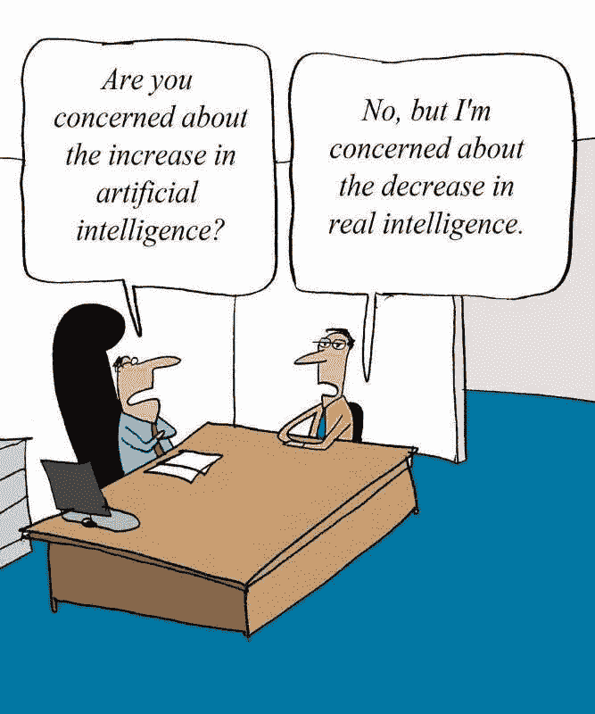

# 非人的条件

> 原文：<https://medium.com/hackernoon/the-in-human-condition-8f6ebdbead4d>

unknown source

> **预备篇** :
> 这篇文章致力于现在令人生厌的人工智能话题，旨在用生物学和进化论的观点来拆解这个概念。我写这篇文章的动机是试图表达一个困扰我很久的想法。我是一个爱好者。让我明确这一点。
> 
> 这里所写的一切，我都认为是真理，然而就我所知，这仍然是真理，是有限的和有偏见的。
> 
> 下面提出的权利要求被去除了细节。过度简化适用于偏离根本点的应变。
> 
> 为了使这种方法可行，有争议的话题被省略了，大多数主张被证明并被普遍接受，并被用作达成逻辑结论的连锁思维催化剂。
> 
> 具体的大脑结构，神经递质，离子通道和其他类似的神经生物学 10 美元的单词将不会被引用，所以要保持真实的想法，不要用迫使使用搜索引擎或/和建立挫折感的术语来增加阅读的趣味。

相当一段时间以来，人工智能的话题一直是争论的焦点。在 50 年代，它被认为是一门学术学科。传统媒体、数字媒体和社交媒体在报道这一理论话题上投入了大量精力。许多多产的人已经跟随并且也已经理论化这门科学将在不久的将来经历的转变。

围绕人工智能的大多数假设都是严峻的，并与技术奇点平行，基本上是说，一旦机器学会自我完善，它就会有效地做出更好的方式来做到这一点。这将使人工智能的发展处于一种递归状态，这将不受我们的控制，其结果似乎是毁灭性的。

偷偷瞥一眼迄今为止人工智能研究的狂野之旅，我们可以看到这样的成就:
谷歌:DeepMind 和它的 alphago 获胜；
IBM:深蓝及其象棋胜利；
IBM:沃森及其危险的新尝试！成功；
脸书:因过于恐怖而被关闭的恐怖聊天机器人；
OpenAI: Dota2 冠军拥有 bot
还有很多很多。

虽然技术奇点假说可能既迷人又非常可怕，但我想打开一扇窗户，解释这个与人工智能关系不大，而与智能关系更大的主题，即我们正在体验和参考的智能。

实际上，上面的例子并不构成智力。它们只是计算机程序，被设计来完成特定的任务。他们不明白他们在做什么。这并不是什么新鲜事，虽然它可能令人印象深刻，而且建造起来也绝非微不足道(向那些项目背后的团队致敬)，但它不应该被视为任何类型的智慧。虽然人们普遍认为存在通用人工智能这种东西，它与实际智能系统的公认定义相关，但也存在应用人工智能，它是机器学习或深度学习的同义词。后一个术语与智力毫无关系，认为它是智力是一种误导。

与普遍的看法相反，人工智能发展的瓶颈不是硅——而是原理。

AI 正在失败。这已被从事该课题的精通技术的人们广泛接受。我想就失败的原因和智力的定义提出我的看法。

这可能被认为是语义，但定义很重要。甚至更多——所以在开发东西的时候。

引用维基百科，讽刺的是，它对智力有一个更准确的定义:

> 智力有许多不同的定义，包括逻辑、理解、自我意识、学习、情感知识、计划、创造力和解决问题的能力。它可以更一般地描述为感知信息的能力，并将其作为知识保留下来，以应用于环境或背景中的适应性行为。

互联网倾向于同意。大多数关于这个问题的书籍都倾向于或多或少地使用相同的定义，只有一个关键的区别:

> 应用于环境或背景下的适应性行为的知识。

我认为智能不能作为一个静态的组成部分存在。它不是一个抽象的特征，尽管我们认为它是——但它实际上是与人类的状况捆绑在一起的，你不能缺少其中的一个。

为了理解我的观点，我们必须看一看进化和神经细胞的起源，它们是由它们的目的决定的。

## 活生物体中的所有细胞结构都在那里，因为它们是实现特定目标的最节能方式，最终导致当前标本和物种的延续。

第一批开发出神经元的微生物利用神经元进行简单的基于反射的动作，并且几乎没有信息记忆[ **1** ]。
最终，这有助于定位和收集营养物质，避免和抵挡食肉动物。在两性异形物种的情况下，它也有助于吸引潜在的配偶。

通过这些神经元传递的信息过去和现在都有一个简单的“它在那里”或“它不在那里”的二元模式。

## 内部和外部刺激最终都变成了电信号。一旦被编码:视觉(光子)、声音(振动)、触觉(压力)、嗅觉(气味化合物)和味觉(有味道的分子)都是通过时间传输的电模式。

重量超过其他生物的生物通常意味着它们是后者的捕食者。尺寸很重要，进化有动力制造更大的标本。
然而，这不是免费的。随着质量的增加，更好地调节内部代谢状态和跟踪周围环境的需求也增加了，这意味着更多的神经元和更复杂的神经结构。
最终，当神经元数量增加超过阈值时，中枢神经系统是保持所有神经活动同步的解决方案，其中单个节点负责这项工作。

## 中枢神经系统负责确保有机体的内部环境受到外部环境的青睐，并保持其他内部组件同步。

在一个繁殖周期的每一次成功迭代之后，生物体的遗传结构都会发生微小的变化。许多内部和外部组件被回收和重新利用，以满足环境要求。由于这是一个漫长的过程，需要许多生命周期才能产生实际结果，因此需要一种更合适、更动态的方法来提高单个生物体的存活几率。前面提到的方法是生物体调整自身适应其实际环境的能力，而不是适应其物种的能力。
因此神经连接(突触)开始适应环境。他们能够在有利于有机体内部状态的事件驱动下，根据重复出现的数据进行重新布线。这就是我们所说的学习，也是记忆的有效组成部分。

虽然基础设施很复杂，但建立新连接的原理很简单，可以总结为:
*一起放电的神经元——连接在一起*。又名*赫布边学***3**。

学习不应被视为一个抽象的概念。这是明确定义的，也是可以理解的:生物体内部和外部都有快乐/疼痛感受器。快乐感受器是激励性的，而疼痛感受器是威慑性的，没有它们，我们就不会有学习。

进化已经足够仁慈，一旦检测到生物和/或环境中有利的模式，就硬连接神经递质，导致愉悦，当相反的模式出现时，导致痛苦。

当你的外部感觉被激发时，它们正在与你的内部状态形成联系，如果这种状态是愉快的，那么你更有可能重复你正在做的事情来获得刺激，反之亦然。相同的模式重复得越多，对其结果的预期就越强烈。

大脑越大——神经元越多，它能容纳的感觉就越多，能储存的模式就越多，时间也越长。然而，更大的大脑并不是一个一维变量。由于内部和外部感觉在大脑中有映射，动物越大，它需要的神经元就越多。

我已经含蓄地提到了两种进化的大脑结构:
**爬虫类大脑**，它负责保持有机体的内部代谢状态。
**边缘脑**，负责将爬行动物的大脑映射到外部环境，从而驱动动机。

但是哺乳动物的进化更进一步。新皮质组织成了我们现在谈论 AI 的原因。新大脑皮层有效地让我们比其他物种更聪明。
这种褶皱的顶级结构允许我们在突触连接中保持有效的灵活性，因此我们的大脑不断地创建/破坏神经元，创建/加强/削弱和破坏突触，因此该结构处于动态变化中。它还具有层的概念，这基本上实现了从像素/短声音到概念表示的信息抽象。一层的输出映射到上一层的输入。

## 大脑乐于概括。来自感官的相同输入实际上不可能重现，因此它填补了空白，并使我们的理解与我们自己的心理库中的给定模式最接近。

新大脑皮层中各层的复杂结构允许我们同时使用低阶和高阶记忆。我们识别形成更复杂表示的单个像素和像素簇。这是因为信息从第一层进入并传播到上层。优化速度——大脑在不同的层面上传递信息。这些层的另一个关键特征是它们实现了反馈循环。
一旦某个东西到达上层，它就可以在信息反馈循环中穿越回下层，创建我们所谓的心理联想，因为它现在充当新的输入，来自我们从给定模式的过去事件中记住的概念。这就是我们所定义的思想。

各层不仅相互交流，还与大脑的其他区域建立联系。视觉、听觉、触觉等。我们在同时输入的基础上进行多种感官的联想。

## 大脑既不是计算机，也不是存储引擎，而是一个精心制作的序列映射器，具有模式和异常检测功能。

客观知识是实践的假象[ **10** ]！这种说法并不新鲜，但相当难以接受。我们对词有社会功能性的定义，我们认为这些定义意味着某种简洁的东西。这仅仅是一个具有可容忍的误差容限的容错协议，并且基本上是足够好的。那是可以说的，不能被证明的[ **7** ]。
我们每个人都有一个独特的世界心智模型，与我们自己的生存状态相关联。此型号不可导出！为了理解它，我们必须首先绘制出人体内的每一个细胞，即使如此，如果没有整个生命周期的背景，我们也将一无所获。每一次经历:床头柜上每一个被碰过的脚趾，每一次汗水顺着后背流下的记忆。即使我们设法解决了这个问题，我们还会遇到一个更大的问题:我们如何在个人之间映射信息。一旦非规范化，脱离了我们的生活环境，椅子的绝对表现会是什么样的呢？

## 大脑一直在预测。意识的幻觉来源于我们感官的表现，结合了我们大脑对未来可能事件的预期以及我们的机体在其中的状态。它在运行心理模拟。进化的目的是让我们的思想死去，这样我们才能活着。

当我们学习一个序列并看到它的初始输入时，我们开始预测接下来可能发生的情况，这样我们就可以创建多个模拟，并迅速选择对我们最有利的一个，并据此采取行动。

一旦一个预期的模式与预期不符，大脑就会认为这是一个异常现象:注意力会激增，我们会将预测集中在特定的事件及其周围，以确定哪里出了问题，并估计可能的危险。作为人——我们在高度聚焦的情况下会感受到不安和暂时的压力。

假设，如果一个人设法让两个有着相同经历的相同的人平行生活，并且其中一个人缺了一个脚趾——两个大脑结构将会有很大不同，因为有机体的内部模型不同。

**结论** :
生物是信息流的自私处理器，它们从世界中获得不断的反馈，这只有从它们自身个体存在的语境中才有意义。我看不出如何通过在一组狭窄的计算机指令中应用一些任意算法来创造人工智能，这基本上是该领域在这一点上可供公众审查的每一种方法。

# 要创造类似人工智能的东西，首先必须重建世界。

## 我敦促所有人:请不要再称“它”为“智能”。让我们使用我们都同意的语言。

松散相关和有偏见的笔记:
我们有更好的机会改变我们现在的样子。设计师超人比人工智能更接近实现。正如 CRISPR/Cas9[ **9** ]的开发所证明的那样，遗传密码已经被证明是一个更容易处理的问题。

在我看来，人工智能这个术语很容易被贴上点击诱饵或宣传噱头的标签。在这一点上，由于其不可思议的性质，声称已经解决了这个问题似乎是伪造的。当然，人们超越推理，应用在这篇文章可能会证明这种说法是错误的。然而，这种可能性微乎其微。我相信解决这个问题的方法主要依赖于解决机器进化，而不是信息处理。

神经科学有一个关于知识的普遍问题。大脑扫描使许多研究人员声称特定的大脑区域和模式与社会行为之间存在某种联系。这些事后分析可能会产生误导，如果有人关心这个问题，那么从这些研究中汲取营养可能会被证明是有益的。神经科学原理是理解人类状况的核心。大多数情况下，细节因人而异。

**参考文献**:

1.  [https://www.ncbi.nlm.nih.gov/pmc/articles/PMC2862905/](https://www.ncbi.nlm.nih.gov/pmc/articles/PMC2862905/)
2.  [https://www.ncbi.nlm.nih.gov/pmc/articles/PMC4780594/](https://www.ncbi.nlm.nih.gov/pmc/articles/PMC4780594/)
3.  行为的组织——唐纳德·赫布
4.  [http://www . cell . com/neuron/abstract/s 0896-6273(12)00941-5](http://www.cell.com/neuron/abstract/S0896-6273(12)00941-5)
5.  [https://www.ncbi.nlm.nih.gov/pmc/articles/PMC4141622/](https://www.ncbi.nlm.nih.gov/pmc/articles/PMC4141622/)
6.  [https://bbp.epfl.ch/nmc-portal/microcircuit](https://bbp.epfl.ch/nmc-portal/microcircuit)
7.  路德维希·维特斯坦根逻辑哲学研究
8.  [https://www.ncbi.nlm.nih.gov/pmc/articles/PMC3718380/](https://www.ncbi.nlm.nih.gov/pmc/articles/PMC3718380/)
9.  [http://www.nature.com/nbt/journal/v32/n4/full/nbt.2842.html](http://www.nature.com/nbt/journal/v32/n4/full/nbt.2842.html)
10.  [https://philpapers.org/browse/perceptual-knowledge](https://philpapers.org/browse/perceptual-knowledge)