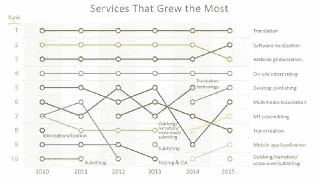
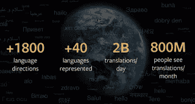
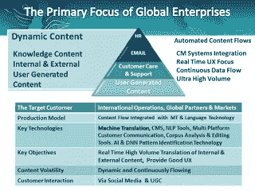
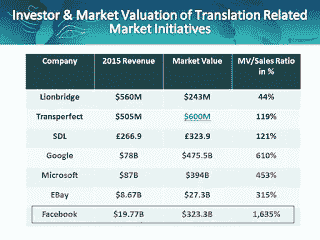

# 更大的上下文翻译市场

> 原文：<https://medium.com/hackernoon/the-larger-context-translation-market-eba871758308>

这是另一个帖子，灵感来自我最近对里约的访问和在 ABRATES 会议上的对话，在那里，翻译人员渴望以有意义的方式与 MT 接触，并问了许多关于最有趣的翻译挑战在哪里的问题。在几次关于“翻译市场”的谈话中，我非常清楚地意识到，对于这意味着什么，我们真的需要一个更大的视角，因为机器翻译最有趣的机会往往存在于翻译行业之外。

对于大多数参加“翻译行业”和本地化会议的人来说，最值得信赖的行业描述是常识咨询公司(CSA)描述为[语言服务市场](http://www.commonsenseadvisory.com/AbstractView.aspx?ArticleID=26590)的市场。**一个翻译机构为买家提供翻译、本地化和口译服务并收取费用的市场。**据 CSA 估计，2017 年这是一个价值 430.8 亿美元的市场，Lionbridge [自豪地宣称自己是“长期排名第一”](http://content.lionbridge.com/lionbridge-named-top-ranked-language-service-provider-2015/)和最大的语言服务提供商(LSP)。[他们的公关文章](http://content.lionbridge.com/lionbridge-named-top-ranked-language-service-provider-2015/)清晰地描述了 CSA 市场定义所涵盖的内容。[此链接列出了全球前 20 名 LSP](https://www.gala-global.org/industry/industry-facts-and-data)，以总收入衡量。这是[CSA 市场总结的另一个视图，显示了行业的地理集中度。](https://www.lingoking.com/en/about-us/press/the-international-language-services-market/)

下图更详细地展示了 LSP 翻译行业的关注点，我们看到了他们关注的内容类型，以及与解决此类内容翻译最相关的工具和技能。**因此，项目管理是核心业务职能，最重要的工具是 TMS 系统和 TM。**

虽然有些 LSP 确实使用 MT，但它通常不是关键任务工具。如果物流服务提供商能够整合一个机器翻译系统来提高生产率和降低成本，那么就使用机器翻译，而且机器翻译在很大程度上是被动的，也就是说，通常是因为客户的坚持。但是，重要的是要明白，重点仍然是上面显示的同类内容。翻译行业对机器翻译的成功有好有坏，也许有几个系统确实成为整个翻译生产过程的一部分。但是大多数自己动手的 LSP MT 计划都失败了，或者陷入一种混乱和孤立的怪圈，结果平平。持续产生出色输出的机器翻译系统是最难开发的，因此具有讽刺意味的是，那些对技术工作原理了解最少的人却试图建立最有能力和效率的机器翻译系统。乔斯特和其他译者在博客中描述的机器翻译经验，如 PEMT、MpT、MT+PE 等..被 IAPTI 称为“大恶”,或者被许多其他人称为“翻译工作的可怕商品化”。大多数情况下，他们与机器翻译系统保持一定距离，没有能力控制或指导机器翻译系统的开发，使其更有用。有希望的是，Moses-as-instant-magic 的概念现在被广泛理解为一种有限的成功策略，更精明的企业和 LSP 将它留给专家，他们也在努力满足这些一致的高质量输出目标。**好的机器翻译系统总是需要时间、专业知识和清晰的语言反馈来开发。**

然而，我认为 Lilt 正在生产的新的[自适应动态学习机器翻译](https://e2f.com/case-study-lilt-travel-portal/)在智能 LSP 方面有着非常光明的前景，并提供了一个平台来将机器翻译体验转变为更可预测和更有价值的努力，也将允许翻译人员更多地参与和参与到机器翻译系统的指导中。

尽管“翻译行业”的机器翻译经验喜忧参半，但我认为机器翻译已经在各种非传统场景中推动了收入或可定义的经济价值，其规模超过了上述定义的“翻译行业”。有趣的是，最成功的 MT 实施是由全球企业完成的，这些企业通常仍然与 LSP 合作处理静态结构化内容，但对于价值更高的非结构化动态内容，他们大多选择自己完成(有时需要一些专家的帮助)或建立内部团队来解决他们认为是增强国际业务计划的长期和战略需求。为了更好地理解这一点，考虑企业的这些战略性 MT 计划的一些案例研究是有用的。

上图显示了 2016 年 4 月谷歌 I/O 报告的谷歌每天用其机器翻译系统翻译的单词量。为了说明这一点，几年前我看过 Lionbridge 的一个演示，首席财务官说他们那一年(2009 年)翻译了 10 亿多单词。SDL 可能是最了解机器翻译的人，也是最积极使用机器翻译 LSP 的人，他最近声称，他们通过机器翻译每月翻译 20 万个单词。因此，很有可能仅谷歌一家每周翻译的单词就超过了整个“翻译行业”一年的翻译量。**考虑到谷歌超过 90%的收入(约 780 亿美元/年)来自与关键词相关的广告，谷歌很有可能从他们的机器翻译技术计划中获得数百亿美元！**它还为他们提供了非常具体的情报，让他们知道什么对世界各地的人重要，什么跨语言内容最受欢迎。这些知识的经济价值是巨大的，隐藏在他们报告的广告收入中。“翻译行业”和 SEO 专家很想知道全球范围内的重要知识。

是从机器翻译中获得高价值的另一个例子。他们最初进入机器翻译就像与搜索相关的谷歌，但此外，他们有大量的英文软件产品知识库，这对于他们庞大的全球客户群来说很难有效地访问。因此，尽管微软可能在静态内容的“翻译行业”服务上花费了数亿美元，但这只涵盖了他们需要翻译的一小部分。鉴于微软 70%的收入来自非英语国家，翻译各种与产品相关的内容非常重要。**让更多的技术支持和客户关怀内容快速多语言化是关心客户体验的高管们的当务之急，同时也为非英语客户节省了大量的支持成本并极大地改善了用户体验。**软件行业通过一种叫做偏差成本的东西来衡量自助服务内容的价值。因此，如果他们可以将呼叫转移到支持中心，通过使用 MT 以更多语言提供更多知识库内容，考虑到其用户群的规模和知识库的实际访问量，他们每天可能会节省多达 1 亿多澳元。他们的 Bing MT 每天为随机的互联网用户增加大约 500 亿个词，我们就有了另一股经济价值流，它来自在全球范围内产生广告收入的搜索词。他们最近的 Skype STS 计划也可能会产生巨大的利益和新的方法来利用他们的翻译技术专业知识。

当您考虑到英特尔和 Adobe 也使用 Microsoft Hub MT 来翻译知识库支持内容时，由此带来的成本节约影响每天可轻松价值数亿美元。这还没有考虑到许多其他 IT 公司自己使用其他机器翻译技术(如赛门铁克)来做这件事。“翻译行业”在这种翻译活动中的影响非常小，现在这种活动通常被认为是至关重要的，每月可能涉及几十亿个单词。

在线电子商务市场是由合格的机器翻译工作产生的经济价值的另一个例子，它不属于“翻译行业”。几年前，EBay 认为新兴经济体是一个值得战略关注的巨大机遇。所以[他们收购了机器翻译技术](https://techcrunch.com/2014/06/13/ebay-acquires-machine-translation-capabilities-from-apptek-to-help-expand-international-sales/)并且建立了[一个有能力的机器翻译团队，这个团队有强大的语言协作能力](http://www.slideshare.net/TAUS/taus-machine-translation-showcase-machine-translation-at-ebay-2014)。根据他们在 2014 年 AMTA 会议上的陈述，很明显，他们最初努力提供更多的俄罗斯内容，对俄罗斯市场产生了巨大的增长影响。可以肯定地说，这种影响的价值可能是数亿美元的新收入，来自他们使用 MT 解决的所有新市场。还值得看看这样做涉及到什么。**专注于** [**解决新类型的翻译问题**](http://www.mt-archive.info/10/AMTA-2014-Picinini.pdf) **并确保你解决的翻译问题确实提高了你的机器翻译工作的价值。最后一个链接显示了仅与巴西葡萄牙语相关的特殊问题。我们应该注意到，任何规模的最有能力的机器翻译工作都是小心翼翼地进行，一次一种语言，而不是一口气做 20 或 30 种语言。我们还看到，亚马逊在 2015 年收购了 Safaba，并可能有类似的计划，使目录内容成为多语种，以推动更大规模的国际业务。阿里巴巴和百度也在进行以电子商务为重点的机器翻译，但细节较少。所有这些类型的 MT 计划的净经济价值:根据我的粗略估计，可能超过每年 200 亿美元。**

最近，脸书宣布在使用微软 Bing 机器翻译技术几年后，他们正在进行大量的机器翻译工作，这让世界大吃一惊。当被问及为什么这样做时，Alan Packer 说:规模是脸书投资自有机器翻译技术的原因之一。另一个原因是适应性，他们希望技术针对他们非常特殊的需求进行优化。脸书现在每天提供 20 亿次文本翻译。他们声称，必应的问题是，它是为翻译正确的网站文字而设计的，在脸书评论中的俚语、隐喻和习语典型用法方面做得不好。帕克形容脸书语“极其不正式”。它充满了俚语，很有地方特色。”他说这本书也充满了隐喻、惯用表达，并且充满了拼写错误(大部分是故意的)。此外，和世界其他地方一样，脸书不同年龄层的人交流方式也有显著差异。他们知道已经有 50%的脸书用户经常使用自动翻译。随着越来越多的人上网，这个用户群只会越来越大。Packer 说，使用翻译产品会让用户“有更多的朋友，更多朋友的朋友，接触更多的概念和文化。”**脸书用户可以联系的世界各地的人越多，他们在社交网络上花费的时间就越长，他们看到的创收广告就越多**。这个项目的经济价值大概是[每年几十亿美元](http://www.wsj.com/articles/facebook-revenue-soars-on-ad-growth-1461787856)。全球化的新兴社交网络将需要解决同样的问题。

因此，我们看到的是，少数几家公司通过解决非常专业且更具挑战性的翻译问题而创造的经济价值，超过了“翻译行业”的总收入。使用机器翻译解决大规模翻译问题显然是一个非常高的价值主张，而**上面提到的全球企业没有一家考虑去** [**【翻译行业】**](https://www.gala-global.org/industry/industry-facts-and-data) **帮助解决这些真正具有挑战性和复杂性的翻译问题。**可能是因为这些公司的任何战略观察者都非常清楚，大多数物流服务提供商缺乏解决这类翻译问题的眼光、技能、兴趣和能力。我们甚至可以概括出更多全球企业的核心需求，如下所示。全球企业更广泛的翻译需求和“翻译行业”的服务重点之间在技能和重点方面存在真正的不匹配。虽然静态内容作为强制要求可能仍然很重要，但在我看来，它不是为企业购买者或 LSP 构建长期公司价值的地方。

为了进一步说明这一点，让我们考虑一下可以从股票市场数据中收集到的投资者对价值的看法。虽然对某些人来说这可能是一种逻辑延伸，**我认为我们可以公平地假设投资者比其他人更重视某些翻译问题的解决方案**。脸书的移动广告收入大幅增长，最近他们似乎正在从谷歌手中夺走广告份额，因此这些市场价值/销售数字反映了非常活跃的市场趋势。投资者的情绪是，脸书可能比图表中列出的任何公司都更有可能从下一波互联网应用中获得美元美元的收益，因为它们已经超越了 2B 用户，很少有人会说英语、法语或德语。正如一位分析师所言:“广告预算正在向脸书倾斜，它似乎是在线广告界的赢家，并取得了可观的成绩。”与投资者对大型有限合伙人的情绪相比，这肯定与长期承诺和潜力有关。对我来说，这表明投资者普遍认为 LSP 的价值较低，但明白翻译可以在合适的人手里产生巨大的杠杆作用。

因此，对于 ABRATES 的那些优秀的翻译人员，他们问我应该参与哪些类型的机器翻译项目，我想说以下这些:

*   关注那些解决有趣翻译问题的公司。他们将会有最有回报的工作，这可能包括走出翻译行业。
*   远离出售摩西海市蜃楼的 LSP，这可能是最糟糕的 PEMT 体验。不希望翻译者在模式层次上反馈的机器翻译系统不太可能是一种令人满意的专业体验。
*   与允许并希望你(翻译/编辑)提供反馈并与 MT 开发过程互动的人(LSP/企业)一起工作。
*   了解机器学习和其他领域的人工智能，并开发正则表达式、语料库分析和语料库编辑以及模式识别技能等有价值的技能。
*   像 Lilt 一样探索自适应动态学习 MT(也许其他人很快就会出现)，以了解 MT 如何与你一起工作，并在你等待合适的机会时为你工作。这是一个真正的范式转变，至少值得做一些实验来看看翻译桌面会如何发展。
*   缓解将所有东西都放在桌面上的需求。机器智能解决方案的未来将需要大数据和大计算，因此最好和最复杂的工具按照定义只能在云中使用。Lilt 是这方面的第一代例子，其他的也将出现。云是有意义的，它允许新的、更有效的方法来解决老问题，这不是一件坏事。

对于那些认为上述四家公司是例外而不是规律的人来说，值得注意的是，我们刚刚开始研究机器学习和人工智能的可能性。神经机器翻译刚刚开始，可能会推动一波全新的更高质量和更具适应性的机器翻译。[机器智能市场](https://www.oreilly.com/ideas/the-current-state-of-machine-intelligence-2-0)仍处于萌芽状态，我们很可能会看到大数据+大计算+智能算法走到一起，解决我们去年认为超出计算机范围的问题。

*原载于 2017 年 7 月 26 日*[*【kv-emptypages.blogspot.com*](https://kv-emptypages.blogspot.com/2016/06/the-larger-context-translation-market.html)*。*