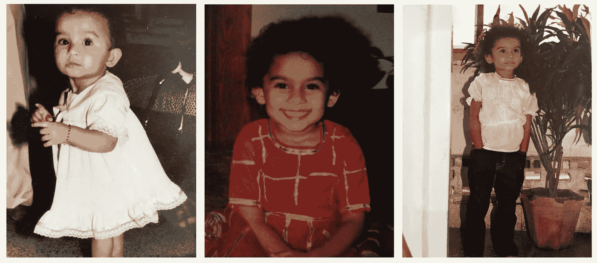
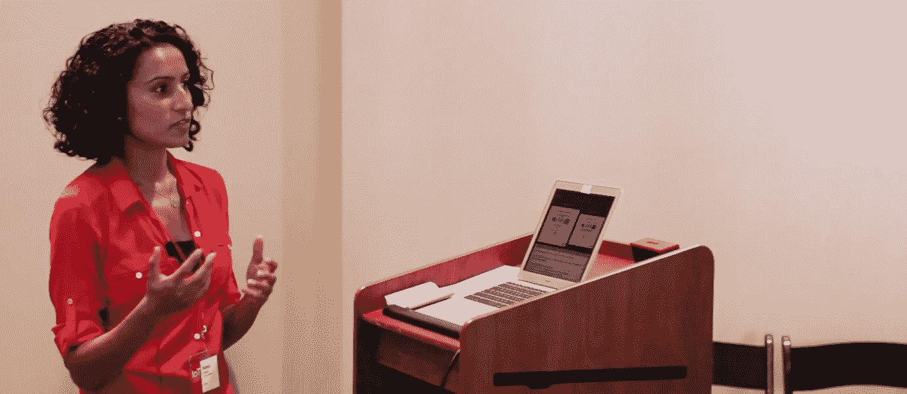

# 新常态——工程师、产品经理、女性。

> 原文：<https://medium.com/tech-like-us/the-new-normal-engineer-product-manager-woman-af182cd77bcb>

作为“像我们一样的科技”系列的一部分，这是我的故事。

我出生在印度孟买附近。我 3 岁时全家移民到了美国，我在俄亥俄州一个寂静的小镇的玉米地旁长大。因此，虽然我的种族背景是印度人，但我认为自己是来自中西部的美国人。我*没看错*把汽水称为[汽水](http://popvssoda.com/)而且我一看到小山就有高原反应。

当我还是个孩子的时候，我就对科技感兴趣，摆弄我父亲带回家的所有电子“玩具”，比如公文包大小的手机、10 磅重的便携式摄像机，以及和我一样高的电脑塔(可能现在还是)。我喜欢拆开软盘看看里面有什么，并把我们的电脑“藏在引擎盖下”安装一些额外的内存。当然，我清楚地记得互联网早期令人兴奋的日子，包括期待在邮件中收到色彩鲜艳的 AOL CD。一旦我们上了万维网，创建网页和学习如何编码就成了我的另一个爱好。

在密歇根大学，我主修计算机工程，这是计算机科学和电子工程的结合。它融合了软件和硬件，以及理论和实践。我还辅修了数学，完全屈从于我的书呆子倾向。

本科毕业后，我留在了技术领域，但进入了 Citrix Systems 的咨询岗位。我拜访了世界各地的客户，从美国的得梅因到安克雷奇，从阿拉斯加到日本的东京。在我从事咨询工作的第四年快结束时，我意识到我想用正规的商业教育来武装我的技术知识。

所以我去了芝加哥大学布斯商学院，在那里我专注于金融和创业，并在创业期间和之后都在创业公司工作。商学院对我来说是一次奇妙的经历。在读研究生之前，我甚至从未见过资产负债表，但在那两年里，我向风险投资家推销了自己的商业计划，参加了诺贝尔奖获得者的授课，并遇到了一些最令人惊叹的超成就者，他们现在是我最亲密的朋友。通过那次经历，我也在科技创业公司找到了自己的位置，毕业后不久就搬到了西海岸。

自从搬到“最佳海岸”后，我一直在许多科技公司担任产品经理。我第一次涉足硅谷是在一家 7 人的初创公司，获得了首轮融资。不到一年，我们公司被收购了。在亲身经历了一次收购的来龙去脉后，我去了位于 Rackspace 的一家大公司，在那里我创建了一个全新的基于分析的产品，名为 T2 云智能。我现在在 [PubNub](https://www.pubnub.com/) 担任首席产品职位，在那里我有机会管理我们所有的产品线，制定整个业务的战略和目标，建立产品团队，并在我到这里的短暂时间里看到公司从 15 人发展到 65 人的团队。

我喜欢产品经理这个角色，因为这是产品开发的技术和商业两方面令人兴奋的结合。在这个职位上，我有机会开发全新的技术产品，将概念性想法转化为实际的市场产品，制定并影响公司战略，在行业活动中发表演讲，并为其他初创公司和企业家提供建议。

虽然我很感激我所拥有的丰富的职业经历，但回顾过去，作为一名科技领域的女性，我觉得自己是个局外人。例如，作为我大学主修课程中为数不多的女性之一，我感到很孤立，这种趋势在职业领域依然存在。当陌生人以一种居高临下的态度和我说话，或者自动认为我是一个助手，而不是会议发言人、产品负责人或技术专家时，这也令人沮丧。

但是当你发现自己处于这种情况时，保持自信，记住你是改变科技领域构成的不可或缺的一部分！你的声音很重要。不要回避让别人听到你的观点，不要因为自己很棒而道歉，最重要的是——做你自己，让你的贡献发光。

我也在科技界发现了如此了不起的人和友情，我知道你也会的。我相信，我们这些有幸成为这个领域一部分的人应该讲述我们的故事，并指导年轻的女性和男性，以便我们行业的未来更加平衡。

最后，如果我能回到过去给年轻时的自己一些建议，我会告诉她不要纠结于别人的想法，不要为小事而烦恼。相反，花点时间倾听自己，认识到什么时候你想尝试其他事情，学习新的方向，或者只是休息一下，会更有成效！

嗯，这是我的故事…到目前为止。我每天都在学习，所以所有这些都是(也将永远是)正在进行的工作。

我邀请你分享你的故事！撰写您自己的 [Tech Like Us](https://techlikeus.org/) 文章。想听更多关于女性和少数族裔在科技行业工作的故事，请看看纪录片[代码:调试性别差距](http://www.codedocumentary.com/)。