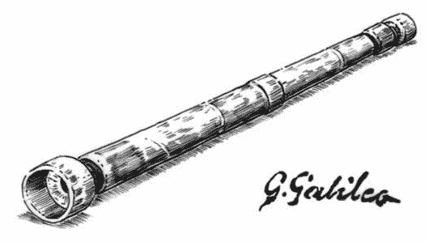
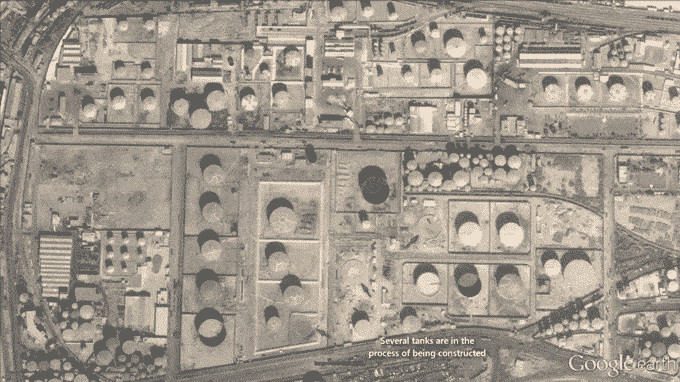
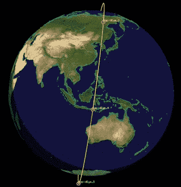

# 新的太空竞赛

> 原文：<https://medium.com/hackernoon/the-new-space-race-24ccd953967d>

## 卫星图像如何改变你所知道的每个行业

## 作者亚当·凯尔，彗星实验室投资合伙人

[Watch full video of Dubai here](https://www.youtube.com/watch?v=JDUOQjNZEp4)

> 1609 年，伽利略让威尼斯的大人物们用他的望远镜观察远航的船只，让他们惊叹不已，这比他们的主人看到船只进港足足早了两个小时。威尼斯人印象深刻(他们将伽利略的工资提高了一倍，并授予他帕多瓦大学终身教职)，因为他们立即看到了这一富有远见的设备所带来的巨大的财政和军事优势。几百年后，在信息的收集、分析和货币化方面，我们正处于一场同样彻底的变革的风口浪尖。如果我们注意，我们甚至可以拯救地球。”

——g . burning ham，[新闻周刊 2016 年](http://www.newsweek.com/2016/09/16/why-satellite-imaging-next-big-thing-496443.html)

[Learn more about Galileo’s refractor here](http://amazingspace.org/resources/explorations/groundup/lesson/scopes/galileo/)

一群新的创业公司专注于降低成本和增加地球卫星图像的频率。这些公司包括卫星制造商、运营商、发射公司、通信基础设施运营商和专注于从图像中提取有价值数据的软件公司。在 20 世纪 90 年代，当卫星图像首次能够合法销售时，轨道上的成像卫星非常少。这些卫星体积庞大，造价昂贵，发射成本高，带宽限制了它们通信的速度，图像本身也没有太大的市场。在接下来的 25 年里，随着技术的进步，从成本和数据的角度来看，新事物正在成为可能，这是以前从未有过的。

**成像卫星**

成像卫星上有传感器，类似于手机中的数码相机，只是组件更高端。镜头是不同的，因为它需要聚焦在 500 公里外的地球表面，而不是你的 iPhone 在手臂的距离。[传感器本身也不同](http://www.space.com/19557-nasa-tdrs-communications-satellites-infographic.html)，聚焦于不同的波长光谱，而手机摄像头聚焦于可见光谱。不同的应用有不同的要求，但卫星图像中有两个主要变量:重访率，即地球某一区域的成像频率，以及空间分辨率，即图像中最小可见特征的大小。

通常在图像分辨率和时间分辨率之间有一个折衷。更高清晰度的图像是由大型卫星产生的，这些卫星有更大的镜头，但由于它们的尺寸，建造和发射成本要高得多。由于成本高昂，在轨运行的数量较少。星座中的卫星越少意味着覆盖陆地的频率越低，或者覆盖的陆地越窄越频繁。体积较小的卫星，或称立方体卫星，大约只有鞋盒大小，可以用一枚火箭作为一个集群发射，因此建造和进入轨道的成本更低。立方体卫星的缺点是航天器的物理几何结构——由于镜头较小，因此产生的图像分辨率较低。立方体卫星星座允许更高的重访率——换句话说，你更频繁地获得地球上同一个地方的图像。

[Real-time location of the ~13,000 satellites in orbit in the year 2008](https://www.youtube.com/watch?v=ydbbd-4oEds)

**有什么变化？**

在过去十年中，卫星图像的每一个元素都发生了重大变化。私营公司越来越多地进入建造小型卫星的市场，如 Skybox ( [被谷歌](http://www.wsj.com/articles/amid-stratospheric-valuations-google-unearths-a-deal-with-skybox-1402864823)收购)和 Planet Labs。这些立方体卫星的组件成本随着规模的扩大而下降，这主要是由于传感器、计算机和太阳能电池的成本不断下降。发射已经变得便宜得多，部分是因为能够在一枚火箭上安装多个立方体卫星。此外，发射本身已经面临来自 SpaceX 和蓝色起源等私营公司的更多竞争，从而降低了成本。卫星通信基础设施在以更快的速度下行传输更多数据的能力方面也有了巨大的提高。下行链路基础设施非常重要，因为有越来越多的摄像机捕捉空间中包含越来越多数据的图像。例如，自 2008 年以来，轨道上的卫星数量翻了一番，与全色或 RGB 图像相比，高频率分辨率的超光谱图像可能包含多 20 倍的数据。更多的卫星也创造了消除云层的能力，这对小星座来说是一个巨大的问题。因为多云的区域无法成像，如果重访率已经很低，这可能会大大降低系统的价值。

最后，直到最近，卫星图像还没有一个巨大的市场。与许多其他平台技术类似，现在我们开始收集更多这种数据，我们正在实现一些非常有趣、有价值和意想不到的应用。

哪些行业正在受到影响？

卫星图像的第一个应用是计算商店和餐馆停车场的汽车数量，以此作为销售/收入的启发。这种知识可以用来预测上市公司的利润，甚至在他们的季度收益报告之前。例如，在 2016 年 Chipotle 面临食品健康问题后，能够访问 Chipotle 数千个地点的停车场高频图像的股票交易员可能已经估计到了糟糕的公关造成的收入损失。这些信息，每天更新，是[做股票交易时非常有力的](/@orbital_insight/chipotle-traffic-declines-at-slower-pace-in-february-march-compared-to-december-january-2e8d705581b8#.lp3ndhu3z)。

卫星图像的另一个应用是监测油罐中的油量。油罐有浮动的盖子，通过了解油罐的位置、太阳的位置和卫星的角度，影子可以告诉你油罐是满还是空。就像餐馆/商店顾客的数量一样，这些信息对于商品交易者来说非常有价值，他们可以收集一些关于石油储量和[石油如何在世界各地流动的信息](/from-the-macroscope/bringing-transparency-to-oil-supply-in-closed-economies-9bec49e8da2b#.s8c3napwb)。

[Time lapse of oil tanks at a refinery in Karachi, Pakistan](https://www.youtube.com/watch?v=7yXVEO5ywTo)

另一个容易监测的商品是水库中的水位。较低的水位对应于较小的水面周长，这可以准确预测对干旱、饮用水和农业用水的影响。

其他更专业的传感器，如超光谱传感器，正被用来试图破译植被的健康状况。反过来，这些信息理论上可以用来预测小麦、玉米和大豆等作物的未来产量，这些信息在二级市场上很有价值。

**风险和障碍**

基于最近资金和开发的爆炸式增长，很明显卫星图像将继续存在。随着成本的不断降低，数据的保真度和频率不断提高，将会出现我们需要准备应对的后果。例如，意图制造伤害的团体和个人会发现收集情报更容易。军方将受到影响，因为更多的民间团体将获得信息，而这在历史上是非常有限的。

另一个 21 世纪特有的问题是太空垃圾的概念，这是地球轨道上的“废物”，可能会损坏卫星等有价值的资产(见下文)。一些组织已经开始着手清除大到足以造成损害的太空垃圾，但成效有限。除了清理垃圾的艰巨任务之外，唯一可行的选择是防止轨道上太空垃圾的增加。

*ESA space debris studies: hypervelocity impact sample. The metal sheet is 18 cm in thickness, and the ball bearing 1.2 cm across, hitting at 6.8 km/s. Image Credit: ESA*

**有趣的创业公司**

在卫星图像的新生态系统中，有许多有趣的创业公司在工作。

专注于**建造和运营立方体卫星星座**的两家最大公司是 Planet Labs 和 [Terra Bella](https://terrabella.google.com/?s=about-us&c=about-satellites) (前身为 Skybox Imaging，2014 年被谷歌以 5 亿美元收购)。通过发射鞋盒大小的立方体卫星(在行星实验室的情况下)或洗衣机(在 Terra Bella 的情况下)，获取卫星图像的成本正在迅速下降。这一数据在时间频率方面也是前所未有的(同一地区拍摄照片的频率)，这使得全新的应用成为可能。 [Planet 于 2015 年收购了 black bridge](https://www.planet.com/pulse/blackbridge/)Geospatial(Rapideye 的运营商，rapide ye 是一个由 5 颗卫星组成的星座，配备了相同的多光谱传感器和 5m 分辨率),这表明该公司不仅注重提高时间分辨率，还注重提高[光谱](http://www.satimagingcorp.com/satellite-sensors/other-satellite-sensors/rapideye/)和[空间](https://www.youtube.com/watch?v=ovPULctoQGs) [分辨率](https://en.wikipedia.org/wiki/RapidEye)。

[Rapideye Satellite Constellation](https://www.youtube.com/watch?v=ovPULctoQGs)

几家软件公司专注于围绕从这个新的数据宝库中提取数据来构建**分析栈——其中最大的两家是 Orbital Insight 和[笛卡尔实验室](http://www.descarteslabs.com/)，专注于本文中描述的许多应用，如汽车计数和商品监控。Orbital 是 Planet 数据集的合作伙伴/客户，已经将上述几个例子产品化，客户主要集中在金融市场。一些创业公司正在致力于更多特定行业的应用，例如使用光谱分析来[估计矿藏](https://www.gislounge.com/five-applications-of-satellite-data/)。**

还有一些公司正致力于为所有即将上线的新卫星创造一个更加强大的通信基础设施。无处不在的卫星图像的瓶颈之一是我们用来将数据传回地球的下行速度。传统上，美国宇航局使用跟踪和数据中继卫星(TRDS)，但这是为低带宽应用而设计的。像 Audacy Space 这样的公司专注于在通信卫星、成像卫星和基站之间建立更多的连接。

卫星拼图的最后一块是围绕首先将卫星星座送上太空的发射基础设施。其中最著名的是 SpaceX，该公司专注于制造可重复使用的火箭以节省成本，但其他几家公司正在努力大幅降低进入太空的成本。

我们将何去何从？

就像其他平台(个人电脑、互联网、手机)的早期一样，我们仅仅开始触及卫星图像的皮毛。随着基础设施、图像和通信网络的不断改善，这一技术的影响将波及其他行业，并为那些利用这一变化的人创造大量机会。

关注我们，了解更多关于正在改变我们世界的人工智能初创公司和技术的更新。

想保持联系吗？[注册订阅我们的时事通讯](http://cometlabs.us12.list-manage1.com/subscribe?u=2a5072861b52658a9323c15b1&id=b2eb297788)，我们会每两周给你一份我们最喜欢的故事和资源的综述供你使用。

> [黑客中午](http://bit.ly/Hackernoon)是黑客如何开始他们的下午。我们是 [@AMI](http://bit.ly/atAMIatAMI) 家庭的一员。我们现在[接受投稿](http://bit.ly/hackernoonsubmission)，并乐意[讨论广告&赞助](mailto:partners@amipublications.com)机会。
> 
> 如果你喜欢这个故事，我们推荐你阅读我们的[最新科技故事](http://bit.ly/hackernoonlatestt)和[趋势科技故事](https://hackernoon.com/trending)。直到下一次，不要把世界的现实想当然！

