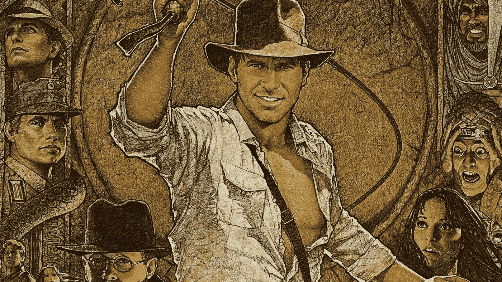

# 为什么每个创业公司都像一部印第安纳琼斯电影！

> 原文：<https://medium.com/hackernoon/the-only-rule-of-startup-success-you-need-to-know-b1da1b9291a9>

## 创业成功唯一需要遵循的规则是

在 Play Labs @ MIT，我试图向我们的创业团队传递的一个核心信息是，尽管有许多书籍可以启发和告知我们创业之旅，但本质上，创业之旅就像一场冒险——一场不可预测的冒险！

Be like Indy: Follow the clue to find the Treasure!

我想进一步解释说，创业冒险的最佳隐喻可能是印第安纳·琼斯电影(最好的当然是*夺宝奇兵*和*印第安纳·琼斯和最后的十字军*)。

作为一名企业家，你会发现自己正在经历英雄旅程的各个阶段，跟随线索到达意想不到的地方，招募冒险者，同时躲避令人讨厌的角色，克服障碍，如果你成功了，最终找到宝藏！

难道我不应该花更多的时间来教企业家如何制定营销计划，采访客户以找到产品/市场的契合度，审阅投资意向书，教授精益方法，销售培训等吗？，而不是把时间都花在谈论“冒险”和“寻宝”上？

事实证明，在当今互联的世界里，在创业过程的每个阶段使用“特定技术”的信息并不难找到。但是在我 20 多年创办和投资创业公司的经历中，我发现通常创业公司的成功发生在它从一个阶段*过渡到下一个阶段*的时候。

这种转变是如何发生的？通常它来自于一种洞察力或联系——一种“线索”。这些“线索”通常来自于与投资者、客户、潜在客户、顾问的意外会面，或者来自于你所获得的市场信息的综合。就像线索指引印第在他的电影中寻找宝藏一样，这些见解也是我们创业寻宝的“线索”:它们指引我们找到下一个重要特征、客户、产品、投资者或合作伙伴。

以下是为什么“跟随线索”可能是成长中最重要的技巧的五大原因:

## ***1)*** ***地图随时间而显现；很少一下子！***

在印第安纳·琼斯的电影中，如果在电影开始的时候就把所有的线索都放在一张地图上，对印第来说不是很好吗？他所要做的就是去最后的“X”拿起宝藏(“约柜”)！

当然，它从来没有这样运作过——首先，它不会成为一个非常有趣的故事！通常有一条线索，如果跟踪的话…会引出…另一条线索！这第二条线索，然后，导致另一个线索，这(最终！)通向宝藏。有些线索需要被弄清楚或解释，而有些会把我们引向一条错误的道路，而另一些则是显而易见的。

我见过的许多初创公司都是从一个想法开始，但最终转向了与第一个想法相关的另一个产品或服务，正是这第二个概念导致了公司的最终成功。这在很多受欢迎的创业公司中都是如此，比如微软或 Slack，我发现在我投资的创业公司中也是如此。

但是这第二个方向的洞察力从何而来呢？

我们来看看 Discord 的例子，它是以一家游戏公司起家的。在他们最初的游戏没有像预期的那样成功后，创始人 Jason Citron 认为他们为游戏创建的交流/聊天系统将会受到铁杆游戏玩家和其他人的欢迎。为什么这个特殊的支点，而不是，比如说，建立另一个游戏？

没有公式可以保证成功转型——你必须依靠创始人的直觉和他们对市场的理解——这就是为什么“创业线索”是主观的，需要外部事件和内部洞察力。Jason 发布了新的应用程序(名为 Discord ),它开始获得铁杆玩家的支持，获得了巨大的逐月有机增长。实际上，当有机增长刚刚开始验证新方向时，我与 Jason 共进了午餐；我记得我想知道他为什么选择这个特定的支点——这当然是基于作为核心玩家的团队的经验和洞察力，以认识到他们所建立的东西没有游戏也能工作。最好的线索是个性化的——我不知道在同一地点的另一位企业家是否会走上相同的方向。这就是为什么“线索”是主观的。

## ***2)*** ***香辣人物。***

在电影中，虽然一些角色显然试图帮助印第，一些角色(如纳粹)显然试图阻碍印第，但总有一些角色的动机要复杂得多。起初，他们可能看起来像是在帮助印第完成他的任务，但事实证明他们有自己的议程，并经常与他作对。

在你的创业之旅中，你会遇到一群有趣的人，他们中的每一个人都是你创业之旅中不可或缺的一员。虽然我们都需要导师，但筛选一系列顾问、指导者、天使、风险投资人是一个复杂的过程，这些人都说他们对你的兴趣有兴趣。

事实上，他们都在忙着提升自己的利益。有些人可能会给你留下他们所在的超级成功公司的名字。然而，仅仅因为他们曾在成功的 X 公司工作或与之有联系，并不能保证他们真的能在你的特殊情况下工作。他们是公司成功的建筑师还是成功旅程中的跟班？

早期创业是一种特殊的野兽，你应该知道为什么有人是顾问，你希望从他们那里得到什么(反之亦然):会是投资者介绍吗？是潜在客户还是销售电话？他们的名字只是为了增强你的投资者甲板吗？他们是某个领域的专家，而你需要利用他们的专业知识吗？

外面有那么多胡说八道的人，你需要花时间和他们在一起，看看他们到底提供了多少价值。最好的办法是随着时间的推移去了解他们，看看他们是如何做决定的，然后再做出长期的承诺。

## ***3)*** ***最大的线索可能是那个小小的声音***

有时候，倾听“小小的声音”是在创业之旅中导航和追踪线索的最佳方式。史蒂文·斯皮尔伯格曾说过，他告诉他的孩子去追寻那些“悄悄到来”的梦想，而这个世界正对我们大喊大叫，为了听到这个“小声音”，我们必须学会不去理会它。

在硅谷这样的地方，这可能很难，因为所有最新的热门话题都围绕着 X(你可以说出 X——手机游戏、虚拟现实、人工智能、机器学习、区块链/ICO/加密货币)等。)

我们不断受到 XYZ 公司为 X 筹集 1000 万美元的文章的攻击，而我们可能很难为 y 筹集到 100 万美元。这可能令人沮丧。还有山谷中常见的“智慧”*败得快，转得快*。你应该放弃你的想法去追求当下的热点吗？

*也许是*。但是跟随你的直觉，你的预感，记住你开始这次冒险的原因也是很好的。如果那个小声音告诉你转动，那太好了。然而，如果“大声音”(即其他人)在说“pivot”，而小声音告诉你要忠于你开始的事情，那就是你需要倾听小声音的时候了。

例如，在 2012 年至 2013 年，比特币出现了上涨(在当前上涨之前！)从 100 美元涨到 1200 美元，突然间每个人都想投身于 crypto。然后，随着比特币从 1000 美元跌至 300 美元，除了最专注的人，加密市场的资金突然枯竭了。

那些真正相信加密货币的人继续前进，不管市场怎么说，而那些不那么专注于这个领域的人则转向了(VR/AI 或其他初创公司)。

然后，突然，随着 crypto 今年再次流行起来(随着比特币涨到每比特币 5000+美元)，突然*每个人*都想再次跳入。虽然我个人非常相信加密货币，但毫无疑问，在某个时候会出现另一场崩溃，届时将会淘汰当前一批区块链伪装者。当市场上有震耳欲聋的噪音时，你的“小声音”可以成为你跟随的线索。追随它需要某种勇气。

## ***4)*** ***有些“线索”伴随着意想不到的感受和同步性而来——注意！***

现在我要深入研究科学没有完全理解的领域。有时我们遇到或听到一家公司或一个人，我们内心会有一种有趣的感觉。我们无法从逻辑上解释，但我们的直觉告诉我们那里有“东西”。

卡尔·荣格将同步性定义为“有意义的巧合”或“因果联系原则”——在我们的脑海中，两件事似乎以有意义的方式相关联，但这种联系不存在“明显的、逻辑的、因果的”方式。同步性的一种简单形式可能是，你想起了一个你有一段时间没想起的朋友，但他们当天或第二天打电话给你，想和你谈谈。

我把这些小事件称为特殊类型的“线索”——或者“量子矩阵中的小故障”。它们是一些小故障，让我们洞察到一些可能对我们很重要的未来事件。在我开始研究量子物理学之前，这种情况一次又一次地发生在我身上，我意识到他们所说的和一些神秘主义者关于时间、过去和未来所说的是一致的。

在量子物理学的一种解释中，有许多不同概率的可能未来，以概率波的形式向你发回信息。当我们从现在走向未来时，*有意识地*关注这些可能的未来会让你朝着一个方向前进。量子物理学家弗雷德·艾伦·沃尔夫在他的书《平行世界》中告诉我们，“我们的大脑是时间机器，能够感知来自过去和未来的可能性波动。”

这在创业界是如何运作的？我经常讲述当我第一次听说某家公司时，我是如何对它产生“奇怪的感觉”的，随着时间的推移，它们最终对我的创业公司变得超级重要。

基于同步性和有趣感觉的真正线索不是一厢情愿的想法，比如“哦，脸书很大，他们会收购我们”——这只是硅谷的陈词滥调，不是真正的直觉，也不是未来的“来自量子泡沫的消息”。在真正的直觉案例中，为了让它成为一个“线索”，这种有趣的感觉通常伴随着一个你以前从未听说过的人或公司。

例如，当我们在为我们的文档公司寻找一个名字时，我碰巧在密歇根州的安阿伯拜访我的父母，开车经过一座建筑物，上面有一家公司的名字，“Arbortext”。我对此有一种奇怪的感觉；奇怪的是，我曾多次路过这座建筑，但从未注意到它。

我把它作为一个“线索”——这里有一家做 XML 的公司用他们的大学城命名了他们的公司，所以我顺着这个线索，我们用我们的大学城 CambridgeDocs(剑桥文档的简称)命名了我们的公司。沿着这条线索留下的线索，我联系了他们，然后过了一段时间，他们成了我们最大的客户，让我们进入了世界上一些最大的企业(最后还出价收购了我们！).

## 5) ***连接小点寻找更大的图案*** 。

有时，这些线索就像图案中的点，只有在更长的时间内才会显现出来。就像在印第的寻宝游戏中一样，整个画面只有在跟随线索的之后*才会展现出来。*

另一个例子，当我是 Tapjoy 早期团队的一员时，我记得看到一封关于一家我从未听说过的日本公司 DeNA 的电子邮件，该公司有一款名为 Mobage-town 的移动产品。这是在 DeNA 或 GREE 成为硅谷知名品牌之前。

出于某种原因,“Mobage-town”这个名字就像线索一样有趣地留在了我脑海里。几年后，当我在经营 Gameview 工作室，我们正在寻找收购者或投资者时，我想起了那种有趣的感觉。尽管已经与美国的收购者和投资者进行了深入的讨论，我还是决定沿着这条线索联系他们，尽管“从逻辑上讲”我被告知日本公司做决定需要太长时间，我们与其他公司的差距太大，无法与他们开始讨论，所以我将浪费我的时间。长话短说，我们的其他选择都失败了，但 DeNA 最终收购了我们！

跟随我们的直觉出现的更大的模式是关于在我们的整个职业生涯中“连接点”。最好的创业公司是那些创始人的生活和事业都有助于创业的公司，反之亦然。在印第的例子中，他的父亲(肖恩·康纳利饰演)一生都在跟随线索寻找他的“圣杯日记”中的“圣杯”；因此，印第的追求和他父亲的交织在一起。有时候有些线索看起来不相关，但是如果你顺着每一条线索，你可能会发现一个更大的模式在几年后，甚至几十年后出现。

一个生动的例子是，有一个年轻人在俄勒冈州的一所大学上学时，决定退几门课。当他走在校园边缘时，一张传单引起了他的注意。他走上去仔细看了看，那是为了上书法课。他决定去上那门课，学习所有关于字体、衬线、间距的知识，并爱上了书法艺术。

现在看来，这似乎是他职业生涯的一个“插曲”，但多年后，当那个年轻人史蒂夫·乔布斯(Steve Jobs)在创造麦金塔电脑时，他坚持在第一版 Mac 电脑中包含多种字体，部分原因是他在书法课上的经历。如果不是一个年轻的史蒂夫跟随那堂课的线索，我可能正在打这个，而你可能正在绿色屏幕上的 courier 上阅读！

## ***结论***

“线索”实际上是直觉的一种形式——它们是大多数成功商业人士决策的重要组成部分。无论我们称之为直觉、预感还是模式匹配，学会相信自己是很重要的，而做到这一点的方法就是注意并跟随“线索”。有时候，看似与我们职业无关的事情实际上以神秘的方式影响着我们复杂的职业生涯。正如史蒂夫·乔布斯所说，“你不能向前看，把点点滴滴连接起来——你必须向后看，把它们连接起来。”

创业和风险投资的这一方面很少被提及，但比你想象的更重要。事实上，当每个人都试图创造模型和一步一步的程序来成功地“教授企业家精神”时，请记住，所有这些模型通常都是在事后发明的*来证明为什么有人会成功。如果按照步骤 1、2、3 就能成功创业，那么每个人都会成功创业！(给你个提示:大多数创业公司都不成功！)*

不要忘记，经验丰富的寻宝者印第在试图向他的学生“教授考古学的方法论”时说:“我们不按照地图去寻找埋藏的宝藏，而 X 永远也不会标记那个地方！”。那是印第老师说的。但是，就在同一天，冒险家印第被吸引到一场冒险中，跟随线索寻找圣杯。

虽然印第是虚构的，但通过直觉和直觉获得成功的企业家人数却不是虚构的。

所以，如果你在寻找创业的“秘密规则”，那就是:找到宝藏……跟着线索走！

*关于作者:里兹·维克(Riz Virk)是一位成功的企业家、投资者、电影制片人和电子游戏先驱。他联合创办或投资的创业公司包括 Tapjoy、Gameview、Telltale、Discord、Sliver.tv、CambridgeDocs 和 Funzio。他的视频游戏，包括 Tap Fish 和 Penny arrible:demi monde，已经被下载了数千万次。他也是《禅宗创业*的畅销书作者，并刚刚发布了他的新书* [寻宝:跟随你内心的线索找到真正的成功](https://www.amazon.com/Treasure-Hunt-Follow-Inner-Success/dp/178678050X/) *。他毕业于麻省理工学院和斯坦福大学，目前运营着初创企业加速器 Play Labs @ MIT。在他的网站了解更多，*[*www.zenentrepreneur.com*](http://www.zenentrepreneur.com)*