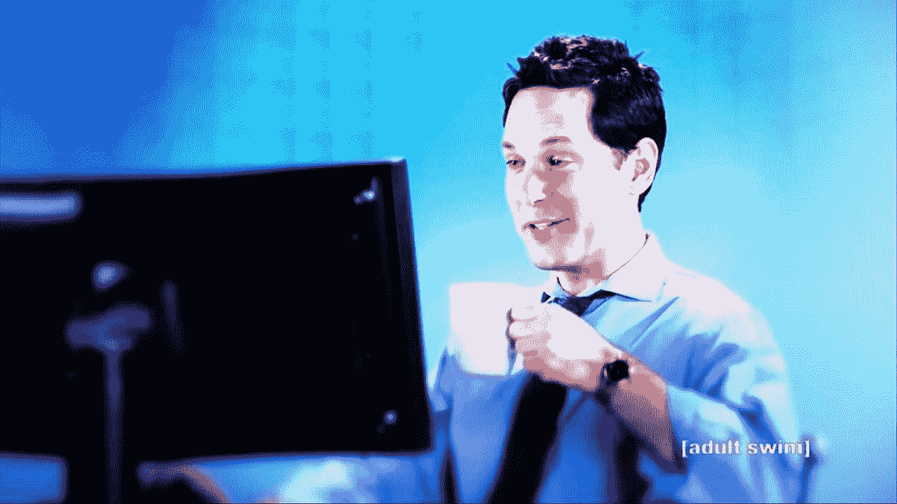

# 千篇一律的瘟疫

> 原文：<https://medium.com/hackernoon/the-plague-of-sameness-94133f510c34>

AI 不会抢走设计师的工作。它会偷走他们的理智。

“Now Tayne I can get into.”

我承认，我和其他人一样迷恋智能镜子的前景。、或任何数量的智能软件应用程序。

事实上，我在一家初创公司工作，努力将智能融入到我们自己的产品和服务中。

简而言之，对于即将到来的机器人革命，我[肯定是失望的](https://youtu.be/KIXTNumrDc4)。

也就是说，我对此有些沮丧。我喜欢创业的磨砺。在战壕里很有趣。这意味着犯错(很多)，不断迭代，在不断的反馈循环中生存。这需要你快速思考，依靠你的团队并认可风险。这几乎是海盗的生活方式。

人工智能对设计的影响挑战我的乌托邦海盗天堂。

# 当然，效率将会提高。

就我个人而言，在未来很长一段时间内，人工智能不会成为设计师工具箱中的行话。多年来，我们已经拥有了像 Photoshop 这样的智能工具。唯一改变的是技术文化及其对设计实践的影响。

人工智能给设计带来的大部分进步是“装配线”效率。更快地裁剪资产，处理数据以优化用户行为，按下按钮即可找到 101 种调色板。有很多关于“自动布局”和自我优化设计系统的讨论。这些奇迹甚至可以取代设计师的工作。

我不这么认为。我可以看到普通的制作工作被外包给我们的机器人兄弟姐妹。我承认，设计工作流程中更深入的角色最终会被技术消耗掉。但是我很难想象。我盲目地相信自己是痛苦的人类。

我做设计师太久了。我知道人类有多挑剔、情绪化和不理性。自我、潮流、品味、风格、文化、法兰绒……大部分设计交给机器还需要很长很长时间。

在不久的将来，人工智能在设计中的作用本质上是自动化。
不是无人机德雷珀 2.0。而且相当平凡。平凡的是对我海盗生活方式的挑战。

# 自动化==机会成本

这就是困扰我的地方。在数字设计中，我们已经在与千篇一律的瘟疫作斗争。自动化重复性跑腿工作和生产工作流程有机会成本。我们从这种技术优势中获得的东西充满了妥协。设计中的情感、工艺上的小怪癖、与众不同的能力、风格上的优势……**我们的工作流程越自动化，就越有可能失去设计中的无形资产。**

*侧栏:在维基百科上快速阅读* [*流水线*](https://en.wikipedia.org/wiki/Assembly_line) *和* [*量产*](https://en.wikipedia.org/wiki/Mass_production#Advantages_and_disadvantages) *，可以从汽车行业中搜罗一点 20/20。*

我不想看装配线，我也不想拥有我的数字体验。捷径很酷，但是通过艰难的方式学习也很有趣。那是手工艺的发源地。否则就是千刀万剐。每一种声称有助于设计的算法都削弱了我们的集体冷静。工作变得越不吸引人。听起来…很无聊。真的很无聊。

千篇一律的瘟疫可能会给 DAU 带来更好的转化率，但它并没有让我变得理智。我会接受奇怪的，古怪的，冒险的。我将不再感到无聊。

在 Medium 上写这篇文章(并使用海明威应用程序)，我意识到这里的讽刺。但这些文字是我的，无论好坏，这让我对我正在做的事情保持兴趣。

[卡尔马克思](https://en.wikipedia.org/wiki/Assembly_line#Sociological_problems)，我不是。我只是不想传送带让我的日子变得沉闷。

简而言之，我支持工匠精神。