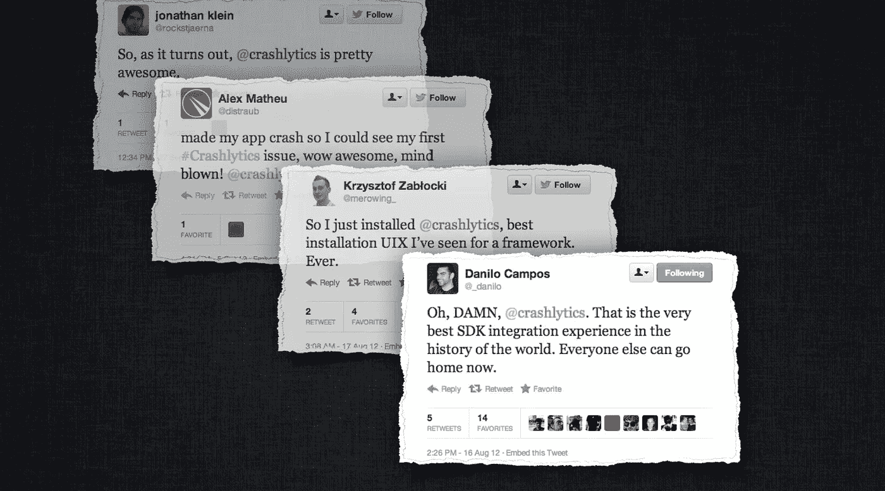
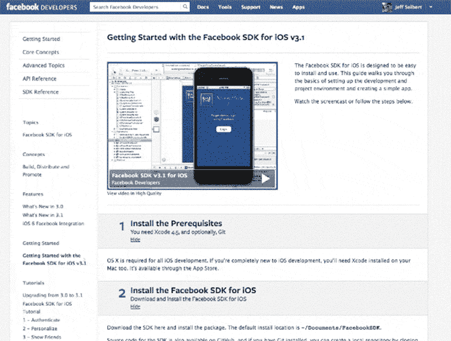
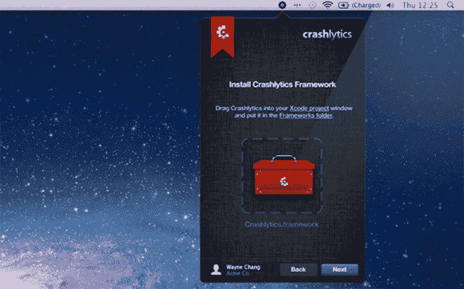
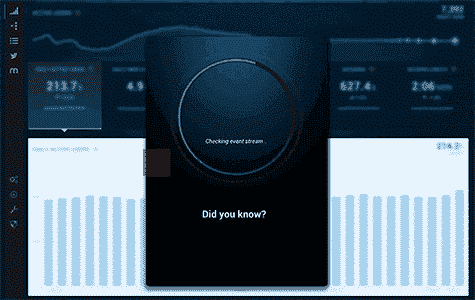

# 构建难忘的首次用户体验的精华指南

> 原文：<https://medium.com/hackernoon/the-quintessential-guide-for-building-an-unforgettable-first-time-user-experience-19720a7447d2>

你只有一次机会留下好印象。

我经常谈到建立一个 MVP(最小可行产品)和我喜欢称之为 MLP(最小可爱产品)之间的区别。

我不相信建立 MVP。

# 我相信创造令人难以置信的产品体验。这从给新用户难忘的初次体验开始。

与 MVP 相反，MVP 的目标是将几乎不可用的东西推出市场并获得初步反馈，MLP 则采取相反的方法，非常认真地对待新用户的第一次体验。

这是他们第一次看到你的产品，第一次体验你是谁以及你所代表的一切。如果他们所经历的是简单和笨拙的，这就是他们会记住你的方式。

> [别忘了，“平均来说，一款应用在安装后的前 3 天内会失去 77%的日活跃用户。”](https://uxplanet.org/best-practices-for-onboarding-92f3a9f0b21a)

# 你必须赢得更多用户时间的权利。

大多数创业公司不会这么想。

相反，他们只考虑核心产品特性，“价值主张”，最糟糕的是，他们的营销策略是什么。新用户如何体验使用该产品的前 30 秒几乎是事后才想到的。

想象一下，如果这是苹果采取的方法。想象一下，如果你的全新 iPhone 装在一个破旧的纸箱里——而不是珍珠白的真空箱里，那感觉就像你得到了一件珍贵的珠宝。或者想象一下，当你打开全新的 MacBook 时，它已经没电了。或者它无法定位您的本地 WiFi 信号并轻松连接到互联网。

作为一个新用户，你会立即感到沮丧、不安、失望——而不是兴奋、喜悦或渴望开始玩这个产品。

# 如果你想打造一个人们喜爱的产品，你必须打造一个讲述情感故事的首次用户体验。

我给你举个例子。

当我们构建 Crashlytics 时，我们发现第一次使用移动开发工具的体验非常糟糕。脸书是精英中的精英，而他们的是一个长长的指导页面，上面有无穷无尽的链接，向下滚动需要 20-30 秒。其他人有 72 步维基(“哦，你用 Mac？点击这里…“还有 26 步…”现在回去继续吧).或者甚至是 10 分钟长的 YouTube 视频，视频中一个人用单调的声音说:“现在..把这个…拖到这里。然后……点击……那里。”

这是一种多么糟糕的给用户留下第一印象和建立关系的方式啊！

# 所以，我们决定解决这个问题。

我们问，“我们如何让第一次体验变得有趣、愉快，并做一些脸书、谷歌、亚马逊和其他人显然做不到的事情？”

嗯，我们建立了一个消费级的安装应用程序。它甚至有一个摆动的图标，这样开发者就能明白它必须被拖动。这看起来似乎是一件容易(甚至是显而易见)的事情，但是创建一个可以在数百万台计算机上运行的安装程序，尤其是那些喜欢修补、修改和定制他们的安装程序的开发人员，并不是一件容易的事情。

事实上，我们花了大部分时间来构建这种首次体验，比我们花在核心 Crashlytics SDK 代码上的时间还要多！

# 但一切都有了回报。非常喜欢。

我们的第一次体验是开发者从未见过的。他们发了微博。他们告诉了他们的朋友。最终，当 Twitter 收购我们的时候，我们已经有 3 亿台设备了。如今，我们每月有近 30 亿台活跃设备。

你认为这是一次性的吗？让我再给你举一个例子，我们对第一次经历的关注帮助我们统治了另一个类别。这一次，它不是像手机事故报告这样的小众类别。

# 接下来，我们要去寻找皇冠上的宝石——移动分析本身。

当我们在 2014 年构建答案时，我们的移动分析产品旨在与 Crashlytics 配合使用，我们推出了一款与分析领域 800 磅重的大猩猩 Google Analytics 竞争的产品，以及移动分析领域的所有其他产品。还有很多:Flurry、Localytics、Mixpanel 等等。

这个领域竞争异常激烈，赌注非常高。据报道，Flurry 被雅虎以大约 3 亿美元的价格收购，当时他们是第二大公司。Localytics 和 Mixpanel 分别筹集了近 1 亿美元，占据了排行榜的第三和第四位。

当我们做最初的研究时，我们发现最引人注目的事情之一是其他公司处理入职流程的方式。

你注册了一个账户。你添加了你的代码。然后，作为第一次用户，您会看到一个仪表板屏幕，因为它还没有收集任何数据，所以仪表板完全是空的。一大块空白。屏幕上的零和扁平线条的条形图没有任何关系。

当我们浏览竞争对手的入职流程时，我们注意到，作为用户，我们的第一次体验并不太好。

非常机械:*输入你的名字。你的邮件。插入此代码。现在看看这个空的仪表板。*

我们想，“这就是数十亿美元的分析价值的样子？”

# 我们不想在我们的任何产品上这样做。我们希望我们的第一次用户感到鼓舞，并为经验是周到的，精心制作的。

因此，我们没有把我们的入职序列看作是为了构建 MVP 而需要检查的另一个框，而是花了相当多的时间来处理与新用户的第一个接触点。

我们不只是想让他们使用我们的产品。我们希望他们会喜欢。

# 我们是这样做的:

对于软件产品来说，倾向于更多的选择。这是解决问题最简单、最懒惰的方法。“我们应该先向用户展示这个还是那个仪表板？好吧，让他们选吧！”

这是设计和制造产品最糟糕的方式。

在入职流程中，这是您可以在产品的决策树中强制线性推进的唯一机会之一。

# 我们抓住了这个机会。

我们的入职流程本身就是一种产品体验。它投入了和最终产品体验一样多的心思。

当用户注册时，我们不是给他们一百万个选项，而是给他们一口一口大小的屏幕。人类的大脑很大程度上更喜欢可消化的信息块(看看这篇博文是怎么分块的？).接受这一点对用户来说意味着更愉快的体验。

每个易于理解的屏幕只询问我们绝对需要的信息。这意味着我们不会要求那些我们不能马上使用的信息。

# 这是黄金法则:

不要询问你的产品不能马上使用的信息。这意味着更高的摩擦，增加挫折感，并从整体体验中带走。

我们的入职流程也需要参与。这意味着我们不只是把它们扔到一个空的仪表板上。

作为入职和首次体验的一部分，我们绝对确保安装了他们的代码。我们故意让他们启动他们的应用程序，这样它就会攻击我们的服务器。当然，这对我们来说意味着额外的工程，因为我们不得不添加大量的逻辑来检查他们自己的代码的状态，在他们自己的应用程序中，然后显示提示，等等。

# 然而，这额外的努力是值得的。

因为我们花时间这样做，这意味着我们确信我们的代码在他们的应用程序中是正确的。我们的用户可以直接体验产品。

最重要的是，我们没有把它们扔进一个空的仪表板，而是创建了一个充满图表的假仪表板，但在背景中进行了模糊处理。在前景中，我们展示了一个小屏幕，上面有一个旋转器——在这个模式中，我们让这些动画块在屏幕上飞行。

直到用户清楚地意识到这些积木组合成了……他们自己的应用程序的标志。

我们的用户喜欢这样。这与强迫他人加入公司形成了鲜明的对比。我们看到了关于我们入职的推文——多么令人愉快，多么有趣，多么有个性。这时，我们知道我们已经做出了令人难忘的东西。

# 现在，你可能想知道为什么一家初创公司会优先在入职流程上花费这么多时间，而不是在核心产品上投入时间。

结果不言自明。

Crashlytics 在移动性能方面排名第一，其使用率超过了排名第二至第六的平台的总和。

我们的移动分析产品 Answers 成为了增长最快的移动分析产品。我们击败了 Flurry 和 Google Analytics，并在推出后的 10 个月内排名第一。

在 1 岁时， [Crashlytics 被 Twitter 收购。](https://techcrunch.com/2013/01/28/twitter-acquires-crash-reporting-tool-crashalytics-development-of-the-product-will-continue-unabated/)

然后，在 2017 年，在 Answers 推出后， [Crashlytics 和 Answers 被谷歌从 Twitter 收购。](https://www.recode.net/2017/1/18/14313164/google-twitter-acquisition-fabric-crashlytics)

显然，我们必须做好许多其他事情，才能成为移动性能和更大的移动分析空间的领导者，但我们对新用户体验细节的关注点燃了我们产品的口碑。

我们不需要营销。我们不需要在其他创业公司分配的那些部门超支太多(太多了！)资源到。

当你让某样东西**变得可爱**时，产品本身就说明了一切。

# 那么，你实际上如何创造一个难忘的首次用户体验呢？

归结起来就是对时间的感知。

一个新用户非常不耐烦。他们还不信任你。他们不知道会发生什么，他们试图(尽快)决定你是要让他们的生活更容易、更快、更有效率，还是更慢、更烦人、更无聊。

我经常把产品设计和电子游戏相提并论，因为在所有行业中，游戏是时代的产物。一个游戏越能让你觉得一个小时刚刚飞逝，你就越有可能再花一个小时，再花一个小时在他们的世界里玩。

当谈到首次用户体验时，没有人比游戏公司做得更好。从你开始一个新游戏的那一刻起，你要么沉浸其中，要么就消失了。

暴雪娱乐公司的热门多人游戏《守望》(Overwatch)在等待屏幕上做了一些有趣的事情，我认为这是创造一个尊重用户时间的可爱产品的完美例子。传统上，当你玩多人在线游戏时，你必须等待其他玩家加入，然后比赛才能开始。如果是 6 对 6，你需要所有的 12 名玩家——而且对于大多数游戏来说，玩家都被留在等待屏幕上:*等待所有用户，寻找服务器，等等。*

《守望先锋》做的很聪明，他们不是强迫玩家等待，而是把他们都扔进一个迷你游戏里。它没有目标，没有规则。这只是一种在游戏世界中悠闲地相互交流的方式。他们不会像正常游戏那样，让对手跑来跑去，互相攻击，而是会做一些他们平时不会做的事情——比如互相挥手，合作等等。这是体验相同游戏的一种新方式，但相当于一个等待屏幕。

# 当一家初创公司可视化他们的产品时，他们往往会忘记用户需要等待的时刻。

他们绘制产品不同屏幕的模型，用一系列图表、数字和充满活力的数据集填充它们，只是忘记了(当他们的产品上线时)新用户将从…什么都没有开始。没有数据。不能长期使用。一无所获。

但是当用户第一次看到这个仪表板的时候呢？用户第一次看他们的“好友列表”或消息框会怎样？

## 它会是空的。

这意味着你的工作是及时检查那个特定的时刻，并问:“我们能做些什么来让用户感觉被包含在这里？我们怎样才能让他们觉得他们不是在等待什么事情发生，而是事情已经发生了，”

# 许多初创公司只从工程的角度来开发产品，而不是以人为中心。

人们非常清楚时间——他们如何花费时间，事情需要多长时间，以及他们投入的时间和他们得到的回报之间的关系。对时间的感知是非常主观的。

这意味着，如果你能让用户的注意力集中在别的事情上，时间会过得更快。而像等待仪表板填充这样的无聊事情会感觉更短，这让用户感觉更投入，更有可能留下来。

## 这里有一些快速的例子，告诉你如何让第一次使用的人感觉时间过得比实际快。

一般来说，我们将这些归类为[进度指标。](https://uxplanet.org/progress-indicators-in-mobile-ux-design-a141e22f3ea0)

*   **产品提示:**当一个新用户第一次进入产品时，给他们一些指示，告诉他们东西在哪里，如何使用，会非常有帮助。但这也可以是一种策略，让他们随着时间的推移继续使用产品(只要这是战略性的，不会成为一种烦恼)。
*   **“你知道吗？”:**加载屏幕是放置与产品或其用例场景相关的快速、有趣事实的绝佳位置。
*   **语录:** Slack 就是这么做的。当你在等待一个空闲频道加载时，你会看到一个奇怪的报价。它能让你忘记你在等待的事实。
*   **动画:** [加载动画](https://conversionxl.com/blog/animation-improve-user-experience/)尤其可以帮助用户感觉好像他们正在目睹一些有创意或独特的东西展现在他们面前——而不是感觉他们在等待、等待、等待一些事情发生。
*   **跟进序列:**你不能忘记用户离开你的产品的时间。例如，我们要做的是给用户发送设计精美的电子邮件，附带即兴更新，比如“TL；博士-你的应用程序是 98。本周%无崩溃。这种积极的强化让他们当时感觉很棒，给了他们更多的理由回来继续使用我们的产品。

# 现在，如果您已经构建了一个产品，来自同一个团队的多个用户都可以登录，那会怎么样呢？你如何确保他们都有同样难忘的首次用户体验？

这是我们遇到的一些不速之客。

很多人问我们是如何在分析社区如此普及，如此迅速地获得如此多的使用。

事实是，我们花了很多时间思考我们的产品如何适应日常用户的自然工作流程。如此多的初创公司试图开发一些产品，尽管这些产品在理论上可能很棒，但却违背了他们想要吸引的客户的自然日常节奏、自然工作流程。

一个典型的例子是:许多公司开发的产品中，用户可以注册一个帐户，使用仪表板，然后与其他 10 个团队成员(在我们的例子中，是工程师)共享他们的登录名和密码。

# 这种方法的问题是，产品只能给其中一个用户完整的首次用户体验。

也就是说，您作为正面强化发送的电子邮件更新或通知只有其电子邮件与该帐户关联的人才能看到。

这不是一个非常以人为本的体验。这只是一个产品做它需要做的功能。

有了 Crashlytics，我们问自己，*“我们怎样才能让每一个移动开发者都拥有难忘的首次用户体验——不管他们是否与另一个使用我们产品的开发者在同一个团队？”*

我们为什么要问自己这个问题？因为如果一个人有可爱的第一次经历，他们会告诉其他人。

这意味着如果 10 个人有了可爱的第一次经历，他们会告诉另外 10 个人。

# 这是一种以人为中心的增长策略。它像野火一样蔓延开来。

我们是如何设计的，我们观察了开发人员的自然工作流程，并意识到他们日常工作的一部分是签入他们的代码——每隔几个小时，每天一次，等等。

因此，我们创造了一种用户体验，当一家公司的用户#2 下载或同步到该公司应用程序的最新代码时，会出现一个弹出窗口，上面有第一位开发人员的个人资料照片，并有一条消息说:*“嘿，约翰需要验证你是他的团队成员。请输入您的电子邮件地址。”*

他们会输入他们的电子邮件，现在他们是 Crashlytics 下的另一个用户——这意味着他们也收到同样的通知和电子邮件灌输积极的强化。

这种微小的细节就是每个拥有 Crashlytics 账户的应用公司和一个公司内每个拥有自己的 Crashlytics 账户的开发者之间的区别。

# 这里是我给那些想要建立难忘的首次用户体验的人的最后一条建议:

大多数企业家都从最好的角度来看待他们的产品。他们想象数百万人使用它，捕捉大量数据，显示大量活动。

这就是我所说的 40 天愿景。他们创造了这一愿景的模型。在投资者看来，它很棒，但除此之外没有什么价值。很少有创业公司真正关注第 0 天，然后是第 1 天，等等。

大多数用户在第 40 天之前就离开了。他们需要不断地看到，并且*感觉到*，价值的证明。否则，他们将进入一个空的应用程序，一个陈旧的产品，并找到继续使用它的理由。

这就是为什么我如此强调创造第一次体验的重要性，以交付真正的价值，并向用户展示他们日复一日可以期待的东西。

不幸的是，大多数创业公司并不关注第一次用户体验——他们为此深受其害。这就是为什么很少有用户能坚持到第 40 天，也很少有公司能熬过首轮融资。

我问几乎每一家我作为投资者、顾问或导师的公司的一个问题是，他们的入职流程是什么样的。

> *“第二天你怎么和你的用户互动？”*

你只有一次机会留下好的第一印象。第一次体验对于你的产品的成功来说，就像你产品中的其他功能一样重要，甚至更重要——因为这是他们第一次接触的功能。

记住，你必须赢得更多用户时间的权利。

*感谢阅读！*

从我记事起，我就一直在创业。如果你想了解如何建立一个成功的公司，请点击这里订阅，这样你就不会错过我的下一篇文章。