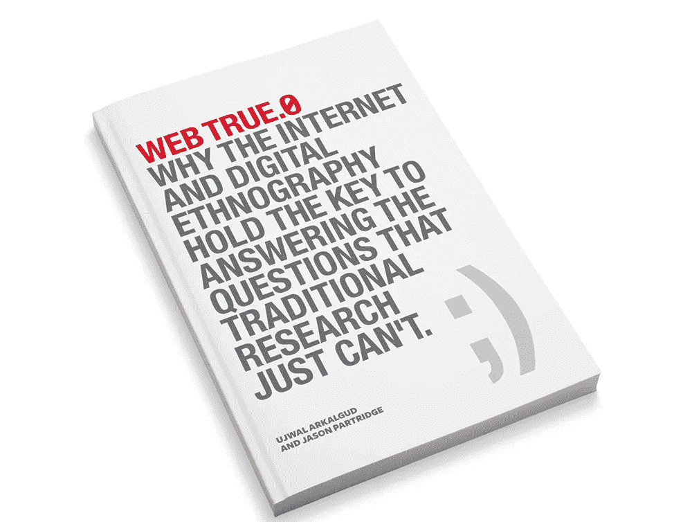

# 正确的研究可以提高创新的有效性:图书节选

> 原文：<https://medium.com/hackernoon/the-right-research-can-improve-the-effectiveness-of-innovation-book-excerpt-87661139a01d>

我最近与人合著了一本关于消费者研究领域的书，专门研究了在互联网上进行的观察研究(称为数字人种学)在帮助组织利用 T2 空白空间进行创新方面的力量。我的合著者[杰森·帕特里奇](http://www.motivindex.com/our-team)和我被迫写这本书[因为每次我们告诉别人我们通过研究互联网上的人类行为来帮助公司识别新的创新机会，我们经常会得到这样的问题——“但是人们不会在互联网上撒谎吗？”](https://hackernoon.com/tagged/book)

现实是，作为人类，我们无处不在。我们努力创造一种身份，我们认为这是我们希望世界如何看待我们。这种渴望从未消失。但是，在互联网上，互动的非个人性质以及隐藏在电脑屏幕和假名后面的能力给了我们勇气来表达我们最深处最黑暗的部分，否则这些部分会被小心翼翼地隐藏起来，不让其他人看到。在我们的书中，我们认为在 Web True.0 的世界中，研究人员可以真正理解人们为什么做他们所做的事情背后隐藏的动机和驱动力。这就是我们这本书的内容。

我想我会分享这本书的节选，让你体会一下我们正在谈论的内容。尽情享受吧！

1961 年，亨利·马蒂斯的杰作《勒巴陶》被悬挂在纽约现代艺术博物馆。由于马蒂斯于 1954 年去世，他无法看到这幅作品在世界上最负盛名和最受尊敬的艺术机构之一展出。当你想到博物馆馆长和他的工作人员把这幅画挂倒了，这是很不幸的。

47 天后，一位名叫吉纳维芙·哈伯特的博物馆参观者才注意到这个错误。在三次参观博物馆后，她不禁觉得马蒂斯绝不会将他更复杂的主要主题放在画的底部，而将更简单、不太复杂的主题放在顶部。通过一点点研究，她找到了一份目录，上面有一幅正确展示的艺术品图片。

博物馆的艺术总监接到通知后，这幅画被翻了过来。当马蒂斯的儿子(一名艺术经销商，他自己也参加了展览，但没有注意到这个错误)被告知时，他说哈伯特应该得到奖励。但最重要的是，当博物馆调查这个错误是如何发生的时，负责安装这幅画的人声称，他们只是按照“勒巴陶”背面的标签指示做的。那些标签是颠倒的。

博物馆的进一步辩护是，这幅画在框架背面的底部也有很深的螺丝孔，所以很明显，这幅画过去被其他画廊挂错了。现代艺术博物馆的罪行仅仅是按照他们以前一贯的方式做事。直到哈伯特提供了一个不同的视角，专家们才被迫以不同的方式，更近距离地观察这幅画。经过更加严格和深入的检查，他们在画框顶部发现了一些模糊的小孔，这些小孔突出了艺术品悬挂和展示的正确方式。

这个故事为寻求更好地了解消费者的财富 500 强公司提供了一个强有力的隐喻——因为，就像现代艺术一样，消费文化是一个非常复杂的谜，需要仔细研究。它是过去的产物，是揭示现在消费者欲望的脉搏，是塑造未来的趋势的窗口。复杂吗？是的。是不是很混乱？是的。但是正确地分析和解释，消费文化可以开启驱动更准确和有效的商业战略的洞察力。

在今天，我们进入消费文化的最强大和最重要的窗口是互联网。因为每天有 24 亿人在线，与世界分享他们的灵魂。

想象一下，在接下来的 60 秒内，消费者将在脸书上分享 2，460，000 条内容。他们将在 WHATSAPP 上分享 347222 张照片，在 Instagram 上分享 216000 张新照片。将有 277，000 条新推文，26，380 条新评论发布到 Yelp，8，333 个新的 Vine 视频被共享。在每一个帖子，每一张图片，每一个想法，每一个观点的背后，都有一个人在揭示他们如何看待这个世界。他们告诉我们他们是如何看待自己的，他们希望别人如何看待他们，以及他们渴望成为什么样的人。他们留下了社交媒体的痕迹，可以引导我们对构成我们人类的善、恶、丑有更深刻、更感性、更同情的看法。

无论你是一家价值十亿美元的公司的首席执行官，还是一家初创公司的营销经理，还是管理创新部门的高管，或者仅仅是一个以擅长社交媒体而自豪的人，我们猜测你低估了自己在网上对一个人的了解程度。

这本书将改变这一点。

因为虽然许多人认为这些分享或帖子的大部分只是一些细枝末节，但我们发现，事实上，真相就在于这些细枝末节。但是为了找到真相，我们需要采取一种稍微不同的视角来观察这些“细节型”数据。这本书会让你成为这个“新”镜头的权威。

但这将是有争议的。

很简单，因为如果你看看今天大多数公司、组织和政治家(以及他们雇佣的研究公司)是如何进行研究的，他们几乎总是依赖两种基本方法。

第一种是通过调查、民意测验、焦点小组或深度访谈，让人们说出他们的想法或感受。这意味着他们试图理解的消费者总是被打断，以某种方式或其他方式，他们的反应有意识或下意识地受到体验的影响，因为他们知道他们正在被观察，或者更糟糕的是，被评判。

第二种方法是通过研究消费者的在线对话和互动来寻找行为模式(比如人们在谈论什么或在哪里谈论)。

问题来了。这两种方法都产生合理的信息，因为它们直接来自消费者的口中。当你从表面上接受消费者告诉你的话时，你就错过了潜在的洞察力——某人说某事或以某种方式行动的真正原因。

这并不是说从这些方法中学不到什么，这本书当然也不是对研究行业的批评。当你需要确定某人做了什么或说了什么，以及他们在何时何地这样做时，这些方法非常有用。但推动创新、更有效的沟通、有意义的消费者旅程和更强大的商业战略的真正问题是为什么？传统研究几乎总是无法回答为什么消费者会以某种方式行事，因此无法揭示未满足和未发现的机会来激励消费者改变他们的行为。无论行业还是品类。

> [黑客中午](http://bit.ly/Hackernoon)是黑客如何开始他们的下午。我们是 [@AMI](http://bit.ly/atAMIatAMI) 家庭的一员。我们现在[接受投稿](http://bit.ly/hackernoonsubmission)，并乐意[讨论广告&赞助](mailto:partners@amipublications.com)机会。
> 
> 如果你喜欢这个故事，我们推荐你阅读我们的[最新科技故事](http://bit.ly/hackernoonlatestt)和[趋势科技故事](https://hackernoon.com/trending)。直到下一次，不要把世界的现实想当然！

