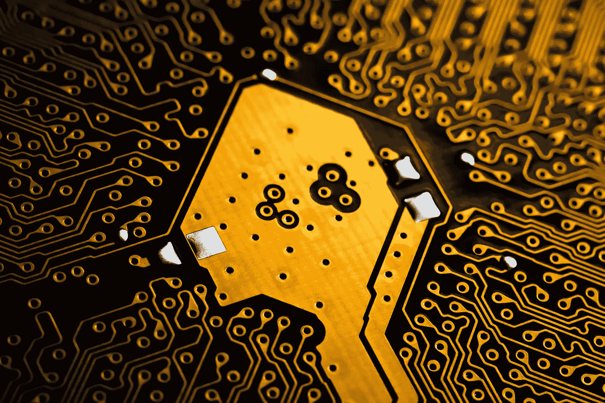

# 所有钱的根源

> 原文：<https://medium.com/hackernoon/the-root-of-all-money-5bf17f1a5f2a>

作者:Sishir Varghese |公司关系经理

纵观历史，人类使用毛皮、树枝、金属和纸张作为货币形式。博学多才的数字货币创新者尼克·萨伯在他与蒂姆·菲利斯和[海军·拉维坎](https://hackernoon.com/tagged/naval-ravikant)的播客中说，“尤罗克印第安人对他们的贝壳很认真，他们会在手臂上有纹身标记来测量贝壳的长度，这告诉你贝壳的面值和价值，这对应于它在自然界中的稀缺程度。”部落使用贝壳作为交换和价值储存的媒介，但是当你想买相当于不到一个贝壳的东西时会发生什么呢？它不能被分割。如果一个贝壳比另一个更华丽或更吸引人呢？价值增加了吗？理想的交换媒介的品质包括可替代性，或可互换的特性，稀缺性，可分性，可转让性和持久性。这些相同的品质帮助黄金成为一种货币形式。黄金是稀有的，任何两个相等的单位都是相同的。谷物或牛肉等其他商品不遵循同样的价值框架。普通商品被消费(谷物和牛肉)，但是黄金被收集和储藏。正是这种储存过程和系统导致了其巨大的全球市场。

随着贝壳变成黄金，黄金变成纸币，货币的演变仍然让许多人觉得遥不可及。但是，当上述交换媒介和价值储存手段的标准升级时，会发生什么呢？输入加密保护的交换媒介。虽然黄金受到物质世界的限制，而法定货币是由政治手段创造的，但制造密码的规则是明确地用代码写出来的。黄金的转移需要物理上的接近，而法定货币则受到法规的束缚。密码可以安全而廉价地跨越国界。菲亚特的价值储存能力很差，因为它每年都会因通货膨胀而丧失购买力。加密货币引入了可编程货币的新概念。协议和价格现在可以完全透明和不可改变。如今，这种可编程性正被希望筹集资金的公司所使用。项目可以使用加密技术和代码行发行和销售代币，而不是将一轮融资限制在合格的投资者。可编程的货币导致了可编程的业务流程，反过来，智能合约催生了代币经济。有史以来第一次，传统上由投资者和风险资本家衡量的技术进步风险，现在越来越多地由普通大众来评估。这种权力下放的一个未被充分认识的结果是风险的民主化，以及随之而来的对波动性的容忍。

在这个全球加密货币生态系统中，产品是实时定价的。考虑即将发布的公告、合作伙伴关系和 alpha 版本。路线图和 Github 提交被彻底调查。Telegram 和 Slack 论坛监测大众情绪，而 Youtube 名人则是卖方分析师。一项资产的整个未来前景已经在价格中反映出来了。但是到底是什么推动了这些代币的价值呢？最大化主义者通过引用资产提供的效用，如跟踪交易、国际支付或对冲通胀，来证明每项资产的合理性。虽然这些公用事业确实如此，但它们是一个更大命题的一部分:一种更好的货币形式。

这种经济产生了寻找新货币最佳形式的竞争。通过转移和存储价值的演变，功能优越的范式转变已经超越了最初的外壳。这一优势将使国际支付迅速结算，点对点交易不间断，物联网将无缝连接，数据、文件存储和身份最终将是安全的。试着用黄金或法币做这件事。