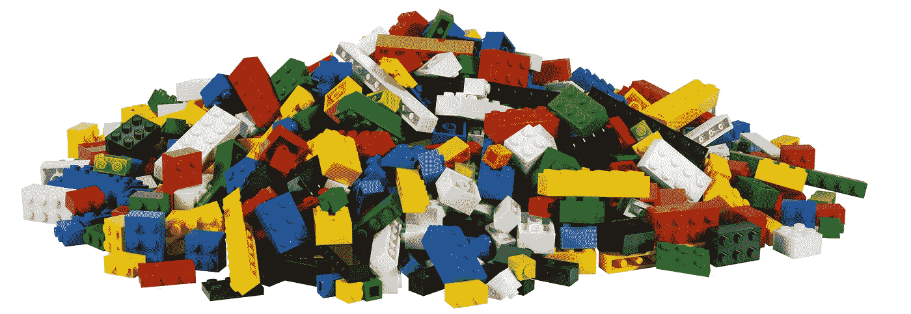
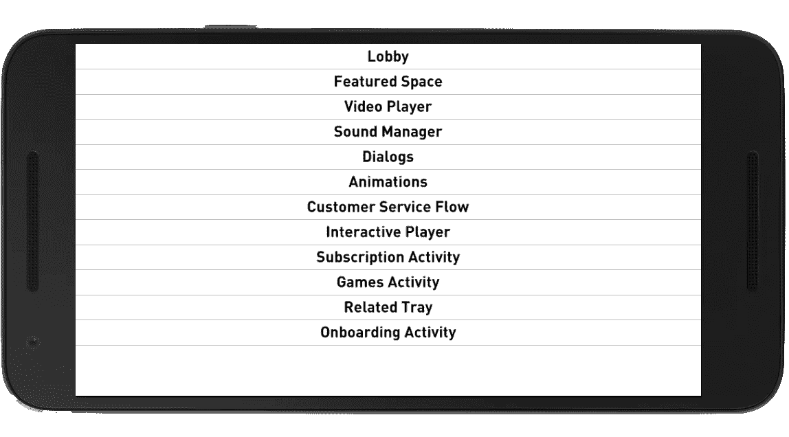

# 跳板模式

> 原文：<https://medium.com/hackernoon/the-springboard-pattern-340e00379404>

## 如何孤立地构建新特性

Software development is not a form of construction.

几年前，在一次敏捷演示中，一个利益相关者特别露面。团队正在接近一个最小的可行产品。演示侧重于声音效果和动画。该小组展示了一个可配置的动画板来快速演示结果。这些体验易于连续启动、隔离和可变配置。动画板并不依赖于更广泛的系统，但其意图是在以后绑定每个动画。

当团队演示时，利益相关者问我们是否评估动画板以进行进一步的实验。有了这个反馈，小组记下了 ***未实现的*** 价值，并迅速写下了下一步要探索的内容。当然，这不是该团队第一次使用这项技术。我们在[未来演示](https://dev.to/solidi/how-to-crush-your-next-team-demo-2bb5)中也有类似的发现。团队意识到特性包容对于他们的演示和产品价值来说都是非常强大的。

对于作为工程师的我们来说，给事物命名很难。更难的是如何交流。对于上面的故事，没有词汇可以描述执行的努力。 ***软件工程*** 中没有对迭代包容编排的描述。

因此，这就是我所提议的，一个描述独特的执行及其优点和缺点的定义。在容器中开发和演示是我称之为 ***跳板* *模式*** 的一个例子。

我们来描述一下是什么模式。

# 跳板模式是什么？

跳板图案被称为 ***视觉设计*** 图案。限制查看区域的移动操作系统已经广泛使用了这种模式。app launcher 就是一个例子。

Above are examples of the springboard visual design pattern within app launchers.

我们的入门故事和它的动画板也符合这个模型。我们可以把动画板想象成包含的屏幕启动器，把每个动画想象成一个有组织的应用程序和它的配置。

当应用于软件开发时，跳板模式就像一个护栏，在孤立的部分中开发特性，这些特性很容易在平台上 ***演示*** 。对工程和产品有很多好处。设计是一种迭代和增量执行的方式。

跳板模式是一种检查依赖关系并围绕 ***产品演示*** 循环开发特性的方法。以下是工程师在迭代时必须遵循的规则。

该功能:

1.  它从包含其他功能的板上启动。
2.  可以通过最少的设置快速启动。
3.  它可以自行启动，也可以按任何顺序启动。
4.  该配置可以在任何状态下启动。
5.  该功能可抵抗更大的系统耦合和依赖性。

如果我们在功能开发过程中遵循这些规则，奇迹就会发生。好处包括促进模块化、可测试性和构建时间。额外的改进包括[未实现的产品构思](https://dev.to/solidi/what-is-a-product-manager-anyway-3pc4)、工程效率以及框架的优势。让我们接下来讨论这些。

# 促进模块化

跳板模式坚持在彼此隔离的情况下发展特色。在每个设计阶段，团队必须尽最大努力在 ***遏制*** 中创造一个解决方案。

依赖关系将始终存在，但是这些层将功能分开，以便清楚地进行演示。该功能应该是模块化和独立的。随着迭代的继续和演示的成功，跳板项目集成到了广泛的系统中。当这种情况发生时，团队应该继续抵制耦合，并确保特性代码的高内聚性。从开始到结束，每个项目都应该有一个 ***从属*** 的弱项。

The springboard design pattern.

在周期中的任何时候，模式违反都会减少模块化的回报。因此，团队必须依靠分层、包装和使用依赖倒置的控制流工具做出 ***谨慎而审慎的*** 决定。

# 支持可测试性和构建时间

从跳板上开发一个可演示的项目需要可测试性。单元测试也将作为模块的文档。

跳板模式的概念是促进可测试性的概念。它的依赖性应该是高度可配置的。该功能应具有可用于其 ***依赖性注射*** 的可用配置。因此，这有助于轻松测试和模拟组件的所有情况。

构建时间也得以维持，并且代码库的复杂性随着每个特性而标准化。传入的特征可以是 ***标记的*** 不被工具集构建。从演示中被拒绝的功能将被持续删除。

最后，跳板图案的自然现象可以揭示 ***诊断* *测试工装*** 的那种独特特征。该功能在没有广泛系统的情况下开始使用。跳板可以使测试部分功能的工具与更全面的系统相对，因为它们是它们的子系统。

# 产品构思与工程效率

当产品被分解成独立的部分时，机会就出现了。在介绍的例子中，使用动画板似乎有未实现的产品价值。

利益相关者将他们产品的特性称为内聚结构，并使用词汇来描述它们。马上找到没有摩擦的部分不是很厉害吗？跳板给了我们一个 ***学习库*** ，允许工程师之间的*，并给了我们一个快速定位每个特性的工具。*

**

*Above is a screenshot of a springboard example with the use of the domain language.*

*作为一个额外的好处，工程师的工作是 ***随时可用*** 进行演示。一个独立的解决方案抵消了准备演示的典型时间成本(您给了工程师准备的时间，对吗？).*

*里程可能因领域和利益相关方的接受程度而异。用最务实的话来说，产品必须少预测，多实验。解构和隔离这些特性可能会导致不同的结果或产品价值的重新配置。*

# *框架支持*

*使用跳板模式，可能会有未被发现的 ***效率*** 好处，这些好处与框架的特性相吻合。团队工作的框架可能会有所不同。在这篇文章中，我将讨论 Android 关于跳板的使用。*

*最近在 Android 生态系统中，谷歌推出了[即时应用](https://developer.android.com/topic/instant-apps/index.html)，并详细讨论了在名为 ***功能模块*** 的领域中整合和突破新概念。正如我们从上面所看到的，对涉众来说可以演示的一切都应该是模块化的和孤立的。随着开发的继续，将每个特性与重要的依赖项隔离开来，并针对每个特性进行优化。产品团队可能希望单独或一起推出这些功能。*

*Android 的另一个例子是孤立的概念 ***活动*** 。每一项活动都应该能够独立地启动，从经历中获取生存所需的东西。如果特性是内置的独立活动，应用程序的各个部分的重新配置是可能的。*

*最后，有了最新版本的 Android，它的工具有了显著的改进。独立的模块允许建造能力，这大大减少了建造时间。使用 ***风格的*** 代码组织的设置可能会导致构建延迟，尤其是在产品尺寸很大的情况下。*

*在我们结束之前，有一些缺点需要考虑。*

# *缺点*

*这种执行方式可能有缺点。团队必须做出最合理的决策，以避免过度工程化。*

*跳板方法可以:*

1.  ***违反 YAGNI**—**[你不会需要它的](https://martinfowler.com/bliki/Yagni.html)团队应该构建他们需要的东西，而不是多一行。***
2.  *****加速决策** —推迟架构选择是保持复杂性可控的一个很好的策略。以这种方式操作可能会迫使更快地做出具有挑战性的代码决策。***
3.  *****增加复杂性** —支持分层和模块化的额外逻辑可能会增加开发时间。***

***但是，请记住，所付出的成本肯定会为代码的一致性和适应性提供成本效益。 ***适应性*** 需要空间呼吸。代码和产品应该有喘息的空间。***

***现在我们来总结一下。***

# ***开始行动***

***为隔离和模块化开发是所有工程师都应该努力的实践。然而，对于这些概念还没有一个实用的方法，也没有一个描述如何执行它们的方法。人们以为工程师会这样做，但事实是他们不会。***

***软件开发中的 ***跳板模式*** 终于给了我们一个词，来沟通我们在软件执行两方面的意图。当坚持这种模式时，我们管理***增加***可选性*** 。如上所述，好处很多，但要意识到缺点的代价。******

****跳板模式需要努力和动力，但对团队和他们的产品来说，好处可能是难以置信的。以团队演示为中心，并坚持下去。****