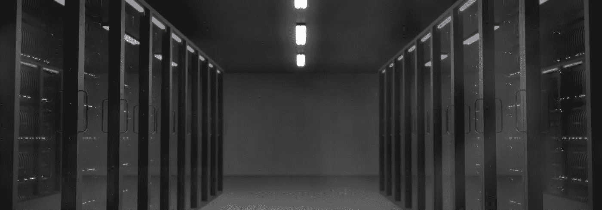

# 第三波投资

> 原文：<https://medium.com/hackernoon/the-third-wave-of-investing-8666444d415a>

## 在人工智能和数据科学上下大赌注

贪婪澄清、穿透并抓住了进化精神的本质。

——戈登·盖柯，*《华尔街》*，1987 年

有史以来，正是这种进化精神一直指引着竞争异常激烈的金融世界。经纪人和对冲基金一直在寻找下一件大事，这将使他们相对于其他人具有竞争优势，并确保他们的生存。而这一次的大赌注是在人工智能( **AI** )和机器学习( **ML** )上。

各种因素的汇合使得第三次浪潮的时机恰到好处。例如，近来数据量呈爆炸式增长，仅在过去几年内就有超过 90%的现有数据被创建。对交易者来说，数据就像黄金一样珍贵。与此同时，云计算的快速发展也使得存储和管理大量数据变得更容易获得和负担得起，从而从根本上降低了进入门槛，并为投资前沿技术的基金创造了激励。

过去十年中最重大的进步是我们能够对所有这些数据进行“T10”分析。人工智能和数据科学的最新突破导致了新模型的发展，现在可以从迄今为止无法使用的“数据汤”中提取可操作的见解。更重要的是，像谷歌大脑的[*tensor flow*](https://www.tensorflow.org/)*和[亚马逊的*Destiny*](https://www.geekwire.com/2016/amazon-goes-open-source-deep-learning-tech-competing-googles-tensorflow/)*(dsst ne)这样的开源深度学习人工智能平台的兴起，大大减少了构建、实施和维护机器学习系统所需的时间和精力。**

**然而，不应该孤立地看待第三次浪潮的到来。这只不过是华尔街“进化精神”的自然结果，而华尔街自身也随着时间的推移不断进化，在金融领域的不同创新浪潮中时好时坏。**

**第一波投资是关于自由支配基金的兴起和增长。在 20 世纪 70 年代，像沃伦·巴菲特和乔治·索罗斯这样有魅力的投资者利用他们与生俱来的人类决策和分析能力来寻找新的机会，并在市场中保持竞争优势。随着时间的推移，互联网等信息技术的普及缩小了这一差距。机会和信息变得更加容易获得和标准化。由于每个人都基于相似的信息和假设，投资公司需要发展竞争优势。**

**2000 年代初的第二波投资浪潮改变了这一切。像 Renaissance Technologies 和 WorldQuant*这样的基金通过雇佣“Quant”为投资和交易带来了高度的数学严谨性。这些定量分析师利用新的统计模型和计算机算法来构建系统性策略，在多个市场和金融工具中产生一致的阿尔法值(即市场优势)。**

**快进到今天，事情又发生了变化，基金开始流行起来。许多人正在使用深度学习人工神经网络(ANN)来发现和利用价格运动中复杂的非线性关系。与人类不同，人工神经网络可以快速、持续地适应市场机制的变化，提供前沿的洞察力。更重要的是，他们不需要休息或喝咖啡休息。**

**考虑到这一点，有必要提出警告。俗话说，天下没有免费的午餐，华尔街当然也没有交易的圣杯。不管你用什么交易方法——是机器学习还是更传统的方法——总会有无数种失败的方法。**

**尽管深度学习算法在交易中的应用越来越多，但它在金融数据上的适用性仍然存在许多问题。虽然深度学习可以有效地发现图像中的模式；它是否能对金融数据做同样的事情仍然不确定，如果不是未经证实的话。更重要的是，交易一直是一场零和游戏——一家公司的人工智能有多聪明并不重要，重要的是它是否比竞争对手更好。此外，随着这些人工智能和人工智能模型变得商品化，它们提供的优势将慢慢消失，并开始在市场中定价。**

**因此，人工智能和人工智能模型不是魔杖，而是非常强大的战略武器，需要由训练有素、技术娴熟的专业人员来使用。对人工智能和机器学习技术的投资不断增加，推动了对具备这些技能的“ *quants* ”的非线性需求。**

**第三波投资来了。这是一台服务器在壁橱里发出的安静的嗡嗡声，是一群默默无闻的 quants 在提升他们的 Python 和数据科学技能。随着进化的压力再次收紧华尔街的绞索，那些成功地用人工智能工具增强人类能力的公司——反之亦然——将会茁壮成长。**

***Ritabrata Bhattacharyya 是一名专业的量化交易者，是一名人工智能爱好者，也是致力于推进全球教育的国际非营利组织* [*WorldQuant 大学*](https://wqu.org/) *的教员。***