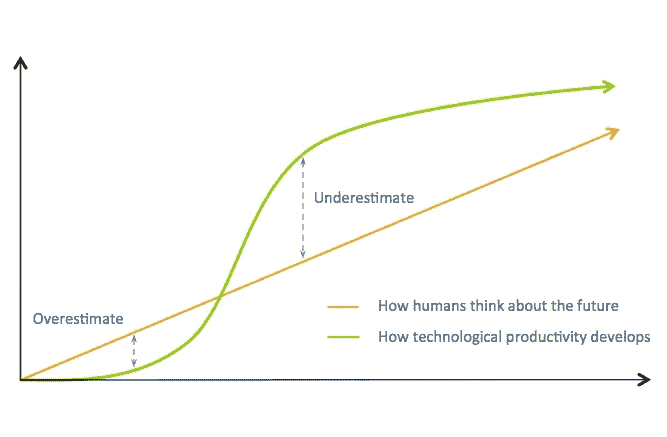

# 批判以太坊——“互联网 3.0”的弱点

> 原文：<https://medium.com/hackernoon/the-top-critiques-on-ethereum-a-bubble-waiting-to-pop-6ccf9b577d11>

## 一个新的网络泡沫是如何形成的。

在我的上一篇文章中，我关注了我比以往更常听到的问题:[“以太坊是什么？”](http://www.lawandblockchain.eu/what-is-ethereum/)

智能合约、去中心化应用的潜力，以及以太坊作为互联网 3.0 主干的崛起。然而，炒作往往带有积极的偏见，所以保持批判是非常重要的。为了平衡所有关于以太坊的积极因素，我将展示以太坊批评者最有根据的论点。

## 可扩展性和集中化

正如维塔利克·布特林所说的[，以太坊最有效的批评是其**(缺乏)可扩展性**。该网络目前每秒能够处理约 5 笔交易，这远远不能满足以太坊成为价值互联网主干的需求。相比之下，像 ber handles 12 这样的应用程序每秒运行一次。以太坊的开发者目前正在研究一些技术解决方案，以提高交易能力。其中包括](https://www.reddit.com/r/ethtrader/comments/6lgf0l/vitalik_drops_the_mic_on_rbtc/djtxbyr/)[等离子](https://www.coindesk.com/ethereum-lightning-buterin-poon-unveil-plasma-scaling-plan/)、[分片](https://github.com/ethereum/wiki/wiki/Sharding-FAQ)、[雷电网络](https://raiden.network/)和[将](https://www.google.nl/search?q=casper+ethereum&oq=casper+ethereum&aqs=chrome.0.0j35i39j0l4.1943j0j4&sourceid=chrome&ie=UTF-8)共识机制从工作证明变为利害关系证明。

Illustration 1: Transactions per second in Ethereum. Credits to Etherchain.org

对以太坊来说，集中化也可能会成为比比特币更大的问题。

跟踪你的余额的账本被安全地保存在数千个节点上，而不是一个集中的服务器上。换句话说，恶意的一方将不得不同时攻击数千台计算机，而不是一台服务器。总账是安全的，因为它是去中心化的。在我的上一篇文章中，我说过如果区块链变得太大，普通用户运行节点会变得很困难。这对比特币来说是一个巨大的问题，但以太坊的区块链规模比比特币增长得还要快。

对利益相关证明的更改可能有助于可伸缩性和分散化，但在游戏的后期更改共识机制也是一个潜在的问题。在工作证明中，共识是通过挖掘过程达成的，在挖掘过程中，挖掘者使用大量的计算能力来解决密码难题，以便向链中添加块并获得块奖励。另一方面，在赌注证明中，增加一个区块的概率不是基于计算能力，而是基于赌注者(也包括伪造者或铸币者)持有的财富数量。这消除了运行 GPU 所需的能源浪费，但也受到了批评。一些人认为，尝试这样的转换是不负责任的，批评缺乏对代码的同行审查，并认为这是给网络增加了一个未经测试和不安全的组件。总的来说，关于功率和位置有很大的争议。

以太坊经常提出的另一个批评是其创造者背后形成的狂热追随者。毫无疑问，维塔利科·布特林是一个聪明人，他正在为以太坊扮演一个**仁慈的独裁者**。然而，布特林仍然是一个独裁者，因为他在以太坊社区有大量的追随者，他独自一人对以太坊未来的发展决策产生了巨大的影响。这使得他成为这个世界上唯一的失败点，而这个世界的目标就是消除这种失败点。

## 智能合同

尽管智能合约广受赞誉，但应该指出的是，它们也有自己的缺点。

*   首先，智能合同的好坏取决于写合同的人。去年，由于糟糕的编码，[的一名黑客几乎从原版 DAO](https://www.cryptocompare.com/coins/guides/the-dao-the-hack-the-soft-fork-and-the-hard-fork/) 中窃取了 5000 万美元。
*   第二，如果合同中有错误，不变性可能是一个大问题。
*   目前，智能合约只对非常简单的合约有用。合同的功能是在双方之间划分风险，为了理解合同的复杂性，我们有大量的判例法和法律术语。大多数合同都不能归结为一组容易核实的要求。
*   第三，智能合同忽略了合同运作的社会背景。
*   第四，智能合约需要可靠的数据作为输入，以便正确执行。因此，需要第三方或甲骨文。尽管第三方带回了对集权化的担忧，但在可预见的未来，神谕还不够完善。预测市场、其他区块链和物联网可能会在这方面发挥作用。
*   最后，智能合同也提出了有趣的法律问题(代码是法律吗？).

## 泡沫问题

以太坊的另一个批评是，围绕它的炒作已经达到了泡沫的程度。没有任何概念证明，仅由一份白皮书和一个网站组成的项目通过 ICO 筹集了数百万美元。以灵知项目为例。Gnosis 是一个预测市场，它在 15 分钟内销售一空，筹集了大约 1500 万美元。然而，只有 5%的代币被分发，这意味着它的价值为 3 亿美元！ICO 基于白皮书和 alpha 版本，没有任何实际的概念证明。可悲的是，随着这一领域的投机活动达到历史最高水平，这种公然的过高估值并不罕见。与此同时，杰米·福克斯、帕丽斯·希尔顿和弗洛伊德·梅威瑟等名人正在社交媒体上愉快地推广 ICO。这非常类似于网络泡沫时期市场的非理性，当时名人公开炒作股票，像 pets.com 这样的网站价值 3 亿美元。

因为 **ICO 估值失控，**以太坊网络上的项目质量正在迅速下降。如果我的初创公司在工作半年后估值为 3 亿美元，我个人将获得 10%的收益，那么我有多大的动力继续工作？我可以卖掉代币然后退休。为了参与 ICO 狂潮，许多开发人员似乎并不关心他们是否有一个正常工作的产品。他们不需要这么做，因为他们知道无论如何人们都会向他们的项目砸钱。如果这让你兴奋，这里有一个从 ICO 炒作中获利的完整指南:

*   第一步:用一个漂亮的标语来启动网站，比如:“第一个分发的(…..)民主化并打破传统(…..)，通过无信任区块链技术赋能公民和利益持有者”。
*   第二步:写一份平庸的白皮书，对这个项目实际上如何产生经济意义含糊其辞。
*   第三步:假设你真的要建造 DApp。
*   第四步:退休获利。

没有监管，开发者认为他们可以对他们项目的未来做出最露骨的声明。为了你的财务健康，在投资 ICO 时做这个快速练习。做一个快速的谷歌搜索'项目名称'+骗局。如果这给出了成千上万的结果，也许是时候重新考虑你的计划了。如果没有，问问自己:这个项目解决的是真正的问题吗？为什么这个解决方案应该是分散的？该项目实际上受益于对等网络吗？为什么这个项目甚至需要一个令牌，令牌是做什么的，同样的目标可以用不同的方法实现吗？他们有工作原型吗？

以太坊网络上的项目质量正在下降，这也可以从 ICO 期间的**黑客数量中看出。**在过去的 12 个月里，估计价值 2 . 25 亿美元的以太坊在与 ICO 相关的活动中[被盗](http://fortune.com/2017/08/28/ethereum-cryptocurrency-stolen-bitcoin/)。还有广泛存在的“骗局币”，其开发者可能正处于我(并非如此)通往财务自由的独特循序渐进计划的第三步。一些诈骗的例子包括 Onecoin，Paycoin 和最近由 SEC [调查的](https://www.sec.gov/news/press-release/2017-185-0) REcoin 和 DRC。还有很多我怀疑不太合法的项目，但冒着失去理智的风险，我不会深入其中。作为一个很好的参照系，曾经有一个硬币的 ICO，在其网站“www.ponzi.io”(我不是开玩笑)上字面上说这是“有史以来第一个分布式金字塔计划”。这个项目获得了数百万的资助(我真希望我是在开玩笑)。

卡利亚里大学的研究人员指出:

> “在以太坊诞生的前 1.5 年里，有大量实验将庞氏骗局作为智能合同来实施:事实上，在 etherscan.io 上有经过验证的源代码的 1384 份合同中，有 10%是庞氏骗局。”

除了大量的诈骗、庞氏骗局和黑客攻击之外，**监管灰色地带**也导致了价格订单和泵和转储计划的广泛欺骗。所有这些都不可避免地吸引了监管者的注意，这将我们带到了最后一个，或许也是最大的问题:法律不确定性。

Illustration 2: *Regulatory uncertainty is prevalent*

到目前为止，代币及其发行的法律地位几乎没有监管确定性。虽然中国已经完全禁止了 ICO，直到颁布了相应的立法，但许多国家还不知道是否以及如何解决这个问题。代币是否是一种证券必然取决于它的特征、分配方式以及它赋予持有者的权利。然而，很明显，令牌肯定可以是一种证券，这取决于它是如何构造的(参见 SEC 对 DAO 的决定)。许多具有类似证券特征的代币不符合任何适用的法规。这意味着投资者无法获得他们需要的信息，因为缺乏合规性会导致缺乏透明度。

虽然我很想在这里深入这个主题，但我可以写一篇关于这个的论文(事实上，这正是我正在做的)。不过，推广 ICO 的名人应该小心:一条花 10 秒钟写的推文可能会产生巨大的影响。

最后，我想提出一个问题，是什么刺激了以太坊的需求。目前，一个合理有效的论点是，这主要是 ICO 炒作。买代币需要以太坊/比特币。现在如果按照这个思路推理，如果以太坊的价值确实有很大一部分是由目前 ICO 市场的不合理决定的，那么当这个市场在自己的炒作下不可避免的崩盘时会发生什么？

# 结论

区块链提供了提供高效、快速、安全、可靠和可审计的价值交易的潜力。就像之前的互联网一样，区块链承诺颠覆商业模式，颠覆行业。区块链技术正在推动我们挑战我们如何构建社会、定义价值和奖励参与。这就是为什么有些人把区块链称为互联网 3.0 或价值互联网的使能技术。

由于几乎任何东西都可以在以太坊的区块链上编码和部署，以太坊可能只是这个新互联网的基础。然而，高潜力伴随着大肆宣传，谈论互联网 3.0 带来了类似于网络危机的问题。

回顾过去，网络泡沫扰乱了市场相当一段时间。然而，它确实让世界意识到了互联网带来的可能性。在泡沫的高峰期，前 280 只互联网股票的总市值接近 3 万亿美元。在撰写本文时，加密市场的总市值为 0.145 万亿美元。

> “我们总是高估未来两年将会发生的变化，而低估未来十年将会发生的变化。”—比尔·盖茨

*Illustration 3: Visual representation of the relation between human perception of potential and development thereof*

***关于作者:***

Thijs Maas 是一名法律系学生，他对分布式账本技术带来的创新浪潮所带来的法律挑战有着浓厚的兴趣。他最近推出了[*www . lawondblockchain . eu*](http://www.lawandblockchain.eu)*，一个关于该主题的信息、见解和学术研究的中心。*