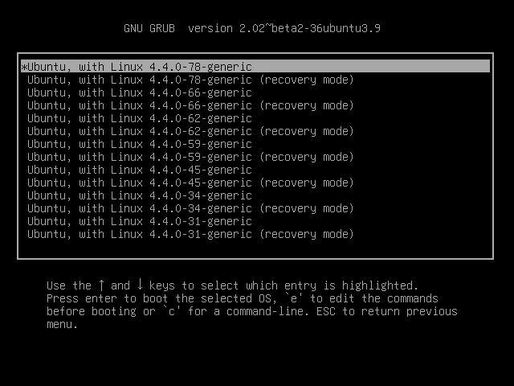
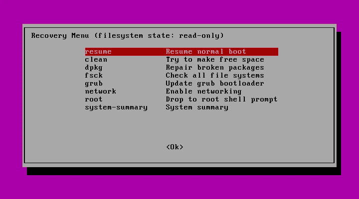

# Ubuntu 恢复菜单:揭秘 Linux 系统恢复

> 原文：<https://medium.com/hackernoon/the-ubuntu-recovery-menu-demystifying-linux-system-recovery-12d622b1b990>

*本文改编自我的曼宁书**[***Linux in Action***](https://www.manning.com/books/linux-in-action?a_aid=bootstrap-it&a_bid=4ca15fc9)***中“应急工具:构建系统恢复设备”一章。Y*** *ou 也可以通过*[****Linux in Motion****](https://www.manning.com/livevideo/linux-in-motion?a_aid=bootstrap-it&a_bid=0c56986f&chan=motion1)***——一个混合课程，由两个多小时的视频和大约 40%的 Linux in Motion 文本组成。****

****

**不要试图说服你自己:除了所有的好东西，你还会有不愉快的日子。**

*   **您(或您支持的用户)将会输入错误的命令并永久性地销毁文档。**
*   **当你意识到某个真正重要的硬件或软件刚刚出了故障时，你会体验到那种沮丧的感觉。那是你多年来为它所做的一切后的感激。**

**正确备份意味着您可以离开无法正常运行的操作系统或计算机，并在其他地方重新构建。但那永远是 b 计划。A 计划是恢复。**

## **在 Ubuntu 上使用恢复模式**

**Linux 不允许您正常登录(例如，可能引导过程在显示登录屏幕之前意外停止)？你需要一些基本的系统管理工具。**

**但是等等:如果 Linux 不能加载，你将如何启动这些工具？好吧，即使 Linux 不能加载到一个正常的命令提示符下，它通常会带你到 GRUB 菜单。在那里，您可以使用上下箭头键，然后回车选择一个运行在恢复模式下的 Linux 内核，您很快就会看到，这将打开一个完整的锦囊妙计。**

****

**The GRUB “Advance options” menu of an Ubuntu installation with links to both current and older kernel versions along with options for launching in recovery mode**

**如下图所示，一旦 Ubuntu 在恢复模式下加载，你会看到一个工具菜单，解决一些常见的启动时问题。值得尝试每一个看起来能解决你的根本问题的方法。例如，如果您怀疑问题源于磁盘已满，则“清理”会删除未使用的文件。“dpkg”将试图修复任何可能会把事情搞砸的基于 apt 的软件包。(“dpkg”工具可能要求您首先启用网络。)**

****

**The Ubuntu Recovery Menu with links to some basic diagnostic and repair tools, along with the option of opening a shell session as “root”**

**“root”选项将为您打开一个 root 命令行 shell 会话，在这里您可以随意使用 Bash。一般来说，使用简单的 shell 会话而不是完整的 GUI 桌面进行恢复是非常有意义的，因为您运行的复杂服务越少，您至少能够让系统运行的可能性就越大。一旦你*确实*设法得到了一个有效的命令提示符，你就可以开始四处探索，看看你是否能识别并修复这个问题。**

**但至少，你这样做看起来会很酷。**

**但是那些工具是什么*？有运行 Ubuntu 的机器吗？你自己去看看吧。运行菜单的代码必须已经存在于 Ubuntu 文件系统中的某个地方。使用“定位”找到它。***

```
**$ locate recovery-mode
/lib/recovery-mode
/lib/recovery-mode/l10n.sh
/lib/recovery-mode/options
/lib/recovery-mode/recovery-menu
/lib/recovery-mode/options/apt-snapshots
/lib/recovery-mode/options/clean
/lib/recovery-mode/options/dpkg
/lib/recovery-mode/options/failsafeX
/lib/recovery-mode/options/fsck
/lib/recovery-mode/options/grub
/lib/recovery-mode/options/network
/lib/recovery-mode/options/root
/lib/recovery-mode/options/system-summary**
```

**请注意，“l10n.sh”脚本为菜单设置了适当的环境变量。如果您导航到/lib/recovery-mode/目录，您会看到“recovery-menu”文件是显示您在上面看到的菜单界面的脚本。/lib/recovery-mode/options/目录包含用于执行每个菜单项的文件…比如“fsck ”,它将检查并在可能的情况下修复任何损坏的文件系统。**

**根据本书前面的章节，既然您现在已经是一名出色的 Bash 脚本专家，为什么不看看 options/目录中的每一个脚本，看看您是否能弄清楚它们是如何工作的。下面是让您入门的“fsck”脚本的内容。请注意该脚本是如何被很好地记录下来的(使用“#”字符)，以帮助您理解发生了什么。**

```
**$ cat /lib/recovery-mode/options/fsck
#!/bin/sh. /lib/recovery-mode/l10n.sh  <1>if [ "$1" = "test" ]; then
  echo $(eval_gettext "Check all file systems")
  exit 0
fi# Actual code is in recovery-menu itself  <2>
exit 0**
```

**这里有一些你可以自己尝试的事情:**

*   **在 Debian/Ubuntu 机器上手动运行“清理”脚本。发生了什么事？**
*   **然后尝试*仔细*编辑/lib/recovery-mode/recovery-menu 脚本(先做个备份)。也许只是改变一些简单的东西，比如菜单标题或者脚本描述。然后重启你的机器，从 GRUB 菜单进入恢复模式，看看是什么样子。**

**通过一些变化和例外，您应该能够在其他地方很好地使用这些示例。**

***本文改编自我的* [*曼宁《Linux in Action》一书*](https://www.manning.com/books/linux-in-action?a_aid=bootstrap-it&a_bid=4ca15fc9) *的第六章(应急工具:搭建系统恢复装置)。这其中有更多的乐趣，包括一个名为 Linux in Motion 的混合课程，由两个多小时的视频和大约 40%的文本组成*[*Linux in Action*](https://www.manning.com/livevideo/linux-in-motion?a_aid=bootstrap-it&a_bid=0c56986f&chan=motion1)*。谁知道呢……你可能也会喜欢我的* [*在一个月的午餐中学习亚马逊网络服务*](https://www.manning.com/books/learn-amazon-web-services-in-a-month-of-lunches?a_aid=bootstrap-it&amp;a_bid=1c1b5e27) *。***