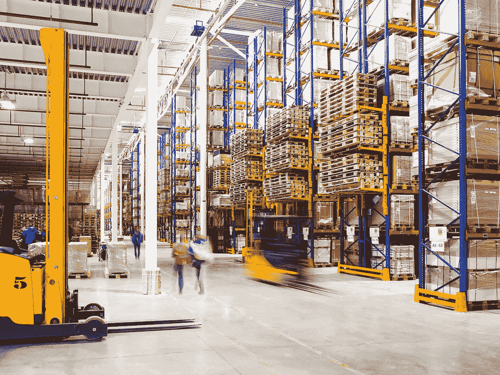

# 区块链技术即将颠覆意想不到的行业

> 原文：<https://medium.com/hackernoon/the-unexpected-industries-about-to-be-disrupted-by-blockchain-technology-b110edf8f918>

如果你认为 blockchai 技术只是用于加密货币，那你就错过了更大的机会。

早在 2014 年，当我联合创立我的区块链和物联网创新公司时，我们开始探索区块链理工大学的非金融用例。但即便如此，我知道这只是开始。当时，我们只是在寻找一种更有效的方法来注册对象、传感器和身份，以便验证和确认真实性。

今天，我和许多来自各种不同行业的人交谈和咨询。

## 在以下行业中有更多潜在的使用案例:

1.供应链

2.资产跟踪

3.贸易金融

4.数字版权

5.保险

6.公司档案数据库

7.个人身份

8.专利申请

9.法医证据

10.篮球运动衫

11.MLB 和其他主要体育联盟的血液样本

老实说，[这个清单还在继续。](https://bravenewcoin.com/news/moodys-new-report-identifies-25-top-blockchain-use-cases-from-a-list-of-120/)

许多创新者和科技企业家很快意识到，通过利用区块链，几乎每个行业都有巨大的再创造机会。事实上，它甚至已经开始[在娱乐界激起对话](https://www.inc.com/nicolas-cole/blockchain-technology-is-set-to-disrupt-every-indu.html)，寻求解决音乐中最突出的问题之一:未支付给艺术家的版税。

以下是一些已经被颠覆的行业:

# **1。供应链**

《财富》杂志称，IBM 和沃尔玛最近合作，通过“在区块链上数字化跟踪猪肉在中国的移动”来改善他们的供应链实践。

这里的目标是减少沙门氏菌爆发和致命的大肠杆菌菌株。

> 在自动区块链上跟踪此类信息的好处是，您可以更快地看到流程中的某些货物来自哪里，一旦被宣布为不安全，就立即停止运输。

这提高了供应商和消费者之间的透明度，这意味着这一过程不仅更安全、更有效，而且还带来了更高程度的信任。

# **2。机器对机器**

以太坊的区块链技术与众不同的一个特征是它能够执行所谓的智能合约。

这意味着双方可以创建一个协议，其中该协议的细节被自动执行。

例如， [slock.it](http://slock.it) 最近与能源公司 RWE 合作，解决目前电动汽车充电不方便的问题。通过利用以太坊的区块链，他们已经为某些汽车提供了自己的数字钱包，允许它们自动与自主充电站通信。通过这种方式，这种体验在很大程度上类似于常规燃料:智能合同只让你在使用充电站时付费，而不是租用一个小时。

[该公司避而不谈的未来例子](http://www.ibtimes.co.uk/rwe-slock-it-electric-cars-using-ethereum-wallets-can-recharge-by-induction-traffic-lights-1545220)是这样一个世界:你把车停在红灯前，嵌入道路的将是可以在柏油路上为汽车无线充电的技术。然后，汽车会通过以太坊钱包自动支付所使用的能量，当灯变绿时，你就可以上路了。

# **3。制造**

这是一个我已经奋斗了很长时间的行业，也是一个我目前正在努力独自颠覆的行业。

给你讲个故事。

早在 2014 年，我就开始认真研究传统的制造工艺——这实际上是出于我们在 Chronicled 从事的几个项目的需要。我开始了解 3D 打印和增材制造，从某种意义上说，我开始痴迷于我的一个朋友 Chris Prucha 在 [Origin Labs](http://www.origin.io/) 所做的工作(他们的口号是“制造不可能的东西，我告诉你，他们真的可以做到)。

快进到今天，我仍然痴迷于增材制造。目前，我正在为一家创新、环保、厉害但漂亮的剃须刀公司提供咨询，这家公司利用大规模 3D 打印技术，让 Dollar Shave Club 和 Harry's 等公司相形见绌。

## 只有一个问题。

没有多少人知道这些市场有多少繁文缛节。

大多数传统的原始设备制造商和零部件制造商只为少数几家公司所有——联合利华、宝洁、Edgewater Brands 等。这意味着，尽管我们不缺乏想法、设计或新的创新，但挑战在于消费产品的制造。

为新的剃刀刀片架设计制造工具的成本可能高达 100 万美元。此外，传统原始设备制造商要求最低生产量。

那么，如果你的客户不喜欢你的第一个设计会怎么样呢？

如果没有资金测试会怎么样？

如果你想每隔几个月就改变设计，以跟上年轻消费者期待的快速时尚周期，该怎么办？

在这里，颠覆的机会在于通过创建 3D 打印机的分散式[网络](https://hackernoon.com/tagged/network)来扩大增材制造的规模，这些 3D 打印机只为需求链服务——本质上是一群生产者响应客户的需求，产品由一群供应商集体生产。

更简单地说:与其试图拥有一条供应链，或者认为购买一条供应链就是答案，为什么不拥有一条需求链呢？

这正是我们要做的。

*本帖是讨论消费品、需求链、本地化生产和增材制造 x 区块链的系列文章的一部分。*