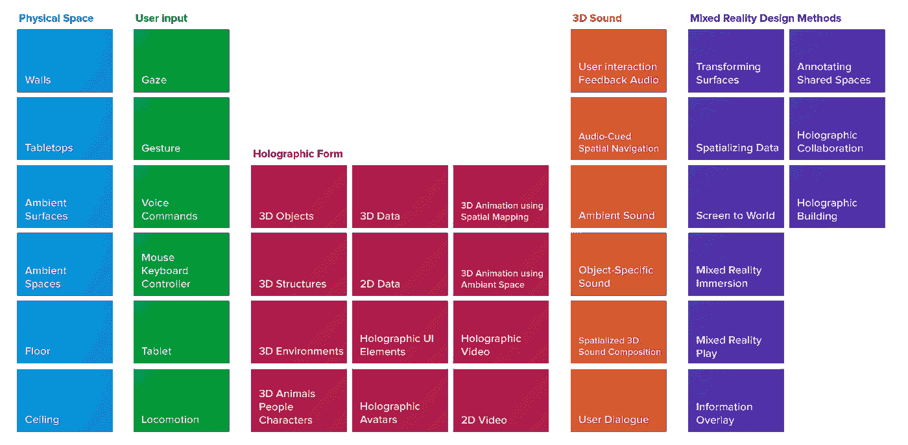
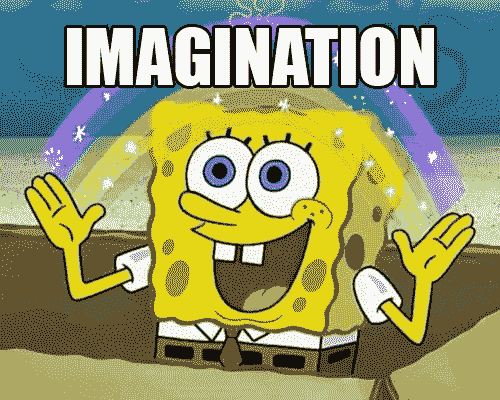
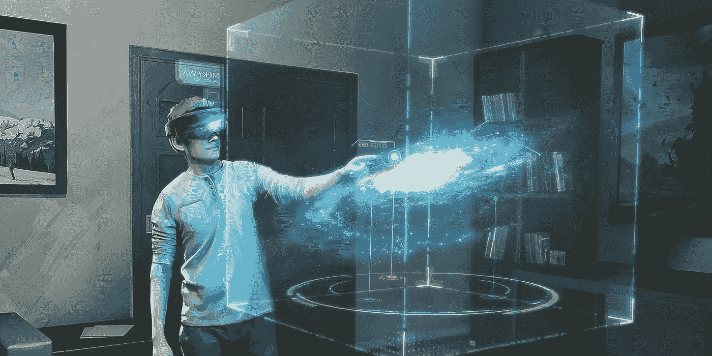

# 全息透镜和混合现实的 UX 工作流程

> 原文：<https://medium.com/hackernoon/the-ux-workflow-for-hololens-mixed-reality-3bf59192e577>

几天前，我和一位设计师朋友谈论我正在和一家公司完成的一个 HoloLens 项目。那是一段令人兴奋的时光，但我们聊得越多，他就越告诉我，即使他有机会与 HoloLens 合作，作为一名产品设计师，他也不知道从哪里开始。

嗯，一开始对我来说完全一样。机会是，我的第一个项目更多的是一个概念验证，所以犯一些错误并试图找出这样一个项目的好工作流程是可以的。

也许其他设计师和我们一样，试图找出他们应该/可以从哪里开始。在完成了第二个 HoloLens 项目后，我认为分享一下我目前在 holo lens/混合现实方面的 UX 工作流程，并对其进行改进，可能会有所帮助。

作为旁注，本文不是关于 holo lens UX/产品设计的最佳实践，也不是关于混合现实是下一件大事吗？。

## 愿景:定义你的目标

如果你有移动/网络产品设计经验，你可能已经听过类似的东西。定义项目的目标将帮助你更好地了解你应该做什么，以及如何根据具体情况做出妥协。HoloLens 不是一个神奇的设备，即使我不希望你这样，你可能会面临一些斗争。

但是更重要的是，有明确的目标会让你清楚地思考应该为你的项目使用什么样的平台/工具。

## **混合现实:HoloLens 是你项目的合适工具吗？**

我不能代表所有人，但我听到很多人谈论 HoloLens 作为一个平台。我不同意。好吧，作为个人观点，我倾向于把 HoloLens，甚至更多，混合现实，更多的看做一个工具而不是一个平台。

由此，我倾向于问这是你项目的正确工具吗？。

几个月前，我和一家初创公司合作。他们有机会在 HoloLens 上工作，并有一个非常具体的体验，他们想带给人们。但是我们谈得越多，就越觉得混合现实不是我们应该用于这种体验的工具，主要是因为它没有传达出虚拟现实可以带来的沉浸感[(但有一天，我相信混合现实会的)。](https://hackernoon.com/tagged/virtual-reality)

关于这一点，[有些人会比我更好地谈论这一点](http://blog.intrepid.io/understanding-virtual-experiences-the-differences-between-vr-mr-and-ar)，所以只是快速提醒一下什么是增强现实、虚拟现实和混合现实:

**AR:** 在没有物理交互的情况下，通过在实际现实或现实世界数据(如导航提示……)的直接视图上添加分层信息来增强现实，也就是谷歌眼镜、手机和 Pokemon Go 之类的东西。

**VR:** 取代现实，让用户沉浸在虚拟世界中。可以是固定的，也可以是房间尺度的，比如 HTC Vive 或者 Oculus Rift。

**MR:** 称之为 AR++。将数字渲染的交互式对象与真实环境相结合，可以将其视为真实工作的对应物。是 HoloLens 和即将到来的 [Magic Leap](https://www.magicleap.com/) 。

## **元素表:构成 HoloLens 体验的深度调色板**

如果你正在阅读这篇文章，你可能已经知道 HoloLens 的能力。至于我自己，当我第一次开始工作时，我确实知道一些事情，但是我不能找出所有可供我选择的方法。我在寻找一种带有设计模式的元素表。经过多次研究，我试图总结 HoloLens，但我发现来自[8/9](http://8ninths.com/hololens-design-patterns/)的人也在做类似的事情，他们在网上发布了一份设计研究文档，旨在作为打造第一代 HoloLens 体验的动态基础。

根据我从他们的研究中所了解到的，我真的邀请你去查阅他们的[作品](http://8ninths.com/)和博客。

我把混合现实设计方法添加到他们的元素表中。将此作为一个提醒，这样您就可以始终了解您和您的项目可用的选项板。最重要的是，与你的团队，尤其是你的开发人员分享你的想法是非常有用的。

Table of Elements for Mixed Reality

最重要的是，不要犹豫自己进行研究，看看别人在用 HoloLens 做什么。[微软 HoloLens Youtube 频道](https://www.youtube.com/channel/UCT2rZIAL-zNqeK1OmLLUa6g)、[全息图评论者](https://hologramreviewer.com/)和[下一个现实](http://next.reality.news/)是开始的好地方。

## 故事板:概念化并分享你对 3D 空间的想法

作为一名设计师，我相信你已经习惯了草图和线框。如果你已经执导过短片或 machinimas，你甚至可能习惯于故事板。

这将是你混合或虚拟现实项目的最佳工具。

当谈到故事板时，没有人会要求你成为最好的抽屉，但你应该学会如何在 2D 表面和一张纸上分享 3D 想法，区分什么是物理世界，什么是全息图，以及用户如何互动以获得良好的体验。

[故事板](http://www.wikihow.com/Create-a-Storyboard)通常是黑白的东西，用箭头来获得动作和运动感。但是当我们在处理数字材料时，你可以在上面使用颜色。根据我的经验，以下是我如何使用第一人称和第三人称视角绘制 HoloLens 体验的故事板:

*   **黑色&灰色阴影:**用于物质世界
*   **蓝色&绿色:**用来说明全息的东西
*   **橙色&黄色:**用于突出元素和运动
*   **紫色:**空间声音和音频线索

See? I am no Leonardo Da Vinci.

## **原型:尽快测试你的想法**

即使虚拟现实不是那么新，已经很难找到这方面的原型工具，所以你猜怎么着，为混合现实找到一个更难。我希望我们能对 AR/MR 有所了解，而且随着市场越来越大，这一天一定会到来。目前，我已经用过三种方法:

发挥你的想象力:是的，这听起来很傻，但确实有效。如果不容易接触到 HoloLens，对 3D 引擎一无所知，或者对胶水和纸不是很有效率，它仍然可以帮助你。对于我的第一个项目，我记得戴上眼镜，试图想象我将如何在全息图周围移动，以及我将如何与它互动。这种方法曾经奏效过。

**现实世界的纸作品:**如果你能记住全息图模仿现实世界的对应物，那么为什么不使用纸模型甚至玩具呢？我的第一个项目也是这样进行的，我用胶水和纸创作东西，然后用绳子把它们粘在天花板上。这样，我可以转过身去，得到幻觉(*大胆运用想象力*)。再说一次，它并不完美，但很有帮助。

用于 3D 世界的 3D 工具:如果你已经熟悉什么是顶点、边和多边形，那么这是一个很大的优势。如果没有，我们将在本文后面详细讨论。我一直认为设计师应该编码，但更多的是，设计师应该拥有与他们相关的每个领域的知识，这样他们就可以轻松地说话，理解不同领域的人。如果你要为 3D 体验制作原型，让我们使用 Cinema4D，3Ds Max 等 3D 软件来创建 3D 模型，即使你只使用图元，并在 Unity for HoloLens 中实现它们。微软做了一个很好的例子来提供这方面的教程:[微软 101](https://developer.microsoft.com/en-us/windows/holographic/holograms_101)

[GrayBoxVR](http://grayboxvr.com/) 是一个使用基本形状和高级 3D 模型快速构建和可视化 VR 场景的工具，它实际上与混合现实无关，但如果你想熟悉 3D 构建和 3D 原型的第一个简单路径，你应该尝试一下。

# **如何分享&向工程师和产品经理提供意见**

你可以假设为一个给定的项目创建 UX 和用户界面部分，一般来说，你不是一个人。你将与产品经理一起工作(嗯，也许现在不是，因为这是混合现实的真正开始)，最重要的是，与工程师一起工作。

我不得不承认，这部分一开始真的很难。当我还在琢磨[工作流程](https://hackernoon.com/tagged/workflow)的时候，我真的不知道我应该分享什么样的信息以及如何分享。什么类型的设计文件最适合展示&说明流程和行动。从现在开始，以下是我分享的内容和我的做法。

## **流程图**

还记得前面提到的元素表吗？现在将是使用它的最佳时机！

根据定义，流描述了运动。当我们在 UX 谈论流时，我们通常谈论用户将如何在系统中导航以执行任务和完成过程。由此，你可能已经熟悉了流程图的概念，它描绘了一个从屏幕 A 到 B 到 c 的路径的屏幕图表。

对于混合现实(以及虚拟现实)，你并不真的有一套屏幕，因为你进入了体验本身。那么你怎么能处理呢？通过合并您之前制作的故事板和目录。

通过相同的方式，移动的流程图说明了通过系统的路径，混合/虚拟现实的流程图将描述用户将被要求执行的每个动作的过程以及他如何能够与全息图交互。故事板已经解释了这个过程，现在，是时候用你正在使用的设计方法、用户输入、物理空间、全息形式和 cie 来完成它了……

举个例子:

I assume you will make your own look more… Professional?

## **概念艺术**

好吧，老实说，这部分没有必要，因为上面的故事板和流程图应该已经完成了工作。但这只有在你能做到的情况下才有用。我不确定是否会出现这种情况，但如果你的团队中有一些概念艺术家，或者你知道如何自己制作概念艺术，那将是一个很好的加分项。

概念艺术将有助于说明你的经验与明确的视觉效果和迹象的关键行动，帮助你沟通周围的情绪这个项目，并给你的团队灵感。实际上，我在为 Mixed Reality 做 UX 程序的时候还没有这样做，但是当我为 Virtual Reality 做游戏的时候，效果非常好，因为我的一个朋友给了我一些不可思议的资产。

它实际上是在从视频游戏行业的工作流程中汲取灵感。正因如此，当我到了该用概念艺术为全息透镜展示灵感的时候，微软的全息透镜 Galaxy Explorer 就是一个最好的例子:

## **UI & 3D 模型**

考虑这一部分作为奖金，因为对于这种项目，3D 艺术家将参与从一开始，他们应该是一个工作的大部分时间在这一部分。当然，你会生产 UI 的东西，但正如我们所说的 3D 体验，它的大部分将由一个 3D 艺术家抛光。

但正如我之前所说的，我真的认为设计师应该对流程的每个部分都有一定的了解，这样他/她就可以轻松地与所有人交流，也可以自己动手做一些事情。

3D 模型是由各种工具，工具，你可以购买或获得免费。你可以选择一个像 Cinema4D(我使用的那个)、3Ds Max(我使用的那个)和 Maya，它们都不是免费的。搅拌机是一个免费的 3D 软件，你可以开始。如果你正在使用 Windows 10，微软刚刚提供了一个非常有用的工具，叫做 [3D Builder](https://www.microsoft.com/en-us/store/p/3d-builder/9wzdncrfj3t6) ，它可以帮助你创建简单但有效的 3D 场景&模型，并让你了解 3D 建模的基本知识。

3D 模型由多边形组成。面是由 3 条边(最小)或更多条边组成的面。一条边由两个顶点组成，也就是与三个空间坐标相关联的点。

这是最基本的。如果你想更多地了解创建 3D 资产的过程，我向你推荐尼克·佩迪特写的这篇非常通俗易懂的文章:[游戏艺术的资产工作流程- 3D 建模](http://blog.teamtreehouse.com/asset-workflow-game-art-3d-modeling)

用于虚拟和混合现实的 3D 引擎可能在绘制和显示多少多边形方面预算有限，这就是为什么与 3D 艺术家合作永远是最好的。

# **结论**

从那里，产品和 UX 设计师，你应该为你的下一个 HoloLens 项目获得一个良好的起点！嗯，至少，我希望这篇文章能帮助你找到一个好的工作流程，正如我第一次开始使用混合现实时所希望的那样。

这一个可能不完美，但是到目前为止，这是我想出来的，并且在几个项目上尝试过，结果很好。正如我总结的那样:

*   目标和愿景
*   混合现实元素表(研究)
*   故事板
*   样机研究
*   流程图

*奖金(给你):*

*   概念艺术
*   用户界面和 3D 模型