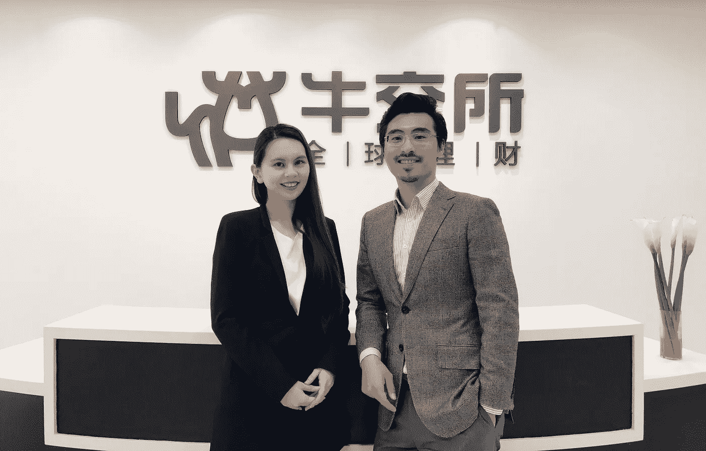

# 这家金融科技初创公司正在帮助中国人将资金转移到海外

> 原文：<https://medium.com/hackernoon/this-fintech-startup-is-helping-chinese-people-move-their-money-abroad-ec915bc9fca1>

*Photo credit:* [*f11photo / 123RF.*](https://jp.123rf.com/profile_f11photo)

每年，成千上万的中国学生离开他们的国家去国外学习。在海外，他们交学费、买书、去餐馆吃饭、付房租。所有这些都需要一个关键步骤:将人民币转移出中国。

“很多人都在做离岸金融规划，因为他们未来的负债将以美元、欧元或英镑计价，”金融科技公司(fin Tech)[初创公司](https://hackernoon.com/tagged/startup)、[索](https://www.fundusd.com/)的联合创始人韦伯·苏(Weber Su)告诉*亚洲科技*。他说，这不仅包括希望孩子出国留学的中国父母，还包括那些希望购买海外房产或“在五年内环游世界”的父母。

“我们通常瞄准这一群人，”他补充道。

> **自 2015 年中国人民币大幅贬值以来，已有约 1.2 万亿美元流出中国。**

这家总部位于北京的初创公司成立于去年初，它选择了一个糟糕的时机开始帮助中国投资者将资金转移到海外。据[彭博情报](https://www.bloomberg.com/news/articles/2017-01-13/what-s-causing-those-capital-outflows-from-china-quicktake-q-a)称，自 2015 年中国人民币大幅贬值以来，已有约 1.2 万亿美元流出中国。作为回应，中国政府收紧了资本控制，尤其是在过去一年，中国的年 GDP 增长率放缓至 7%以下。

对保险产品、并购以及[甚至比特币](https://www.bloomberg.com/news/articles/2017-01-06/bitcoin-buyers-eye-beijing-nervously-as-prices-slide-from-record)的限制都是政府打击资本外逃的一部分。例如，在中国每人每年有 5 万美元的外汇限额。

然而，这并没有阻止所的发展，它将中国散户投资者或个人与海外共同基金联系起来。通过该公司的应用程序，用户可以投资自己选择的海外基金，如贝莱德、摩根大通和富兰克林邓普顿。最低投资额为 400 美元。当然，上限是 5 万美元。

*Husband and wife co-founders of Niu Jiao Suo (left to right): Angeline Cai and Weber Su. Photo credit: Niu Jiao Suo.*

韦伯在解释中国资本管制的影响时表示:“这实际上给了我们更多的关注，因为突然之间，你就有了 5 万美元的额度，而且每年更新一次。”。“这只是向普通人传达了配额是有价值的。如果你不用它，它就过期了。”

此外，韦伯表示，对资本外流的限制正激励贝莱德(BlackRock)等知名海外基金考虑像所这样的小公司。“他们的目标是(中国投资公司)，”他表示，他指的是一只庞大的中国主权财富基金。“安全。大玩家。如果他们有时间，他们会去保险公司——那些公司可以开出很高的价格。”

“但由于外汇管制，即使他们获得了非常好的销售线索，也不会真的带来销售，”他解释道。

为了吸引资金，牛叫索将通过其应用程序进行的小额投资打包成一个更大的包。每天都有一次转移到资产管理公司。

> **我们不想为美国税务居民开立账户**

需要注意的是，公司本身并不管理任何资金。当用户给牛叫索的账户充值时，钱会被转到由星展银行管理的托管账户，星展银行是牛叫索的合作伙伴之一。当用户进行投资时，资金会相应转移。这家初创公司主要负责内部清算和结算工作，并对其用户——投资者——进行尽职调查。

“我们需要确保这个人[……]不是罪犯，”韦伯解释道。这家初创公司使用的是中国公安部的一个应用程序接口，可以输入中国的身份证号码并进行背景调查。

牛叫索还检查用户是否是美国公民或美国纳税居民。“我们不想为美国纳税居民开设账户，(因为)我们必须代表他们报税，”他表示。

麻烦的是，这家初创公司收取 1%的认购或赎回费，分别在投资者购买或出售股票时收取。从某些资产管理公司那里，所还可以从管理费中提成，用于支付基金经理的薪酬。

# 小心前方

索提出的将小额投资整合成一笔资金的概念并不新鲜。 [Acorns](https://www.acorns.com/) 是一家成立于 2012 年的美国公司，它让用户投资更少的钱——或者被称为“小额投资”——通过凑整费用，比如一杯咖啡，然后投资差额。

[去年推出的应用程序钱箱](https://moneyboxapp.com/)，是另一家小额投资创业公司。

一系列其他的中国创业公司，比如 Jimubox 和老虎经纪，迎合了那些想要投资海外股票和证券的中国散户投资者。

然而，随着中国官员继续打击资本外流，这些跨境投资创业公司可能开始感受到压力。

[席梦思&席梦思](http://www.simmons-simmons.com/)驻香港的贸易融资和金融科技合伙人 Jolyon Ellwood-Russell 告诉 *Tech in Asia* “从监管角度来看，对个人津贴的关注将变得越来越严格。

“所以，没错，这是一个好主意[……]但他们需要谨慎，吸取比特币、保险产品和银联限制等方面的教训，”他表示，他指的是所。“如果他们的产品被认为规避了资本管制，它将受到审查。”

对牛叫索而言，其业务仍处于早期阶段。它的应用程序于去年 7 月上线，目前拥有“数千名用户”，尽管这家初创公司拒绝透露确切数字。今年 3 月，索宣布获得由 Gobi Partners 领投的 500 万美元 A 轮融资，Gobi Partners 是一家专注于中国和东南亚科技初创公司的早期风险投资公司。

*原帖* [*亚洲科技*](https://www.techinasia.com/niu-jiao-suo-profile) *。*

> [黑客中午](http://bit.ly/Hackernoon)是黑客如何开始他们的下午。我们是 T21 家庭的一员。我们现在[接受投稿](http://bit.ly/hackernoonsubmission)并乐意[讨论广告&赞助](mailto:partners@amipublications.com)机会。
> 
> 如果你喜欢这个故事，我们推荐你阅读我们的[最新科技故事](http://bit.ly/hackernoonlatestt)和[趋势科技故事](https://hackernoon.com/trending)。直到下一次，不要把世界的现实想当然！

