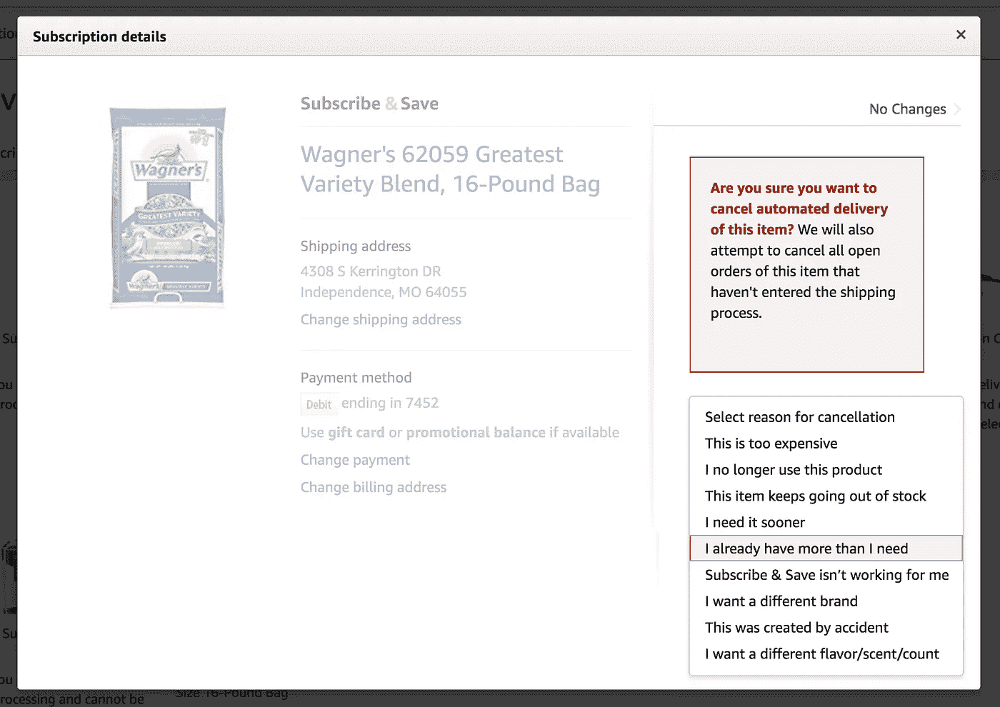

# 这个接口是给别人的

> 原文：<https://medium.com/hackernoon/this-interface-is-for-someone-else-2efd0725e394>

很多时候，我发现自己在使用一个软件时会想，“这不是为我设计的。”不是说我不是目标市场。从某种意义上说，创造它的人比我从这个过程中获取了更多的价值。

我给你举个例子。不是挑亚马逊的毛病…但他们是最顶尖的，所以这是必然的。(我只是确定贝佐斯今晚会哭着自己睡在一堆现金上。)

现在，钱就像水一样从我的手指间流过。因此，前几天晚上，在这些地区持续紧缩开支期间，我去取消了我的亚马逊产品订阅。

当你取消一个项目，你会得到这个确认。我被要求选择取消的原因，然后点击一个按钮。这是额外的一步。这有点烦人，但我可以自己为它做一个论证。在破坏性行为成为普遍和正当行为之前需要确认。

我的问题是我要从取消原因列表中选择。这是两个不同的项目。看看这个。

I was in fact subscribed to two different flavors of birdseed, don’t worry about it.

名单*随机化*。我一次取消了大约 15 个项目。所以每当我弹出这个列表时，我必须从头开始通读，找出我真正的原因。

现在，我知道他们为什么这么做了。众所周知，亚马逊的业务是由数据驱动的。这并不奇怪(从科学的角度来说也很聪明)，当收集他们的订阅流失数据时，他们想要控制给用户的选择顺序。但是对他们来说聪明和对他们的数据有益对我来说是糟糕的 UX。*但是这个界面不适合我。*

这不是一个黑暗的模式。他们的网站很容易使用，特别是考虑到亚马逊提供的令人眼花缭乱的功能和服务。你可以买鸟食，看电影，为你的网络创业提供数据安全，或者修理你的炉子……一切都在 Amazon.com。来吧，伙计们，让我们集中注意力。

我为他们很好地理解了这一切而鼓掌。但是这个购买过程和取消过程就相当于销售得到了红地毯待遇，而众所周知的便便三明治没有被保留。在这一点上，一切都是为了他们。

我不得不选择的第一对夫妇令人讨厌，然后它变得令人沮丧，到了最后几个项目，我真的只是打开它，选择一个随机的答案，并确认。当人们以面向任务的方式使用设计良好的界面时，他们倾向于建立动力。这是因为好的设计很像编程，因为你应该使用可重复的模式。所以随机选择一个我需要重复使用的菜单是非常讨厌的。

大警告:它甚至不是必需的。你可以留空，然后点击确认按钮！啊啊啊。直到我经历了这个过程(15 次)并取消了所有的项目，我才发现这一点。我只发现它是可选的，因为我是一个 UX 书呆子，我回去玩它，同时考虑这篇文章的前提:为不是用户的人的利益的接口。

也许我很笨。或者连同他们令人讨厌的随机菜单一起，他们的 web 表单中所需内容的启示是热垃圾。我设计这样的系统已经有 10 多年了。我用错了，很沮丧，给他们提供了不好的数据。(在这过程中，我多少有点建立了小小的怨恨。)非 technorati 的机会有多大？

我不是那种不提供至少一两个半生不熟的解决方案就抱怨的人。该怎么办呢？如何让这个界面更加贴近客户？

*   添加一些启示，使什么是必需的，什么是不明显的。
*   仅在会话之间进行随机化，而不是每次生成菜单时。让用户通过重复交互模式来取消多个项目。
*   继续随机选择你的菜单，但是允许批量取消项目。(如果你仔细听，你可以听到远处的一个算豆人对着他的拿铁怒目而视。)

这一切都是假设亚马逊*希望*这个界面更接近我/他们等式中的我这一边。他们很可能不会。这是他们底线的负面界面。高效完成它的人并不重要。因此，也许可以让它更难使用，看看他们是否可以提取一些有用的数据供保留部门分析。毕竟，这就是以商业为中心的设计的张力。你必须找到你和顾客之间的中间立场。你必须提供价值*和*提取它。

在这种情况下，他们索取的太多，提供的太少。紧张气氛消失了。这对我们俩都没用。我很沮丧，开始输入随机答案，只是为了继续下去，因为我可以告诉界面不适合我。

是给他们的。

Wade Meredith 自 2005 年以来一直从事设计、写作和编程工作。所有表达的观点都是他自己的，并不代表他的雇主、朋友、熟人或其他同事的观点。他的个人网站是[*WadeMeredith.com*](https://wademeredith.com)*。*

> [黑客中午](http://bit.ly/Hackernoon)是黑客如何开始他们的下午。我们是 [@AMI](http://bit.ly/atAMIatAMI) 家庭的一员。我们现在[接受投稿](http://bit.ly/hackernoonsubmission)，并乐意[讨论广告&赞助](mailto:partners@amipublications.com)机会。
> 
> 如果你喜欢这个故事，我们推荐你阅读我们的[最新科技故事](http://bit.ly/hackernoonlatestt)和[趋势科技故事](https://hackernoon.com/trending)。直到下一次，不要把世界的现实想当然！

