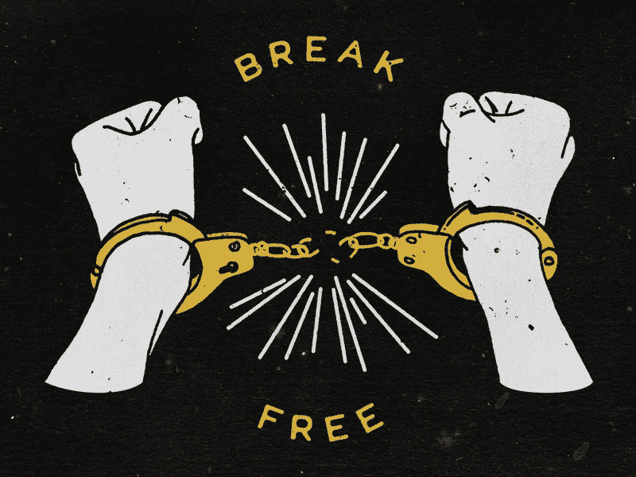

# 去大公司还是去小公司？这是个问题。

> 原文：<https://medium.com/hackernoon/to-big-company-or-to-small-company-that-is-the-question-5385d3ce38f9>

BeeHyve 社区的许多人都曾问过，在职业生涯的早期，他们应该如何看待在大公司(T2)还是小公司(T4)或初创公司(T5)工作。Aatish ( [Linkedin](https://www.linkedin.com/in/aatishnayak/) ， [Twitter](https://twitter.com/nayakkayak) )最近面临这个决定，并在下面亲切地分享了他的故事。我们希望这是一个有益的视角。

“大学毕业后干什么？”“在一家小公司工作”“哦，真的吗，那家公司体制好吗，工资高吗？”

亲戚、朋友和我的父母都问过我这些和类似的问题。对四年紧张的大学学习来说，财务稳定的前景是一个诱人的回报。这就是数百万移民来到美国并持续到今天的原因。他们都冒着巨大的风险，抛下家人，希望有一个更光明的未来。所以你为什么要与众不同呢？你可能会说“但这是不同的时代，我们有坚实的基础，因为我们父母的牺牲”。**我认为这正是我们拥有更大机会的原因。**

正如 GaryVee 在他著名的大学毕业生视频中所说，现在不是得到妈妈一直希望你得到的工作的时候。现在不是尽可能多赚钱的时候，这样你才能买到好东西。然而，现在是时候认识到你有五年的时间(22-27)来建立你一直想要的生活。

你永远不会完全确定事情会变得很好，但是你不应该混淆风险和不确定性。只带一个背包，没有计划地飞往泰国会带来很多不确定性，但这并不完全是冒险；无论如何，你都会在世界背包客之都度过一段美好的时光。因为大多数人害怕未知，所以他们错误地估计了机会。特别是在你职业生涯的早期，很少或没有长期承诺，你有非常高的风险承受能力。对一个 20 岁的人来说，从经济上和名誉上恢复要比一个 40 岁的有抵押贷款和家庭的人容易得多。不要让不确定性诱使你高估风险。

> “我想现在就做，以便以后再做”

对于许多从顶级院校毕业的新毕业生来说，下一步合乎逻辑的选择是大型科技公司、咨询公司和商学院。这些机会创造了可选性，因为广泛接触行业实践、专业网络和梦寐以求的技能。然而，随着接受期权变得越来越习惯，这种方法往往会适得其反。获得认可和拓宽你的安全网是一项永无止境的努力。在一家声望很高的公司，周围都是聪明人，这份高薪工作的舒适实在太让人难以割舍。当这种情况发生时，这些选项原本要实现的梦想就会慢慢退居幕后。相反，应届毕业生需要明白，仅仅是从顶尖大学毕业或获得顶级公司的聘用，就已经让他们成为人生彩票中的幸运儿；他们不再需要安全网了。

> 坐下，谦虚点。

我们可以整天谈论选择、选择权和高于平均水平的起薪，但最终手铐还是金子做的。我每天都意识到自己是多么幸运，能够上一所名牌大学，有机会在世界上最具创新性的公司工作。坐下来想一想，成千上万的人会为了你的位置而杀人。

选择是一种被极度低估的特权。由于经济、家庭或健康原因，许多人只是对薪水感到满意。去年，在我从帕洛阿尔托去旧金山的路上，我的出租车司机告诉我，成功是运气乘以努力，这是他一直铭记在心的认识。在土耳其，他是一名令人垂涎的货船船长，从那里移民后，他在美国开始了低收入出租车司机的生活。这些年来，他慢慢地买了越来越多的车，并用自己的积蓄建立了一家黑车公司。一天下午，他接了一位顾客，开始了一场活跃的谈话。客户非常喜欢他，于是聘请他为帕洛阿尔托一家小型初创公司的私人司机。如今，这位出租车司机是 Palantir 行政交通的唯一供应商，直到今天，他仍然是同一个客户兼首席执行官 Alex Karp 的朋友。在你的决定中表现出一些谦逊，并意识到你的成功不仅仅归功于你自己的努力。生活中的大多数事情很少像帮助他人成功那样令人满意。

最后，人们过度强调了第一份工作的重要性，尤其是在科技和硅谷，那里工程师的平均流动时间是 9 个月。在你 20 多岁剩下的 7-8 年里，这是一个相当小的时间跨度。即使是完美的工作也有起起落落，所以不要太努力去寻找最好的工作，祝你好运！

祝你好运！

阿提什

影响我决定的几段引言:

*   “我得到的最好的建议之一是，总有许多好的选择，然后你会选择一个，并致力于实现它。”—玛丽莎·梅耶
*   “如果我在 18 岁时坚持我最初的五年计划，我就会错过发生在我身上的每一件大事”——玛丽莎·梅耶
*   “大多数人都希望被接受，所以他们不会冒可能让他们看起来疯狂的风险——这实际上让他们错误地估计了风险。”—山姆·奥特曼
*   “如果你 22 岁从斯坦福大学毕业，被谷歌聘用，你将朝九晚五地工作。就努力程度而言，可能更像是 11 比 3。他们会给很多钱。很放松。但他们实际做的是付钱让你接受一个低得多的智力增长率。当你认识到智力是复合的，失去长期复合的代价是巨大的。他们没有给你一生中最好的机会。然后，可怕的事情可能会发生:有一天你可能会意识到你已经失去了竞争优势。你不会再是最好的了。你不会爱上新的东西。你所在的地方很舒适。你会变得自满并停滞不前。”—彼得·泰尔

有用的阅读材料:

*   [http://blog . samaltman . com/the-days is long-but-the-decades is short](http://blog.samaltman.com/the-days-are-long-but-the-decades-are-short)
*   [http://www . the crimson . com/article/2017/5/25/Desai-commencement-ed/# . wtg 41k _ m1zg . Twitter](http://www.thecrimson.com/article/2017/5/25/desai-commencement-ed/#.WTg41k_m1zg.twitter)
*   [https://www . ribbon farm . com/2017/02/28/a-brief-history-of-existential-terror/](https://www.ribbonfarm.com/2017/02/28/a-brief-history-of-existential-terror/)

我叫 Aatish Nayak ( [@nayakkayak](https://twitter.com/nayakkayak) ， [Aatish Nayak](https://medium.com/u/96e2b03774e1?source=post_page-----5385d3ce38f9--------------------------------) )我是卡内基梅隆大学 2017 届 ECE 毕业生，在洛杉矶一家名为 Skurt 的初创公司工作。我以前在大型科技公司实习，有机会回去。在 Linkedin 上找到我—[https://www.linkedin.com/in/aatishnayak/](https://www.linkedin.com/in/aatishnayak/)