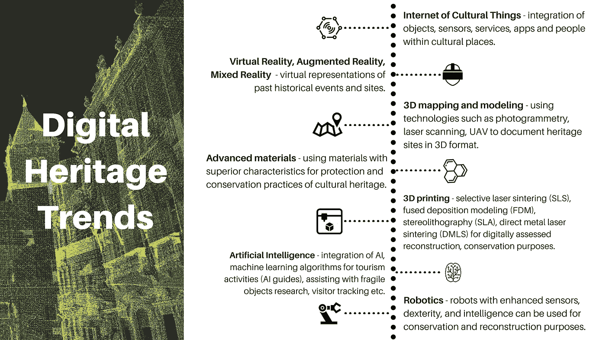
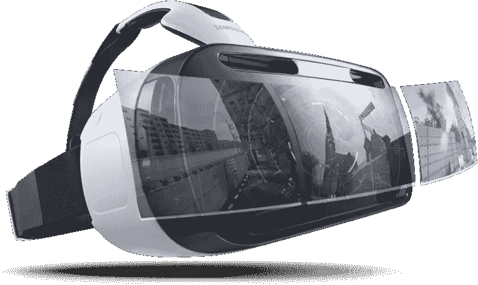

# 为了塑造未来，我们必须拯救过去

> 原文：<https://medium.com/hackernoon/to-shape-the-future-we-have-to-save-the-past-ac28c77cd2ff>

> *自动驾驶，人工智能，虚拟现实，或者物联网和古代历史有什么关系？*

从表面上看，第四次工业革命和文化遗产似乎不是两个自然重叠的领域。然而，仔细观察，这两者开始创造强大的纽带。塑造全球经济未来以及我们日常生活的技术也将对我们感知、理解和参与文化的方式产生巨大影响。

想象去一个历史悠久的地方旅行；你通常如何沉浸在历史和文化中？你可能会参观博物馆、展览、纪念碑、城市建筑，并品尝当地美食。现在想象一下这个地方，其文化相关的网站被包含在一个物联网网络中。想象一下，这个物联网网络有一个人工智能向导，他已经准备好了丰富的经验，可以创建一个旅程，并根据你的兴趣提供特定的信息。或者，在虚拟现实和增强现实的帮助下，你可以访问网站，并利用智能手机探索 20 年、50 年或 100 年前的地方，并发现该地区发生了哪些重要事件。

事实上，文化领域已经有了大量的技术。

— -

***自动驾驶和 3D 地图保存***

自动驾驶汽车需要详细的 3D 地图才能运行，这项技术现在正被用于数字化和绘制历史建筑。例如，CyArk 的目标是利用自动驾驶和地图技术，在世界各地的遗产遗址和整个城市因自然灾害、武装冲突和忽视而消失之前，对它们进行数字化保护。看看这张新奥尔良区的 3D 地图。

该公司还在 2009 年绘制了卡苏比(乌干达)皇家陵墓的地图，一年后大火摧毁了该遗址的许多建筑。

***人工智能使看不见的、看得见的***

计算机科学家布伦特·希尔斯开发了一种[机器学习算法](https://uknow.uky.edu/research/science-technology/uk-computer-science-professor-leading-major-breakthrough-reading-ancient),可以阅读以前难以辨认的古老、受损的卷轴。他还发现，利用新的医学技术，如断层扫描技术，可以在不损坏这些古代文献的情况下对它们进行数字化处理。

赫库兰尼姆(Herculaneum)是一座古罗马城镇，在公元 79 年被火山火山碎屑流摧毁，其遗址位于意大利坎帕尼亚省埃尔科拉诺公社。在这里，他们发现了一张纸莎草纸，上面有许多希腊哲学文献。由于火山爆发，成捆的卷轴被高温碳化，变成了紧密而易碎的块。用传统方法打开卷轴会损坏它，无法修复。但是由于 x 射线技术与人工智能算法的结合，这份文件可以被阅读和保存。

***增强现实展示历史现实***

[时间裂缝旅游](http://timerifttours.com/preview/new-home/)凭借其沉浸式 360 度虚拟现实技术，正在颠覆旅游业。由于城市景观的变化，更一般地说，随着时间的推移，很难想象柏林墙及其周围在 60 年代、70 年代和 80 年代的样子。使用虚拟现实技术，这些游览通过创建历史事件的沉浸式虚拟现实可视化来帮助游客可视化过去。

同样， [ZeitFenster](http://www.zeitfenster-app.de/) 是一家“时间机器”，以体验为导向的增强现实初创公司，致力于以互动的方式教育人们了解具有历史意义的地方。它们还旨在提高社区对城市发展问题的参与。他们的应用程序利用你的智能手机的摄像头，在屏幕上叠加一幅图像，以便你比较与特定地点相关的历史时刻。

***文化物联网***

物联网现在是一个热门话题，正在被用于从智能住房到农业和能源的一系列领域:引入文化物联网(IoCT)，这是一种通过集成文化场所内的对象、传感器、服务和应用程序来应用于文化遗产的物联网范式。IoCT 的应用不仅可以实现游客跟踪、文化遗址的物理条件，还可以实现物与人之间的连接以及人与人之间的连接，以共享知识——这是一个提高公众参与度和积极性的绝佳机会。

— —

技术在文化领域的潜在应用是巨大的，但我们必须记住，由于全球公民、多元文化以及大城市的标准化，我们看待文化和现实的方式也面临着许多挑战。全球化迫使各国通过开发其遗产和自然资源在新的全球经济中竞争，新的规范是通过大众旅游积极消费和货币化传统——想想信息亭、互动标牌、历史重演、重建建筑和虚拟现实指南。

人们往往无法洞察一个地方的道德或伦理问题、社会公正和可持续性。但是，如果负责任地使用技术，它可以成为将大规模遗产消费转化为可持续旅游的有力工具。由于最近的发展，技术将在帮助沟通复杂的解释，揭示难以接近的事实，故事和记忆方面提供巨大的帮助，并最终为所有人创造一个可持续的遗产过程。

那么在这个领域成功的关键是什么呢？开发具有强大基础设施的技术，支持并认识到人类和文化多样性的复杂性。

***作者:*** *全球开发经理叶夫根尼娅·帕诺娃，CG*

*We are 是一个全球创新生态系统，充当高科技初创公司和决心塑造工业 4.0 未来的企业之间的战略纽带。*