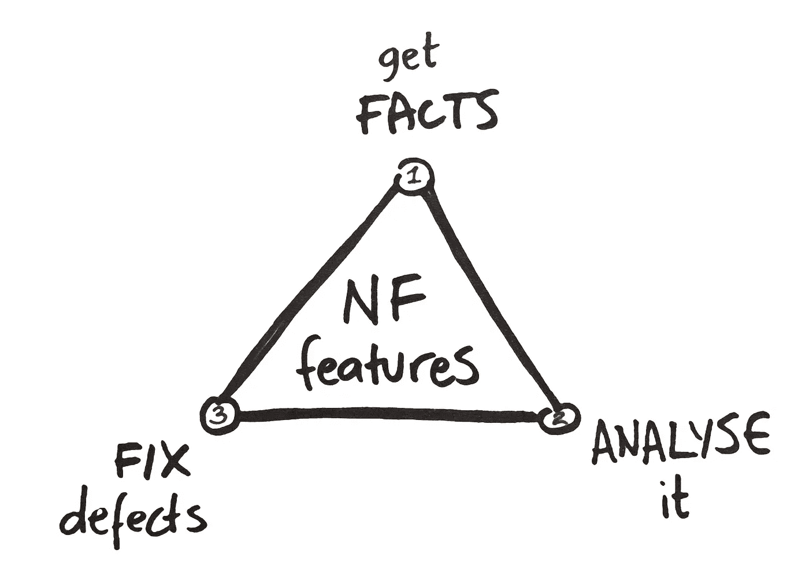

# 十大性能优化

> 原文：<https://medium.com/hackernoon/top-10-performance-optimisations-18cdad54155c>

2015 年，我花了相当多的时间试图提高网络规模数字服务的性能。当然不仅仅是我，我和团队一起在 Kainos 为英国公民提供新的数字服务。

那么我学到了什么？

## 优化被低估了

性能优化经常被低估。对于一些软件项目来说，性能是一个需要在第一个产品发布前的第 11 个小时打上勾的方框。对于一些人来说，使用 Acme Corporation 的工具 X 进行性能测试是最重要的。其他人成功地进行了测试和优化，但当真正的用户开始使用时，生产服务仍然会失败。当然还有那些根本不费事的。

那么让我们明确一点:**性能优化比一个服务的所有特性加起来更重要**(提示:如果用户运行缓慢或没有反应，他们不会使用你的特性)。这是一个不同的视角，将挑战你如何处理性能。

## 优化而非测试

我说“性能优化”是因为许多人将其简化为性能测试。这意味着雇佣一个知道谁使用 Acme 公司的 tool X 的性能测试人员，但是测试(和工具)只是性能优化的一小部分。不要仅仅因为你做了性能测试或者你选择了一个行业领先的工具，就被错误的安全感所迷惑。确保您正在分析结果和修复服务——我说的服务是指应用程序和基础架构——并重复。并再次重复(提示:如果您不断添加功能，您将无法停止性能优化)。

## 性能作为一项功能

将性能视为一种特性，而不是一些非功能性的技术债务来进行风险管理是有帮助的。一旦性能成为一个特性，那么就很难降低优先级。你可以通过多种方式做到这一点，但其中一种方式是让性能成为你的用户故事的验收标准的一部分。这样，只有通过团队的故意疏忽，它才是可以避免的。

为了让你的产品所有者做到这一点，你不能把性能优化留到最后。您也不能将提供代表性性能测试的技术环境留到最后。您需要尽早做好性能优化的准备。拥有一个特性应该意味着拥有一个性能优化的特性。那么什么时候为时过早呢？我建议当你得到用户需求并选择建立一个生产服务时——这与英国数字公司的[测试阶段](https://www.gov.uk/service-manual/phases/beta.html)的开始是一致的。

## 当心 NFR 陷阱

有些人获得了性能优化。他们测试、分析并解决问题。但是当真正的用户开始使用他们的服务时，他们会遇到性能问题。不幸的是，这些人经常陷入 NFR 陷阱。NFR——非功能性需求——没有描述真实用户对服务的真实使用水平。相反，非常复杂、难以理解和详细的需求是由一个聪明的软件架构师构建的，他不了解用户需求或用户上下文。

挑战你的表现吧，NFR。如果你不满意，撕掉它们，写下新的绩效目标。问自己一些问题，

*   它们易懂吗？
*   它们是否涵盖了所有用户角色的基本需求？
*   它们包括历史使用中的峰值吗？
*   它们考虑到并发用户的最坏情况了吗？
*   它们考虑到并发事务的最坏情况了吗？
*   它们是否涵盖了未知的未来峰值(提示:过去的表现并不能保证未来的结果)。将延伸目标定义为绩效指标的一部分。
*   它们覆盖无带宽或低带宽用户吗？
*   它们包括用户将采用的设备类型吗？
*   它们是否涵盖了所有同时登录的用户(提示:有时会出现问题，您的服务会中断。当这种情况发生时，每个人都试图同时进行身份验证)？

如果您无法就性能目标达成一致，那么另一种方法是向产品所有者提供使用该功能时可用容量的量化数据。这可以通过使用完整数据集在类似生产的环境中进行压力测试来实现。这允许产品所有者或高级经理评估性能风险。

## 尽早并经常发布

有经验的人担心新上线的服务会有性能问题；它真的可以扼杀一次发射。为了建立这种信心，准备好向整个项目团队公布你的绩效结果。要做到这一点，你需要让它易懂(所以典型的 NFR 不会削减它)。考虑总结性能目标，这些目标可以展示性能优化的进展，以及在当前状态下接受该特性的风险。

## 测试驱动的基础设施

所以你听说过 TDD——测试驱动开发。测试驱动的*基础设施*为基础设施构建带来了与 TDD 为应用程序所做的相同的面向结果的方法。

即使开发团队是敏捷的，基础设施通常也是使用瀑布过程构建的。这有一个缺点，就是让结果出现在最后，这是基于架构师的智慧。考虑到生产环境往往是在项目生命周期的后期进行配置，这加剧了性能风险。

取而代之的是将敏捷的好处带给你的基础设施。测试驱动，特别是性能测试，导致性能优化和工作基础设施。从基础设施测试(性能、故障、安全性)开始，意味着您的基础设施设计在开发过程中得到验证。可以在以后的迭代中进行扩展，并进一步测试以找到工作负载的最佳点。

那么，在早期测试时，您将如何分析您的生产基础设施呢？您昂贵的性能测试工具对此帮助不大。相反，采用 DevOps 原则来提出所有传统的运营监控功能(提示:通常只有在上线后才需要这些功能，所以不要等到最后才构建)。这样，您可以在开发过程中测试和优化您的监控。开发和运营一起！

## 不可修复的性能缺陷

为无法修复的性能缺陷做好准备。你需要根据你服务的风险做出大胆的决定。

即使你有能力修复自己的代码，这种情况也比你想象的要多。例如，如果您选择了商业产品来包含在您的服务中，您就已经暴露在这种风险中了。您将无法控制问题的解决，而是依赖于供应商。

因此，在选择产品时，你需要在 *购买*之前*获得保证，即有真实案例研究或实验室测试结果证明它能够满足你的性能目标。如果你的项目无论如何都要购买，那么你就依赖于供应商，除非你设计出一条出路。这显然是最后的手段，但是如果风险太大，那么你可能需要保护你的服务的用户。*

## 所有的数据

数据仍然是最难达成一致的因素之一，尤其是考虑到信息安全和隐私的政府服务。信息安全保管人可能会通知您，出于某些原因，您不得将真实数据用于非生产用途。这通常会导致没有完整的真实数据用于功能和性能测试。

然而，很明显，没有完整的数据集，你*无法*进行性能测试。考虑到实际的真实数据可能很重要，使用合成的全尺寸数据集进行功能和性能测试也存在风险(提示:数据比代码更重要，投入更多时间来获得正确的数据)。

因此，要清楚地表明性能测试需要全尺寸的真实数据。如果有必要，把它交给高级管理人员。作为使用协议的一部分，可能有必要对个人身份信息进行伪匿名，但这是值得的。

嘿，那么你在开头提到的 10 大优化是什么呢…

## 10 件事

总之，我建议你遵循 10 件事来帮助降低性能风险。

1.  尽早建立生产。早在测试开始时。这将允许您在开发时在生产规模的环境中进行测试。
2.  不要依赖非功能性需求。根据容量和并发性定义易于遵循的目标。然后定义拉伸目标。然后定义过度拉伸目标。
3.  如果您的目标不确定，请关注压力测试，而不是负载测试，这样您的生产环境就可以根据它所能承受的容量向您的产品所有者进行描述。
4.  在生产之前编写性能测试脚本。这有助于从一开始就灵活地设计预期数据，以便它们可以使用实时数据和测试数据运行。
5.  在构建产品时对其进行测试。这确保了它是针对您的目标进行测试和优化的。
6.  敞开心扉。向高级管理层和项目团队的其他成员公布您的绩效结果。注意调整你的结果来代表你的目标和延伸目标。
7.  在构建产品的开始阶段构建对基础设施和应用程序的深度监控，并在性能测试期间对其进行调优。
8.  始终使用完整大小的数据集进行性能测试。
9.  为无法修复的性能缺陷做好准备。选择商业或开源产品时要向前看，并提前要求测试结果。
10.  圣杯是性能测试是连续的，是你的部署管道的一部分。至少每个 sprint 都应该进行性能测试。

> [黑客中午](http://bit.ly/Hackernoon)是黑客如何开始他们的下午。我们是 [@AMI](http://bit.ly/atAMIatAMI) 家庭的一员。我们现在[接受投稿](http://bit.ly/hackernoonsubmission)，并乐意[讨论广告&赞助](mailto:partners@amipublications.com)机会。
> 
> 如果你喜欢这个故事，我们推荐你阅读我们的[最新科技故事](http://bit.ly/hackernoonlatestt)和[趋势科技故事](https://hackernoon.com/trending)。直到下一次，不要把世界的现实想当然！

