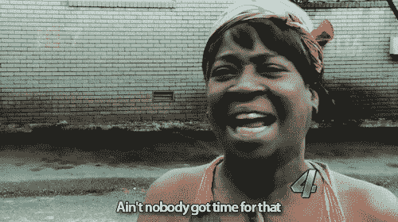
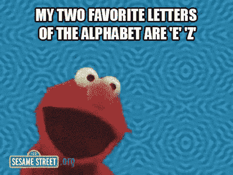
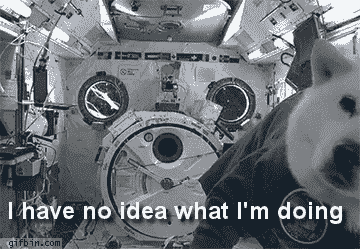

# 经理在一对一会议中问的十大问题

> 原文：<https://medium.com/hackernoon/top-10-questions-managers-are-asking-during-1-1-meetings-c2c9ee8ad201>

## 他们回避的第一个问题

我喜欢一对一的会议。这是一个交换反馈并确保我们公司正常运转的机会。这也是我们创建 [**SoapBox bot 的原因之一——一个帮助人们进行高效的一对一和团队会议的 bot。**](http://soapboxhq.com/goodtalk) 反响热烈:来自世界上超过 500 家最好的公司的经理们 *(Adobe、Intercom、Wayfair 等)* 正在他们的团队中使用它。

人们最喜欢的一个功能是我们的问题建议器——如果他们在议程中遇到一些问题，我们会建议他们可以用来开始富有成效的谈话的问题。

我想知道哪些问题最常被使用，所以我挖掘了数据*(我可以看到他们选择的建议问题，而不是输入的问题！).*话不多说，下面是**由现实生活中的经理判断的在现实生活中 1:1**被问到的十大问题！

# **#1。你每周最大的时间浪费是什么？**

人们在工作中浪费大量时间并不奇怪……不仅 89%的人公开承认浪费了一些时间，而且看似富有成效的“工作”任务实际上也浪费了大量时间。[比如说](https://www.atlassian.com/time-wasting-at-work-infographic)，你的员工浪费了:

*   每天 2 小时从琐碎的干扰/分心中恢复过来。
*   每天有 1.55 个小时在无成效的会议中
*   1250 美元的薪水用于管理垃圾邮件，1800 美元用于不必要的电子邮件，4100 美元用于糟糕的通信。

# **#2。作为一个团队，我们应该开始做些什么吗？**

HBS 大学教授、《飞无网》的作者托马斯·j·德隆说，有效反馈的最佳问题是:[我应该开始做什么，我应该停止做什么，我应该继续做什么。](https://hbr.org/2011/08/three-questions-for-effective-feedback)

根据我的经验，像这样的直接反馈对员工来说很难与他们的经理分享，所以我们调整了这个问题，将“作为一个团队”包括在内，使它变得更加平易近人。

# **#3。你希望我对你的工作给予更多或更少的指导吗？**

没有人想成为一个微观经理，但是员工通常不愿意告诉他们的经理少管一点。这个问题让员工有机会向他们的经理提供诚实和建设性的反馈，而不用担心伤害感情。

# **#4。你觉得你的工作得到了足够的反馈吗？如果不是，您希望从哪里获得更多反馈？**

我从惨痛的教训中学到，你反馈的时机和反馈本身一样重要。在发布日给出全面的反馈是没有意义的——除非是关于打字错误。在一对一的过程中进行这样的对话可以确保在正确的阶段给出反馈。

在 SoapBox，我使用的是我们的朋友[的](http://shopify.com) [Robleh Jama](https://twitter.com/robjama) 购买的 99/50/1 框架(frm ly。TinyHearts 的创始人)写道。

# **#5。作为一名经理，我能做些什么来让你的工作更轻松？**

和许多创始人一样，我也是无知冰山的受害者。根据这一理论，96%的问题是高层管理者所不知道的——他们知道的问题可能不是应该关注的问题。这个简单的问题让员工有机会让他们的经理少 1%的无知。把它想象成管理的改善方法！更多信息，请点击。

# **#6。在你的工作中，有什么方面你需要更多的帮助或指导吗？**

良好的工作关系是经理帮助员工变得更好，员工帮助经理变得更好。在某种程度上，我认为这个问题是要求员工帮助指导经理——一种“帮我也帮你”的情况。

不觉得这是个要问的关键问题吗？考虑一下这个:[谷歌对 it 经理做了一项多年的双盲研究。](https://hbr.org/2013/12/how-google-sold-its-engineers-on-management)他们发现，将高绩效经理与低绩效经理区分开来的最重要的能力是指导。

# **#7。你觉得你得到了足够的反馈吗？**

非常类似于#4。一般来说，我不建议问这样的是/否问题——除非你已经和员工建立了良好的关系。你需要迅速决定在哪里进行这次谈话。

我发现很有成效的一个后续问题是，“什么类型的反馈最有价值/你错过了什么？”

# **#8。我们如何改进我们团队的合作方式？**

大多数经理表示，这份工作最难的部分是“人的问题”。人们很复杂，所以很难找到这些问题的根源，但有一点是肯定的，如果你让员工参与到对话中，你就有更大的机会解决这些问题。

为你和你的员工提供公开讨论如何更好地合作的空间，可以帮助你发现问题，但请记住——最难讨论的问题可能是关于你自己的，所以要非常专心！

# **#9。从 1 到 10 分，你在工作中有多开心？**

我很高兴这个进入了前 10 名。我很喜欢这个问题，不是因为这个问题本身，而是因为它能引出后续问题。

假设员工回答“嗯……我觉得是 7 分”。你的后续问题是，“我们如何让你达到 8 分？”。这并不是神奇地把他们变成 10 分，而是你可以帮助他们克服他们遇到的小事情。

# **#10。就我们的战略和目标而言，你最不清楚的是什么？**

下面是来自 2013 年的不幸消息:研究人员要求 20 家公司的员工(已经明确表达了公共战略)从 6 个选项中选择战略。只有 29%的人选择了正确的选项。

我敢打赌，你的公司没有一个“清晰的公共战略。”事实上，我敢打赌，它既没有明确阐述*也没有*公开。所以，我不想打断你，但是你团队中至少 70%的人不知道你或公司在努力做什么。

这是一个需要提前解决的重要问题。我要求你们在本季度的每一次一对一谈话中谈论你们的目标和战略——每个人都会因此而变得更好。

# 唷，好了。

现在你知道了。这些是由现实生活中的经理们在与他们的员工的现实生活中选出的十大精选问题。这是他们、以及希望你这个经理、想知道的。

但是，他们不想知道什么？

# 一对一谈话中最容易回避的问题:

## “你想进一步了解公司的哪个领域？”

对此有多种解读方式。经理们是否因为这不是一个问题而避免问这个问题？经理们会保护这些信息吗？他们担心自己不知道答案吗？这难道不能帮助两个人实现他们的近期目标吗？

你坚持到了最后！我很好奇你:一对一你爱/讨厌聊什么？你最喜欢的关键问题是什么？下面让我知道。

感谢阅读，
布伦南

附注:你应该至少每月与你的主管进行一次这样的对话。**如果你的谈话陈旧、不一致或无组织，你现在应该尝试一下** [**街头表演团队**](http://soapboxhq.com) **。**

## 布伦南是加拿大排名第一的工作场所 [SoapBox](http://soapboxhq.com) 的首席执行官兼联合创始人。他们的应用程序[soap box for Enterprise](https://soapboxhq.com/how-it-works/)&[soap box for Teams](https://soapboxhq.com/goodtalk/)，是关于你应该与你的员工进行的对话...但目前还没有。

如果你喜欢这篇文章，请推荐一下，帮助别人找到！👇 💚