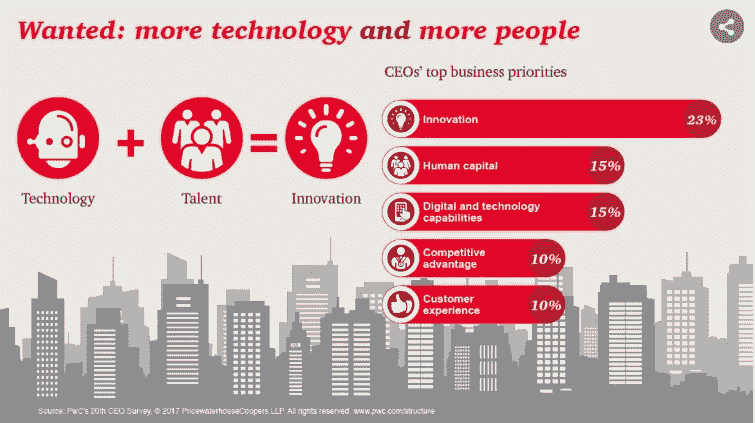

# 转型不是“我也是”的策略

> 原文：<https://medium.com/hackernoon/transformation-is-not-a-me-too-strategy-fd0f2afab365>

Images by Pixabay.com

*金融服务行业的商业领袖终于认识到，他们如何使用技术和数据对他们的业务成功至关重要。*

出于多种原因，金融服务一直难以采用转型技术。与首席技术官或首席信息官交谈时，普遍的讨论集中在几个关键主题上，“我如何继续降低成本？”以及“我如何创新？”。这些是相互竞争的议程，在许多情况下，两者兼顾的平衡行为不起作用。最终结果是很少实现真正的转型业务能力。使用工具总是有正确的方式和错误的方式，许多公司轻率地使用新技术，缺乏对最终状态如何加速业务增长的真正愿景。以下是两种技术的组合，它们具有变革性的影响，尚未被金融服务公司充分利用。

## 云

乍一看，将您的计算环境迁移到云听起来很有吸引力。由于共享的规模经济，您可以付费使用，并以较低的成本获得优质的服务。此外，您还可以利用旨在加速开发的工具和服务生态系统。现实情况是，遗留系统对项目执行有巨大的拖累，因为云中的完整应用程序管理和部署与独立服务器上的非常不同。在许多情况下，为了获得云环境的全部优势，您需要重新架构您的系统和操作流程。

一位前同事受命展示他们为一家大型银行创建全弹性计算环境的“登月计划”。他的提议是——“你可以将所有应用程序迁移到云中，只使用你需要的计算能力，并且只为你使用的东西付费。最重要的是，您的开发和部署生命周期将几乎是即时的，因为“自动化”将完全可用。银行的高层领导喜欢一次性解决所有这些棘手的运营和成本问题的想法，并资助了提升和转移计划。两年后，所有相关人员要么被解雇，要么被调到其他工作岗位，整个“云”项目陷入困境，资金匮乏，备受指责。未能为新应用构建并行 devops 功能和微服务架构，导致环境变得过于复杂和昂贵。

被迫迁移到云环境通常是由“我也是”方法驱动的。当一家公司确信其竞争对手在做一些不同的事情时，他们通常会效仿。正如上面的案例[所示，简单地将您的环境提升并转移到](https://www.infoworld.com/article/2917910/cloud-computing/fix-your-applications-before-migrating-them-to-the-cloud.html)云并不能解决您在应用程序开发和部署方面的根本问题。它只是将您的转型目标推得更远，因为您团队的大部分成员都专注于迁移，而不是新的架构。

许多公司没有认识到，除非同时采用全面的 devops 计划和架构变更，否则简单地迁移到云并不能加速软件开发生命周期。没有多少公司能够同时做到这两点，因为他们的大部分资源都集中在管理现有环境上。

[从戏剧性的失败中吸取的教训](http://www.zdnet.com/article/five-major-pitfalls-to-avoid-in-a-cloud-migration/)应该让人们暂停简单地提升和转移到弹性计算环境更便宜、更容易的想法。[技术](https://hackernoon.com/tagged/technology)转型只能通过全面的架构和技术路线图来实现。

# RPI / RPA

RPI 或 RPA 是流程自动化的热门新术语，它实际上应用了人工智能或机器学习工具，用于从大量数据中提取洞察力。无处不在的数据和移动解决方案正在推动公司应用自动化和机器学习来增强其产品和服务。

以节约成本和提高效率的形式，在线驱动客户给金融服务机构带来了巨大的好处。出现的困境是，这些客户保持距离，与他们建立个人关系更加困难。智能代理“机器人顾问”的使用已经在一些市场进行了测试，并取得了不同程度的成功。银行的发展方向是利用人工智能和可用数据来定制提供给客户的产品和服务。

银行无法使用亚马逊、脸书或谷歌的数据方法与客户互动。遗留的银行系统是阻碍这些公司创新的一条绳索。SOA 架构使得像亚马逊这样的公司变得灵活敏捷。金融科技公司在建立客户群方面势头强劲，尤其是在年轻人当中。许多新进入者来自创造了亚马逊、谷歌和脸书的创新中心。

我们现在用“谷歌 it”这个术语来描述我们如何在网上查找信息。我们开始相信亚马逊会在结账时声明的准确时间内给我们送货。我们已经开始“信任”这些公司的服务，因为他们已经向我们证明了他们是可靠的、增值的和方便的。

正如我在[之前的帖子](https://hackernoon.com/the-greatest-banking-high-tech-evolution-or-revolution-9d2c8089543f)中所说，信任问题让金融科技公司没有侵蚀银行对客户关系的掌控。随着公司展示他们的能力，随着客户开始更加信任这些关系，我们将看到快速的变化。Venmo、Apple pay、谷歌钱包等产品将会侵入银行目前享有的传统关系。一旦这些关系发生转变，投资[管理](https://hackernoon.com/tagged/management)，借贷和其他关系也会随之而来。

未来的银行业军备竞赛与技术无关，它已经存在，但随着时间的推移，当组织证明自己有能力为客户提供价值和便利时，信任就会嵌入到建立的关系中。肉豆蔻、Acorn、lending club 只是少数渴望拥有这种信任的公司，它们的优势是在一个发展速度越来越快的行业中反应敏捷。问题仍然是:谁将是这场竞赛的赢家和输家？

## 最后:

普华永道全球金融服务调查的一些发现显示，首席执行官们越来越依赖于数据、分析和技术来为要求更高的客户群提供价值。除非银行加大对技术和创新的投资，否则它们会将业务拱手让给不受传统系统和方法约束的金融科技公司。

技术转型是一个术语，通常用来描述公司提高竞争力和减少对遗留系统依赖的战略。不幸的是，在许多情况下，转型的真正价值在关注降低成本和提高效率时被忽略了。虽然更新公司系统的价值不会降低，但这应该是一个持续的过程，真正的转型关注的是业务将如何改变，以通过使用技术作为执行业务战略的工具来获得市场份额、增加收入甚至占领新市场。

*感谢阅读*

最诚挚的问候:**诺曼·金**

*如果你喜欢这篇文章，请点击“喜欢”按钮；发表评论或与您的网络分享。另外，请查看我在 Linkedin 上的其他帖子* [***这里***](http://www.linkedin.com/in/normanmking) ***，*** *也在 Medium 上* [***这里***](/@normanking) *。邮箱:*[***normanking@brook-port.com***](http://normanking@brook-port.com)*。可用于咨询、顾问和演讲活动*