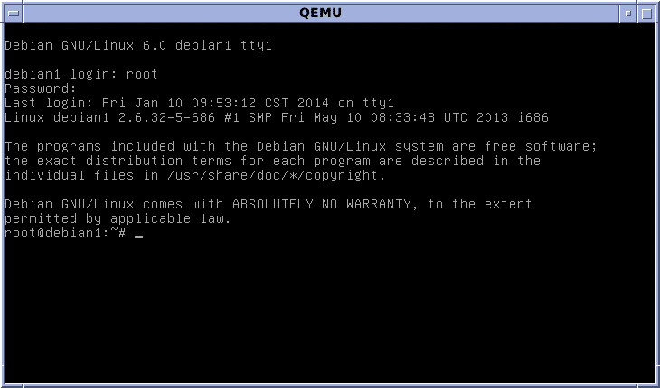

# 将 Unix 理念转化为现代环境

> 原文：<https://medium.com/hackernoon/translating-unix-philosophy-into-modern-environments-80d7949834f3>



简单来说，*Unix 风格*是一套工具，将小单元组合成复杂的操作。从这个意义上说，它很像函数式编程，但是生活在应用中而不是理论中。这个时代最值得注意的两个操作是操作符的配置和连接。

举个例子，一个程序寻找有制表符而不是空格的源文件

```
find . -name test.py -print -exec cat {} \; | egrep './|\t'
```

这种构造基本上是多余的，但关键是开发人员有很多选择，既可以配置现有的操作符，也可以根据需要加入新的操作符。在这里的一行中，有一个目录搜索、一个参数替换、函数连接和通过正则表达式的搜索。这种代码通常需要大约 10 行程序。这听起来可能没那么糟糕，但是如果考虑到一个 Unix 用户一天可能会编写数千个这样的短程序，那么使用 shell 会变得更加愉快。

*另一方面，函数式风格*在可组合性方面更加丰富，但是完全缺少配置部分(所有命名的操作符只允许一种狭义的含义)。现代环境通常可以访问 Unix 工具集，但是选择不使用它。这是为什么呢？

在应用程序中不使用 Unix 的第一个原因是安全性。对终端的控制通常是如此强大，以至于任何级别调用 *exec* 调用的应用都被认为是低级趣味。Unix 是为系统管理员设计的，当然不是 web 应用。

第二，Unix 的学习曲线很高。所有的命令和选项都是晦涩难懂的，而且通常是反直觉的。如果运营商之间有一个共同点，那就是对*阅读手册页*的简单回应。

第三也是最后一点，Unix 不太容易组合。Unix 只允许文本到文本的合成。由于这种有意的限制，复杂的数据结构必须简化为 JSON 等。或者陷入应用程序逻辑的泥潭。应用程序变成整体是有原因的，通常不是因为“性能原因”。

那么，前进的道路是什么？

首先，让我们坚持以前的标准。让我们打造一个更好的 *sh* 。从今天的角度来看，那会是什么样子呢？

如果 Unix 风格不是前进的方向，那么什么才是呢？如果我们着眼于学术理论，那么我们可能想要尝试泛函。Haskell 或者 ML 怎么样？

因为我对 ML 分支稍微熟悉一些，所以让我们试试。OCaml 包含一个 REPL，所以如果您想继续学习，可以从在 shell 中安装并运行 *ocaml* 开始。

数据类型？检查。

```
# type 'a btree = BTree of 'a btree * 'a * 'a btree | Empty;;type 'a btree = BTree of 'a btree * 'a * 'a btree | Empty# BTree(Empty,1,Empty);;- : int btree = BTree (Empty, 1, Empty)
```

管道操作员？检查。

```
# let ( |> ) x f = f x;;val ( |> ) : 'a -> ('a -> 'b) -> 'b = <fun># let f x = x+1;;val f : int -> int = <fun># let g x = x+1;;val g : int -> int = <fun># f 1 |> g;;- : int = 3
```

性能和安全？对比检查检查。

所以我们现在缺少两样东西，可配置性和内置。

对于内置，Haskell 有一个名为 Turtle 的库，它很好地移植了尽可能多的标准 shell 操作符。*我不知道 OCaml 有类似的项目。*结果略显尴尬，可能与旧款 shells 相比并无改进。

对于可配置性，没有一个包含在参数化操作符方面做得很好。Haskell 不允许我所期望的 shell 的简洁语法。尽管 OCaml 支持函数的可选参数，但前景并没有好到哪里去。如果我们要充分利用数据类型的优势，那么我们就需要像特别多态性这样的东西。虽然这个特性通常被认为是有帮助的，但是在函数社区中并没有得到广泛的支持，因为它与类型推断的实现方式不兼容。

综上所述，我乐观地认为 Unix 哲学将继续存在，并将其风格转化为现代语言和 shell 使用。然而，暂时不要期望抛弃过去 40 年中幸存下来的所有代码。好主意很难放弃。

[](http://bit.ly/HackernoonFB)[](https://goo.gl/k7XYbx)[](https://goo.gl/4ofytp)

> [黑客中午](http://bit.ly/Hackernoon)是黑客如何开始他们的下午。我们是 [@AMI](http://bit.ly/atAMIatAMI) 家庭的一员。我们现在[接受投稿](http://bit.ly/hackernoonsubmission)并乐意[讨论广告&赞助](mailto:partners@amipublications.com)机会。
> 
> 如果你喜欢这个故事，我们推荐你阅读我们的[最新科技故事](http://bit.ly/hackernoonlatestt)和[趋势科技故事](https://hackernoon.com/trending)。直到下一次，不要把世界的现实想当然！

