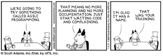
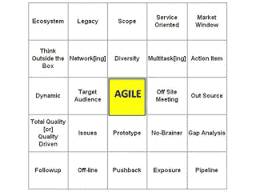

# 翻译行业未来透视:乌托邦还是反乌托邦？

> 原文：<https://medium.com/hackernoon/translation-industry-future-perspective-utopia-or-dystopia-87f6fb9a3dc0>

这是 Luigi Muzii 关于“专业翻译行业”发展前景的后续文章。他的 [*上一篇*](https://kv-emptypages.blogspot.com/2017/06/from-reasoning-to-storytelling-furture.html) *基于谷歌流量排名已经吸引了不少关注。在我看来，Luigi 对可疑行业行为的高度批评为“行业”讨论提供了巨大价值，因为他所指出的大部分都是显而易见的事实。* [*扯淡营销演讲*](https://www.buzzfeed.com/copyranter/the-language-of-marketing-is-complete-bullshit?utm_term=.hczlv3ade#.deRyL7oY8) *是各行各业普遍存在的问题，但 Luigi 专注于本地化会议和行业中的一些术语。你可能选择不同意他的观点，或者可能看到有很好的理由开始一场新的、更实质性的讨论。在这篇文章中，Luigi 对本地化世界中术语“敏捷”的不当使用提出了质疑。* ***敏捷的概念来自软件开发领域，通常指定制软件开发项目的快速原型制作、测试和生产实现。***

> *敏捷软件开发是软件开发的一套原则，其中需求和解决方案通过自组织、跨职能团队之间的协作而发展。它促进适应性计划、进化开发、早期交付和持续改进，并鼓励对变化做出快速灵活的反应。*

在我看来，将这一概念应用到翻译作品中确实有些牵强。(Gabor，你能给我提供一份名单，列出哪些人在他们的网站上使用敏捷这个词最多？)虽然如今项目的类型以及翻译项目的定义和处理方式都发生了明显的变化，但使用软件行业的术语来描述对非常古老的流程和生产模型的微小演变，确实值得提出一些问题。“增强翻译”的概念也有些愚蠢，因为只有大约 50%的译者使用 20 世纪 90 年代的翻译记忆技术，这是一种数据库技术 [*，充其量是过时的*](https://kv-emptypages.blogspot.com/2011/03/future-of-translation-memory-tm.html) *。*

***我的感觉是第一步要有大的飞跃，就是把重心从片段层面转移到语料库层面。第二步是关注客户对话文本，而不是很少有人阅读的文档文本。第三步是拥有适当的元数据，并在这种可利用的语言资产上建立更强的健壮性。***

*MT 已经是当今世界翻译内容的主导手段，但是很少有 LSP 或者翻译者真正知道* ***如何熟练使用。*** *专业翻译界的变化是缓慢的，尤其是如果是渐进式的，并且涉及到***新技术的熟练运用(即不是 DIY MT 或 DIY TMS)。根据我对行业如何应对和滥用 MT 的长期观察，我可以证明这一点。我认为，那些少数正确完成机器翻译的人很可能会成为领导者，他们会将新议程定义为紧密集成的机器翻译和机器翻译工作是快速响应和业务流程敏捷(不是“敏捷”)以及持续改进的关键。效率与开发有意义的新技术翻译流程技能密切相关，但很少有人投资，因此许多人可能会被可能进入市场并改变规则的新力量抓住。**

**鉴于* [*最近亚马逊开发机器翻译技术*](http://www.cnbc.com/2017/06/26/amazon-web-services-launching-machine-translation-service.html) *服务的传闻，我们不应该太惊讶，如果在未来几年内“专业翻译”中出现一种新的力量，那从一开始* ***就适当地*** *整合了机器翻译+外包劳动力(超级机械土耳其人)* ***与不断改进的机器学习和人工智能基础设施，以 Lionbridge 或 transp 等 LSP 的一小部分成本提供同等的翻译产品他们已经在构建横跨* [*大量学科领域、*](https://www.amazon.com/gp/site-directory/ref=nav_shopall_btn) *的机器翻译引擎，因此在如何做到每月十亿字的规模上有着深刻的知识，他们也是当今最大的云服务提供商。正如我去年指出的* [*从机器翻译中赚钱最多的玩家*](https://kv-emptypages.blogspot.com/2016/06/the-larger-context-translation-market.html) *都是翻译行业之外的公司。亚马逊已经取代了西尔斯和其他几家主要零售商，如果他们真的想做，他们有合适的技能来完成这件事。*** *查看* [*零售店关门的图表，这主要是由 AMZN*](https://kv-emptypages.blogspot.com/2017/06/creating-unified-experience-meet.html) *造成的。**

*即使他们只成功地占据了“翻译市场”的 5-10 %,这仍将使他们成为一个价值数十亿美元的 LSP，可以同样轻松地将 3 个单词或 30 亿个单词的项目翻译成 10 种语言，并且只需通过项目管理会议和关于质量的讨论来完成。这也可能是我们见过的最自动化和持续改进的工作方式。因此，想象一个高度自动化和基于网络的客户交互语言翻译服务，它有一个谷歌规模的机器翻译，在 50 个主题领域和一个人工智能主干上输出更好的质量，以及最大的全球人类翻译和编辑网络，他们在交付时获得报酬，并获得一个翻译工作台，在过程的每一步增强和协助实际的翻译工作。想象一下这样一个工作台，它将语料库分析、TM、MT、词典、索引、同义词查找和格式管理都集成在一个界面中，这使得翻译行业对“增强翻译”的愿景看起来像玩具一样。*

**所以，男孩女孩们，收拾好你们的东西，因为时代在改变。**

**这篇文章的亮点和重点以及大部分图片都是我的选择。我还在 Luigi 的文本中用紫色斜体添加了一些评论。下面的但丁语录真的很难翻译。如果有人能提出更好的翻译，我会更新它。**

**————**

**我喜欢鸽子，因为它不是标准的。* 
*有志者事竟成；进一步的问题不是。*韦氏词典将技术定义为“知识的实际应用，尤其是在特定领域。”《牛津词典》将其定义为“将科学知识应用于实际目的，尤其是在工业中。”《剑桥词典》将技术定义为(对科学发现的实际应用，尤其是工业应用的研究和知识)柯林斯将技术定义为“方法、系统和装置，它们是科学知识用于实际目的的结果”。更广泛地说，维基百科将技术定义为“用于生产商品或服务或实现目标的技术、技能、方法和过程的集合。”*

*这应该足以消除技术仅限于物理设备的普遍误解。事实上，根据大英百科全书，硬技术与物理设备有关，软技术与人和社会因素有关。硬技术离不开相应的软技术，而软技术是很难获得的，因为它们依赖于通过指导、应用和经验获得的人类知识。技术也分基础和高。*

*也就是说，[语言，就所有效果和目的而言，都是一种技术](http://www.huffingtonpost.com/mark-changizi-phd/language-and-evolution_b_930075.html)。一种软技术，一种基本的技术，但是非常复杂。*

*为什么这么长时间介绍技术？因为我们已经经历了半个多世纪的指数级技术发展[，我们几乎无法掌握](http://www.thomaslfriedman.com/thank-you-for-being-late/)。像往常一样，我们适应得很快，但一天比一天慢。*

*这种指数级的技术发展是阿波罗计划的女儿，其结果被公认为人类历史上最伟大的成就。它刺激了几乎所有的技术领域。*

*阿波罗计划中一些最重要的技术创新在 80 年代和 90 年代得到普及，甚至所谓的翻译行业在某种程度上也是那个时代的副产品。的确，如果我们今天所知的翻译职业**的诞生可以追溯到上世纪两次世界大战之间的年代，随着世界贸易的发展，翻译行业的诞生可以设定在 20 世纪 80 年代后期，伴随着个人电脑和办公自动化的普及。此类产品面向新客户、中小企业和个体户，而不是普通客户，即拥有资源和员工来处理庞大复杂系统的大公司。这些产品可以销售给更多的公众，甚至海外，但要想在全球范围内成功销售，他们必须会说目标国家的语言。然后翻译得到了巨大的推动，计算机软件业很快就面临着使其日益多样化的产品适应当地市场的问题。我们今天所知的翻译行业是一个百年历史的单人实践突然演变成多人商店。事实上，中介机构(翻译机构)甚至在科技公司帮助翻译成为全球性业务之前就已经存在，但它们的范围和野心完全是地方性的。他们大多是多服务中心，他们的营销策略是每年在当地黄页上更新一个广告。随着大型软件公司的出现，翻译记忆库(TMs)的使用也出现了。软件业看到了寻找重复的典型 TM 特征，这是一种降低翻译成本的方法。***

******

***到目前为止，翻译模式是翻译领域最伟大的，也可能是唯一的颠覆性创新。正如 SDL 的保罗·菲尔金最近回忆 T4 的那样，经颅磁刺激是 80 年代早期杨百翰大学的艾伦·梅尔比和他的团队的研究成果的应用。翻译供应商无法承受来自高预算客户的大量采购所带来的开销，于是他们设计了一种通用的方法来弥补利润损失，即要求供应商提供折扣，而不管工作的性质如何。20 世纪 90 年代末，翻译管理系统(TMSs)开始普及；它们是唯一的其他创新，远没有 TMs 重要，影响也小得多。***

***在 21 世纪头十年的末期，免费的在线机器翻译(MT)引擎开始发布“足够好”的输出，由于过去三十年全球内容需求的激增导致翻译内容的需求远远超过了可用人才的需求，MT 一直在稳定地呈指数增长，到今天，机器每天翻译超过 1500 亿个单词，比人类多 300 倍，有 200 多种组合，每月为超过 5 亿用户提供服务。(实际上，我愿意打赌每天的总字数超过 5000 亿字。KV)***

******

***我们现在即将实现翻译服务的完全自动化。实际上，典型工作流程的三个主要组成部分可能几乎完全自动化:生产、管理和交付。使用 MT，生产几乎可以完全自动化；TMS 几乎实现了翻译管理和交付的全自动化。为什么差不多？因为翻译行业并不能免受浪潮和炒作的影响，但它在很大程度上和历史上都非常保守，有点被动，因此是技术的“迟到”采纳者。**一个明显的证据是对敏捷方法的迷恋，以及随之而来的影响一些最杰出的行业参与者的兴奋。当然，突出并不一定意味着有能力。*****

******

***事实上，敏捷更像是一个品牌名称，[和相关的市场宣传](https://news.ycombinator.com/item?id=5406384)，因此，更像是一种管理时尚，有一个有限的生命周期。事实上，本地化过程很难适合敏捷方法，因为它有典型的方法和过程。如果没有新的技巧可以教给任何老狗，那么敏捷要想可行，一个世纪以来的教学和实践态度应该进行深刻的改革。此外，尽管敏捷已经成为最流行的软件项目管理范例，但它被理解为甚至没有真正提高软件质量，这通常被认为是低的。(这里有一个名为[*http://agileisbullshit.tumblr.com/*](http://agileisbullshit.tumblr.com/)*的网站记录了这种方法的许多问题。KV)* 相比之下，翻译行业一直声称非常注重并致力于质量。如果质量是翻译购买者的主要关注点，这可能意味着大多数供应商还远远没有达到稳定的质量水平。事实上，虽然主要软件公司的安全缺陷列表显示了高水平的公开缺陷，但世界各地的翻译用户和客户的投诉表明，该行业工作不佳。***

***提高标准，增加赌注，将边界推得更远，这些都是采用像敏捷这样的新工作方法的动机。这些动机转化为更多、更快、更便宜，但不一定更好。事实上，更高的速度、更大的灵活性和更低的流程成本应该会使返工和翻新变得更方便。***

***无论如何，在网站、博客、演示和活动中充斥着赞美一种被认为是流行的方法的奇迹的赞歌，这不仅是可笑的，而且是没有帮助的。在不了解其含义和基本概念的情况下唱出流行词汇可能看起来是一种有效的营销策略，但最终，当接受者意识到这只是掩盖了实际的落后和无知时，它将受到伤害。***

******

*****内容的爆炸给新兴的全球公司带来了严重的翻译问题。企业在网络上的不断迁移造就了** [**DevOps**](https://en.wikipedia.org/wiki/DevOps) **和** [**连续交付**](https://en.wikipedia.org/wiki/Continuous_delivery) **的新范式，进一步推动了翻译自动化的需求。翻译界的许多人说的和做的就好像他们生活在一个想象的、无限遥远的地方，这个地方对其居民来说拥有非常令人向往或近乎完美的品质。他们认为未来，无论它被描绘成什么，都是一个想象中的地方，在那里人们过着非人的、经常是恐惧的生活。*****

***与此同时，几周前发表在《麻省理工技术评论报告》的一篇文章中的一项调查显示，在 45 年内，人工智能在所有任务上超过人类的可能性为 50%,在 120 年内，所有人类工作实现自动化的可能性为 50%。具体来说，研究人员预测，到 2024 年，人工智能将在翻译语言方面超过人类，到 2026 年，写高中论文，到 2049 年，写畅销书，到 2053 年，做外科医生。***

***毕竟，创新和翻译一直是奇怪的伙伴。创新来自于回答新问题，而翻译界几个世纪以来一直在同老问题作斗争。不足为奇的是，翻译行业的任何创新都将是持续创新，延续当前的绩效水平。然而，尽管人们担心机器人会破坏工作岗位，导致人们失业，但翻译技术的市场正在增长，但翻译卢德派相信，翻译技术不会很快危及翻译工作，而是指出缺乏熟练的专业人员。***

***事实上，翻译行业就像一幅静物画，它的每一部分似乎都是永恒不变的。这幅画的一个典型部分是质量评估，仍然遵循昂贵且低效的基于检查的错误计数方法和相关的[红笔综合症](http://www.s-quid.it/en/penna-rossa/)。***

*****在日益自动化和非中介化的情况下，对质量的权衡似乎是最容易预测的情景**。对于软件行业来说，提高速度和灵活性，同时控制成本，可以让返工和改造变得可以接受。机器翻译将会越来越普及，后期编辑将会成为通往全球通信其他银行的渡船，允许以比桥梁或隧道低得多的资本成本在各点之间直接传送。不过 MT 不是[卡戎](https://en.wikipedia.org/wiki/Charon_%28mythology%29)。***

******

***米开朗基罗在他的壁画 [*中描绘的卡戎*](https://en.wikipedia.org/wiki/The_Last_Judgment_%28Michelangelo%29) 西斯廷教堂***

***关于后期编辑的关键问题是需要多长时间，甚至需要多长时间。目前，大多数翻译工作都是小规模的、仓促的、基础的、频率不可预测的，然而生产模式基本上仍然和五十年前一样，尽管 TMS 系统和其他自动化工具越来越受欢迎。**这意味着管理大项目和小项目需要相同的时间，因为翻译项目管理仍然依赖于从传统中借用的相同的僵化范例。*****

***该领域最杰出的创新将是信心评分和数据驱动的资源分配。它们已经得到实施，并将在获得足够高质量的数据后得到进一步改进。事实上，如果分数不能首先与基准进行比较，然后再与实际结果进行比较，那么信心评分几乎是无用的。基准只能来自项目历史，而结果必须被恰当地衡量，衡量标准必须被阅读和分类。***

***这还不在大多数物流服务提供商的技能范围内，在翻译课程或翻译培训项目中也很难教授。***

***然而，这是人类的判断在很长一段时间内仍然有价值的地方。而不是质量评估，质量评估在今天仍然不够客观。**信息不对称仍将是一个主要问题，因为总会有一对语言完全超出任何客户的范围，他们无法知道产品是否符合对客户的承诺。**的确，人类对翻译质量的评估，如果基于当前通用的方法，意味着使用参考模型，尽管这是隐含的。换句话说，每个被要求评价译文的人都是根据他/她自己的[理想](https://www.merriam-webster.com/dictionary/ideal)来评价的。***

***MT 能力将被集成到所有形式的数字通信中，MT 本身也将很快成为一种商品。这将进一步使后期编辑取代翻译记忆库，成为未来几年工业翻译的主要生产环境。这也意味着，在不久的将来，对机器翻译后期编辑的强烈要求可能会升级，并让翻译行业的参与者措手不及。***

***事实上，MT 输出的质量一直在稳步提高，现在已经相当可观了。这是大多数翻译应该担心的，对专业翻译的期望会越来越高。***

***随着机器很快在人类做的几乎所有事情上都做得更好，翻译公司将不得不重新思考他们的业务。随着指数级的发展速度，机器翻译很快就会给翻译业务留下很小的空间。这并不意味着不再需要人工翻译。简单来说，今天的 1%将会进一步缩水。在必须做出关键决策时，最有可能需要人类。这正是信息不对称发挥核心作用的那种情况，在这种情况下，一方无法知道从另一方收到的产品是否与承诺相符，例如，何时翻译应作为证据在法庭上处理。***

***随着技术使得匹配资源、为特定内容找到最合适的机器翻译引擎、预测质量等成为可能。人类技能将不得不改变。今天，已经没有一套单一的标准可以保证优秀的翻译了，而且人们的素质本身与他们提供的服务和收取的费用没有多大关系。***

***这意味着供应商管理(VM)将成为一项越来越重要的职能。评估各种类型的供应商需要翻译课程中从未开发过的技能和工具。今天，供应商经理大多是语言学家，他们自己开发了虚拟机管理能力，大多数时间无法将所有时间和精力用于供应商评估和管理，被迫尽最大努力处理电子表格，没有机会参加 [HRM](https://en.wikipedia.org/wiki/Human_resource_management) 或谈判课程。供应商管理系统( [VMSs)](https://en.wikipedia.org/wiki/Vendor_management_system) 已经存在了一段时间，但是大多数物流服务提供商仍然不知道它们。然而，翻译遵循一个典型的外包供应链，一直到自由职业者。***

***所以，翻译行业的专家、权威人士和玩家，应该停止胡说八道。诚然，即使在普遍危机时期，翻译行业也在稳步增长，但翻译业务仍然只占总数的 1%。换句话说，当翻译购买者决定放弃零翻译选项并翻译全部或大部分内容时，增长仍然是线性的。***

***敏捷翻译并不是本地化行业中唯一的市场营销术语。现在轮到“增强翻译”和“无人值守项目管理”了([无人值守管理(LOM)](https://en.wikipedia.org/wiki/Out-of-band_management) 是系统管理员通过远程控制来监控和管理服务器的能力。从其他领域借用术语(不是概念)显然是为了掩饰废话，看起来很酷，让观众震惊，但是，试图看起来很酷并不一定意味着很酷。最后，这会让人觉得她/他不知道自己在说什么。即使是时髦的模特也是由精确的规则和角色塑造的:仅仅把它们作为神奇的词汇可能会适得其反。***

***尽管如此，这个坏习惯似乎一点也没有减少。事实上，它仍然主导着行业事件。例如，本地化世界应该是揭示新的翻译技术和趋势的世界顶级会议。无论如何，聚集在巴塞罗那的 400 多名与会者中的大多数人似乎都把时间花在了聚会和社交活动上，而房间话题却远远偏离了持续交付和相关技术及趋势的会议主题，尽管对更好的自动化和更先进的工具的需求正在稳步增长。也许这是真的，会议的社会方面就是会议的目的，但是为什么要选择一个主题并安排演讲和讨论呢？***

***陈述围绕着通常的论点，在事件之前和之后被广泛和重复地处理，并且经常是商业主张的盲目重复。问题和评论通常不意味着挑战或引发辩论，尽管它会刺激和丰富。琐碎规则，因为没有人愿意烧毁他/她的东西，这些东西是打算在其他时间向不同的观众展示的。***

***无论如何，变化正在快速到来，当下一次创新的影响将把它搞糟时，翻译行业将再次发现毫无准备。因此，是时候让服务提供商和他们的客户重新思考他们的翻译业务，从他们一直接受创新的昏睡中醒来了。此外，工作也在快速而彻底地变化，教育和商业之间的差距将比现在更大，而现在已经很大了。想象自己的孩子在翻译行业的未来越来越没有意义，这将使寻找愿意并能够利用行业内丰富的技术、数据和解决方案的年轻人才变得越来越困难，无论这些技术、数据和解决方案多么神奇。这表示，用不了多久，“精通机器学习”就会成为新的“精通 Excel”。现在翻译界很少有人在做这方面的具体工作。选择一个 ML 算法很快就会像在 Microsoft Word 中选择一个模板一样简单，但迄今为止，很少有翻译毕业生甚至专业翻译人员看起来那么精通。当然是在文字上。***

******

***[**Luigi Muzii**](https://it.linkedin.com/in/luigimuzii) **从 1982 年开始从事“翻译业务”，从 2002 年开始担任业务顾问，在翻译和本地化行业通过** [**他的事务所**](http://www.s-quid.it/) **。他专注于帮助客户选择和实施最适合的技术，并重新设计他们的业务流程，以实现翻译和本地化相关工作的最大效率。*****

***[**这个链接**](http://www.s-quid.it/en/blog.) **提供了访问他其他博客文章的途径。*****

****原载于 2017 年 7 月 19 日 kv-emptypages.blogspot.com**T21*[。](https://kv-emptypages.blogspot.com/2017/07/translation-industry-persepective.html)***