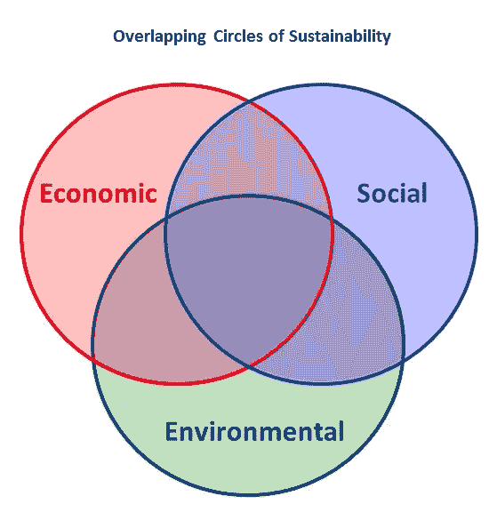
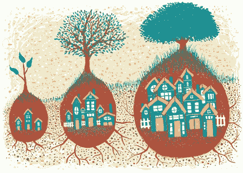

# 用加密货币将商品变成黄金

> 原文：<https://medium.com/hackernoon/turning-good-into-gold-with-cryptocurrency-23d7f7025764>

Value is more than money. Value is everything that the society needs and benefits from.

17 世纪，荷兰东印度公司开创了几项金融创新，为现代金融体系奠定了基础。这个可疑的企业超级大国通过向公众发行股票和债券，使金融变得更加透明和容易获得，并在这样做的过程中，奠定了现代资本主义的基础。

如今，股票和债券似乎很简单，甚至有点乏味。但在现代早期，它们是金融革命的工具，促成了私人所有权、二级交易和企业利润分享。思想开放的投资者肯定会受益匪浅，但他们主要受益于千里之外的殖民地对他人的剥削。

现在，新一代企业家和技术专家正在用区块链技术和加密货币改革这种金融模式。参与传统资产市场正被一波创新浪潮重新定义。通过消除摩擦和中间人，区块链促进了一种新的市场参与方式——这种方式超越了对价格走势的押注，让参与者真正“参与进来”。

# 是打破常规的时候了

今天，股票市场惯例规定公司利润等于投资者利润。社会价值似乎在这个简单的等式中没有位置。从积极的方面来看，社会影响投资的概念近年来已经出现，甚至受益于一波慷慨的资金，但它仍然是一个边缘运动。

Ananas 将会改变这一切。我们正在为慈善机构开创一种新的金融模式，这种模式建立在区块链技术推动的象征性经济基础上，打破了为个人利益投资和支持社会公益的古老二分法。我们将你的个人财务利益与社会利益相结合。

Ananas 不是一个简单的慈善机构。我们不需要仅仅依靠利他主义来创造社会公益。我们也不必为了取悦股东而在慈善目标上妥协。为了建立一个为参与者和整个社会创造价值的经济体，我们不需要以盈利为目的。

# 一种硬币和一种新的代币模型

对于企业家、投资者和整个社会来说，代币经济改变了游戏规则。关于这方面的背景知识，请查看伟大的文章[这里](https://news.21.co/thoughts-on-tokens-436109aabcbe)(作者 [*巴拉吉·斯里尼瓦桑*](https://news.21.co/@balajis?source=post_header_lockup) )和[这里](https://vinnylingham.com/why-tokens-are-eating-the-world-b4174235c87b)(作者 [*文尼·林厄姆*](https://vinnylingham.com/@vinnylingham?source=post_header_lockup) )。我们也在这里分享了一些关于加密领域道德的想法[。](/ananas-blog/ethics-in-the-crypto-space-5cf79972329d)

Economy, society, and the environment are all interconnected. Existential imbalance is a risk when goals aren’t aligned. The mission to fight climate change is an example of a crucial threat to deal with, despite an absence of an external enemy, facilitated by imbalance of goals. The same could be said about societal division and the mission we’re igniting.

代币经济从根本上不同于传统的资本市场，因为**你可以在“开放”和“私人”(代币)经济之间产生供求效应。**当硬币的供应是预先铸造的(并且是有限的)时，这一点尤其正确，并且有激励保持硬币在私有经济中的流通，正如 [Anacoin 的](https://anacoin.io)案例:随着私有生态系统由于网络效应而有机地增长，以及随着域内容变得更广泛和更丰富而系统地增长，内部流通和外部需求增长。这确保了我们可以[为每个人做大蛋糕*和*同时增长系统的总价值](https://hackernoon.com/gamifying-the-delivery-of-money-c55c25cecaee)。精英管理是新的标准。

Ananas 将是一个独特的生态系统。在私营经济的推动下，它的社区是多中心治理的，参与者、消费者和基础设施的目标与更高的目标相一致，即回收和开发对我们最个人化的知识。庆祝我们文化中所有不同的故事。

这是你加入这项任务的门票，并建立一些真正伟大的东西。它首先是一个实用令牌，在 Ananas 平台上是多功能的。它赋予你参与管理、培养和引导平台和社区方向的权利。

防止在资本和权力之间建立关系的明显危险的一个方法是“赌注”机制。基本上是用户的安全保证金，因为他们以潜在的有影响力的方式参与平台。我想强调两个有趣的结果:

1.  参与者可以，也将被鼓励这样做，同时培养“HODL”和“T1”。
2.  通常与财富相关的权力和影响力被颠覆了:增加赌注和奖金最重要的是*让你受到用户更多的审视。*

让那件事深入人心。

继续:我们的生态系统旨在提供丰富多样的参与方式(同样，就像一个小社会)。例如，一个人可以专注于社区中的许多角色及其治理，或者专注于众多领域和方法中的一个来改进内容。

## 我们* *需要** 这个

主观知识是一种共同的共享资源，就像牧草或饮用水一样。相比之下，它不会耗尽。反而不负责任的过度消费会导致其恶化。这只是人的本性:接触到贴近内心的想法和观点，几乎总是会导致信仰的改变，不管是从一个方向还是另一个方向。

当你的信念改变时，你传达的信念也会改变。交流往往会变得混乱。在信息时代，人类从根本上来说是高度连接的，所以我们的基础设施需要分散化，以防止自我强化的循环和回音室——让最值得听到的细微差别和多样性真正被听到。

有些人可能会意识到上图中的公地悲剧。已故的诺贝尔经济学家埃莉诺·奥斯特罗姆可能会同意，并承认我们的使命是努力实现她解决经典社会经济困境的愿景。事实上，Ananas 的设计完全符合她提出的解决这个古老问题的方案。

# 变善为金:非营利组织的范式转变

我们的生态系统及其基础设施有一个明确的目的:创造一种转化为货币价值的社会价值。

Ananas will be like a little society. Safely nurtured in a private ecosystem, with value exchange sensibly optimised for the private ecosystem’s growth, but fruits it yields will be freely accessible to all.

我们所做的不仅仅是通过重新分配捐款和投资流，把黄金变成好东西。我们正在通过将*善变成金、*善、*、*协调个人和社会的利益来完成闭环。代币和区块链推动的创新使这种范式转变成为可能，这对整个非营利部门都有影响。我们谈论的是慈善机构的新财务模式，使他们能够在可持续的基础上建立自己的运营。

天使投资人和未来思想家哈姆普斯·雅各布松认为，“雄心勃勃的初创公司被货币化损害了”，事实上，货币化 Ananas 平台感觉微不足道，因为有足够多的“传统”逐利机构将从中受益——媒体公司、记者、大学、宗教机构等等。

正如总统的目标不是从他们所领导的国家的经济增长中致富一样，一个基金会不一定要以盈利为目的，才能为其参与者创造繁荣的象征性经济。一个正确的令牌模型会从*生态系统的*馅饼中给你分一杯羹，而不是基金会或公司的。

最终，Ananas 社区和令牌持有者将成为探索可能性和推动发展的积极参与者。像维基百科和 Quora 一样，Ananas 有潜力成为一个主观知识的中心资源，每个人都可以免费使用，没有广告，由令牌经济完全可持续地支持。除了不断增长的人员和内容网络，研究和测试将进一步推动平台的实用价值。将其转化为财务价值只是时间问题。转化为财富，分配给效用价值的源泉:参与者。

毕竟，这最终只是一种价值交换。

## 帮助我们帮助你帮助所有人

代币不是传统的股票。
参与者不是传统股东。
代币经济不是传统市场。参与代币经济不是传统的投资。

像 Anacoin 这样的模型将推动加密空间超越快速致富主导的青春期阶段，并实现其让社会变得更好的承诺。我真诚地希望看到更多的项目更加认真地对待代币经济和生态系统设计。

购买 Anacoin 不是为了获取公司利润，而是为了生态系统的增长和内容质量的提高。我们正在重新定义投资，挑战“投资”的概念——参与应该是一个正确的词。

因为最重要的是，代币应该赋予你权利*投资你的努力，*这应该是回报的最大决定因素——否则它将是稳定的，主要用作一种担保。没有人希望这样。