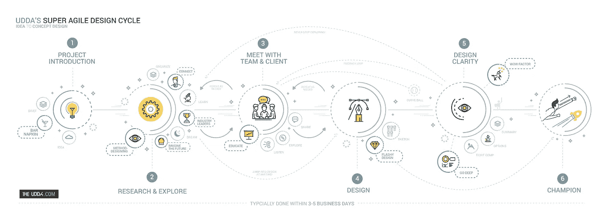
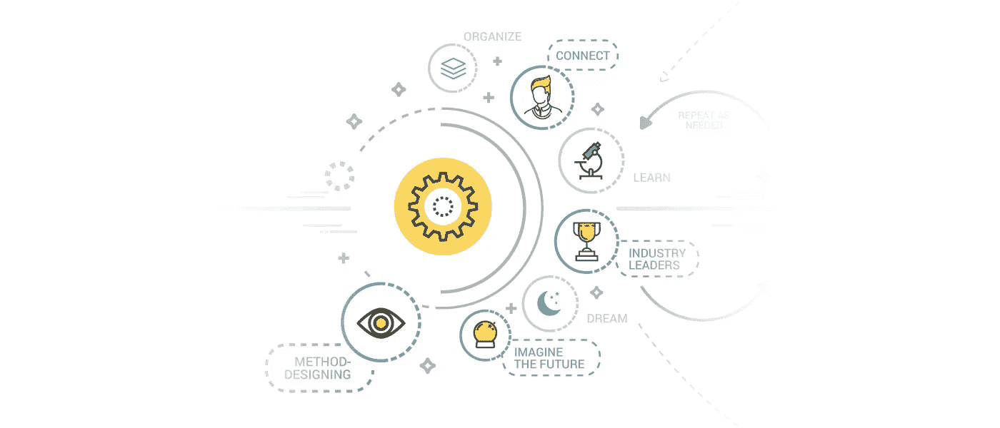
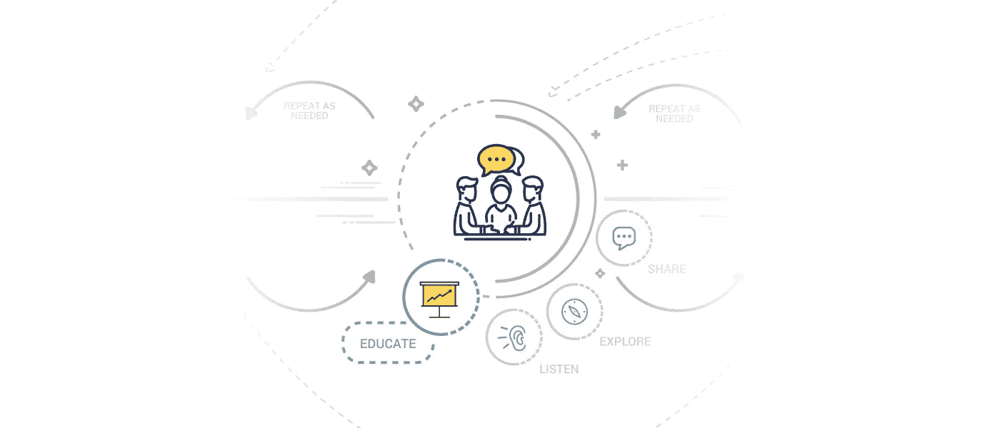
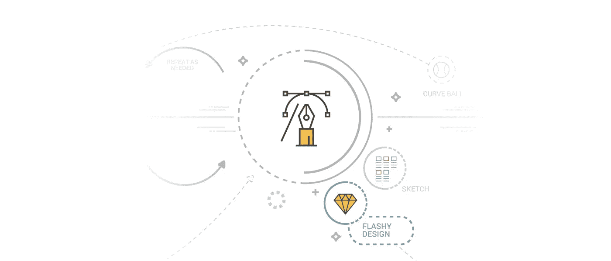
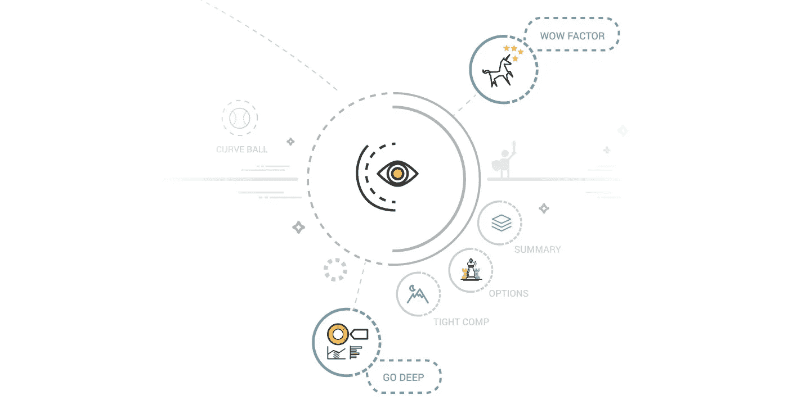

# UDDA 的超级敏捷设计周期

> 原文：<https://medium.com/hackernoon/uddas-super-agile-design-cycle-e24c3515885c>

请允许我向您介绍我在 TheUDDA.com 使用的精益&超级[设计](https://hackernoon.com/tagged/design)循环。它主要用于快速概念设计。乍一看，它可能看起来势不可挡，但坚持几分钟，我保证这将完全值得你的时间。我强调了每个部分的要点…

# **1。项目介绍**

这很简单……一个[项目](https://hackernoon.com/tagged/project)必须从某个地方开始。通常，它是作为一个创造性的概要或某种有组织的概念或想法出现的。我们最喜欢的项目介绍？吧台餐巾间距，下面继续…

***1.a 吧台餐巾纸:*** 这大概是我们最喜欢的介绍了，总的来说，这真的是一个没有太多描述的概念隐喻。有点像草草记下的尤里卡。有一次，我们的一位企业高管给我们发来了一张照片，上面写着一个开始行动的想法。我们觉得这很有趣，没有问任何问题，我们就开始了。

*为什么这是我们的最爱？*因为接受一个松散的想法，看看它能发展成什么样的东西，这是一种被信任的恭维。不像完全详细的创意简报，我们现在可以不受限制地进行创意。这并不意味着更容易，实际上可能更具挑战性…但这是我们喜欢并擅长与客户一起应对的挑战。我们还知道，客户正在寻找想法，要求我们带着能进一步激发对话的东西回来。如果你得到了一个“酒吧餐巾”项目…不要问问题，只管去做，享受其中的乐趣。一定要带好东西回来。

# **2。研究&探索**

另一个简单的过程，但我想指出我们为成功做的几件事:

2.a 连接: 对于任何新项目，我们都会调查相关人员，看看他们的简历和经验。这给了我们对潜在的某些设计想法的洞察力，这些想法会引起他们的共鸣。这也是就他们感兴趣的话题进行闲聊和交谈的好方法，我们都必须一起工作，在个人层面上与人们联系是很好的。就当是侦察吧。如果你发现客户对攀岩感兴趣，也许演示以 Bishop 中的一个场景为中心…你看到我刚才做的了吗？

***2.b 行业领袖:*** 永远不要用“竞争对手”这个词。但那基本上是我们正在谈论的。了解谁以类似的想法获得成功，并在市场上立足。

***2.c 想象未来:*** 永远要试着考虑技术或社会趋势如何影响这个概念。

*例如:*在增强现实技术方面正在进行大量投资……我试图想象这个概念如何应用于未来的技术。你认为还有哪些技术是趋势？

***2.d 方法-设计:*** 这类似于方法-表演的思路。在这个过程中，你可以在精神上深入潜在角色的思维模式，以获得关于界面或技术如何改善他们的体验的见解。我们喜欢方法设计，因为它对我们有用，有那么一会儿，我们可以假装自己是别人，做着我们为之设计的工作。这可能对你不起作用，一个较慢的替代方法是创建至少两个用户角色，或者对业内人士进行简单的采访。

# **3。会见团队和客户**

保持会议简短扼要。每次我来参加会议，我都尽力确保自己准备得尽可能专业。这就引出了下面的亮点…

教育:总是给客户带来一些东西，表明你开始以更深的方式或新的角度理解这个主题。即使是很小的洞察力，一点点热情也能起到很大的补偿作用。这并不总是容易做到的。我通常会找到一个不完全清楚或难以理解的领域，并真正深入理解它…如果你理解它有困难，很可能团队中的其他人也会。所以，如果你花时间去真正了解一个领域，然后用一种让别人更容易理解的方式来介绍它，你就会看起来像一个超级明星。*击掌庆祝*

*下面是一个例子:*在为一家公用事业公司研究预测性服务工具时，我研究了他们服务站的一件设备，浏览了服务手册，并围绕它创建了一个上下文相关的故事。我认真阅读了服务手册，这样我就能确保我理解了工程师会考虑和寻找的信息类型。我甚至进一步了解了它周围的部件和可访问性，以了解这个部件的故障会有多严重，以及它会如何影响整个机器…你认为一个 UX 设计师只是让事情看起来很漂亮:)

*专业会议提示:*试着根据需要记录你的会议，我擅长做笔记，但这可以拯救生命，减轻很多压力。尤其是当我感到疲劳、压力大、难以理解客户等情况下。我点击记录，知道我可以回去重放所有的反馈。我的工具:GoToMeeting 或 Screenflow

# **4。设计**

拼凑一些草图和粗略的布局就足够简单了。但是有一件事我总是比大多数设计师做得更早...那就是创造至少一个让人垂涎的浮华设计。

***华而不实的设计:*** 在第一次或第二次会议中，我喜欢提出至少一个华而不实的设计……如果它不好，那就不要麻烦了。完成后，将一个华而不实的设计带到桌面上会创造出令人兴奋、自信和人们可以依靠的视觉效果。它可以滚雪球般地增加很多动力。即使这不是最终的设计，它也让每个人都尝到了可能性的滋味。

# **5。设计清晰**

在几个设计周期和会议之后，一个更清晰的产品愿景应该开始变得清晰。有两件事我总是试图包含在我的最终设计中…

***5 .一个哗众取宠的因素:*** 设计中至少要有两个能真正哗众取宠的特点。这并不总是容易做到…但不断问自己这些咒语会有所帮助:

*“还能做些更有趣的事情吗？”
“还有更好的办法吗？”*

***5.b 深入研究:*** 我记得当我第一次开始开发企业应用程序时，我会把漂亮的彩色条形图或饼状图扔到我能看到的任何地方……我的设计看起来确实不错，但我记得一个客户问我:“这些图实际上意味着什么？它们背后的逻辑和数据是什么？”自从我无偿设计的日子以来，我已经走了很长一段路，每个图形、按钮和元素都有一个目的和更深层次的信息。深入…你不必设计每一个小部分，但你应该了解组成每个页面的逻辑或功能，因为有可能你会被问到这个问题。

# **6。冠军**

这与你无关，尽管你可能是一名设计冠军，但这与客户有关。在很大程度上，我们在我的公司所做的就像是一个为高管和高级职员服务的秘密行动团队。我们的工作是给我们的客户弹药，他们需要支持他们想要前进的愿景。希望你的设计能够继续下去，激发灵感，创造新的关系，鼓励讨论，并在世界范围内产生影响。

我希望我的过程能给你一些有帮助的想法。如果你在创作过程中有任何想要分享的技巧和诀窍，请在评论栏留下。我期待听到您的反馈！