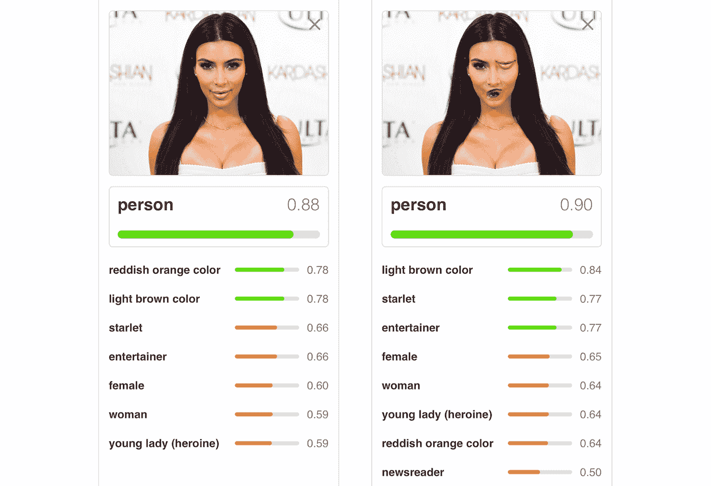
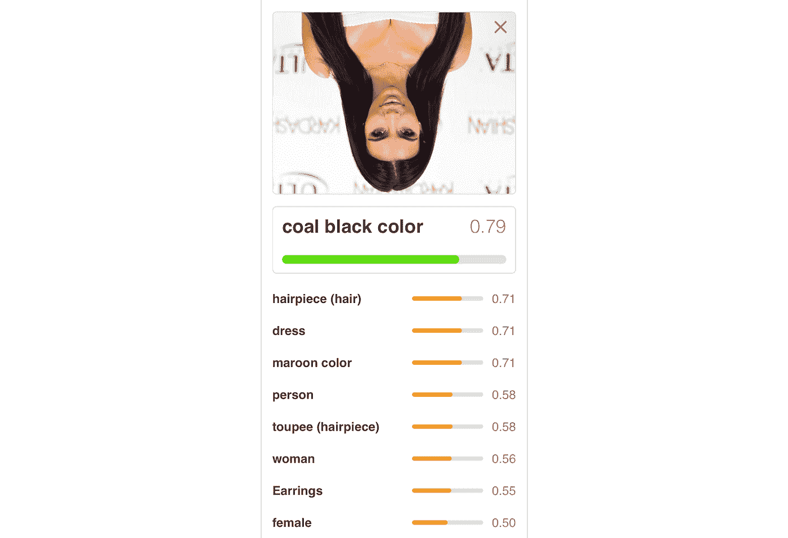
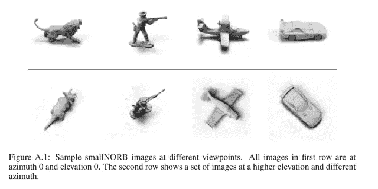
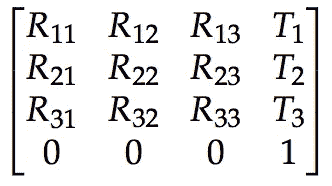
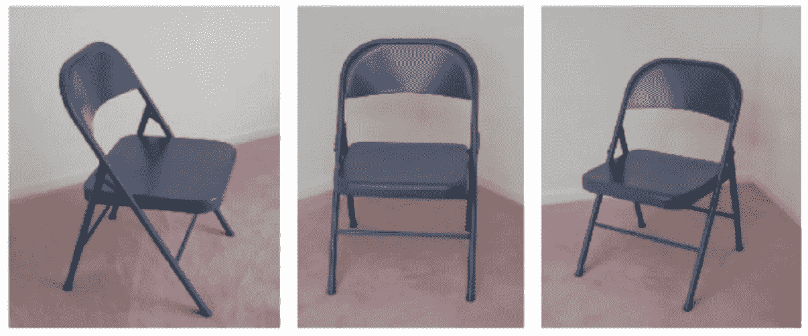
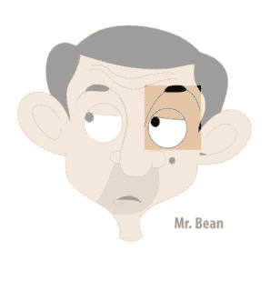
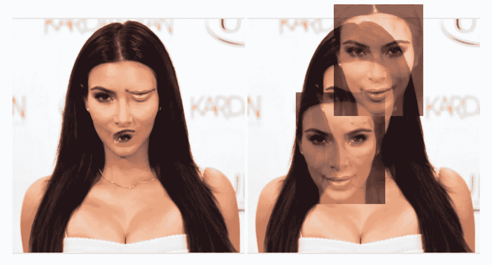
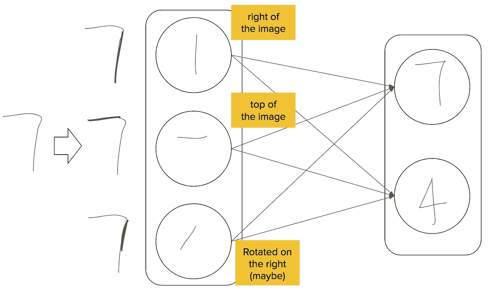

# 揭开胶囊网络和逆图形背后的直觉

> 原文：<https://medium.com/hackernoon/uncovering-the-intuition-behind-capsule-networks-and-inverse-graphics-part-i-7412d121798d>

> 大脑会做逆图形吗？—杰弗里·辛顿

# 1.介绍

第一次听到“胶囊网络”和“逆图形”时，它们似乎是令人生畏且有些模糊的术语。这些术语直到最近才在主流媒体上流行起来，在深度学习的教父 Geoffrey Hinton 发表了两篇论文之后，这两篇论文分别是关于 ***胶囊之间的动态路由*** 和关于 ***带 EM 路由的矩阵胶囊*** *【这是目前正在为 2018 年 ICLR 进行审查的盲提交，但老实说，我们知道这将是 Hinton 等人的】* ***。***

在本文中，我将尝试提取这些想法，并解释它们背后的直觉，以及这些如何使计算机视觉中的机器学习模型更接近模拟人类视觉。从 CNN 背后的直觉开始，我将深入探讨它们是如何从我们关于人类视觉背后的神经科学的假设中产生的，以及逆图形是如何创建下一代计算机视觉系统的*的，最后简要概述所有这些是如何与胶囊网络相连的。*

# 2.第一个突破性的想法:等级制度

关于神经科学和人类视觉的研究让我们认识到这样一个事实:人类是分层次地学习和分析视觉信息的。婴儿首先学会识别边界和颜色。他们利用这些信息来识别更复杂的实体，如形状和数字。慢慢地，他们学会了从圆圈到眼睛和嘴巴到整张脸。

当我们看一个人的图像时，我们的大脑识别两只眼睛、一个鼻子和一张嘴:它识别所有这些存在于一张脸上的实体，你会认为*“这看起来像一个人”。*

这是深度神经网络的**起源的最初直觉，当它们在 20 世纪 70 年代首次被构建时。这些网络被设计成能够识别底层特征，并一次一层地从中构建复杂的实体。**

# 3.第二个突破性的想法:位置等变

Figure 1: Recognizing a cat should be the same learning process irrelevant of its position

## 不变性与等方差

这是什么意思？如果我们有平移不变性(这对于我们现在使用的 CNN 是正确的)，那么这两幅图像都将被预测为猫。也就是说，图像的位置不会(也不应该)影响我们对图像的分类。

等方差的概念类似于不变性，除了具有与位置无关的分类之外，我们还希望预测物体在哪里:即除了检测它是一只*猫*，我们希望网络能够检测它是左边的一只*猫*，还是右边的一只*猫*。

假设我们有一个可以检测猫的分层网络。您不会希望一组节点试图在图像中的特定区域识别一只猫，而另一组节点试图在其他地方识别同一只猫。

## 回旋

进入**卷积神经网络** ( [如果对你来说这是新的话你可以在这里阅读更多](http://cs231n.github.io/convolutional-networks/))！这些有小的*内核*，分析图像的局部区域，试图识别特征。革命性的想法是在整个图像中使用相同的内核来检测相同特征在多个位置的出现。由于通过在图像中的所有位置共享参数而减少了参数，这使得系统性能更好，速度也更快。

2012 年，Hinton 与 Ilya Sutskever 和 Alex Krizhevsky 一起创建了 AlexNet:一个深度卷积神经网络，在 ImageNet 上表现出色。

CNN 很快成为计算机视觉的同义词，并应用于所有主要任务:从对象检测和图像分类到分割、生成模型等等。

# 4.第一次失败:MaxPool 对现代问题不起作用

> 卷积神经网络中使用的池操作是一个很大的错误，它如此有效的事实是一场灾难—辛顿

Figure 2: Max Pooling with a 2x2 Kernel and 2 Stride

> 如果 MaxPool 是两层之间的信使，它告诉第二层的是‘我们在左上角的某个地方看到了 high-6 **和在右上角的某个地方看到了 high-8 **。****

Figure 3: A CNN with MaxPool would classify both images as human faces because it would detect all the required features. Because of MaxPool, it never learnt any spatial relation between these elements. [[Source](/ai³-theory-practice-business/understanding-hintons-capsule-networks-part-i-intuition-b4b559d1159b)]

卷积网络的第一个实现是在 20 世纪 80 年代由 Kunihiko Fukushima 完成的，他构建了一个名为[**neocogniton**](https://en.wikipedia.org/wiki/Neocognitron)的深度神经网络，具有卷积层(体现了平移等变)，在每个卷积层之后有一个池层(以允许*平移*不变)。福岛当时用的是 MaxPool，并在论文中雄辩地解释了背后的直觉。池层的最初想法在当时是有意义的，因为他们试图解决的任务是识别手写数字。我们仍然继续着遥远过去的残余。是我们做点什么的时候了。

> 作为人类，我们不仅检测组成整体的所有部分，我们还需要所有这些元素在空间上相互关联。然而，MaxPool 慢慢剥离这些信息，以创建平移不变性。

当然，您可以检测第一层中的基本特征，并尝试将其发送到下一层节点，以检测更复杂的对象。但是，如何决定如何在这两组节点之间传输这些信息呢？

这是最重要的一块拼图:路由。**什么是路由？**

> **路由**:在分层学习系统(又名深度神经网络)中，用于将信息从一层的节点发送到下一层的节点的策略或协议

**MaxPool** 看起来像是一个解决了问题的黑客，表现良好，并被用作标准。但是我们过去的鬼魂回来纠缠我们。通过用一个数字来表示每个 2x2 块，它允许一些*平移*不变性，其中特征可以被检测到并导致相同的输出。如果脸稍微偏离中心呢？眼睛可能更偏向左边，但是这些微小的变化不应该影响我们的预测。对吗？

但是 MaxPool 对于它允许多少平移不变性太宽容了。

Figure 4: Messing around with the original image actually improved the confidence. Seems fishy. [[Source](https://hackernoon.com/capsule-networks-are-shaking-up-ai-heres-how-to-use-them-c233a0971952)]

好吧，也许这有点太宽容了，但我们确实可以归纳为不同的方向，对吗？

Figure 5: Clearly our network isn’t generalizing to different orientations.

不完全是。真正的问题不是 MaxPool 没有很好地完成它的任务:它在*平移不变性*方面很棒。

> 最大池(或子采样)允许我们的模型对视点的微小变化保持不变。

今天，我们的任务跨越了许多领域，在这些领域中，我们大部分时间都在现实生活的 3D 图像上训练我们的模型。*仅仅平移不变性*已经不够了*。*我们现在要找的是**‘视点不变性’**。

Figure 6: An excerpt from Hinton’s paper demonstrating the same object observed from different viewpoints

这里是我们深入研究视点背后的数学基础的地方:**逆图形。**

# 5.提取视点和反向图形

当试图从相机的视角从 3D 场景中产生 2D 图像时(类似于拍照——这被称为渲染:用于创建计算机游戏和电影，如《阿凡达》),渲染引擎需要知道所有对象相对于相机的位置(也称为**视角**)。然而，我们不想定义相对于摄像机的所有对象。我们宁愿在我们的坐标框架中定义它们，然后从我们想要的任何相机视点渲染它们。

此外，在创建这些图形时，您可能希望定义眼睛相对于面部的位置，但不一定要相对于整个人。本质上，你会有一个层次的部分创建一个完整的对象。

姿态矩阵帮助我们**为所有对象定义摄像机视点**，也代表部分和整体之间的**关系。**

## 姿态矩阵:图形的本质

姿势矩阵(也称为*变换矩阵*)是一个 4x4 的矩阵，它在一个坐标框架中表示一个对象的属性。该矩阵表示三维平移(相对于原点的 x-y-z 坐标)、缩放和旋转。

Figure 7: A pose matrix. The T-values represent the translation, while the R-values represent the rotation and scale of the image.

你们当中有 3D 建模或图像编辑经验的人，你们很清楚我在说什么。这些概念在标准计算机图形学中存在了几十年，但不知何故逃脱了机器学习的掌握。

**注意**:理解姿态矩阵的元素是什么意思并不重要。如果你愿意，你可以在这里阅读更多关于姿势矩阵背后的数学。

Figure 8: Pose matrices representing hierarchical relationships. **M** represents where the face is on the person, while **N** represents where the mouth is on the face.

一个整体是由它的部分组成的，每个部分通过一个姿态矩阵与主对象相关联。姿态矩阵表示整个对象坐标中的较小部分。姿势矩阵最重要的部分来了:如果 **M** 是人脸相对于人的姿势矩阵， **N** 是嘴相对于人脸的姿势矩阵，我们可以得到嘴相对于人的坐标(即它相对于人的姿势矩阵)为**N’= MN。**

> **先不说**:把一个姿态矩阵想象成相对速度。如果 A 比 B 快 5 m/s，B 比 C 快 5 m/s，那么我们可以说 A 比 C 快 5 + 5 = 10 m/s，就像我们可以把这两个数相加来计算相对速度一样，我们可以把两个姿态矩阵相乘来得到嘴巴相对于人的姿态矩阵。

现在，如果我们有一台相机，并且我们知道在相机的帧中，人的姿态矩阵是 **P** ，我们可以通过乘以姿态矩阵来提取姿态矩阵，从而提取人的每个部分的所有本质属性。在上面的例子中，相机的帧中的脸部的姿态矩阵将由**M’= PM 给出。这就是所有用于游戏和电影的渲染引擎的工作原理。**

Figure 9: Yellow highlighted text is the pose of the objects w.r.t the camera viewpoint

这个姿态矩阵代表了我们观察物体的不同视角。一张脸的所有特征都是一样的，唯一不同的是从你的角度看这张脸的姿势。所有其他物体的所有视点都可以从仅仅知道 **P** 中导出。

Figure 10: Example of a coordinate conversion from one frame to another, described by the 4x4 matrix. Here **Xw** is a coordinate in the person’s frame, and the 4x4 matrix is **P**. Xc is the same coordinate in the camera’s frame.

## 提取视点和反向图形

逆图形的发展方向与我们上面讨论的方向相反。辛顿认为大脑就是这样工作的。观察 2D 图像时，它试图估计我们观察虚拟 3D 物体的视点。

Figure 11: When you look at these images, do you imagine a 3D chair like that in front of you? Can you rotate the image in your head and visualize how the chair would look from a top view? This is what Hinton was getting at with Inverse Graphics representing the human function of sight.

现在，我们可以结合层次识别和视点不变性来深入了解这个系统实际上是如何工作的。

## 估计逆姿态矩阵

Figure 12: Estimating the pose of the face from the pose of the left eye

给定嘴的姿势，你可以估计脸的姿势(或者换句话说，如果我告诉你左眼在哪里，你可以想象脸的其他部分在哪里，对吗？).类似地，我们可以从嘴的姿势来估计脸的姿势。如果你记得我们之前得到的金的图像，如果我们有一个正常的直的图像，从嘴和左眼得到的面部姿态的估计是相似的:我们可以自信地说它们属于同一张脸，因此是相关的。同样，即使是在颠倒的图像中，颠倒的嘴和颠倒的左眼都暗示着脸应该是颠倒的。因此，我们将这两个特征归为同一个整体的一部分。

Figure 13: If we can estimate Ev and Mv from the image (through ML models), we can multiply them with the inverse pose matrices (E and M) to get an approximate pose matrix for the face

Figure 14: Non-agreement on the position (pose) of the face. Left: The actual image. Right: Pose estimates for the face based on the mouth and the left eye.

对于上面扭曲的金的图像，嘴给出了一个在右上角的脸的暗示，而左眼则说脸应该在图像的底部。那好像不符合。所以我们在这些特征之间会有较少的一致，它们不应该被认为是同一个整体的一部分。因为这种一致仅在它们被放置在彼此相对的*正确的*位置时发生，所以该理论引导网络学习相对空间定位。在这种情况下，它会学习嘴巴应该在两只眼睛之间的下方，这样它才是脸的一部分，而不是仅仅通过*嘴巴*和*眼睛*的存在来识别脸。

> 改变视点时，像素可能会发生剧烈变化，但姿态矩阵会线性变化。

这使我们能够使用线性变换来建模空间关系，使我们能够归纳到多个视点，并通过设计来分层表示信息。

而这也正是两篇论文 ***中动态路由胶囊*** 和 ***矩阵胶囊与 EM 路由*** 所探讨的。

**先不说**:在机器学习中使用逆图形方面，早就有一些工作做了:**Kulkarni 等人的 DC-IGN** (深度卷积逆图形网络)。

# 6.胶囊动态路由初探

虽然当前网络具有输出标量值(特征的激活)的节点，但是胶囊网络用胶囊代替它们，胶囊除了输出矢量/矩阵之外还输出激活，矢量/矩阵**还封装了关于特征的**信息。这可能是位置，旋转，规模，笔画的厚度，或任何其他你能想到的。

> 我知道你在想‘我们为什么不用 8 个卷积层来代替胶囊的 8D 输出呢？’接下来的几节将使它变得更加清晰。

Figure 15: The network finds the vertical and horizontal lines, and a hint of the diagonal line. It found all features of the 7 and some of the features of the 4\. The text highlighted in yellow are the capsule outputs

在 CNN 中，水平线和垂直线对这两个数字都有很高的权重:它意识到它们可以是 7 和 4 的一部分。尽管这张图片明显没有 4，CNN 会给 4 一个相当高的概率。

现在让我们看看胶囊网络是如何工作的:

胶囊网络中的每个胶囊都输出一个矢量，其中包含关于要素的位置、比例和旋转的信息。

## 第一步:

*   当用于 4 的胶囊接收到其输入:垂直线、错位的水平线和几乎检测不到的对角线时，用于 4 的胶囊输出低激活。
*   当用于 7 的胶囊接收到其输入:理想放置的垂直线、理想放置的水平线和几乎检测不到的对角线时，用于 7 的胶囊输出高激活。

Figure 16: Pose estimates for the 4 from the poses of the features detected in the image. All estimates are different from each other.

## 动态路由

胶囊网络的力量来自于*动态路由*。经过多个时期，我们的网络学会通过它的许多节点检测不同的特征，并发展出它们如何相关的一般概念(例如，一条垂直线可以属于 4 或 7 或 1，甚至 9)。动态路由控制的是垂直线是否应该将信息发送到 4 或 7——在这种情况下它是哪一个的一部分？这是在每次迭代期间发生的计算，以**将**信息从一层中的胶囊路由到下一层中的胶囊。层**中的每个胶囊 *L*** 具有与层 ***L+1*** 中的每个胶囊的*耦合强度****c****，这表示该部分属于特定整体的可能性。*

> *而正常的正向传播有标准的权重传递信息:
> ***z = W * a*** ，有了耦合强度，就变成了 ***z = c * W * a*** 带 ***(c < 1)****

## *第二步:*

*   *现在，特征(初始特征胶囊)查看下一层的胶囊。*
*   *垂直线看着 7 和 4，就像*“哇，4 几乎没有任何激活，它的大致位置与我预测的不同，但 7 看起来就像我预测的位置，如果图像是 7，因为它有很高的激活，其他功能也与我一致！”。* 所以它的耦合强度向 7 增大，向 4 减小。水平线也是如此。*
*   *现在我们有了新的耦合强度，我们重新计算我们对 7 和 4 的姿态和激活的估计。所有胶囊的耦合强度都比 4 低，因此 4 的激活这次会更低。*

*Hinton 在他的论文中对每一对胶囊层重复步骤 1 和步骤 2 三次。*

> *通过动态路由，较低层的胶囊从较高层的胶囊获得关于需要注意什么的反馈。*

> *注意:如果你听说过 EM 或期望最大化算法，你能看到步骤 1 和步骤 2 如何表示 M 和 E 步骤吗？；)*

*在胶囊网络的一般训练中，不强制每个胶囊具体记录姿态和平移属性。它可以自由地使用矢量输出来封装它想要的任何东西。那么，我们如何确保它也使用矢量表示来捕捉对象的属性(如比例和位置)？*

## *重建*

*这就是我们使用重建能力的地方。让我们再来看看猫的图片。*

**

*Figure 17: Two cats: what do you get from this image?*

*如果我让你看着这两幅图像，并试着再画一次:如果你从图像中得到的只是一只猫，你可能只是在画布中间为这两幅图像画一只猫。然而，如果你想让你的画接近原图，当你看着图片的时候，你也要试着记住那只猫在哪里，它有多大，这样才能画出准确的图片。*

*Hinton 用**重建实施了同样的原则。***

**

*Figure 18: Training the capsule network. The Encoder is the capsule network while the decoder is a set of fully connected layers which take the output of the capsule network (aka the compressed representation)*

*胶囊网络的输出是每个胶囊的激活以及向量。在训练时，除了正确分类的交叉熵损失之外，Hinton 还增加了一个重建损失:*在将正确类别的矢量输出通过解码器时，重建的图像与正确的图像相差多少？**

*这自动地迫使胶囊层能够学习和表现图像的位置和属性，除了它们的激活之外。*

**

*Figure 19: Each of these rows represent the perturbations along one of the dimensions of the vector output for different digits.*

## *把它们包装在一起*

*这样，我们可以看到，对于更复杂的实体(如数字)，较低层的特征需要有类似的估计。我们之前看到的扭曲的脸根本不会被检测为脸！更重要的是，如果我们传递左边的猫的图像和右边的猫的图像，除了 x 位置向量之外，激活和向量输出的每个其他组件都是相似的，这可以用来从它们各自的编码中重建猫的图像，而不必经过任何修改。这也被证明可以很好地推广到从不同角度观察的 3D 物体，以及具有仿射变换的 2D 物体。每项技术本身看起来都很不错，但当它们放在一起时，它们有可能在未来几年给*机器学习带来革命性的变化。**

## *额外奖励:坐标加法*

*正如我们所讨论的，网络可以学习它认为最合适的任何特性。我们可以在重建过程的基础上，通过一种叫做坐标加法的技术来调整它以识别特定的特征。*

*为了测试你是否对猫的 ***(x，y)*** 坐标有一个完美的想法如果你能恰当地重建初始图像，我可以让你在 ***(x + 10，y + 5)*** 画一只猫。如果你的输出与猫的相同图像相匹配，那么我知道你学会了将位置存储为一个 ***(x，y)*** 对。*

*与重构类似，假设我们有(在动态路由纸的情况下)一个 16 维向量来表示正确的输出类。它重建以产生原始图像。现在，我们可以在前两个坐标上加一个小的 ***dx*** 和 ***dy*** ，测试网络重构被 ***dx*** 、 ***dy*** 像素移位的图像的能力。现在，网络保持一致的唯一方法是使用前两个元素来表示被检测到的实体的位置，而不影响它是什么以及在哪里被检测到。*

*类似地，可以在所有胶囊层中使用坐标加法来调整所有胶囊以跟踪空间信息。在 Hinton 关于具有 EM 路由的矩阵胶囊的第二篇论文中，他们通过将内核感受野的中心位置添加到输出姿势矩阵的前两个元素来实现坐标加法。*

*这表明**比没有任何坐标添加的网络表现得更好**(在使用具有矩阵输出的胶囊时，测试误差率为 1.8%，相比之下，没有坐标添加时为 2.6%)。*

# *7.结论*

*根据我们目前对这个空间的了解，逆图形似乎是人类视觉的一个相当精确的模型。虽然分层学习和参数共享已经存在了几年，但计算机视觉中逆图形的概念验证为开发开辟了许多新的途径。*

*在标准数据集上，如 MNIST(具有 99.75%的测试准确率)和 SmallNORB(与之前的技术水平相比，误差减少了 45%)，这些都显示出了最先进的性能。然而，这些网络在真实和更复杂的数据上的应用和性能还没有得到验证。但是胶囊网络提供的一个非常重要的好处是迈出一步，从黑盒神经网络转移到那些代表更具体特征的网络，这些特征可以帮助我们分析和理解这些网络在幕后做什么。(如果你看过《神经网络》中的黑镜一集，你就会知道能够理解这种黑盒解释有多重要。我吓坏了。)*

*这是本系列关于反向图形和动态路由的第一部分。我希望这篇文章有助于揭开逆图形的概念，以及它们如何将人类和计算机视觉联系在一起。在即将出版的第二部分中，我将更多地讨论如何通过动态路由和 EM 路由在胶囊网络中实现这一点。*

*如果你喜欢读这篇文章，请一定要给我一个掌声(或者更多，如果你愿意),并关注我，当我发布第二部分的时候！*

# *致谢和进一步阅读*

*   *关于[“胶囊间动态路由”](https://arxiv.org/abs/1710.09829)的论文，Sabour，Hinton，Frosst。第一篇也是最著名的论文展示了胶囊网络的可用性。*
*   *关于[“带 EM 路由的矩阵胶囊”](https://openreview.net/forum?id=HJWLfGWRb)的论文，目前正在 ICLR 2018 的双盲评审中匿名提交*
*   *[“大脑做逆图形吗”](http://helper.ipam.ucla.edu/publications/gss2012/gss2012_10754.pdf):辛顿等人，多伦多大学*
*   *深度卷积逆图形网络([Arxiv 上的 DC-IGN](https://arxiv.org/abs/1503.03167))。第一篇训练网络进行逆图形推理的论文之一。*
*   *一篇从另一个角度看待胶囊网络的好文章: [Kendrick Tan:胶囊网络解释](https://kndrck.co/posts/capsule_networks_explained/)*
*   *灵感来自 [Max Pechyonkin](/@pechyonkin?source=post_header_lockup) 。*
*   *CNN 的起源和汇集:[新认知体](http://citeseerx.ist.psu.edu/viewdoc/download?doi=10.1.1.569.5982&rep=rep1&type=pdf)，福岛县*
*   *感谢 Rishab Mehra、Shagun Goel 和 Vikul Gupta 提供的重要反馈。*