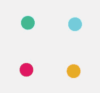

# 解开 Slack 的产品开发策略

> 原文：<https://medium.com/hackernoon/uncracking-slacks-product-development-strategy-ec10e21abda2>

*打造可持续技术产品的方法和原因*

我一直是 [Slack](https://hackernoon.com/tagged/slack) 的忠实粉丝，自从我开始使用它的网络应用程序(以及后来的移动应用程序)来管理我的团队。后来，我看到了 Slack 的[增长统计数据](https://techcrunch.com/2016/04/01/rocketship-emoji/)，这激起了我的好奇心，想知道 Slack 为什么以及如何成为如此成功的产品。

本文旨在通过我们最喜欢的搜索引擎 [Google](https://hackernoon.com/tagged/google) 提供的故事和信息来解释和推断 Slack 的产品开发策略。把这想象成一次解决难题的探索，我们将开始一次冒险，寻找缺失的拼图块，把它们拼在一起。

# 拼图 1:作为新市场创新的 Slack

Slack 是一种新的市场创新，它为人们开始使用即时消息(IM)作为团队沟通的一种形式打开了大门。以前通过电子邮件实现的任务和沟通通过 Slack 转移到 IM 平台。从注册到发布公告、讨论想法和更新工作进度，其精美的用户体验让普通用户非常容易使用。

Slack 作为一种新的市场创新，使其能够专注于与“非消费”而不是现有的 IM 市场竞争。这可以通过目标和任务细分市场来理解，这些目标和任务是典型用户在加入平台时试图实现的。HipChat、CampFire 和 Yammer 等工具并不是 Slack 的直接竞争对手，因为用户在这些平台上试图实现的目标与 Slack 不同。用户采用 slack 来完成以前通过电子邮件完成的任务。例如，发布公告从发送电子邮件转移到即时消息(空闲时间),因为起草的压力较小，并且可以灵活地在以后编辑公告。在电子邮件中讨论想法被转移到空闲频道。

> 推销创新，而不是产品——斯图尔特·巴特菲尔德

Slack 精心打造了产品的用户体验，以至于该公司能够吸引主流市场的团队进入 IM 市场。以前使用任何电子邮件平台或 WhatsApp 和脸书等主流社交平台进行交流的团队，现在都使用 Slack，因为它更有效，更容易完成更多以团队为中心的任务。通过使用新的市场创新，Slack 不仅从现有的 IM 市场吸引了消费者，还从电子邮件市场吸引了用户。Slack 的用户在一年内增长了 3.5 倍也就不足为奇了。

# 拼图 2:关注用户

无论是培养自己，建立关系还是经营公司，专注于重要的事情是释放潜力的关键。当 Slack 选择关注他们的用户时，它就掌握了解锁和实现其全部潜力的钥匙。事实上，他们非常了解他们的用户和用户试图完成的任务，这使得他们能够缩小产品功能的范围，专注于客户的结果。但是怎么做呢？

> 你的客户不在乎你知道多少，直到他们知道你有多在乎

围绕用户在实践什么来设计，并使之更好。Slack 的目标是减少 75%的电子邮件使用，它知道如何围绕用户在使用电子邮件时想要完成的任务进行设计，并将同样的行为转移到即时消息上。例如，组织和团队使用电子邮件来宣布更新，在电子邮件线程中讨论想法或主题，附上已完成的工作以获得反馈，并检查工作进度。这些都可以很容易地在 Slack 中完成，大大减少了提及(@everyone 来宣布更新)、标签(#channel 来表示想法或主题)、附加文档和跟踪工作流的集成以及可搜索的消息的时间和精力。这些都符合他们的三个核心重点:搜索、同步和简单的文件共享。Slack 没有重新发明轮子，也没有试图改变用户想要完成的工作。相反，他们围绕用户正在练习的内容进行设计，并做得更好。Slack 专注于客户重视的东西，并将其转化为他们的优势，以提高其在 IM 市场的竞争力。作为回报，Slack 得到如此多的爱也就不足为奇了。

# 拼图 3:发现驱动的方法

产品开发不仅是关于构建，也是关于学习。在一个不可避免变化的环境中运作，Slack 中的产品经理使用[发现驱动的方法](http://ritamcgrath.com/2007/06/discovery-driven-planning-praised-by-clayton-christensen/)来持续学习、构建和测量其产品。随着环境的变化，他们理解公司的目标，并提出实现目标需要满足的假设。他们像科学家一样运作，提出一个要测试的假设，不是在实验室，而是在不断变化的环境中。他们优先考虑需要测试的假设，因为他们知道时间是黄金。他们明白指标只是衡量他们目标的一种方法，而发现驱动的方法确保他们不会被历史数据所蒙蔽。正是这种从环境中不断学习的过程，在产品开发的学习、构建和测量的循环中，保持并促进了产品的成长轨迹。总而言之，产品的生命周期类似于人的生命周期:当你停止学习，你就停止成长。

# 拼图 4:通过收购来维持增长

作为一家了解持续创新重要性的公司，Slack 利用 2015 年收购 [Spaces](https://slackhq.com/spaces-joins-slack-5ad3a6cd6324#.q1cuag7ne) 和 [Screenhero](https://slack.com/screenhero) 的机会来维持其增长。Spaces 是一项颠覆性的创新，让用户可以在文本、代码、图像、任务列表和文件等任意组合上进行协作。允许用户以一种新的文件格式进行协作，这是他们以前无法做到的。此次收购使得 Slack 能够扩展其功能，为积极使用文档协作工具的现有客户提供服务，并将用例转移到自己的平台上。另一方面，收购 Screenhero 似乎是通过引入一项新功能来改善 Slack 业绩的明智之举:“[群呼](https://melbdigitalcreative.slack.com/pricing)”。这是因为 Screenhero 是 Slack 的持续创新，当它作为一个整体很好地集成到其产品中时。Slack 已经证明，当一个收购机会被充分利用时，这是一个维持增长的好策略。

# 拼图 5:坚韧不拔的细节

Connecting the dots

总的来说，Slack 的执行得到了创始团队培养和培育的人员、流程和文化的支持——勤奋、好奇和同理心。Slack 是团队作为一个整体展示的具体细节的产物。对细节的极大关注、对持续增长的努力以及人们在设计和建造时站在自己立场上的能力使得 Slack 成为用户喜爱的产品。

> 一条线由两个点连接而成，而 Slack 的散列标志线由之前展示的彩色点组成。坚韧不拔的细节是连接这些点来完成标志的力量，因此松弛。

Making your working life simpler, more pleasant and more productive

> 这篇文章受到了克莱顿·克里斯滕森的《创新者的解决方案》、埃里克·里斯的《精益创业》和制作精美的 Slack 的极大启发。

*重要来源:*

*   [*Slack 的第一位产品经理讲述如何让反馈的消防水管有用*](http://firstround.com/review/slacks-first-product-manager-on-how-to-make-a-firehose-of-feedback-useful/)
*   【Slack 如何成为(可能)有史以来发展最快的 B2B SaaS 业务
*   [我们这里不卖马鞍](/@stewart/we-dont-sell-saddles-here-4c59524d650d#.5i6ee3dtt)
*   [打造我们想要的工作场所](https://slackhq.com/building-the-workplace-we-want-31fff8d6ffe0#.af58vu173)

> [黑客中午](http://bit.ly/Hackernoon)是黑客如何开始他们的下午。我们是 AMI 家庭的一员。我们现在[接受投稿](http://bit.ly/hackernoonsubmission)并乐意[讨论广告&赞助](mailto:partners@amipublications.com)机会。
> 
> 如果你喜欢这个故事，我们推荐你阅读我们的[最新科技故事](http://bit.ly/hackernoonlatestt)和[趋势科技故事](https://hackernoon.com/trending)。直到下一次，不要把世界的现实想当然！

