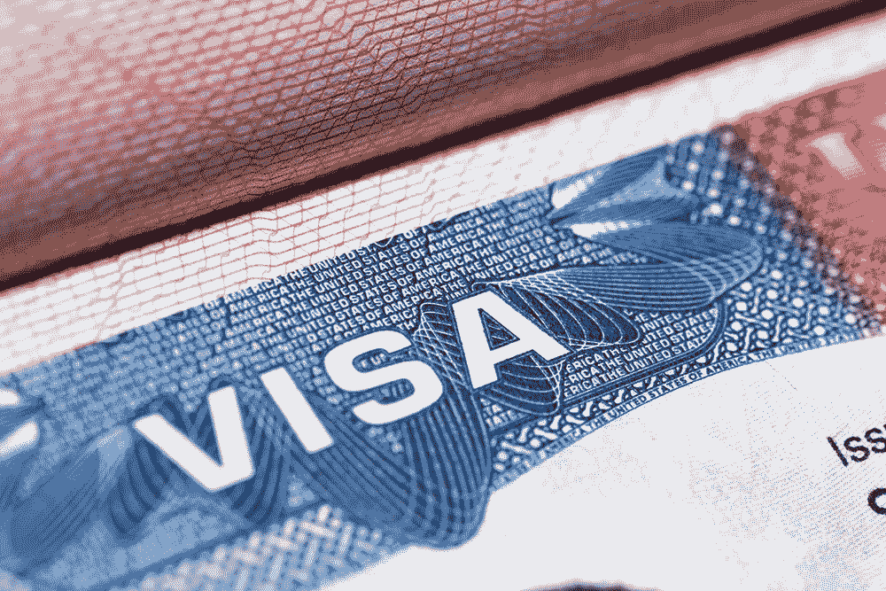

# 提高 H-1B 签证最低工资要求的意外后果

> 原文：<https://medium.com/hackernoon/unintended-consequences-of-increasing-minimum-salary-requirements-for-h-1b-visa-38cf1947e43d>

Source: images.google.com

一项新法案正在提交众议院。这一条是关于将 H-1B 签证的最低工资要求提高到 13 万美元。

H-1B 签证美国的一种非移民签证，允许雇主临时雇佣从事特殊职业的外国工人。H-1B 公司的雇员需要支付由政府为各种职业类型确定的最低工资。签证一直是科技公司雇佣急需技术工人的最常见方式，这些工人在美国不容易找到。

H-1B 签证最近再次受到几位政策制定者的抨击，指责其被外包公司滥用。立法者认为外包公司以较低的工资雇佣外国工人，抢走了美国人的工作。这些公司在外国雇佣人员，并以较低的收入将他们带到美国，从事以前由美国公民从事的工作。这些员工不熟练(根据预期的定义)，他们利用签证从事低质量的工作。

作为削弱外包公司竞争优势的一种方式，立法者希望提高在 H-1B 雇佣一名员工所需的最低工资。他们认为这将剥夺成本优势和美国公司将工作外包给其他国家的理由。

我想明确声明，我不是淡化立法者提出的问题，也不是以任何方式暗示目前的 H-1B 签证法没有问题。

我的假设是，仅从收入角度看待 H-1B 工人会导致美国经济的更大损失，即使它让一些美国公民就业。目前的 H-1B 项目有许多好处，不仅仅是立即就业。

我还没有机会阅读该法案，并不真正了解变化和实施的全部范围。我想强调几件事:

*   它可以豁免某些类别或类型的公司。例如，它可能仅适用于拥有高比例 H-1B 员工的公司
*   可能有其他程序来处理我不知道的某些问题
*   可能会提议对现行立法进行修改，以解决下述所有问题

现在，在这种背景下，我想分享我作为一名国际学生和 H-1B 签证持有人的观点*。

我认为，重要的是，不要把 H-1B 视为一种立即就业的签证，而是一种更大的工具，在人才生命的各个阶段吸引他们。我们需要了解 H-1B 签证持有人的生命周期，从他们获得签证之前开始，到他们被雇用之后。如果我们只关注公司/工资，而不是人们的故事，我们可能会错过很大一部分劳动力，他们可能在第一天就不熟练，但他们在美国的一生中增加了很多价值。

以下是 1B 提高最低工资带来的一些意想不到的后果:

1.  **减少来美国的国际学生数量** —目前约有 120 万国际学生在美国接受高等教育。来自中国和印度的国际学生数量最多。中国学生大多报读本科，印度学生报读研究生。大约 50%的国际学生注册 STEM 课程。这些学生在美国大学的学费上花费了 300 亿美元。奖学金被限制为零，这些学生大多贷款或有父母支持他们。美国学校不便宜。如果你的收入是印度卢比，并且必须用美元支付，没有贷款你是做不到的，如果你有贷款，你也不能在自己的国家挣足够多的工资来偿还贷款。对于大多数人来说，用印度人的工资还清美国学校贷款需要几十年的时间。这些学生在移居美国时需要某种工作上的确定性。他们知道如果他们努力学习并取得好成绩，他们就能找到工作。这些工作中的大部分最初不会支付 13 万美元。没有一家公司愿意给一个应届毕业生支付这么高的薪水(包括科技行业)。但随着新的最低工资要求，这些学生可能无法找到工作，因为公司需要支付 13 万美元申请 H-1B。只有 12 个月— 36 个月的选择，如果他们不支付 13 万美元，大多数公司都不支付，他们将不得不每年培训新员工。如果国际学生在毕业后找工作的这种确定性消失了，他们就会对来美国不那么感兴趣。他们祖国的学生贷款负担太重，他们不敢冒这个风险。美国院校每年将损失数十亿美元的学费。这就引出了我的下一个观点。
2.  **非营利机构的研究经费减少**——许多学校招收国际学生(学士和硕士)时没有经济资助。绝对没有**。这些学生支付昂贵的美国教育费用，其中很大一部分用于大学的研究项目。很多博士都是靠 MS 学生的学费资助的。如果国际学生停止移居美国(要么是因为 H-1B 现在更难，要么是他们的薪水达不到要求)，这肯定会对研究经费产生影响。这种影响不会被谈论太多，但研究是创新文化的基石之一，由于联邦资金的削减，它正在受到多方面的攻击。这将限制大学的研究努力。
3.  未来的企业家和商业领袖——许多后来成为工人的学生，包括 H-1B 的工人，在他们职业生涯的后期，当他们拿到绿卡，并真正有经验开始一些新的东西时，就会创办公司。人们需要时间在一个新的国家定居，还清债务(如果他们在美国学习过)，并进入冒险的心态。如果他们的父母没有移居美国，相当多的第一代和第二代商业领袖不会在这里。51%的 10 亿美元创业公司有一名非美国公民的联合创始人。最有可能的是，当他们搬到这里的时候，他们并不都是拿着高薪的天才。如果我们在一个狭窄的时间框架内看待 H-1B，我们可能会错过它在未来的积极影响。举个例子，很多现在的医生都是印度人，如果他们的父母没有在很多年前以 H-1B 或其他类型的工作/教育签证移民到美国，他们就不会在这里。
4.  **护理和教育**等行业的就业——还有许多其他非技术类别，如教育和卫生，许多国际工人持 H-1B 签证。与科技招聘相比，这些行业相形见绌，但考虑其影响很重要。哈佛和其他学校的许多教师是来美国上学或工作的人，他们不得不持 H-1B 签证工作一段时间，收入水平低于新规定的要求。护士和其他专业人员也是如此。
5.  **吸引有创新精神的年轻人**——最后但同样重要的是，美国被视为一个拥有创新精神和勤奋工作的人的国家，这一点很重要。世界上有大量的人才可以帮助人类更快地发挥他们的潜力——只要给他们机会。美国被认为是最有机会的国家，如果这种感觉开始消退，人们会找到新的目的地(其他国家会抓住这个机会)。根据皮尤研究，美国将因为移民而保持年轻国家的地位。年轻人在他们的黄金时期搬到这里——他们努力工作，除了为自己创造更好的生活之外，还为国家增加了大量的价值。这不仅仅是 1B 的问题，但是如果美国对年轻的、有创新精神的、努力工作的人失去了吸引力，其他一些国家也会失去吸引力。

如果我们真的想让美国成为创新的温床，我们不仅需要让现在伟大的人在这里工作，还需要让未来伟大的人在这里工作。它们可能不会立即产生巨大的影响，但它们可能会成为未来几年创新的巨大源泉。由于背景不同，他们可以为工作场所带来新的观点和想法，并帮助美国保持在创新金字塔的顶端。

* *对于来自经济落后国家的学生，有限的奖学金可能很少

* 2010 年，我作为 MS 的国际学生来到美国，就读于纽约哥伦比亚大学。然后是被占领土，最后是 1B。去年开了一家公司，通过 Y Combinator。按照提议的上限，我没有资格申请签证。

> [黑客中午](http://bit.ly/Hackernoon)是黑客如何开始他们的下午。我们是 [@AMI](http://bit.ly/atAMIatAMI) 家庭的一员。我们现在[接受投稿](http://bit.ly/hackernoonsubmission)，并乐意[讨论广告&赞助](mailto:partners@amipublications.com)机会。
> 
> 如果你喜欢这个故事，我们推荐你阅读我们的[最新科技故事](http://bit.ly/hackernoonlatestt)和[趋势科技故事](https://hackernoon.com/trending)。直到下一次，不要把世界的现实想当然！

