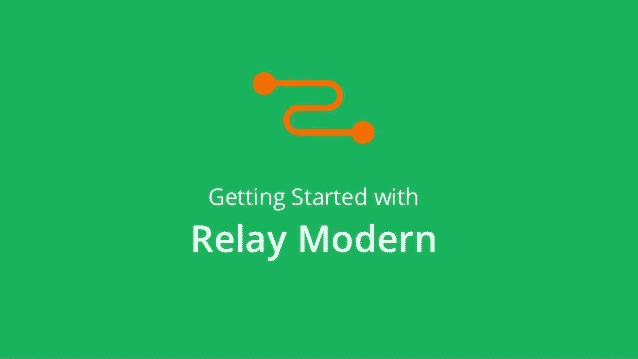

# 使用 Relay Modern 创建 React 应用程序

> 原文：<https://medium.com/hackernoon/using-create-react-app-with-relay-modern-989c078fa892>



本教程假设你已经熟悉[**Create React App**](https://github.com/facebookincubator/create-react-app)(CRA)和一点点 [**Relay**](http://facebook.github.io/relay/docs/relay-modern.html) ，只是在寻找一些如何一起使用它们的例子。在这里，您将了解到:

*   如何修改 Create [React](https://hackernoon.com/tagged/react) 应用程序设置以在其配置中使用“巴别塔插件中继”
*   如何配置中继编译器
*   如何使用继电器的`<QueryRenderer />`组件
*   当用户浏览站点时，如何用 Relay 获取数据

注意，网上很多教程都是覆盖 Relay 以前版本的(又名 Relay Classic)。它与 Relay Modern 有很大的不同，所以最好忽略那些不要混淆自己。

**TL；DR** —访问 GitHub 上的`[**kriasoft**](https://github.com/kriasoft)/[**react-static-boilerplate**](https://github.com/kriasoft/react-static-boilerplate)`资源库，获得完整的 Create React App + Relay Modern 示例。

# 向 CRA 注入“巴别塔插件中继”

你可能知道，Create React App 的可扩展性不是很好。基本上，在定制 Babel/Webpack 配置时，您只剩下以下几个主要选项:

**选项 1** :运行`yarn eject`，调整 Babel/Webpack/PostCSS 等。在项目中就地配置。但是在这种情况下，您将无法轻松地将您的应用程序升级到 React 相关工具的新版本。这首先违背了使用 Create React App 的目的，而不是使用一些流行的样板文件，如 [React Starter Kit](https://github.com/kriasoft/react-starter-kit) (RSK)，您可以克隆这些文件，但仍然能够将更新拉回到您的项目中。

**选项 2** :派生`create-react-app`存储库，并使用“react-scripts”的补丁版本。注意，更新你的餐叉会消耗你的一些空闲时间，你可以把这些时间用在更有用的事情上。参见 [React App SDK](https://github.com/kriasoft/react-app) 作为一个例子，它允许使用自定义配置覆盖扩展 CRA，并带有服务器端代码支持。

**选项 3** :创建一个脚本，每当您运行`yarn build`或`yarn start`时，该脚本将自动修补您的“react-scripts”NPM 模块。我个人认为这个选项更实用，因为它帮助我在初始设置期间更快地完成工作，并且在未来[的](https://hackernoon.com/tagged/future)中以更少的工作量保持我的项目最新。

在引导一个新项目之后(通过运行`yarn create react-app`，您将需要安装 Relay 的运行时和开发依赖项:

```
$ yarn add relay-runtime react-relay
$ yarn add relay-compiler babel-plugin-relay --dev
```

接下来，在项目的根目录下创建“setup.js”文件，内容如下:

```
const fs = require('fs');
const path = require('path');

const file = path.resolve('./node_modules/babel-preset-react-app/index.js');
const text = fs.readFileSync(file, 'utf8');

if (!text.includes('babel-plugin-relay')) {
  if (text.includes('const plugins = [')) {
    text = text.replace(
      'const plugins = [',
      "const plugins = [\n  require.resolve('babel-plugin-relay'),",
    );
    fs.writeFileSync(file, text, 'utf8');
  } else {
    throw new Error(`Failed to inject babel-plugin-relay.`);
  }
}
```

最后，更新`package.json`文件中的“脚本”部分，以便在`react-scripts <command>`之前运行该脚本:

```
"scripts": {
  "build": "node ./setup && react-scripts build",
  "test": "node ./setup && react-scripts test --env=jsdom",
  "start": "node ./setup && react-scripts start"
}
```

现在，每当你运行`yarn build`、`yarn test`或`yarn start`时，巴别塔编译器将按照 Relay Modern 的要求使用“巴别塔插件中继”。

# 配置中继编译器

下一步是配置 Relay 编译器，其目的是找到您代码中的所有`graphql`…``查询，预编译它们并保存到上一步“babel-plugin-relay”所消耗的`__generated__/*.graphq.js`文件中。

为了做到这一点，首先，您需要将 GraphQL 模式的基于文本的表示保存到项目内部的一个文件中，假设您的 React 应用程序打算与一些外部 GraphQL API 一起工作。然后在将运行`relay-compiler`的`package.json`中再添加一个 *npm 脚本*。它可能看起来像这样:

```
"scripts": {
  ...
  "relay": "curl [https://graphql-demo.kriasoft.com/schema](https://graphql-demo.kriasoft.com/schema) -o ./src/graphql.schema && relay-compiler --src ./src --schema ./src/graphql.schema
}
```

在这个练习中，我们将使用位于[https://graphql-demo.kriasoft.com](https://graphql-demo.kriasoft.com)([源代码](https://github.com/kriasoft/nodejs-api-starter))的现有 GraphQL 演示 API。

在运行`yarn relay`之前，确保您的开发机器上安装了脸书的 [Watchman](https://facebook.github.io/watchman/) 工具。

现在，每当您在代码中更改一些 GraphQL/Relay 查询时，您将需要再次运行`yarn relay`,或者通过运行`yarn relay -- --watch`让它在一个单独的 shell 窗口中以监视模式运行。

> ***问*** :我是否需要通过在`.gitignore`后面追加 `__generate__/**`来从我的源代码控制中排除中继编译文件生成的文件？
> ***A*** :好问题:)是的，根据经验，你不希望你的源代码库中有任何自动生成的文件。

尝试将下面这段代码放入您的任何源文件中(例如放入`src/index.js`)并运行`yarn relay && yarn build`:

```
import { graphql } from 'relay-runtime';graphql`query { me { displayName } }`;
```

如果您可以构建没有任何错误的项目，很可能前面的两个步骤都是正确的。

# 如何初始化中继客户端(环境)？

这部分很简单，按照官方文件做就行了。您的中继客户端(环境)将看起来像这样(`src/relay.js`):

如果你想的话，你甚至可以直接使用它而不用“反应-中继”包。这里有一个例子:

```
import { graphql, fetchQuery } from 'relay-runtime';
import relay from './relay';fetchQuery(
  relay,
  graphql`query { me { displayName } }`
).then(...);
```

在现实世界的项目中，您需要将上面代码示例中的硬编码 API URL 替换为如下内容:

```
fetch(process.env.REACT_APP_API || 'http://localhost:8080', ...)
```

..因此，您可以在开发/测试/生产环境中轻松运行您的应用程序。有关将环境变量注入应用程序的更多信息，请参考《创建 React 应用程序用户指南》。

# 如何使用<queryrenderer>组件</queryrenderer>

Relay Modern 带有一个方便的`<QueryRenderer />`组件，你可以在应用程序的顶层使用，有点类似于 Redux 的`<Provider>`组件。它将通过*上下文*将 Relay 的环境(包括 Relay store 和 HTTP client)传递给所有的 React 子组件。此外，它将为您处理更新，因此您不需要在运行突变后手动重新渲染您的组件。

逻辑看起来是这样的——每当用户打开您的站点，或者从一个页面/屏幕导航到另一个页面/屏幕，您找到相应的 GraphQL 查询和该页面的参数(变量)列表，将其传递给<queryrenderer>并让它完成工作(它将获取丢失的数据并重新呈现受影响的子组件)。</queryrenderer>

您的顶级 React 组件(`src/App`)将如下所示:

上面的代码示例使用“history”NPM 模块进行导航，使用“universal-router”将 URL 路径解析为路由。`src/history.js`的内容如下:

```
import createHistory from 'history/createBrowserHistory';
export default createHistory();
```

它是围绕 HTML5 历史 API 的跨浏览器包装器，允许你对客户端发起的`window.location`中的变化引起的任何变化做出响应，并修改该状态，例如通过调用`history.push(..)`。

`src/router.js`的内容更有趣一点。给定应用程序路由列表和一个全局路由器处理函数，它初始化并导出一个`universal-router`类的实例。

顺便说一句，在使用 GraphQL/Relay 的情况下，使用声明式路由方法是有意义的(与命令式路由相反)，这意味着所有的路由都只包含元数据，不包含处理程序。至少，每个路由都可以包含 URL 路径字符串(模式)、GraphQL 查询和要呈现组件，例如:

```
const routes = [
  {
    path: '/posts/:id',
    query: graphql`query routeStoryQuery($id: ID!) {
      post: node(id: $id) { ...Post_post }
    }`,
    component: () =>
      import(/* webpackChunkName: 'post' */, './Post')
  },
  ...
]
```

现在，您可以通过提供路由列表和一个全局路由器处理程序(解析器)函数来初始化路由器，如下所示:

```
import Router from 'universal-router';
import { graphql } from 'relay-runtime';const routes = [ ... ]; // see aboveexport default new Router(routes, {
  resolveRoute({ route, next }, params) {
    if (!route.component) next();
    return {
      query: route.query,
      component: route.component(),
      variables: params,
    };
  }
});
```

您需要稍微调整一下这个例子，以涵盖更多的用例。想法是，当找到相应的路由(URL 匹配)时，它应该开始下载该页面/屏幕的 JavaScript 块，同时将查询和变量传递给`QueryRenderer`(参见上面的`src/App`示例)，有效地触发该路由的数据获取。唯一的问题是，当 QueryRenderer 完成获取数据时，您需要确保异步块加载也完成了它的工作(promise resolve ),然后才能呈现页面，为此您使用了一个中间(AppRenderer)组件。

您可以在路径中放置或多或少的元数据来适应您的应用程序，例如，您可以放置如下身份验证规则:

```
{
  path: '/admin/users',
  query: graphql`...`,
  component: () => ...,
  authorize: { roles: ['admin'] } // or, "authorize: true" etc.
}
```

使用 GraphQL / Relay，您可能希望一次为特定页面/屏幕上的所有组件获取数据(而不是为每个嵌套级别的组件单独获取数据)，否则会稍微降低 GraphQL 的价值。

有关使用 Relay Modern 创建 React 应用程序的完整示例，请访问`[**kriasoft**](https://github.com/kriasoft)/[**react-static-boilerplate**](https://github.com/kriasoft/react-static-boilerplate)` —这是一个在 React/Relay 堆栈上创建单页应用程序的流行样板，如管理面板、仪表板等。不需要服务器端渲染的地方。您不仅可以将它用作示例，还可以将其作为 React 项目的种子，从而节省大量从头配置一切的时间。请随时在 [Gitter](https://gitter.im/kriasoft/react-static-boilerlpate) 或 [Twitter](https://twitter.com/koistya) 上 ping 我，如果你遇到任何问题，我很乐意帮忙。

**附注**:这个项目有一个 [OpenCollective 页面](https://opencollective.com/react-static-boilerplate):)非常欢迎您的支持！