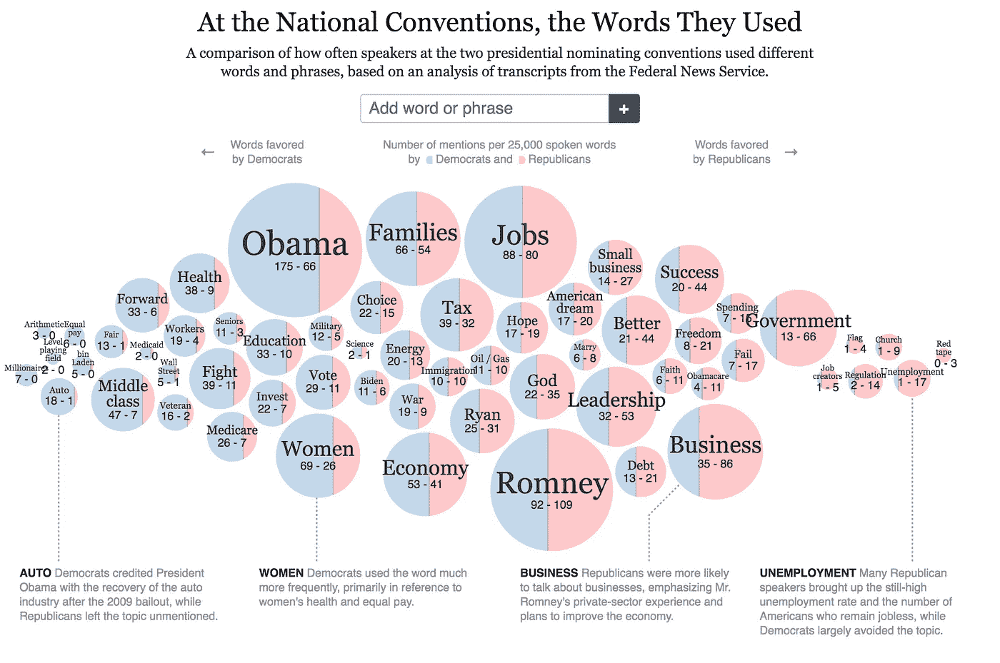
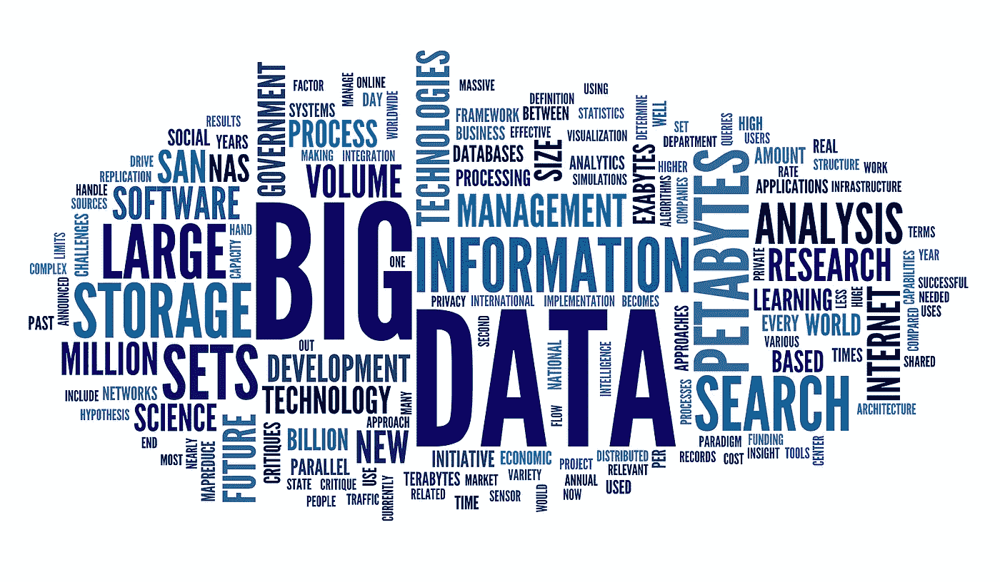
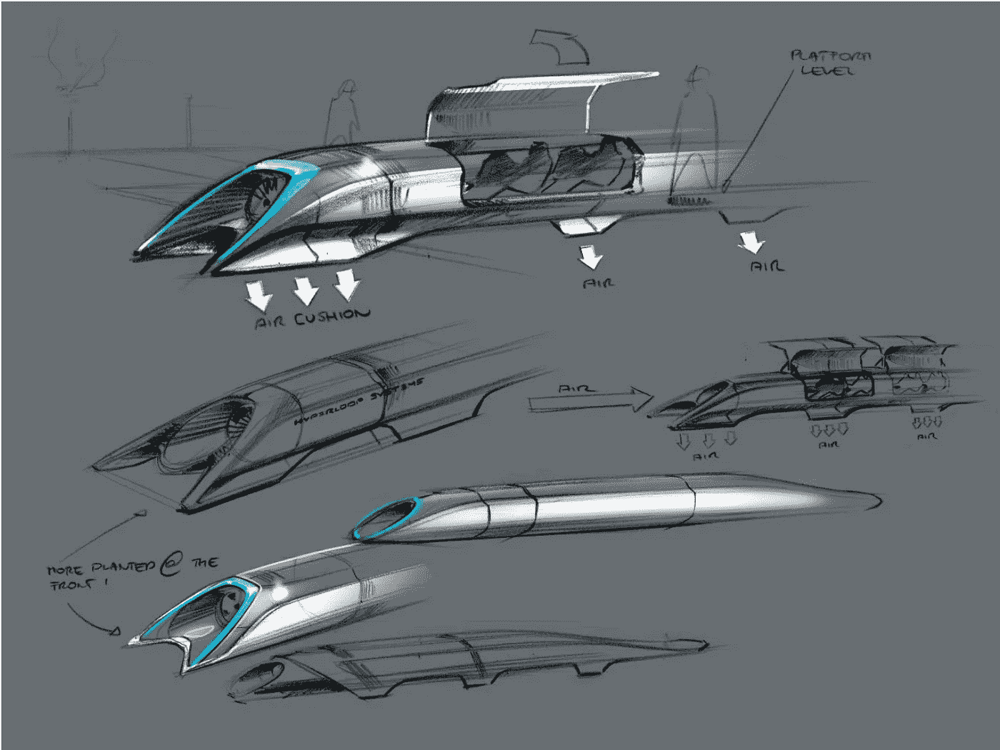
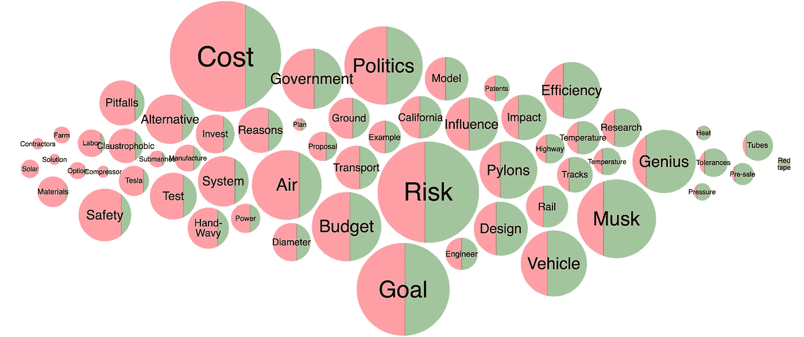

# 使用机器学习来可视化客户偏好

> 原文：<https://medium.com/hackernoon/using-machine-learning-to-visualize-customer-preferences-6a007cfb9b97>

## 关于 Hyperloop 发布的案例研究

2012 年，我在《纽约时报》上看到了最惊人的可视化。它是由我最喜欢的工程师之一迈克·博斯托克和他的数据可视化专家团队创建的，旨在让读者更深入地了解奥巴马连任竞选中最具两极分化的问题。

当我们推出 Soylent 时，我们被黑客新闻、Twitter 和 Reddit 上的评论淹没了。反馈太多了，有正面的，也有负面的，我们实际上无法通读每一条评论。面对有太多[客户](https://hackernoon.com/tagged/customer)反馈的问题(这是一个惊人的问题)，我建立了一个解决方案，让我们向我们的支持者和批评者强调最重要的问题。该分析概括得相当好，所以我将概述我是如何设计该系统的，然后使用 Elon Musk 的 Hyperloop 公告和与之相关的讨论作为例子。

## 《纽约时报》视觉效果的实际运作方式:

> 根据对联邦新闻处文字记录的分析，比较了两次总统提名大会上发言人使用不同词汇和短语的频率。

基本上，NYT 可视化中的气泡越大，这个词在演讲中被提到的次数就越多，就像传统的词云一样。但是 NYT 的视觉化是不同的，因为它实际上给了你一个有用的视角，让你看到问题在双方之间的位置。正常的词云只是突出热门话题，并不能真正教会你什么。

## 无用词云示例:

除了与某个主题广泛相关的流行语之外，这个词云实际上没有教给你任何关于这个主题的东西。不同的颜色实际上与任何信息都没有关联。有许多关于标准单词云的陷阱以及它们如何误导人的优秀文章。我偏爱[这一篇，纽约时报的一位高级软件架构师将它们描述为“互联网的鲻鱼”](http://www.niemanlab.org/2011/10/word-clouds-considered-harmful/)

## “加权”单词云有何不同:

在 NYT 的例子中显示的加权词云是不同的，因为它不仅显示了什么概念是热门话题，而且还显示了它们在一个问题的两个方面的位置(政治立场)。这与顾客反馈分析相关，因为你收到的关于你产品的反馈，是一个类似于政治光谱的连续统一体。就像民主党人和共和党人会在他们的大会演讲中强调不同的政策主题一样，支持者和反对者会在他们的评论中强调完全不同的产品特性。当推出一个新产品时，尤其是一个收到不同反应或引发争议的产品时，将支持者的反馈与批评者的反馈区别对待是非常重要的，加权词云可以帮助你做到这一点。使用[机器学习](https://hackernoon.com/tagged/machine-learning) /自然语言处理，我们可以通过情感分析自动将评论分类为正面、负面或中性，然后使用实体解析准确找到每个评论的核心问题。如果你想了解更多关于情绪分析及其工作原理的知识[，瓦拉·梅德哈特、艾哈迈德·哈桑和霍达·科拉什写了一篇关于 2014 年该领域的精彩综述](http://www.sciencedirect.com/science/article/pii/S2090447914000550)。

## 建立一个自动化系统来进行这种分析:

我认为这将是查看各种产品在线可用数据的一种很酷的方式，所以我使用 HackerNews API、Google 的自然语言 API 和 D3.js 围绕这种类型的分析建立了一个自动化。所有这些都使用 Python 连接在一起。我想为此建立一个 web 接口，并使其公开可用，但我有点担心如果人们开始频繁使用它，所有 API 调用的成本。

HackerNews API 托管在 Firebase 上，GitHub 上记录了[。它让我们可以很容易地获取关于一个故事的所有评论。一旦我们有了这些评论，我们就可以使用 Google 的](https://github.com/HackerNews/API)[云自然语言 API](https://cloud.google.com/natural-language/) 进行实体解析和情感分析。一旦我们聚集了所有最常被提及的实体及其相关的情感得分，将这些数据插入到加权的词云中是很容易的。

## 该代码主要执行以下操作:

1.  使用 HackerNews ID 从 HackerNews API 获取评论 ID。
2.  遍历评论线程以获得所有相关的故事评论。
3.  将每个注释提交给自然语言 API 并存储结果。
4.  将结果转换成 JSON 对象，以便在 D3 中可视化。
5.  用 D3 根据情绪给每个实体画一个彩色泡泡。

这里最关键的一步是对每条评论进行情感分类，分为正面或负面。这就是机器学习实际发挥作用的地方，也是使将评论分为两类(支持者和反对者)成为可能的地方，这两类评论可以很好地映射到加权词云。在截图中，您可以看到一些来自 Google 自然语言 API 的示例结果。使用这种 API 基本上消除了钻研训练和使用新的机器学习模型带来的所有复杂性的需要。谷歌的模型高度准确、可靠，最重要的是，通过简单的 API 调用就能以可承受的价格获得。在 API 示例中，整个文档被分类为表达积极情绪(在-1.0 到 1.0 的范围内得分为 0.3)。此外，识别了九个不同的实体，其中三个实体具有与其相关联的情感。

当每个评论被传递给自然语言 API 时，文档情感得分连同其中标识的实体一起被存储。这些构成了我们加权词云的基础。最常被提及的实体会有较大的气泡，这些气泡会根据他们的情绪被加上阴影。情绪分析加权词云使用红色代表批评者，绿色代表支持者，而不是红色代表共和党，蓝色代表民主党的配色方案。最后，这个可视化是使用优秀的 JavaScript 库 D3.js 绘制的，[使用强制导向的图形布局](https://github.com/d3/d3/blob/master/API.md#forces-d3-force)。

## 在 Hyperloop 发布会上使用这一分析

Concept imagery from Hyperloop Alpha

出于几个原因，我认为通过使用这种类型的分析进行案例研究来重温 Hyperloop 发布公告是合适的。首先，埃隆·马斯克(Elon Musk)周二刚刚宣布，[他的最新企业， *The Boring Company，*将建造一个全功能的 Hyperloop](https://www.wired.com/story/great-elon-musk-building-hyperloop/) 。其次,《Hyperloop 宣言》可能是我近年来能想到的最完美的发布前预告。几十年来，风险资本家一直在为预发行公司提供资金，提供最基本的市场信号(“风险资本家认为这是个好主意吗”)。最近，KickStarter 和更广泛的众筹创造了一批公司，这些公司受益于在投入巨资开发实际产品之前，能够与潜在用户一起测试他们的理论，但 Hyperloop 的公告将这一想法提升到了一个新的水平。通过在宣布制造该产品的实际计划前四年宣布一种产品(真空管中的高速列车)的想法，埃隆能够以很少的前期投资推广这种想法，并了解什么对潜在消费者最重要。

以下是 HackerNews 对最初的 Hyperloop 发布的评论，使用情绪加权词云进行可视化后的样子。

## 一些关键要点:

*   批评者最担心的是成本和安全。基础设施项目是出了名的超预算和耗时过长([见大挖掘](https://en.wikipedia.org/wiki/Big_Dig))，这是评论中的一个常见话题。
*   支持者认为埃隆·马斯克是一个可以成就任何事情的天才。总的来说，他的明星效应在 HackerNews 上确实很重要，但我认为这次宣布让他进入了一个新的类别。
*   政治因素对双方来说都是一个重要问题。评论者喜欢寻找绕过监管的方法，但似乎无法就政府将如何影响 Hyperloop 达成共识。
*   支持者更关注具体的设计标准，如温度、压力、公差和塔架。这份 58 页的文件非常详细，支持者非常关注该项目的技术细节。
*   批评者似乎专注于建设 Hyperloop 的可行性以及相关成本，如承包商、农场、电力和投资者。这与成本有关，但也触及到规划这种规模的一些子问题。

不过这只是冰山一角，从围绕一个共同主题的评论中可以获得许多有趣的见解。这种类型的分析可以帮助公司了解什么问题对他们的客户最重要，甚至在他们推出之前。

## 我们如何在 Soylent 使用它:

在 Soylent，进行这种类型的分析使我们认识到，我们的客户对产品健康、方便和实惠这一事实感到最兴奋。当我们查看 Soylent 之前的可用资源时，似乎总是只能从三个中选择两个。通过种植和烹饪食物可以获得健康和便宜的食物，但这并不方便。任何快餐店都可以买到便宜又方便的饭菜，但是它们不健康。餐馆里有方便和健康的选择，但价格不贵。这三个关键信息在早期阶段营销 Soylent 时给了我们一个方向。

在一个公司的早期阶段最重要的事情是和你的客户交谈。如果你有幸有一个充满嗡嗡声的发布会，有很多人在讨论，我强烈建议你利用这一点，尽你所能把信号从噪音中分离出来。你的支持者抓住的特性和想法可以作为清晰的产品开发指南。同样，你的诽谤者围绕的讨论话题可能值得在博客帖子或未来的营销活动中提出，你可能会赢得一些支持。

如果您想进一步讨论这个问题，或者需要帮助解析您的客户数据，请随时联系我。我很乐意帮忙。

***感谢阅读！如果你觉得这篇文章有趣，请点击下面的推荐按钮！***

【www.twitter.com/johncoogan】*你可以在推特上联系我:*