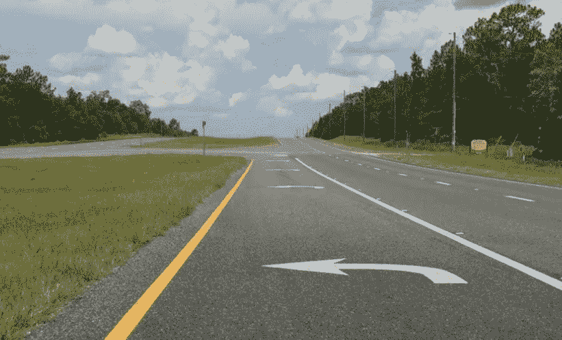

# 特斯拉对 2016 年的自动驾驶撞车事故负责吗？

> 原文：<https://medium.com/hackernoon/was-tesla-responsible-for-the-2016-autopilot-crash-ed84ddd3324a>

## NTSB 表示，汽车制造商必须防止滥用其自主系统——但没有说明如何做到。

Approach to scene of the crash between a Tesla Model S and a semitrailer near Williston, FL. Source: NTSB report.

毫无疑问，自动驾驶汽车将使我们的道路更加安全，减少事故和死亡。但是它们不会完美，有些 AVs 会[崩溃](https://hackernoon.com/tagged/crash)。2016 年 5 月，一辆在[自动驾驶](https://hackernoon.com/tagged/autopilot)模式下行驶的特斯拉 Model S 在佛罗里达州威利斯顿附近撞上了一辆半挂车，司机约书亚·布朗丧生。

坠机后，NHTSA 分析了发生的事情。它澄清了特斯拉的错误，称其未发现主题车辆的 AEB 或自动驾驶系统的任何“[设计或性能缺陷，也未发现任何系统未按设计](https://static.nhtsa.gov/odi/inv/2016/INCLA-PE16007-7876.PDF)运行的事件。事实上，NHTSA 继续分析我所有 2014 年至 2016 年特斯拉 Model S 车辆的安全气囊部署数据，发现在安装 Autosteer(自动驾驶仪的一个组件)后，车辆的碰撞事故实际上*减少了*40%——这是一个巨大的数字。这一结论是对自动驾驶的非常有力的信任票，进而也是对自动驾驶汽车改善道路安全的能力的信任票。

然而，上个月事情变得更加复杂。美国国家运输安全委员会(NTSB)也研究了这起坠机事件，并得出了一些[明显不同的结论](https://www.ntsb.gov/news/press-releases/Pages/PR20170912.aspx)。NTSB 的报告同意 NHTSA 认定的整体事实:自动驾驶系统没有将半挂车识别为威胁，因此没有警告司机或开始制动，司机在撞车前没有采取任何制动或转向措施。

> NTSB 本质上是说，特斯拉应该让车辆的驾驶员/乘客更难或不可能在奇怪的情况下使用自动驾驶模式，无论是从它行驶的位置来看，还是从注意力来看。

但 NTSB 将其分析扩展到了自动驾驶系统的“操作设计领域”(ODD)问题——基本上，就是该系统应该被使用的条件。它发现了自动驾驶仪的两个主要问题:首先，“司机可能会在不打算使用自动驾驶仪系统的道路上使用自动驾驶仪系统”。第二，“尽管特斯拉自动驾驶仪的操作设计需要专注的驾驶员作为一个不可或缺的系统元素，但威利斯顿碰撞车辆上的自动驾驶仪允许驾驶员在自动控制模式下操作近 6 分钟，在此期间，系统**没有检测到驾驶员的手放在方向盘上**”。

NTSB 本质上是说，特斯拉应该让车辆的驾驶员/乘客更难或不可能在奇怪的情况下使用自动驾驶模式，无论是从它行驶的位置来看，还是从注意力来看。在某种意义上，NTSB 在这一点上是绝对正确的:特斯拉的自动驾驶仪过去(现在仍然)只是一辆 [SAE Level 2](https://www.sae.org/misc/pdfs/automated_driving.pdf) 自动驾驶汽车(“部分自动化”)，因此人类司机仍然明确负责监控环境，并准备在必要时收回对车辆的控制。但报告发现的核心是，特斯拉作为制造商，至少要对车主/司机的行为与预期的不一致负部分责任——最明显的是，没有注意。

> AVs 制造商希望找到方法，确保他们的系统只在特殊情况下使用，即使司机/乘客不想遵守这些限制，即使没有明确的监管要求。

NTSB 不是监管机构，他们报告中的发现通常被限制在法律诉讼中使用。但是这份报告中的发现仍然会对 AV 安全政策和实践的发展产生重要的影响。在政策方面，我们在国会正在考虑的[当前版本的立法中没有看到任何这些考虑因素](/@cfmccormick/whats-in-the-self-drive-act-6c090e8a2e9a)，但是在进一步的立法程序中可能会包括一些方面。

在 AV 安全实践方面，自动驾驶汽车很可能会将道路事故的法律责任[从司机疏忽范式转移到产品责任范式](https://papers.ssrn.com/sol3/papers.cfm?abstract_id=2923240)。这意味着 AVs 制造商将希望找到方法来确保他们的系统只在奇数情况下使用，即使司机/乘客不想遵守这些限制，即使没有明确的监管要求这样做。他们怎么能这样做？

ODD 最明显的方面是**位置** : AVs 应该只在有限的区域内运行。原则上，这可以在使用地理围栏的车辆上实施，即仅在某些物理区域启用车辆的自主能力。但是还不清楚这在实践中是如何运作的。如果一个 AV 司机/乘客试图将车辆引导到一条不寻常的道路或区域，车辆会简单地拒绝去那里吗，除非人类恢复控制？这安全吗，特别是如果司机/乘客在没有太多准备时间的情况下指挥车辆这样做？对于如何发生这种情况，没有明确的程序，特别是在 ODD 很复杂的情况下，例如包括某些类别的道路(如分车道公路)，但排除非常接近的其他道路(如出口匝道外的未分车道)。除非人类及时抓住方向盘，否则自动驾驶模式下的 AV 会在匝道上呼啸而过吗？

ODD 的下一个最明显的方面是**驾驶员意识**。对于低于 SAE 级的所有 AVs，人类负责一定量的情境意识和可用性以执行驾驶任务。这是有问题的，因为人类非常不擅长监控通常处于正常(即非故障/非紧急)模式的自动化系统。NTSB 首席研究员明确指出了这一点，[指出](https://blog.caranddriver.com/a-tesla-crash-but-not-just-a-tesla-crash-ntsb-issues-final-report-and-comments-on-fatal-tesla-autopilot-crash/)对核电站操作员的研究表明[人类不太擅长“注意力任务”](https://www.aps.org/publications/apsnews/201011/boringenvironme.cfm)。因此，AV 制造商需要找出方法来监控人类是否在注意道路，如果没有，就(优雅地)关闭自主性。

> 如果一个 AV 司机/乘客试图将车辆引导到一条不寻常的道路或区域，车辆会简单地拒绝去那里吗，除非人类恢复控制？

还没有人真正解决这个问题。Autopilot 试图通过监控手是否放在方向盘上来衡量司机的注意力，但这显然是有缺陷的——当你实际上在膝盖上用手机观看 YouTube 时，很容易将一只手放在方向盘上。一些汽车制造商正在开发内部驾驶员监控摄像头系统，该系统可以跟踪驾驶员的面部和眼睛，以确定他们的注意力是否分散。一个例子是 2018 款凯迪拉克中的通用超级巡航系统；不幸的是，这真的会让司机很恼火，而且不一定准确。如果司机无视多次警告，该系统目前的紧急救助方法是减速到车道中央停下来——在大多数情况下这并不理想。

正确监控驾驶员意识将是一个重大问题，也是开发 AVs 的一个重要部分。目前这个领域最有趣的公司之一是 Nauto，它正在开发更复杂的监控驾驶员注意力的方法，并且肯定[吸引了很多投资者的注意](https://www.recode.net/2017/5/3/15524506/self-driving-startup-autonomous-distracted-driving-nauto)(在未来的帖子中会有更多关于他们的信息)。这是一个如此棘手的问题，以至于有些公司认为这是没有希望的，并且已经放弃了 2 级和 3 级(在某些情况下 4 级)AVs。一个例子是 Zoox，它完全避开了人类可用的控件，直接跳到第 5 级；他们似乎正在积极地[攫取工程人才](https://www.bloomberg.com/news/articles/2017-08-30/group-of-17-apple-auto-engineers-is-said-to-join-startup-zoox)以实现这一愿景。

> 还有一个问题是如何向不耐烦的车主解释这些限制(并证明其合理性),这些车主不想停止观看*权力的游戏*并接手驾驶去扫雪。

除了位置和驾驶员的意识，还有其他方面的问题，最明显的是**天气**(雾、雨、雪和其他不理想的天气条件可能会严重影响 AV 性能)，在某些情况下**一天中的时间**(日落时的眩光也可能是一个限制)。与其他维度一样，对于如何遵守这个奇怪的限制在实践中实际工作，仍然没有很好的理解。如果开始下雪，AV 会停在路边吗？谁来决定雪会在多大程度上阻碍车辆的运行能力——制造商、监管机构还是其他机构？还有一个问题是如何向不耐烦的车主解释(和证明)这些限制，这些车主不想停止观看*的《权力的游戏》*并开车去扫雪，他们可能会决定下次开一辆感觉不太像保姆的不同品牌的车。

总的来说，NTSB 的报告提出了一些关键的问题，即考虑到人性和技术的现实，AVs 将如何在现实世界中实际运作。这使得考虑反病毒政策变得更加复杂，但从长远来看，这是一件非常好的事情。