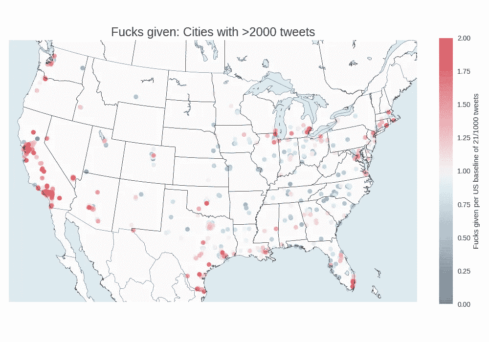
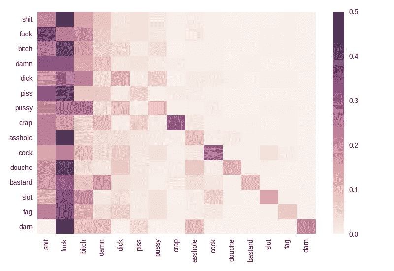
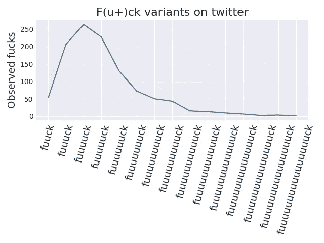
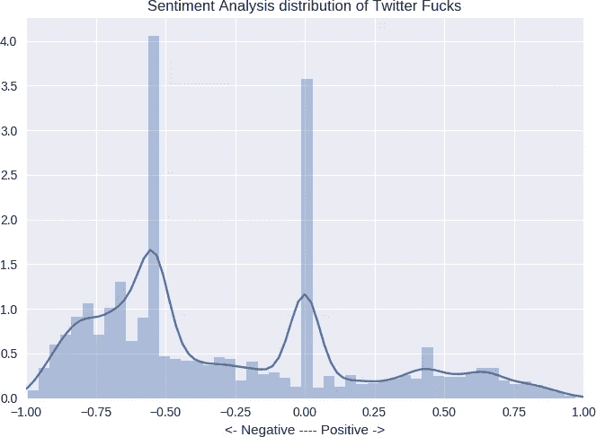

# 华盛顿一点也不在乎

> 原文：<https://medium.com/hackernoon/washington-d-c-gives-no-fucks-be51aa152fe>

## 在推特上寻找性交和其他世俗的观察

我们国家的首都现在是夏天。潮湿和政治气候令人难以忍受，华盛顿的居民根本不在乎——至少不是真的不在乎。我们怎么知道？我和另一位数据科学家丽贝卡·梅塞罗尔(Rebecca Meseroll)从邻近的 48 个州收集了超过 1070 万条推文，发现每 1000 条推文中大约有 21 条出现了“他妈的”。换句话说，略高于 2%的美国推特包含至少一个单词“他妈的”。我们的分析揭示了这个地区相对于全国其他地区来说缺乏性交；华盛顿当地的做爱频率只有每 1000 条微博 11.7 次。然而，其他地方的语言就不那么纯洁了。怀俄明州、加利福尼亚州和内华达州的推特上充斥着大量脏话，每 1000 条推特中超过 25 条含有色情内容——是华盛顿特区的两倍多。



*Regional frequency of fuck usage on Twitter by city (left panel) and state (right panel). Full dataset for all cities provided at* [https://github.com/thoppe/twitterf_cks/blob/gh-pages/data/fucks_to_give_geo.csv](https://github.com/thoppe/twitterf_cks/blob/gh-pages/data/fucks_to_give_geo.csv) and states at [https://github.com/thoppe/twitterf_cks/blob/gh-pages/data/fucks_to_give_geo_state.csv](https://github.com/thoppe/twitterf_cks/blob/gh-pages/data/fucks_to_give_geo_state.csv).

```
**State  Total tweets   # of fuck-containing tweets (per 1000)** MT     9976           10.4
AR     36,957         11.2
DC     94,142         11.7
NE     42,636         13.6
MO     108,180        13.7
...
LA     216,023        23.4
AZ     173,604        24.8
NV     127,481        25.9
CA     1,377,434      26.7
WY     5357           27.6
```

为什么操的用法因地区而异仍然是个谜。根据数据采集的时间，我们最初猜测，一些难以理解的当地 NBA 球队的决定草案是加州性交水平上升的罪魁祸首。然而，随着我们取样持续时间的延长，趋势的持续超出了任何单个事件的范围。我们还推测，色情行业的巨大存在可能在某种程度上增加了加利福尼亚州和内华达州的使用率。当人工筛选 2000 条包含“fuck”一词的推特时，这种说法很快被驳回，因为只有极少数情况下这个词(~2%)指的是字面上的性行为，而完全没有涉及色情。我们的数据与 2013 年对脸书上的[脏话进行的分析一致，该分析发现“他妈的”是西方最受欢迎的脏话，但在美国其他地区仅次于该词，所以这可能只是一个单词用法的地区差异，就像“苏打”和“汽水”一样](http://www.slate.com/blogs/lexicon_valley/2013/09/11/top_swear_words_most_popular_curse_words_on_facebook.html)

关于用户如何使用粗俗词汇，Twitter 还能告诉我们什么？我们研究了“他妈的”在整体用法上与其他亵渎性词汇的对比，发现它以微弱优势排在“狗屎”之后。“他妈的”和“狗屎”是推特上最受欢迎的脏话；这两个词的使用频率是排在第二位的最常见的形容词“bitch”的两倍多。

```
**Curse word   % of curse total** shit         33.39%
fuck         33.16%
bitch        12.59%
damn          8.88%
dick          2.79%
piss          2.61%
pussy         1.72%
crap          1.59%
asshole       1.11%
cock          1.01%
douche        0.26%
bastard       0.25%
slut          0.24%
fag           0.23%
darn          0.18%
```

**诅咒组合**

到目前为止，我们只考虑了含有(至少)一个脏话的推文。当 Twitter 用户通过组合一个附加效果的修饰语来最大化他们的强势语言的影响时，会发生什么？我们确定了主要脏话的共现频率(见上面的列表)，发现一般来说，“他妈的”是几乎所有其他淫秽词汇最有可能的伴词，甚至是极其轻微的“该死”这种意想不到的非正统组合背后的动机很难辨别，但生活是一幅丰富多彩的织锦。这条规则的例外是“废话”和“公鸡”。对于有不止一个诅咒词的推文，一条推文中出现一个“公鸡”是另一个的强烈指示。



*Co-occurrence of curse words. Given a curse word (vertical) the probability that it co-occurs with another curse word (horizontal) is shown by the shading. Words more likely to accompany one another are shaded in dark purple, while those less likely to co-occur are light pink.*

**词汇种类**

“他妈的”这个词的流行程度，无论是就其本身而言，还是与其他脏话连用，都是显而易见的。但是我们仅仅通过寻找它的标准拼写真的掌握了它的全部用法吗？在很大程度上，答案是肯定的，然而“fuck”的较小的正字法变体是值得考虑的。一些(最常见的是“f*ck”)似乎是自我审查，而另一些包括扩展的 u 或 k 字符串(例如，“fuckkkk”和“fuuuuck”)，可能是为了增加强调。值得注意的是，有一个字母扩展的甜蜜点；对于 k 和 u，幻数都是字母的四次重复。



*Frequency of u-expanded ‘fuck’ variants. Plot is truncated at 16 u(s). Full dataset at* [https://raw.githubusercontent.com/thoppe/twitterf_cks/gh-pages/data/fuck_variations.csv](https://raw.githubusercontent.com/thoppe/twitterf_cks/gh-pages/data/fuck_variations.csv)

**情感内容**

鉴于“他妈的”可以表达广泛的情感，检查我们的语料库来询问推文作者的感受是很自然的。有快乐的“操”这种东西吗？我们使用专门针对社交媒体的情绪分析工具来推断每条推文的情绪意图。尽管情感分析是一门不完美的科学，但它旨在捕捉作者的态度和情感意图。在 f 字的例子中，我们发现虽然平均使用是负面的(不出所料)，但四分之一的推文是非常正面的。为了说明这种情感的混杂，我们在不同的时间间隔选择了九个有代表性的例子，推断的情感显示在括号中。出于比较的目的(因为这是互联网)，所有选择的推文都与猫有关。

*   我讨厌猫..只是邪恶的小混蛋(-0.91)
*   我只想睡觉，这些愚蠢的猫在我的窗外打架
*   我刚把一只猫灌醉了，他在虐待我(-0.78)
*   我现在想要一只猫我他妈是谁(-0.49)
*   让你的猫成为他妈的猫。(0.0)
*   老实说，吓唬猫是他妈的热闹(0.48)
*   哎兄弟，你怎么不给你的猫一些爱呢(0.64)
*   猫真他妈的完美，我喜欢它们，想要它们全部(0.88)
*   我他妈的太爱我的 CATS 了，看看这个漂亮的家伙，我发誓它是多么聪明忠诚可爱的动物啊



*Sentiment analysis of tweets containing the word `fuck`. The large peak at 0.0 indicates no strong sentiment was found. Full dataset can be found here* [https://raw.githubusercontent.com/thoppe/twitterf_cks/gh-pages/data/fucking_sentiment.csv](https://raw.githubusercontent.com/thoppe/twitterf_cks/gh-pages/data/fucking_sentiment.csv)

**结论**

我们应该把推特上的脏话归于什么意义？可能没有——这些趋势可能就像对最新体育赛事的愤怒一样短暂。另一方面，美国的国家元首有很多事情要做，他的前通讯主管在一次充满诅咒的咆哮中对他的同事进行了自我口交(顺便提一下，这次长篇大论的后果是否会进一步削弱华盛顿推特的粗俗是未来分析的潜在素材)。我们认为，我们使用的语言很重要，对带有情绪色彩的形容词、感叹词和其他污秽感叹词的调查可能会揭示我们国家有时粗俗的思想。

**数据来源和方法**

通过打开一个[消防软管](https://dev.twitter.com/streaming/public)连接美国境内所有报告位置的推文，推文以每小时约 60，000 条的速度获取。数据被限制在美国周边的边界框内，来自墨西哥和加拿大用户的推文被丢弃。由于这种技术限制，我们无法从夏威夷和阿拉斯加收集数据。数据收集了两周，总共产生了~10⁷的推文，这些推文经过过滤，删除了提及(@)和链接中的匹配项。数据和源代码的编译子集可在 [GitHub](https://github.com/thoppe/twitterf_cks) 上获得。使用效价感知字典和情感推理器( [VADER](https://github.com/cjhutto/vaderSentiment) )进行情感分析。

**作者投稿**

TH 构思了这项研究，获取并分析了数据，并撰写/修改了本文。RM 建议了额外的分析，分析了数据，并撰写/修改了这篇文章。

**联系我们**

特拉维斯在 [@metasemantic](https://twitter.com/metasemantic?lang=en) 发了关于机器学习和其他高度无关项目的推文。丽贝卡大多潜伏在[@机器人警告](https://twitter.com/robotwarning)。在这篇报道发布之前，他们两个都没有在 Twitter 上发表过任何言论。