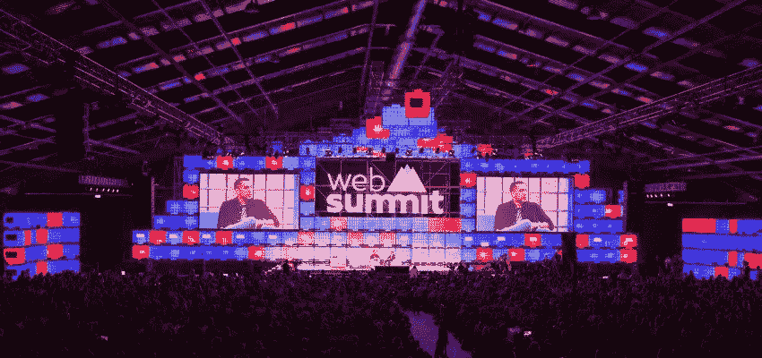

# 我们需要(更多)科技伦理

> 原文：<https://medium.com/hackernoon/we-need-more-ethics-in-tech-6a74a4eecc82>

在过去的几天里，我在网络峰会上听了很多了不起的聪明人的演讲。我的经历从聆听微软 Azure 的首席技术官和 Adyen 的首席执行官，到在街上与一群渴望创业的企业家半醉交谈，这些企业家认为他们的初创企业将是下一个最好的事情。

所有这些演讲都非常鼓舞人心，但几乎所有的演讲都忽略了一个重要的方面:除了卡巴斯基实验室的副总裁叶夫根尼·切列什涅夫(Evgeny Chereshnev)之外，我听过的演讲者或我见过的与会者都没有谈到他们企业的道德含义。

我不是在谈论关于安全和安保的显而易见的道德问题，这些问题似乎已经成为技术领域道德的标准解释。我也不是在谈论技术社区中对女性或其他少数民族的性别歧视和敌意。尽管这些都是需要解决的有效话题，但它们仍然停留在技术社区的封闭回路中。

我说的是核心的“我的产品真的对任何人有好处吗”这种道德观。我说的是道德。

# 消费者的声音

以在线调查平台 [Qualtrics](http://www.qualtrics.com) 为例。在他们的网站上，他们有像“所有人的智慧”这样的陈述。一个人的力量。Qualtrics 的首席执行官 [Ryan Smith](https://www.linkedin.com/pub/ryan-smith/1/790/341) 谈到他们如何帮助企业在客户满意度和员工统计行动方面变得更加透明。透明度意味着他们收集的所有关于绩效指标的硬数据都是公开的，但也包括日常活动(我上周做了什么，我本周计划做什么)，甚至像网络峰会这样的活动的报销。

Ryan Smith 声称，没有理由向员工隐瞒这些数据，因为他们完全有能力解释这些信息。

同样的逻辑也适用于消费者，例如医疗保健应用。似乎流行的想法是，如果我们作为一个技术社区，向消费者提供这些看似与道德无关的数据，我们就让他们能够做出自己明智的决定。数据的意义在于旁观者的眼中。

这是科技界的一个普遍说法，它甚至受到了欢迎:看看我们，我们是现代英雄，为被银行、医疗保健专业人士、政府等蒙在鼓里的消费者发声。

这个现代版的罗宾汉故事被用来掩盖一个事实，即尽管有些人可能真的相信消费者赋权，但如果不是同一位消费者为了自制的概念向我们砸钱，我们谁都不会这样做。

# 通用消费者不存在

我们基本上在做的是强加我们的世界观，即我们都有能力在生活的任何方面，在普通消费者的概念上做出明智的决定。

作为一个相当同质化和有点特权化的群体，科技界往往会忘记，在大多数发达国家，只有 30-40%的人口拥有高等教育学位。这是对他们所获得的学位类型的一种相当宽泛的解释。这么说吧，他们不是都去了斯坦福，伯克利或者哈佛。

事实上，我们自己和我们认识的人可能能够正确地解释所有这些应用程序收集并提供给我们的大量数据，并根据这些数据做出明智的决定(我不相信这是真的)，这并不意味着没有一大群人肯定没有受过训练，无法理解复杂的相关性或隐含性概念。

例如，如果你向消费者提供关于他们健康的深入信息，并使用机器学习来识别可能的异常，他们会在遇到任何小恐慌时向医疗保健专业人员求助。如果他们的询问因缺乏任何医学证据而被驳回，他们将不会信任同一位专业人员。

因此，我们可能赋予了消费者更多关于他们健康的“信息”,但我们完全破坏了医疗保健的最基本要素，即患者与医生的关系。

即使这不是关于数据解释，而只是一般性的破坏，我们也应该试着从上周占领 Airbnb 总部的抗议者身上吸取教训。他们抗议一家备受赞誉的颠覆性科技公司不仅破坏了酒店，还破坏了社区和街区。这是我们业务的副作用，我们不能忽视。这是技术社区需要解决并承担责任的事情。

# 没有所谓的非道德

到目前为止，如果我试图与科技界人士讨论道德问题，我会被贴上高人一等或保守的标签。

这是不公平的，因为道德问题不应该因为取消你的候选人资格而被忽视。技术创新对世界和我们社会的影响要求我们以开放和理解的方式进行这场辩论。

科技界不能躲在道德的烟幕后面。如果你对“这对任何人都有好处吗”这个道德问题的回答是，你只提供数据，由消费者来解释，你可能需要再想想。

问题应该不止于此。当然，Airbnb 为很多人做了很多好事。我在 Airbnb 的出租房里写这篇文章。但是，当那些不太幸运的人被迫离开他们的家园，去接纳那些有能力在当地享受“真实”体验的人时，就会产生负面的副作用。我们需要问自己:瓦解的社区值得酒店的破坏吗？

我在网络峰会上看到的大多数推销都是为我们这种人创造的。我不是指消极的方面。只是我们从我们的环境、我们的朋友、我们做的事情和我们遇到的人那里获得灵感。而且在大多数情况下，这些都是和我们自己兼容的，离很多其他人(或者消费者)的平均一天很远。

因此，我想敦促那些被邀请参加网络峰会等活动的人，那些作为投资者或顾问与初创企业打交道的人，开始提出这些道德问题，并拒绝当前不道德的道德观。

如果你打算用我们的应用程序改变世界，你最好确保这将是一个美好的地方。

> [黑客中午](http://bit.ly/Hackernoon)是黑客如何开始他们的下午。我们是 [@AMI](http://bit.ly/atAMIatAMI) 家庭的一员。我们现在[接受投稿](http://bit.ly/hackernoonsubmission)并乐意[讨论广告&赞助](mailto:partners@amipublications.com)机会。
> 
> 如果你喜欢这个故事，我们推荐你阅读我们的[最新科技故事](http://bit.ly/hackernoonlatestt)和[趋势科技故事](https://hackernoon.com/trending)。直到下一次，不要把世界的现实想当然！

