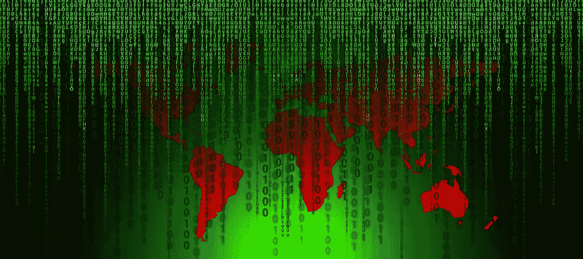

# 大规模杀伤性武器

> 原文：<https://medium.com/hackernoon/weapons-of-mass-adoption-417e20120650>

如果比特币大规模采用……等一下？我们应该用“如果”还是“当”呢？有一个相当确凿的案例表明这是一个“何时”的问题。或许不是因为比特币的辉煌，而是因为它之前的所有东西都存在缺陷。无论如何，我们现在看到的比特币价格要么是泡沫，要么是 T2 巨大冰山的一角。以下是指向后者的内容。

构成好货币的是三个因素的结合。它需要成为一个强大的*价值储存手段*，它需要成为一个良好的*交易媒介*，它需要成为一个*记账单位*。有人可能会说，以前从来没有钱在这三个盒子上都打勾过。

我们都经历过，传统的法定货币不能保值。例如，想想你小时候吃一个比萨饼要花多少钱。爱因斯坦曾在被问及他认为人类最伟大的发明是什么时回答“复利”。我们的大脑似乎生来就无法直观地理解指数函数。在 2%的通货膨胀率下，上述比萨饼的价格每 35 年就会翻一番以上，这意味着在那段时间里，一些实体偷走了每个人一半的钱，而似乎没有人注意到这一点。顺便说一下，损失的钱实际上是以巨额贷款的形式返还给公众的，但这是另一个故事了。

虽然法定货币作为交换媒介的功能非常好，但不能保值，但对于黄金等传统资产来说，情况正好相反。很难将一根金条、一件艺术品或一艘游艇分成更小的部分。在交换媒介中，可替代性和稳定性之间似乎存在着一种反比关系。

第三个属性是记账单位，要理解起来有点棘手。这基本上意味着信任。相信什么属于谁，谁欠什么，什么时候事情会发生变化。你是否能信任政府和中央银行很大程度上取决于你住在哪里，但你能信任的是，造假是存在的，既有冒险的个人造假，也有犯罪的政府造假。

区块链可能还不完美，但它作为价值储存手段远胜于菲亚特，作为交易媒介远胜于贵金属，作为记账单位也优于一切，因为它分散并量化了信任。如果这个世界上有一样东西是你可以信任的，那就是数学。总有一天*每个人*都会意识到这一点。在那一天*一切都变了。还记得电话簿吗？传真机？当真正的破坏性变化发生时，它们发生得很快，唯一无法从采用加密货币中受益的人是最顶层的人，即拥有半个地球的 80 个人。比特币需要做的只是继续做它已经在做的事情——成为一个替代品。*

价格越高，采用者越多。采纳者越多，价格越高。如果供应有限，这是绝对的事实。如果你给某人一些比特币，会发生一些事情。他们可以开始使用它，从而提高采用率。他们可以拿着它，自己看着价格上涨，或者他们可以以某种方式失去比特币，从而进一步限制可用的供应量。不管怎样，由于供应有限，从长远来看，价格不会上涨，只会上涨。只要有需求，有限的供应就不可避免地会出现这种情况。在这个系统中有一个内在的反馈回路，作为一个自我实现的预言。大多数人没有意识到这一点，因为以前从来没有过这样的事情，但是当他们意识到的时候…好吧，抓紧了，因为你正在经历一生的旅程。

未完待续…