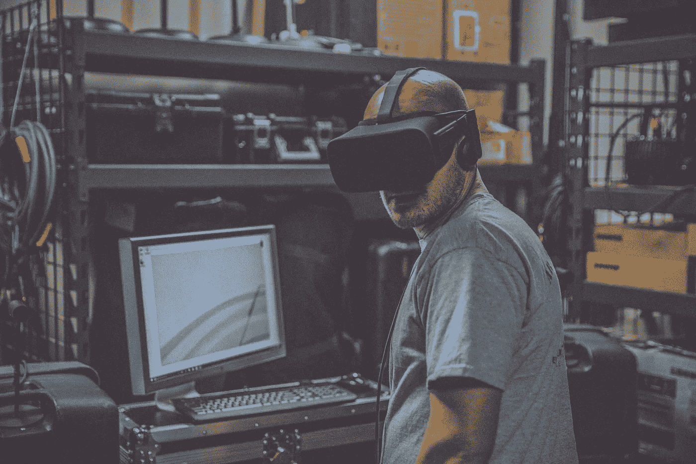

# 可穿戴技术推动商业创新

> 原文：<https://medium.com/hackernoon/wearable-technology-driving-innovation-in-business-49679dda4ee6>

物联网(IoT)最强大的应用之一是可穿戴技术，它有可能积极改变许多行业开展业务的方式。

智能手表、虚拟现实耳机和其他可穿戴设备已经越来越受消费者和公司的欢迎。事实上，技术分析公司 CCS Insight 预测，2017 年将售出令人印象深刻的 9600 万台可穿戴设备，价值 108 亿美元，到 2021 年将增加到 1.85 亿台设备，带来 169 亿美元的收入。显然，对可穿戴设备的兴趣正在迅速爆发，未来几年没有放缓的迹象。

虽然许多人都专注于消费设备，如 Apple Watch、Fitbit 和 Oculus Rift 等用于游戏的 VR 耳机，但越来越多的企业现在认识到这项技术可以有效地用于改善客户体验和增加收入。

将这一概念付诸实践的一个很好的例子来自旅游公司嘉年华。它创造了“海洋奖章”，这是一个小令牌，可以戴在腕带或链条上。目的是一旦消费者登上该公司的一艘游轮，这种设备将取代智能手机和信用卡，因为令牌可以用于多种方式，包括在船上登记和支付商品和服务。物联网是这项技术的一个基本组成部分，当客户走近他们预先预订的餐厅时，令牌会提醒员工，使公司能够正确预测他们的到来，以提供个性化的问候和即时座位。嘉年华还使用该设备在客人离开客舱时提醒客房部团队，让员工在不打扰客户的情况下完成工作。

而房地产呢？一些公司已经采用可穿戴设备，为消费者提供在自己家中使用一副虚拟现实护目镜舒适地查看物业的能力，真正让他们感觉好像在房间里走动，而不必实际参观物业。这种虚拟观看为感兴趣的买家和房地产经纪人节省了大量时间。

可穿戴技术的上述商业应用仅仅是当前许多例子中的两个。物联网已经在我们日常生活的无数方面普遍存在，可穿戴设备是帮助这项技术更深入地融入我们世界的完美伴侣，将设备与物体无缝连接，以改善客户体验，同时增加广泛行业的收入。

*由* [*DataArt*](https://www.dataart.com/industry/iot-and-m2m-solutions?utm_source=medium&utm_medium=social&utm_campaign=i-spring-2018) *物联网负责人伊洛宁撰写。*