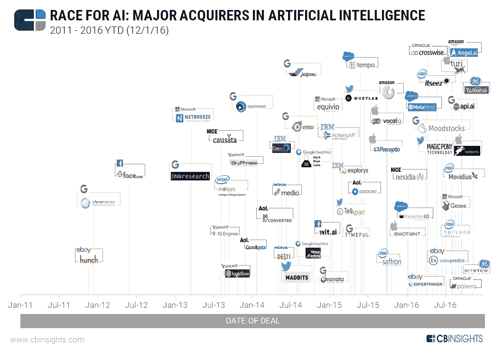

# 欢迎来到人工智能收购俱乐部:人工智能收购如何定价的框架

> 原文：<https://medium.com/hackernoon/welcome-to-the-ai-acquisitions-club-a-framework-on-how-ai-acquisitions-are-priced-39f37b9ba6f4>

人工智能初创公司抓住了最近关于退出活动的头条新闻。这些头条新闻是多种趋势的汇合，包括 2016 年退出的缺乏，人工智能作为核心技术的日益接受，以及通过 DeepMind 进行的历史上最大规模的收购。但是，尽管人工智能收购屡见不鲜，但对这一过程的理解一直并仍相当不透明。

The AI acquisitions club

不透明的部分原因是每笔收购交易的差异。由于收购方和被收购方之间的熟悉程度，一些交易会很快执行(见 Gnips 和 Twitter)，而一些交易则需要更长的时间。有些会在双方皆大欢喜的情况下非常顺利地执行，有些会因为糟糕的谈判、时机或者玩家而消失在夕阳中。有些公司会强迫初创公司搬迁到母公司的总部，有些公司，比如新加坡的 Pie，就是母公司在新市场的基石。

然而，像大多数事情一样，还是有规律可循的。这些模式为未来的收购提供了一个框架，并为未来的过程铺平了道路。该框架用于指导，并应随着时间的推移而改进。

收购定价有四个不同的要素。这些因素是相互关联的，最终价格可能是这些因素中的一个或全部四个因素。为明确起见，不考虑收购上市公司，因为它们已经由市场力量定价。此外，这四个要素按照重要性从高到低的顺序排列。

第一个要素是收购方的战略意图。根据产品、团队或不收购的机会成本等因素，评估潜在收购者为什么感兴趣是很重要的。在某些情况下，收购背后的动机是让收购方利用收购方公司目前不具备的人力资源加速产品开发。因此，收购一家已经在该领域发展的初创公司，比从零开始组建一个团队或从其他产品转移资源更便宜。

对于人工智能初创公司来说，收购的第二个要素是产品，或核心技术和算法。通常，收购者拥有现有数据，但不知道如何利用他们拥有的数据；另一方面，人工智能初创公司拥有有效利用数据的产品和算法，可以产生显著的增值价值。优势在于了解产生价值需要哪些数据，找到拥有这些数据的收购方，并锁定将从产品整合中显著受益的收购方。

收购定价的第三个因素是团队。该团队可由以下部分组成——领导、销售、工程和/或运营。通常情况下，工程和领导力构成的保费较高，但情况并非总是如此。杠杆作用是，对收购者来说，技能组合越稀有或越专业(例如，机器学习人才)，溢价就越高。这是一些早期人工智能收购的主要定价元素，如 DeepMind 和 Wit.ai。

收购的第四个要素涉及用户/客户。一些收购者愿意为每个用户/客户支付一定的价格，因为有机客户收购成本可能更高，并且需要收购者不具备的技能和时间。杠杆作用是，客户获取成本越高，收购方支付的溢价就越高。这是电子商务初创企业常用的一种方法，在这种情况下，收购方在某个目标市场没有优势。

最后，创业公司应该把这个框架作为一个指南，开始思考如何调解通常是一个模糊的过程。但也建议从经历过这一过程的人那里获得指导，这既是从经验的角度，也是解决每笔交易特有问题的一种方式。

感谢 Wendy Chen、 [Rodolfo Rosini](https://medium.com/u/27b95bb5ec10?source=post_page-----39f37b9ba6f4--------------------------------) 、Jonathan Savoir 和 Alexandre Winter 的评论和编辑

> [黑客中午](http://bit.ly/Hackernoon)是黑客如何开始他们的下午。我们是 [@AMI](http://bit.ly/atAMIatAMI) 家庭的一员。我们现在[接受投稿](http://bit.ly/hackernoonsubmission)并乐意[讨论广告&赞助](mailto:partners@amipublications.com)机会。
> 
> 如果你喜欢这个故事，我们推荐你阅读我们的[最新科技故事](http://bit.ly/hackernoonlatestt)和[趋势科技故事](https://hackernoon.com/trending)。直到下一次，不要把世界的现实想当然！

