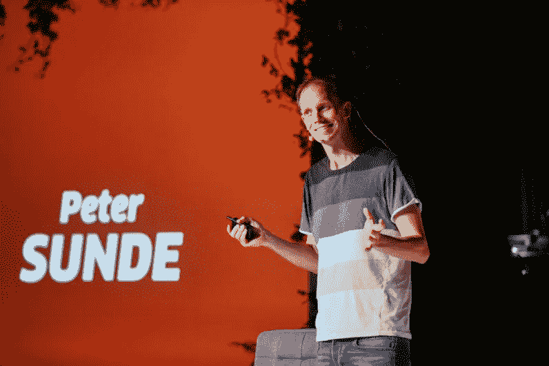
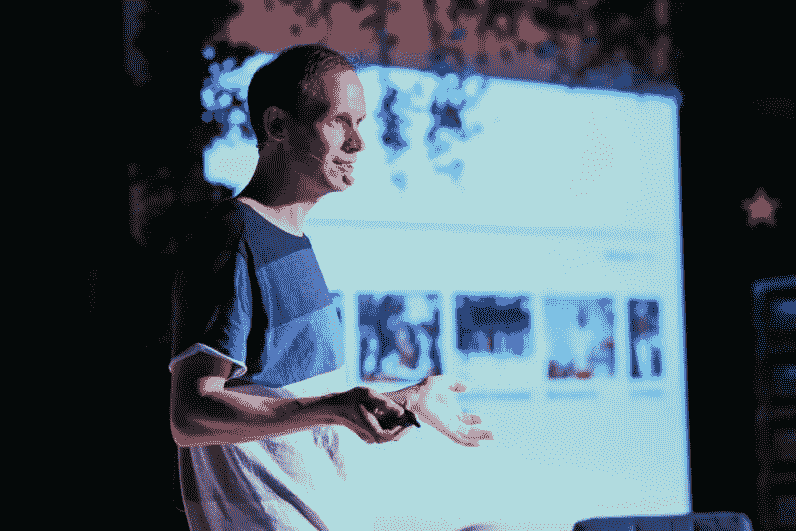

# “我们把所有的数据都集中到一个叫马克·扎克伯格的人那里，”海盗湾创始人说。

> 原文：<https://medium.com/hackernoon/weve-centralized-all-of-our-data-to-a-guy-called-mark-zuckerberg-says-pirate-bay-founder-4b503e6485db>

最初，互联网是一个美好的理想主义和平等的地方。但这个世界糟透了，我们不断地让它变得越来越集中化，从用户手中夺走权力，把它交给大公司。最糟糕的是我们无法修复它——我们只能让它稍微不那么糟糕。

这几乎是海盗湾联合创始人[彼得·桑德](https://twitter.com/brokep)在布达佩斯科技节[大脑酒吧的演讲的核心。TNW 与这位悲观的活动家和有争议的人物坐在一起，讨论我们在互联网去中心化方面到底有多糟糕。](http://brainbar.com/)

# 忘记未来，问题是现在

在孙德看来，人们太关注于*可能*发生什么，而不是*正在*发生什么。他经常被问到数字化的黯淡未来会是什么样子，但事实是我们正在经历它。

> 一切都不顺利。这就是问题所在，这不是关于未来会发生什么，而是关于现在正在发生的事情。我们把所有的数据都集中到一个叫马克·扎克伯格的人身上，他基本上是世界上最大的独裁者，因为他不是由任何人选举出来的。
> 
> *特朗普基本上控制着扎克伯格拥有的这些数据，所以我认为我们已经在那里了。所有可能出错的事情都已经出错了，我不认为我们有办法阻止它。*

要意识到的最重要的事情之一是这个问题不是技术问题。“互联网本来就是去中心化的，”Sunde 说，“但是我们一直把一切都集中在互联网上。”

为了证明这一点，Sunde 指出，在过去的 10 年里，几乎每一家新兴的科技公司或网站都被五大巨头收购了:亚马逊、谷歌、苹果、微软和脸书。那些设法逃脱巨头控制的公司，往往最终会加剧中央集权。

> 我们不再创造东西，取而代之的是虚拟的东西。例如，优步、阿里巴巴和 Airbnb，它们有产品吗？不。我们从这种基于产品的模式，到虚拟产品，再到几乎没有产品等等。这就是正在进行的集权化过程。

虽然我们应该意识到当前集权的影响，但我们也不应该忽视它只会变得更糟。有许多即将到来的基于技术的服务正面临集中化的风险，这可能会对我们的日常生活产生巨大影响。

> 我们对自动驾驶汽车非常满意，但是谁拥有自动驾驶汽车呢？谁拥有他们能去哪里和不能去哪里的信息？我不想乘坐自动驾驶汽车，因为有人在那里购买或出售非法拷贝的东西，它不能把我带到某个地方。

Sunde 坚信这是一个现实的场景，因为公司必须始终将财务收益放在第一位，而不是人民和社会的需求。这就是为什么我们需要对技术和所有权进行更大的伦理讨论，如果我们不想最终生活在一个由企业驱动的反乌托邦(比我们目前的更糟)中的话。

# 让糟糕的情况变得稍微可以忍受一些

感觉有点乐观，我问孙德，我们是否还能争取权力下放，把权力还给人民。他的回答很简单。

> *不，我们很久以前就输掉了这场战斗。我们能有所作为的唯一方法是限制这些公司的权力——通过政府的介入——但不幸的是，欧盟或美国似乎对此没有任何兴趣。*

因此，未来仍有机会变得不那么糟糕，但这需要巨大的政治努力。然而，为了实现这一目标，公众需要被告知权力下放的必要性——但从历史上看，这不太可能发生。

> *我会说，我们，作为人，在某种程度上把互联网输回了资本主义社会，我们希望把它从那里夺回来。我们曾有过一个分散式互联网的小小开端，但我们因为幼稚而失去了它。这些公司试图听起来不错，以便接管，他们实际上是“给”你一些东西。比如 Spotify 给你音乐，对音乐有极大的热情，以及围绕它的所有成功的公关。*
> 
> 但是从长远来看，它对我们的影响更像是吸烟。在这个意义上，大数据和大烟草真的很相似。以前，我们不知道烟草实际上有多危险，但现在我们知道它会导致癌症。我们不知道大数据可以成为东西，但现在我们知道了。我们一生都在大数据产品上吸烟，现在我们不能戒掉。

就像烟草一样，政府需要制定限制。然而，除了像美国和欧盟这样的大玩家，很难看到任何政府能够限制强大的科技巨头。

Sunde 认为，随着欧盟这个庞然大物变得越来越大，通过实际上是为人类服务并赋予人们更多权利的法律将变得更加困难。这是不幸的，因为从技术上来说，欧盟拥有立法权，可以在权力下放方面产生实际影响。

> *欧盟可能会说，如果脸书想要在欧盟内部运营，他们必须同意所有数据必须归用户所有，而不是归脸书所有。这对欧盟来说很简单，但这当然会让脸书非常不安。*
> 
> 那么每个国家都会害怕成为第一个实施这项法律的国家，因为脸书将会离开，所有的公民都将没有烟草。这是我们一直存在的问题。

然而，Sunde 有点乐观(但不是真的)，因为他不认为这场斗争必须通过铁板一块的政府才能达到某种成功的结果。事实上，在较小的国家层面上，它更有可能取得成功。

关于这一点，Sunde 以我所热爱的冰岛为例，在那里，运行在突破性数字政策平台上的海盗党[几乎进入政府](https://thenextweb.com/eu/2016/10/30/icelands-pirate-party-scores-unprecedented-electoral-success/#.tnw_MifnneGB)。无论人口多么少，国家层面的巨大变化都会对全球社会产生巨大影响。基本上意味着国家可以以身作则。

Sunde 是挪威和芬兰的混血儿，他说在国家层面引领数字政策的另一个好例子是芬兰在 2010 年将访问互联网[作为一项人权](http://www.bbc.com/news/10461048)。通过给人们这些权利，政府不得不定义互联网到底是什么，并阻止未来关于审查的讨论——支持人们反对进一步集权的权利。

如果民族国家真的能像 Sunde 建议的那样促进进一步的权力下放，那么我们也许真的能限制大公司的巨大权力。像爱沙尼亚这样的国家已经表明，政治家们能够提出数字政策，在数字时代切实保护公民的权利。

然而，我们人类是不合逻辑的生物，不一定会做对我们有益的事情:“这对人们来说更好，但我们不想忍受我们心爱的烟草的一分一秒的停机时间。”

点击查看彼得·桑德的 TNW 答问环节[。](https://answers.thenextweb.com/s/peter-sunde-PBPbr0)

*这个故事由*[*már másson Maack*](https://thenextweb.com/author/mar-maack/)*撰写，最初发表在*[*Next Web 上。*](https://thenextweb.com/eu/2017/06/09/pirate-bay-founder-weve-lost-the-internet-its-all-about-damage-control-now/)

*要阅读黑客正午的每周趋势 TNW 故事，请访问*[*【Hackernoon.com/tnw】*](http://hackernoon.com/tnw)*。*