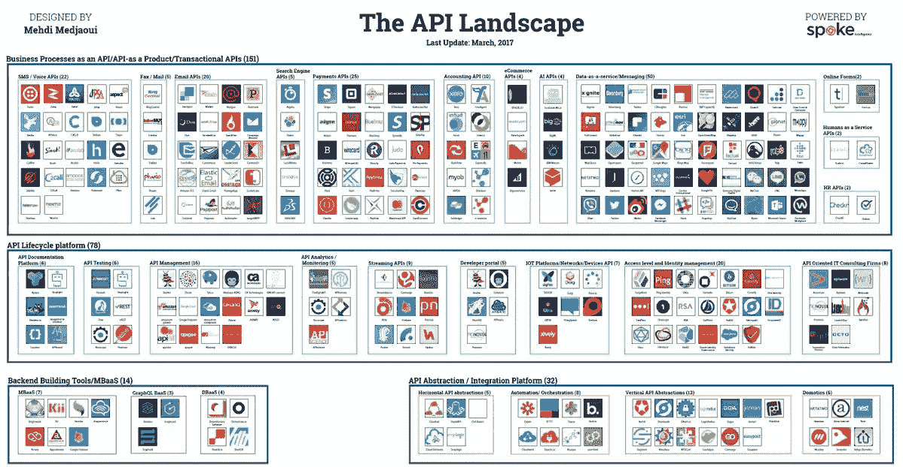
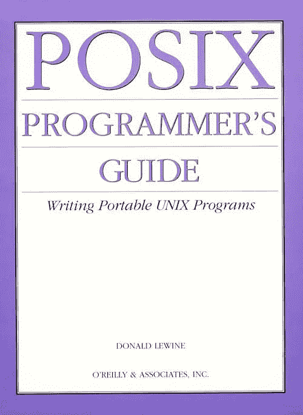
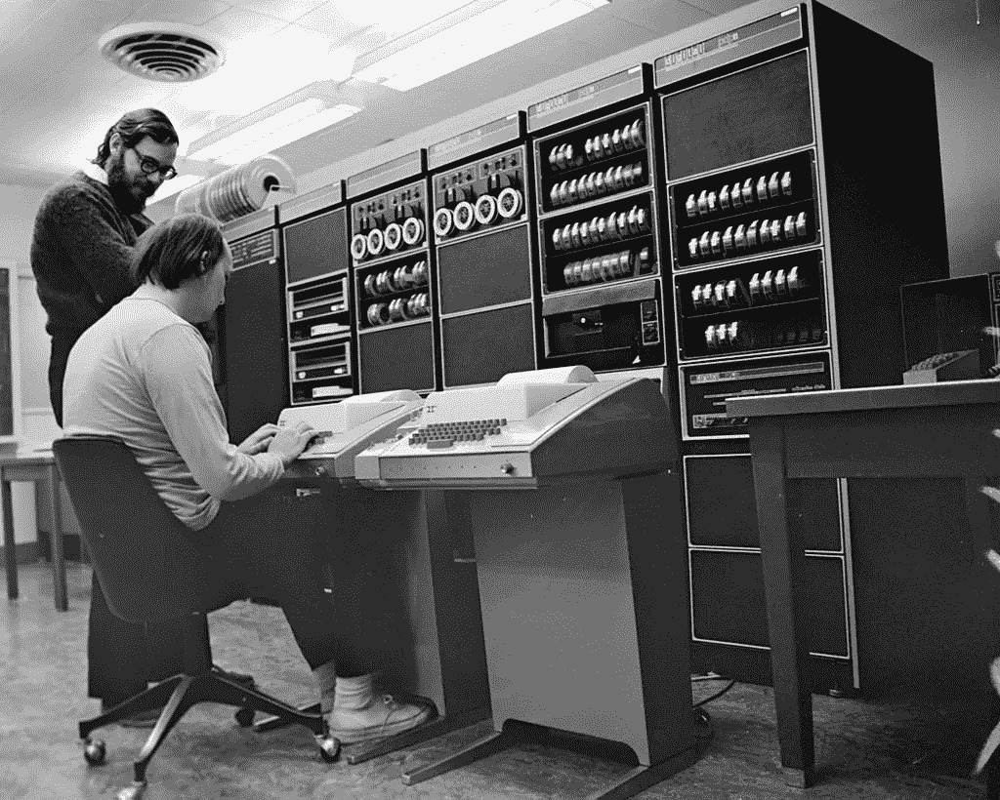

# 什么是 Web APIs

> 原文：<https://medium.com/hackernoon/what-are-web-apis-c74053fa4072>

Web APIs 到底是什么？为什么 Web APIs 如此流行和广泛使用？让我们首先探索什么是 API，这样你就可以理解它们是如何演变成 Web APIs 的。

API 代表 Application[Programming](https://hackernoon.com/tagged/programming)Interface，它允许开发者将一个应用程序的任意两个部分或任意不同的应用程序集成在一起。它由各种元素组成，例如允许开发人员构建应用程序的函数、协议和工具。所有类型的 API 的一个共同目标是通过提供一部分现成的功能来加速应用程序的开发，因此开发人员不必自己实现它。所有类型的系统都有 API，包括操作系统、库和 Web。

## 不同类型的 API

工作在操作系统级别的 API 通过遵循一组协议和规范来帮助应用程序与底层以及应用程序之间进行通信。这种规范的一个很好的例子是 POSIX，可移植操作系统接口的缩写。通过遵循 POSIX 标准，为在特定操作系统上工作而编译的应用程序也可以在遵循相同标准的其他系统上工作。软件库在创建不同系统之间的兼容性方面也起着重要的作用。

[POSIX Programmers Guide](http://shop.oreilly.com/product/9780937175736.do), by Donald Lewine, April 1991

API 定义了软件库的行为方式。与库交互的应用程序应该遵循 API 指定的规则集。这种方法使得软件开发人员可以轻松地编写与不同库通信的应用程序，而不必重新考虑他们的策略，只要所有的库都遵循相同的 API。这种方法的另一个优点是，只要消费者应用程序能够与 API 进行交互，使用不同的编程语言来消费同一个库是多么容易。

为了能够与远程机器上的应用程序通信，开发人员使用远程 API。通过使用远程 API，开发人员可以让应用程序以标准化的方式轻松地与远程资源和系统进行交互。这种标准的一个很好的例子是 ODBC，即开放式数据库连接，它允许应用程序通过访问相同的函数来使用不同的数据库。在这种情况下，数据库对于开发人员来说似乎是本地的，而实际上它是远程的。ODBC 标准处理连接、错误处理和通信的所有底层方面。另一种与代码执行相关的远程 API 是 Java 远程方法协议。在这种情况下，它使远程函数和对象可用，就像它们对于调用者应用程序是本地的一样，而不是使远程数据库看起来是本地的。然后，开发人员可以操纵远程对象，就像它们在本地可用一样，而不必处理任何通信细节。

Web API 是一种独特的接口类型，在这种接口中，使用互联网和特定于 Web 的协议进行通信。就像远程 API 使远程资源看起来像本地资源一样，Web APIs 对 Web 上可用的资源做同样的事情。事实上，随着允许用户在线存储内容的互联网服务的出现，Web APIs 开始变得流行。通常，您通过 HTTP 接口提供 Web APIs。API 本身定义了一组端点、请求消息和响应结构。这也是识别支持的响应媒体类型的标准方法。XML 和 JSON 是响应媒体类型的两个最受欢迎的例子，API 消费者可以很容易地解释它们。虽然最初 Web APIs 也被称为 Web 服务，但现在后者的使用表明 API 是 RESTful 的，而不是遵循 SOAP 标准。

## Web APIs 的历史

Web APIs 的起源可以追溯到 UNIX 本身的根源，以及不同的应用程序或进程如何相互通信。我们所说的 Unix 实际上是一组具有相同根的操作系统:美国电话电报公司 UNIX。这个最初的版本是由当时在贝尔实验室研究中心工作的肯·汤普森和丹尼斯·里奇在 20 世纪 70 年代发明的。在第一个版本发布后，美国电话电报公司选择将 UNIX 授权给第三方。这种类型的许可证使 UNIX 及其众多变体成为最常用的操作系统之一。在不同的风格中，对 Web APIs 的历史贡献最大的是 Sun Microsystems Solaris。

Ken Thompson (sitting) and Dennis Ritchie at a [PDP-11](https://en.wikipedia.org/wiki/PDP-11) minicomputer, circa 1970

从一开始，UNIX 就被描述为一个模块化的系统，在这个系统中，不同的应用程序或进程以协同工作为目标而被简化地构建。这种方法，也称为 Unix 哲学，是其最大的优势之一，也是 Web APIs 开发的关键。UNIX 上用于发送和接收来自不同进程的消息的系统称为 IPC，即进程间通信。事实上，IPC 是一组 API，让开发人员协调如何执行不同的并发进程。IPC 通过提供各种风格的进程间通信(如管道、消息队列、信号量、共享内存和套接字)使这种协调成为可能。除了套接字之外，所有通信方法都仅限于在同一服务器上运行的进程。

利用[网络](https://hackernoon.com/tagged/network)套接字的运行方式，Sun Microsystems 开发了一种与远程进程通信的方式，称为远程过程调用，或简称 RPC。它最初是在 20 世纪 80 年代作为 Sun 网络文件系统项目的一部分实现的，遵循 UNIX 和 C 编程语言中使用的调用约定。RPC 变得非常流行，因为它允许任何正在运行的应用程序向另一个应用程序发送请求，该应用程序会用所请求的操作的结果进行回复。消息和响应都使用外部数据表示格式(简称 XDR)进行序列化。这种方法通过使用双方都能理解的标准格式，将消息生产者与消费者分离开来。RPC 协议可以使用 UDP 或 TCP 通过 XDR 有效负载传递消息，让它可以在不同类型的网络上工作。

从最初的实现到以 RFC 的形式正式发布，大约花了十年时间。RPC 协议于 1995 年作为 [RFC 1831](https://tools.ietf.org/html/rfc1831) 发布，并通过不同的版本不断发展，直到 2009 年 [RFC 5531](https://tools.ietf.org/html/rfc5531) 发布才得以描述。在那一年，Sun 将 RPC 协议使用的许可证更改为标准的 3 条款 BSD，使其可供任何人自由使用。如今，大多数 UNIX 操作系统都在本地提供某种类型的 RPC。微软视窗系统还通过他们的 UNIX 产品和第三方服务正式支持 RPC，并提供了一系列编程语言的实现，如 C、C++、Java 和. NET。

尽管 RPC 非常流行，主要是因为它被认为是精简的，易于实现和使用，但它不是在高度异构的网络环境中使用的最佳协议。在客户机和服务器不是用同一种编程语言编写的情况下，RPC 问题与参数传递和封送有关。这就是其他提取消息和参数的协议开始蓬勃发展的地方。

面向服务的体系结构，或者简单地说，SOA，就这样诞生了，并成为在异构环境中运行的应用程序之间建立协作的事实上的标准。与此同时，不同的互联网公共服务正在逐渐普及。其中，一项服务尤其吸引了学术界以外更广泛的受众的注意:万维网。

1989 年，英国科学家蒂姆·伯纳斯·李发明了万维网，并成为获取信息和在线交流的主要方式。在最初的几年里，网络只是由相互连接的网页组成，在那里你可以查阅信息。信息是由当时所谓的网站管理员或负责维护网页的人手工更新的。随着时间的推移，随着商业网络倡议的兴起，一些不同的服务被创造出来，让你上传和提供个人信息，如照片、博客和其他类型的多媒体。这些服务产生了构建桌面应用程序的需求，这些应用程序可以让用户更有效地与这些服务进行交互。虽然最初这些应用程序是用来下载信息的，但随着时间的推移，它们也允许用户上传内容。

Sir Tim Berners-Lee invented the World Wide Web in 1989, Image © CERN

这些内容创建桌面应用程序和正在推出的 Web 服务之间的通信是我们现在称之为 Web APIs 的前身。最流行的早期 Web API 之一是 Flickr 的。Flickr 是一种流行的照片分享服务，开发者可以通过一个 Web API 与它进行互动，他们可以上传、下载、列出和搜索单个用户或整个服务的照片。

在软件业更封闭的一端，其他协议开始出现，目标是简化开发人员和集成设计人员的生活。简单对象访问协议(或简称 SOAP)就是这样一种协议，它获得了广泛的流行，这可能是因为它与现有的微软工具进行了自然的集成。事实上，SOAP 不费吹灰之力就成为集成不同微软产品的首选方法。

几乎与此同时，另一种方法正在形成。这一次的目标是尽可能多地重用 HTTP 的特性，同时采用更符合 Web 服务需求的视图。因此，具象状态转移建筑风格，或休息，诞生了。与 SOAP 相比，REST 更容易理解和处理，是开放 Web 的自然赢家，因为它不像 SOAP 那样需要那么多的操作约束。正因为如此，另一个协议诞生了。这一次的目标是增加对传输内容的控制，以便信息可以被重复验证。谷歌的远程过程调用，或简称为 [gRPC](https://grpc.io/) 诞生了，它开始被几乎所有的谷歌开放 Web APIs 使用。

## 摘要

如果你已经读到这里，你现在应该知道什么是 API，以及它们是如何演变成我们所说的 Web APIs 的——实际上，我们只是去掉了“Web”这个词，只使用了“API”

您还应该了解了一些现有的 Web APIs 服务和交互方法。除了本文介绍的协议之外，还有更多协议，并且新的协议一直在发布。

现在你是如何使用 API 的？欢迎分享你的经验。