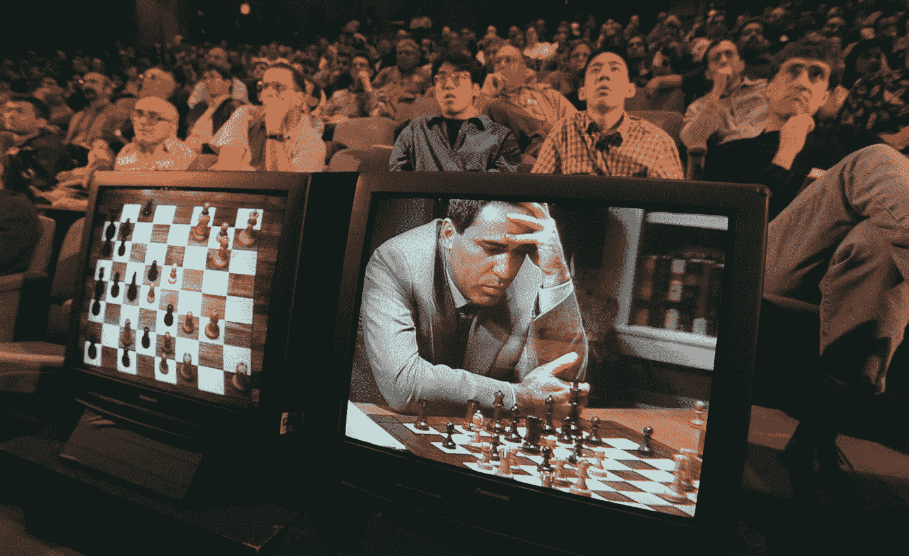

# 教育工作者必须从 IBM 的“背叛科学”中学到什么

> 原文：<https://medium.com/hackernoon/what-educators-must-learn-from-ibms-betrayal-of-science-10126d988655>

## 性能超过认知的代价

数学有两个版本。首先是学校教育的数学，这是一个封闭问题和考试需要学习的硬道理的集合。我们都经历过，但很少有人喜欢或擅长它。第二个版本是对这个主题更开放、更美丽、更有力量的表现，这也是我写作的重点。

> 为什么会脱节？是什么导致我们以牺牲深刻而有意义的学习经历为代价，去追求狭隘的结果呢？

加里·卡斯帕罗夫有一些想法。

卡斯帕罗夫在他的最新著作 [*深度思考*](http://www.kasparov.com/deep-thinking-ai/) 中，讲述了所谓人机终极战的故事。他是 IBM 深蓝机器的人，在一场 6 局的国际象棋比赛中争夺智力吹牛权的终极大奖。我们都知道结果如何:深蓝队以 3 比 2 获胜。对于[人工智能](https://hackernoon.com/tagged/artificial-intelligence)来说，分水岭时刻已经到来。

不过，卡斯帕罗夫可不这么看。虽然国际象棋长期以来被认为是人工智能的圣杯，但深蓝编程的本质很难像许多人想象的那样是一次巨大的飞跃。

深蓝是建立在蛮力计算之上的。到 1997 年，计算能力和 IBM 的搜索算法的结合足以击败世界上最强的国际象棋选手。深蓝的胜利可能更少地揭示了人工智能的本质，更多地揭示了国际象棋相对封闭的本质。

深蓝采用了一种几乎不像卡斯帕罗夫的战略游戏风格。例如，深蓝可以直接从表格中查找最佳的下一步棋，而不是通过最终策略进行推理。IBM 不关心为什么他们的机器做出了一个特殊的举动；结果才是最重要的。

这场比赛被认为是 IBM 的胜利(它的声誉和股票价格都飞速上涨)，但对卡斯帕罗夫来说，这种暴力计算方法是对科学的背叛。IBM 回避了开发类似人类的国际象棋机器的野心。相反，他们认为要不惜一切代价赢得胜利，将绩效置于方法之上。这是工程学的胜利，也是科学错失的机会。

We all know that look ([source](http://hplusmagazine.com/2014/12/29/double-feature-computer-chess-vs-game-kasparov-machine/))

快进 20 年，机器已经进一步上升。谷歌 DeepMind 的 AlphaGo [击败世界围棋冠军李·塞多尔](https://www.theatlantic.com/technology/archive/2016/03/the-invisible-opponent/475611/)，震惊了科学界。围棋的特点是开放性；它不能被深蓝的蛮力搜索算法驯服。相反，AlphaGo 呼吁先进的机器[学习](https://hackernoon.com/tagged/learning)技术，如*深度学习*和*神经网络*。光是名字就假定这些机器以更像人类的方式思考。这种假设是站不住脚的。在对深度学习的精彩评论中，弗朗索瓦·乔莱写道:

> 到目前为止，深度学习唯一真正成功的是在给定大量人类注释数据的情况下，使用连续几何变换将空间 X 映射到空间 Y 的能力。做好这一点基本上对每个行业来说都是游戏规则的改变者，但距离人类水平的人工智能还有很长的路要走。

那么‘人类水平的人工智能’会是什么样子呢？他继续说道:

> 处理假设的能力，将我们的心智模型空间扩展到远远超出我们可以直接体验的范围，一句话，执行*抽象*和*推理*的能力，可以说是人类认知的定义特征。
> 
> 这与深度网络所做的形成了鲜明的对比…如果新的输入与它们在训练时看到的略有不同，由深度网络执行的从输入到输出的映射很快就失去了意义。

有一种把性能和方法混为一谈的倾向。仅仅因为一台机器能在*围棋*或*象棋*中获胜，并不意味着它们能像人类一样玩游戏。我们对黑盒算法有太多的崇敬。

与教育的相似之处是惊人的。这些抽象和推理的基本技能在课程中经常被边缘化，而对事实和程序的强力记忆占据着至高无上的地位。学生们被训练进行数学运算，吞下黑盒，充当能够不假思索地给出答案的微不足道的神谕。这和做数学不一样，因为做数学就是质疑，探索，推理。数学是最开放的领域，永远不能简化为算法的形式。

对国际象棋机器的追求初衷是好的，但由于性能的压力而未能实现。学校数学也是如此，它是基于表现的评估的基础。评估的目标——测量学生的思维并提供反馈——是值得称赞的。高风险考试的商品化已经让这些目标付之东流，让大部分教育沦为表演。正如 IBM 为了胜利背叛了科学，教育为了测量背叛了学习。

我曾经被本科导师称为‘考试机器’。他的意思是称赞，我当然认为这是称赞。但是通过考试并不意味着一个数学家。考试以时间为界限，改变了解题的根本性质。正如 [*子弹头国际象棋*](https://www.thespruce.com/speed-chess-basics-611238) 剥夺了人类的直觉，考试也不是捕捉我们内心数学家的合适形式。

教育者必须超越机器般的倾向，只关注结果。当 [IBM 最新的展示品 Watson](https://www.ibm.com/watson/) 和其他数字创新将魔爪伸向教育的时候，我们必须要求强调更深层次的思考。

我们对人工智能的跟踪记录揭示了作为人类的事物价值；性能超过认知。我们对待教育的方式也是如此。

如果教育是为了把学生培养成有生产力和积极参与的公民，那么教育者必须改变这种说法。方法决定一切。

我是一名研究数学家，后来成为一名教育家，致力于数学、教育和创新的结合。

*来打个招呼上*[*Twitter*](https://twitter.com/fjmubeen)*或者*[*LinkedIn*](https://uk.linkedin.com/in/junaidmubeen)*。*

如果你喜欢这篇文章，你可能想看看我的以下作品

 [## 数学系学生被困在塞尔的中文教室里

### 随着对强人工智能探索的展开，我们是否正在失去对人类智能的控制？

hackernoon.com](https://hackernoon.com/maths-students-are-trapped-in-searles-chinese-room-d5ab9eafbc51)  [## 电子人时代的思考

### 一位教育家对埃隆·马斯克的警告

hackernoon.com](https://hackernoon.com/thinking-in-the-age-of-cyborgs-7f1e3dcf3bb9)  [## 当数学毁了你

### 推理是数学的语言

mystudentvoices.com](https://mystudentvoices.com/when-maths-screws-you-over-1df63dbccd68)